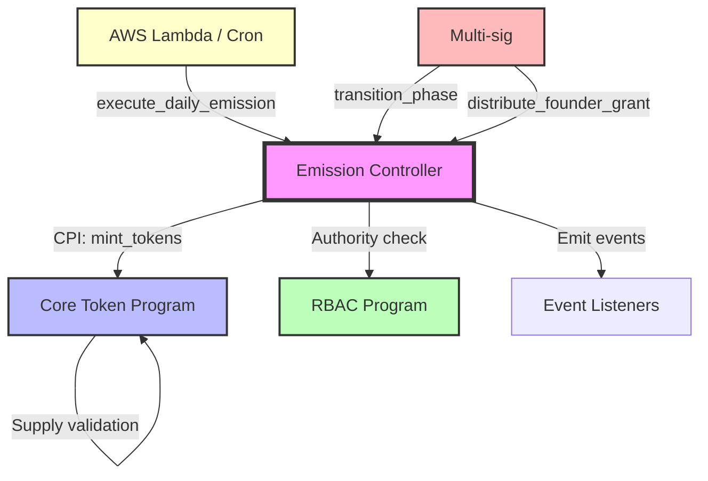

# Dynamic Emission Controller Program

**Document ID:** TECH-002  
**Version:** 1.0  
**Status:** Implementation Specification  
**Owner:** Smart Contract Developer  
**Category:** Core Technical / Smart Contracts  
**Dependencies:** TECH-001 (Token Program), TECH-005 (Architecture), TECH-006 (Dev Environment)  
**Blocks:** TECH-008 (AWS Infrastructure)

---

## 1. Program Overview

| Property | Value |
|----------|-------|
| **Program ID** | `TBD` (Generated during deployment) |
| **Purpose** | Autonomous time-gated token emission with phase-based distribution and supply controls |
| **Framework** | Anchor v0.29+ |
| **Solana Version** | v1.17+ |
| **Execution Model** | Time-gated (24-hour intervals using Clock sysvar) |

**Emission Phases:**

| Phase | Rate (DTC/day) | Distribution Model | Transition |
|-------|----------------|-------------------|------------|
| Pre-Launch | 50,000 | 100% → Emission Pool | Years 1-5 |
| Post-Launch | 125,000 | 50% → Founder Grants<br>50% → Merchant Rewards Pool | Year 6+ |

**Integration Points:**



| External Program/System | Integration Point | CPI Direction | Purpose |
|------------------------|-------------------|---------------|---------|
| Core Token Program | `mint_tokens` | Outbound (EC → Token) | Execute minting via CPI |
| RBAC Program | Authority validation | Query | Verify admin authorities |
| AWS Lambda / Cron | `execute_daily_emission` | Inbound (AWS → EC) | Trigger daily emissions |
| Multi-sig Wallet | Phase transition & distributions | Inbound (Multi-sig → EC) | Admin operations |

---

## 2. Emission Schedule

### Phase Definitions

| Phase | Rate (DTC/day) | Duration | Total Emission | Distribution Breakdown |
|-------|----------------|----------|----------------|------------------------|
| **Pre-Launch** | 50,000 | Years 1-5 (1,825 days) | 91,250,000 DTC | 100% → Emission Pool |
| **Post-Launch** | 125,000 | Year 6+ (uncapped) | Up to remaining supply | 50% → Founder Grants<br>50% → Merchant Rewards |

### Supply Constraints

| Constraint | Value | Enforcement |
|------------|-------|-------------|
| Maximum Supply | 1,000,000,000 DTC | Hard cap in Token Program |
| Initial Supply (at genesis) | 10,000,000 DTC | Minted in Token Program initialization |
| Remaining for Emissions | 990,000,000 DTC | Controlled by Emission Controller |
| Theoretical Max Days (post-launch) | 7,920 days (~21.7 years) | At 125K/day until cap reached |

### Emission Calculation Formulas

**Pre-Launch Daily Emission:**

$$E_{pre} = 50{,}000 \times 10^9 \text{ (lamports)}$$

**Post-Launch Daily Emission:**

$$E_{post} = 125{,}000 \times 10^9 \text{ (lamports)}$$

$$E_{founder} = \frac{E_{post}}{2} = 62{,}500 \times 10^9 \text{ (lamports)}$$

$$E_{merchant} = \frac{E_{post}}{2} = 62{,}500 \times 10^9 \text{ (lamports)}$$

**Supply Cap Validation:**

$$S_{total} = S_{initial} + \sum_{i=0}^{n} E_i \leq S_{max}$$

Where:
- $S_{total}$ = Total minted supply
- $S_{initial}$ = 10,000,000 DTC (initial supply)
- $E_i$ = Emission on day $i$
- $S_{max}$ = 1,000,000,000 DTC (maximum supply)
- $n$ = Number of emission days elapsed

**Time Interval Validation:**

$$T_{next} = T_{last} + \Delta T$$

Where:
- $T_{next}$ = Next allowed emission timestamp
- $T_{last}$ = Last emission timestamp
- $\Delta T$ = 86,400 seconds (24 hours)

**Emission Eligibility Check:**

$$T_{current} \geq T_{next} \implies \text{Emission Allowed}$$

---

## 3. Account Structures

### EmissionControllerState

```rust
#[account]
pub struct EmissionControllerState {
    /// Program version for upgrade compatibility
    pub version: u8,
    
    /// Current emission phase (0 = pre-launch, 1 = post-launch)
    pub phase: EmissionPhase,
    
    /// Timestamp of last executed emission
    pub last_emission_at: i64,
    
    /// Total number of emissions executed
    pub emission_count: u64,
    
    /// Total amount emitted across all phases (lamports)
    pub total_emitted: u64,
    
    /// Is emission paused (emergency control)
    pub is_paused: bool,
    
    /// Authority allowed to trigger phase transition
    pub phase_transition_authority: Pubkey,
    
    /// Authority allowed to pause/resume
    pub emergency_authority: Pubkey,
    
    /// Founder grant recipient authority (multi-sig)
    pub founder_grant_authority: Pubkey,
    
    /// Core Token Program pubkey
    pub token_program: Pubkey,
    
    /// Emission pool token account (receives pre-launch emissions)
    pub emission_pool: Pubkey,
    
    /// Merchant rewards pool token account (receives 50% post-launch)
    pub merchant_pool: Pubkey,
    
    /// Founder grant pool token account (receives 50% post-launch)
    pub founder_pool: Pubkey,
    
    /// Program initialized at timestamp
    pub initialized_at: i64,
    
    /// Bump seed for PDA derivation
    pub bump: u8,
}

// PDA Seeds: ["emission_state"]
// Space: 8 (discriminator) + 1 + 1 + 8 + 8 + 8 + 1 + 32 + 32 + 32 + 32 + 32 + 32 + 32 + 8 + 1 = 268 bytes

#[derive(AnchorSerialize, AnchorDeserialize, Clone, Copy, PartialEq, Eq)]
pub enum EmissionPhase {
    PreLaunch = 0,
    PostLaunch = 1,
}
```

### EmissionHistory

```rust
#[account]
pub struct EmissionHistory {
    /// Emission execution timestamp
    pub timestamp: i64,
    
    /// Amount emitted (lamports)
    pub amount: u64,
    
    /// Phase during emission
    pub phase: EmissionPhase,
    
    /// Founder amount (0 for pre-launch, 50% for post-launch)
    pub founder_amount: u64,
    
    /// Merchant amount (100% for pre-launch, 50% for post-launch)
    pub merchant_amount: u64,
    
    /// Total supply after this emission
    pub total_supply_after: u64,
    
    /// Transaction signature (stored as first 32 bytes)
    pub tx_signature: [u8; 32],
    
    /// Bump seed
    pub bump: u8,
}

// PDA Seeds: ["emission_history", timestamp_le_bytes]
// Space: 8 + 8 + 8 + 1 + 8 + 8 + 8 + 32 + 1 = 82 bytes
```

### FounderGrantAccount

```rust
#[account]
pub struct FounderGrantAccount {
    /// Version for upgrades
    pub version: u8,
    
    /// Total founder grants accumulated (vested, not yet distributed)
    pub total_vested: u64,
    
    /// Total distributed to date
    pub total_distributed: u64,
    
    /// Remaining balance (vested - distributed)
    pub remaining_balance: u64,
    
    /// Last distribution timestamp
    pub last_distribution_at: i64,
    
    /// Founder grant authority (multi-sig)
    pub authority: Pubkey,
    
    /// Created at timestamp
    pub created_at: i64,
    
    /// Bump seed
    pub bump: u8,
}

// PDA Seeds: ["founder_grant"]
// Space: 8 + 1 + 8 + 8 + 8 + 8 + 32 + 8 + 1 = 82 bytes
```

---

## 4. Instruction Handlers

### initialize

```rust
pub fn initialize(
    ctx: Context<Initialize>,
    phase_transition_authority: Pubkey,
    emergency_authority: Pubkey,
    founder_grant_authority: Pubkey,
    emission_pool: Pubkey,
    merchant_pool: Pubkey,
    founder_pool: Pubkey,
) -> Result<()>
```

**Accounts:**
```rust
#[derive(Accounts)]
pub struct Initialize<'info> {
    #[account(
        init,
        payer = payer,
        space = 8 + 268,
        seeds = [b"emission_state"],
        bump
    )]
    pub emission_state: Account<'info, EmissionControllerState>,
    
    #[account(
        init,
        payer = payer,
        space = 8 + 82,
        seeds = [b"founder_grant"],
        bump
    )]
    pub founder_grant_account: Account<'info, FounderGrantAccount>,
    
    /// Core Token Program
    pub token_program: Program<'info, Token>,
    
    /// CHECK: Core Token Program (custom program, not SPL)
    pub core_token_program: UncheckedAccount<'info>,
    
    #[account(mut)]
    pub payer: Signer<'info>,
    
    pub system_program: Program<'info, System>,
}
```

**Key Validation Logic:**
```rust
// 1. Validate authorities are not default pubkeys
require!(phase_transition_authority != Pubkey::default(), EmissionError::InvalidAuthority);
require!(founder_grant_authority != Pubkey::default(), EmissionError::InvalidAuthority);

// 2. Initialize state with pre-launch phase
emission_state.phase = EmissionPhase::PreLaunch;
emission_state.last_emission_at = Clock::get()?.unix_timestamp;
emission_state.emission_count = 0;
emission_state.total_emitted = 0;
emission_state.is_paused = false;

// 3. Store token account addresses
emission_state.emission_pool = emission_pool;
emission_state.merchant_pool = merchant_pool;
emission_state.founder_pool = founder_pool;

// 4. Initialize founder grant account
founder_grant_account.total_vested = 0;
founder_grant_account.authority = founder_grant_authority;
```

**Security Checks:**
- ⚠️ Initialize can only be called once (Anchor enforces via `init`)
- ⚠️ Set initial `last_emission_at` to current time (prevent immediate emission)
- Validate all token account addresses are valid and owned by correct programs

---

### execute_daily_emission

```rust
pub fn execute_daily_emission(
    ctx: Context<ExecuteDailyEmission>,
) -> Result<()>
```

**Accounts:**
```rust
#[derive(Accounts)]
pub struct ExecuteDailyEmission<'info> {
    #[account(
        mut,
        seeds = [b"emission_state"],
        bump = emission_state.bump,
    )]
    pub emission_state: Account<'info, EmissionControllerState>,
    
    #[account(
        init,
        payer = payer,
        space = 8 + 82,
        seeds = [
            b"emission_history",
            &Clock::get()?.unix_timestamp.to_le_bytes()
        ],
        bump
    )]
    pub emission_history: Account<'info, EmissionHistory>,
    
    #[account(
        mut,
        seeds = [b"founder_grant"],
        bump = founder_grant_account.bump,
    )]
    pub founder_grant_account: Account<'info, FounderGrantAccount>,
    
    /// CHECK: PDA for emission authority
    #[account(
        seeds = [b"emission_authority"],
        bump
    )]
    pub emission_authority: UncheckedAccount<'info>,
    
    /// Core Token Program for CPI
    /// CHECK: Validated by address check
    pub core_token_program: UncheckedAccount<'info>,
    
    /// Token Program state account from Core Token Program
    /// CHECK: Cross-program PDA read
    #[account(
        mut,
        seeds = [b"token_state"],
        bump,
        seeds::program = core_token_program.key(),
    )]
    pub token_state: UncheckedAccount<'info>,
    
    /// Mint account
    #[account(mut)]
    pub mint: Account<'info, Mint>,
    
    /// Mint authority PDA from Core Token Program
    /// CHECK: Cross-program PDA
    #[account(
        seeds = [b"mint_authority"],
        bump,
        seeds::program = core_token_program.key(),
    )]
    pub mint_authority: UncheckedAccount<'info>,
    
    /// Recipient token accounts (phase-dependent)
    #[account(mut)]
    pub emission_pool: Option<Account<'info, TokenAccount>>,
    
    #[account(mut)]
    pub merchant_pool: Option<Account<'info, TokenAccount>>,
    
    #[account(mut)]
    pub founder_pool: Option<Account<'info, TokenAccount>>,
    
    pub token_program: Program<'info, Token>,
    
    #[account(mut)]
    pub payer: Signer<'info>,
    
    pub system_program: Program<'info, System>,
}
```

**Key Validation Logic:**
```rust
// 1. Check not paused
require!(!emission_state.is_paused, EmissionError::EmissionPaused);

// 2. Validate 24-hour interval elapsed
let current_time = Clock::get()?.unix_timestamp;
let time_since_last = current_time.checked_sub(emission_state.last_emission_at)
    .ok_or(EmissionError::TimeCalculationError)?;
require!(time_since_last >= 86_400, EmissionError::EmissionTooEarly);

// 3. Calculate emission amount based on phase
let (total_amount, founder_amount, merchant_amount) = match emission_state.phase {
    EmissionPhase::PreLaunch => {
        (50_000 * 10_u64.pow(9), 0, 50_000 * 10_u64.pow(9))
    },
    EmissionPhase::PostLaunch => {
        let total = 125_000 * 10_u64.pow(9);
        (total, total / 2, total / 2)
    },
};

// 4. Validate supply cap via CPI (Token Program enforces)
// 5. Execute minting via CPI (see section 6)
// 6. Update state
emission_state.last_emission_at = current_time;
emission_state.emission_count = emission_state.emission_count.checked_add(1)
    .ok_or(EmissionError::MathOverflow)?;
emission_state.total_emitted = emission_state.total_emitted.checked_add(total_amount)
    .ok_or(EmissionError::MathOverflow)?;

// 7. Update founder grant account (post-launch only)
if emission_state.phase == EmissionPhase::PostLaunch {
    founder_grant_account.total_vested = founder_grant_account.total_vested
        .checked_add(founder_amount)
        .ok_or(EmissionError::MathOverflow)?;
    founder_grant_account.remaining_balance = founder_grant_account.remaining_balance
        .checked_add(founder_amount)
        .ok_or(EmissionError::MathOverflow)?;
}

// 8. Create emission history record
// 9. Emit event
```

**Security Checks:**
- ⚠️ **CRITICAL:** Use Clock sysvar for time validation (not client-provided timestamp)
- ⚠️ Enforce exactly 24-hour minimum interval (86,400 seconds)
- ⚠️ Use checked arithmetic for all calculations
- Allow emission even if slightly late (e.g., 24h + 5min is acceptable)
- Do NOT allow multiple emissions in single 24h window

---

### transition_phase

```rust
pub fn transition_phase(
    ctx: Context<TransitionPhase>,
    new_phase: EmissionPhase,
) -> Result<()>
```

**Accounts:**
```rust
#[derive(Accounts)]
pub struct TransitionPhase<'info> {
    #[account(
        mut,
        seeds = [b"emission_state"],
        bump = emission_state.bump,
    )]
    pub emission_state: Account<'info, EmissionControllerState>,
    
    pub phase_transition_authority: Signer<'info>,
}
```

**Key Validation Logic:**
```rust
// 1. Verify authority
require_keys_eq!(
    emission_state.phase_transition_authority,
    *phase_transition_authority.key,
    EmissionError::UnauthorizedPhaseTransition
);

// 2. Validate phase transition is valid
require!(
    emission_state.phase != new_phase,
    EmissionError::PhaseAlreadyActive
);

// 3. Validate transition direction (only PreLaunch → PostLaunch allowed)
require!(
    emission_state.phase == EmissionPhase::PreLaunch && new_phase == EmissionPhase::PostLaunch,
    EmissionError::InvalidPhaseTransition
);

// 4. Update phase
let old_phase = emission_state.phase;
emission_state.phase = new_phase;

// 5. Emit event
emit!(PhaseTransitioned {
    old_phase,
    new_phase,
    timestamp: Clock::get()?.unix_timestamp,
    authority: *phase_transition_authority.key,
});
```

**Security Checks:**
- ⚠️ **CRITICAL:** Only phase_transition_authority (multi-sig) can execute
- ⚠️ Only allow PreLaunch → PostLaunch (irreversible)
- Emit event for monitoring and auditing

---

### emergency_pause

```rust
pub fn emergency_pause(
    ctx: Context<EmergencyPause>,
) -> Result<()>
```

**Accounts:**
```rust
#[derive(Accounts)]
pub struct EmergencyPause<'info> {
    #[account(
        mut,
        seeds = [b"emission_state"],
        bump = emission_state.bump,
    )]
    pub emission_state: Account<'info, EmissionControllerState>,
    
    pub emergency_authority: Signer<'info>,
}
```

**Key Validation Logic:**
```rust
// 1. Verify emergency authority
require_keys_eq!(
    emission_state.emergency_authority,
    *emergency_authority.key,
    EmissionError::UnauthorizedEmergencyAction
);

// 2. Check not already paused
require!(!emission_state.is_paused, EmissionError::AlreadyPaused);

// 3. Set pause flag
emission_state.is_paused = true;

// 4. Emit event
emit!(EmissionPaused {
    timestamp: Clock::get()?.unix_timestamp,
    authority: *emergency_authority.key,
});
```

---

### resume_emission

```rust
pub fn resume_emission(
    ctx: Context<ResumeEmission>,
) -> Result<()>
```

**Accounts:** Same as `EmergencyPause`

**Key Validation Logic:**
```rust
// 1. Verify emergency authority
require_keys_eq!(
    emission_state.emergency_authority,
    *emergency_authority.key,
    EmissionError::UnauthorizedEmergencyAction
);

// 2. Check currently paused
require!(emission_state.is_paused, EmissionError::NotPaused);

// 3. Clear pause flag
emission_state.is_paused = false;

// 4. Emit event
emit!(EmissionResumed {
    timestamp: Clock::get()?.unix_timestamp,
    authority: *emergency_authority.key,
});
```

**Security Note:**
- Resume does NOT reset `last_emission_at` (next emission still requires 24h interval from last successful emission)

---

### distribute_founder_grant

```rust
pub fn distribute_founder_grant(
    ctx: Context<DistributeFounderGrant>,
    amount: u64,
    recipient: Pubkey,
) -> Result<()>
```

**Accounts:**
```rust
#[derive(Accounts)]
pub struct DistributeFounderGrant<'info> {
    #[account(
        seeds = [b"emission_state"],
        bump = emission_state.bump,
    )]
    pub emission_state: Account<'info, EmissionControllerState>,
    
    #[account(
        mut,
        seeds = [b"founder_grant"],
        bump = founder_grant_account.bump,
    )]
    pub founder_grant_account: Account<'info, FounderGrantAccount>,
    
    #[account(mut)]
    pub founder_pool: Account<'info, TokenAccount>,
    
    #[account(mut)]
    pub recipient_account: Account<'info, TokenAccount>,
    
    pub founder_grant_authority: Signer<'info>,
    
    pub token_program: Program<'info, Token>,
}
```

**Key Validation Logic:**
```rust
// 1. Verify founder grant authority
require_keys_eq!(
    founder_grant_account.authority,
    *founder_grant_authority.key,
    EmissionError::UnauthorizedFounderDistribution
);

// 2. Verify sufficient vested balance
require!(
    founder_grant_account.remaining_balance >= amount,
    EmissionError::InsufficientVestedBalance
);

// 3. Transfer from founder pool to recipient
// (SPL token transfer via CPI)

// 4. Update founder grant account
founder_grant_account.total_distributed = founder_grant_account.total_distributed
    .checked_add(amount)
    .ok_or(EmissionError::MathOverflow)?;
founder_grant_account.remaining_balance = founder_grant_account.remaining_balance
    .checked_sub(amount)
    .ok_or(EmissionError::MathUnderflow)?;
founder_grant_account.last_distribution_at = Clock::get()?.unix_timestamp;

// 5. Emit event
```

**Security Checks:**
- ⚠️ Only founder_grant_authority (multi-sig) can distribute
- Cannot distribute more than vested balance
- Track all distributions for auditing

---

## 5. Time-Based Execution Logic

### Clock Sysvar Reading

```rust
use anchor_lang::prelude::*;

pub fn validate_emission_timing(
    last_emission_at: i64,
    current_timestamp: i64,
) -> Result<bool> {
    // Calculate elapsed time since last emission
    let elapsed = current_timestamp
        .checked_sub(last_emission_at)
        .ok_or(EmissionError::TimeCalculationError)?;
    
    // Require at least 24 hours (86,400 seconds)
    const EMISSION_INTERVAL: i64 = 86_400; // 24 hours in seconds
    
    if elapsed < EMISSION_INTERVAL {
        return Err(EmissionError::EmissionTooEarly.into());
    }
    
    Ok(true)
}

pub fn get_current_timestamp() -> Result<i64> {
    let clock = Clock::get()?;
    Ok(clock.unix_timestamp)
}
```

### 24-Hour Interval Validation

```rust
pub fn execute_daily_emission(ctx: Context<ExecuteDailyEmission>) -> Result<()> {
    let emission_state = &mut ctx.accounts.emission_state;
    
    // Read Clock sysvar
    let clock = Clock::get()?;
    let current_time = clock.unix_timestamp;
    
    // Validate 24-hour interval
    const SECONDS_PER_DAY: i64 = 86_400;
    let next_allowed_emission = emission_state.last_emission_at
        .checked_add(SECONDS_PER_DAY)
        .ok_or(EmissionError::TimeCalculationError)?;
    
    require!(
        current_time >= next_allowed_emission,
        EmissionError::EmissionTooEarly
    );
    
    // Additional validation: detect timestamp anomalies
    let max_reasonable_interval = SECONDS_PER_DAY * 7; // 7 days
    let elapsed = current_time
        .checked_sub(emission_state.last_emission_at)
        .ok_or(EmissionError::TimeCalculationError)?;
    
    // Warn if emission is very late (but don't block)
    if elapsed > max_reasonable_interval {
        msg!("WARNING: Emission delayed by {} seconds ({} days)", 
             elapsed, elapsed / SECONDS_PER_DAY);
    }
    
    // ... rest of emission logic
    
    // Update last emission timestamp
    emission_state.last_emission_at = current_time;
    
    Ok(())
}
```

### Timestamp Arithmetic

```rust
// Safe timestamp arithmetic using checked operations
pub fn calculate_next_emission_time(last_emission: i64) -> Result<i64> {
    const EMISSION_INTERVAL: i64 = 86_400; // 24 hours
    
    last_emission
        .checked_add(EMISSION_INTERVAL)
        .ok_or(EmissionError::TimeCalculationError.into())
}

pub fn calculate_missed_emissions(last_emission: i64, current_time: i64) -> Result<u64> {
    const EMISSION_INTERVAL: i64 = 86_400;
    
    let elapsed = current_time
        .checked_sub(last_emission)
        .ok_or(EmissionError::TimeCalculationError)?;
    
    // Integer division to get number of complete 24h periods
    let missed_periods = (elapsed / EMISSION_INTERVAL) as u64;
    
    // Subtract 1 because we execute one emission now
    Ok(missed_periods.saturating_sub(1))
}
```

### Drift & Missed Emission Handling

```rust
// Strategy: Allow single emission per call, track missed windows
pub fn execute_daily_emission(ctx: Context<ExecuteDailyEmission>) -> Result<()> {
    let emission_state = &mut ctx.accounts.emission_state;
    let current_time = Clock::get()?.unix_timestamp;
    
    // Calculate how many emission windows were missed
    let missed = calculate_missed_emissions(
        emission_state.last_emission_at,
        current_time
    )?;
    
    if missed > 0 {
        // Log warning but proceed with single emission
        msg!("WARNING: {} emission window(s) were missed", missed);
        
        // Emit event for monitoring
        emit!(MissedEmissionsDetected {
            missed_count: missed,
            last_emission: emission_state.last_emission_at,
            current_time,
        });
    }
    
    // Execute SINGLE emission (not catch-up)
    // This prevents massive token dumps if system is offline for days
    let amount = calculate_emission_amount(emission_state.phase)?;
    execute_mint_via_cpi(ctx, amount)?;
    
    // Update to current time (not catch-up to "correct" time)
    emission_state.last_emission_at = current_time;
    
    Ok(())
}
```

**Design Decision:**
- ⚠️ **No automatic catch-up emissions** - If 3 days are missed, only 1 emission executes on next call
- Rationale: Prevents supply shocks, maintains predictable daily rate
- Recovery: Admin can manually trigger emissions on subsequent days to catch up gradually

💡 **Implementation Tip:** Use AWS EventBridge or similar for reliable 24-hour triggers, but design contract to be resilient to missed windows.

---

## 6. Cross-Program Invocation

### CPI to Token Program mint_tokens

```rust
use anchor_lang::prelude::*;
use anchor_spl::token::{self, Mint, Token, TokenAccount};

pub fn execute_mint_via_cpi(
    ctx: Context<ExecuteDailyEmission>,
    amount: u64,
) -> Result<()> {
    let emission_state = &ctx.accounts.emission_state;
    
    // Prepare CPI context for Core Token Program
    let cpi_program = ctx.accounts.core_token_program.to_account_info();
    
    // Determine recipient based on phase
    let recipient = match emission_state.phase {
        EmissionPhase::PreLaunch => {
            // 100% to emission pool
            ctx.accounts.emission_pool.as_ref()
                .ok_or(EmissionError::MissingAccount)?
                .to_account_info()
        },
        EmissionPhase::PostLaunch => {
            // First mint 50% to merchant pool
            ctx.accounts.merchant_pool.as_ref()
                .ok_or(EmissionError::MissingAccount)?
                .to_account_info()
        },
    };
    
    // Build CPI accounts
    let cpi_accounts = CoreTokenMintTokens {
        token_state: ctx.accounts.token_state.to_account_info(),
        mint: ctx.accounts.mint.to_account_info(),
        mint_authority: ctx.accounts.mint_authority.to_account_info(),
        recipient: recipient.clone(),
        token_program: ctx.accounts.token_program.to_account_info(),
    };
    
    // PDA signer seeds for emission authority
    let emission_authority_seeds = &[
        b"emission_authority",
        &[*ctx.bumps.get("emission_authority").unwrap()],
    ];
    let signer_seeds = &[&emission_authority_seeds[..]];
    
    // Execute CPI
    let cpi_ctx = CpiContext::new_with_signer(
        cpi_program,
        cpi_accounts,
        signer_seeds,
    );
    
    // Call mint_tokens on Core Token Program
    core_token_program::cpi::mint_tokens(cpi_ctx, amount)?;
    
    // If post-launch, mint second 50% to founder pool
    if emission_state.phase == EmissionPhase::PostLaunch {
        let founder_recipient = ctx.accounts.founder_pool.as_ref()
            .ok_or(EmissionError::MissingAccount)?
            .to_account_info();
        
        let cpi_accounts_founder = CoreTokenMintTokens {
            token_state: ctx.accounts.token_state.to_account_info(),
            mint: ctx.accounts.mint.to_account_info(),
            mint_authority: ctx.accounts.mint_authority.to_account_info(),
            recipient: founder_recipient,
            token_program: ctx.accounts.token_program.to_account_info(),
        };
        
        let cpi_ctx_founder = CpiContext::new_with_signer(
            cpi_program,
            cpi_accounts_founder,
            signer_seeds,
        );
        
        core_token_program::cpi::mint_tokens(cpi_ctx_founder, amount / 2)?;
    }
    
    Ok(())
}
```

### PDA Authority Signing Pattern

```rust
// Emission authority PDA derivation
pub fn get_emission_authority_pda(program_id: &Pubkey) -> (Pubkey, u8) {
    Pubkey::find_program_address(
        &[b"emission_authority"],
        program_id,
    )
}

// Usage in CPI context
let emission_authority_bump = *ctx.bumps.get("emission_authority").unwrap();
let signer_seeds: &[&[&[u8]]] = &[&[
    b"emission_authority",
    &[emission_authority_bump],
]];

let cpi_ctx = CpiContext::new_with_signer(
    program,
    accounts,
    signer_seeds,
);
```

### Error Handling for CPI Failures

```rust
pub fn execute_daily_emission(ctx: Context<ExecuteDailyEmission>) -> Result<()> {
    // ... validation logic ...
    
    let amount = calculate_emission_amount(ctx.accounts.emission_state.phase)?;
    
    // Attempt CPI with error handling
    match execute_mint_via_cpi(ctx, amount) {
        Ok(_) => {
            msg!("Successfully minted {} lamports", amount);
            
            // Update state only after successful mint
            ctx.accounts.emission_state.last_emission_at = Clock::get()?.unix_timestamp;
            ctx.accounts.emission_state.emission_count += 1;
            ctx.accounts.emission_state.total_emitted += amount;
            
            Ok(())
        },
        Err(e) => {
            msg!("CPI mint failed: {:?}", e);
            
            // Match specific errors from Token Program
            return Err(match e {
                // Token Program error codes
                Error::SupplyCapExceeded => EmissionError::SupplyCapReached.into(),
                Error::ProgramPaused => EmissionError::TokenProgramPaused.into(),
                Error::UnauthorizedMintAccess => EmissionError::InvalidCpiAuthority.into(),
                
                // Pass through other errors
                _ => e,
            });
        }
    }
}
```

**Error Propagation Pattern:**
```rust
// In Token Program error enum (referenced from TECH-001)
#[error_code]
pub enum TokenError {
    SupplyCapExceeded = 6000,
    ProgramPaused = 6001,
    UnauthorizedMintAccess = 6002,
    // ... etc
}

// In Emission Controller error enum (see section 8)
#[error_code]
pub enum EmissionError {
    SupplyCapReached = 7000, // Maps to TokenError::SupplyCapExceeded
    TokenProgramPaused = 7001, // Maps to TokenError::ProgramPaused
    InvalidCpiAuthority = 7002, // Maps to TokenError::UnauthorizedMintAccess
    // ... etc
}
```

---

## 7. Circuit Breakers & Safety

| Safety Mechanism | Limit/Threshold | Trigger Condition | Recovery Method | Notes |
|------------------|-----------------|-------------------|-----------------|-------|
| **Max Single Emission** | 125,000 DTC | Calculated amount > limit | Reject transaction | Prevents erroneous large mints |
| **Max Total Supply** | 1,000,000,000 DTC | Total minted ≥ cap | CPI to Token Program fails | Enforced in Token Program (TECH-001) |
| **Timing Anomaly** | < 86,400 seconds | Attempted emission before 24h | Reject with `EmissionTooEarly` | Prevents double-emission attacks |
| **Phase Mismatch** | N/A | Wrong recipient accounts for phase | Reject with `InvalidPhaseAccounts` | Ensures correct distribution |
| **Emergency Pause** | N/A | `is_paused == true` | Call `resume_emission` | Manual intervention required |
| **CPI Failure Limit** | 3 consecutive failures | Auto-pause after threshold | Admin investigation + resume | Prevents runaway errors |
| **Missed Emission Alert** | > 2 days (172,800s) | Emission delayed significantly | Monitoring alert + manual trigger | Does not auto-block execution |

### Circuit Breaker Implementation

```rust
// Max emission per instruction
const MAX_SINGLE_EMISSION: u64 = 125_000 * 10_u64.pow(9); // 125K DTC in lamports

pub fn validate_emission_amount(amount: u64, phase: EmissionPhase) -> Result<()> {
    // Validate against expected amount for phase
    let expected = match phase {
        EmissionPhase::PreLaunch => 50_000 * 10_u64.pow(9),
        EmissionPhase::PostLaunch => 125_000 * 10_u64.pow(9),
    };
    
    require_eq!(amount, expected, EmissionError::InvalidEmissionAmount);
    
    // Additional ceiling check
    require!(amount <= MAX_SINGLE_EMISSION, EmissionError::EmissionExceedsLimit);
    
    Ok(())
}

// Timing anomaly detection
pub fn detect_timing_anomaly(
    last_emission: i64,
    current_time: i64,
) -> Result<()> {
    const MIN_INTERVAL: i64 = 86_400; // 24 hours
    const MAX_REASONABLE_INTERVAL: i64 = 86_400 * 30; // 30 days
    
    let elapsed = current_time
        .checked_sub(last_emission)
        .ok_or(EmissionError::TimeCalculationError)?;
    
    // Too soon
    if elapsed < MIN_INTERVAL {
        return Err(EmissionError::EmissionTooEarly.into());
    }
    
    // Suspiciously late (but don't block, just log)
    if elapsed > MAX_REASONABLE_INTERVAL {
        msg!("ANOMALY: Emission delayed by {} days", elapsed / 86_400);
        emit!(TimingAnomalyDetected {
            last_emission,
            current_time,
            elapsed_seconds: elapsed,
        });
    }
    
    Ok(())
}

// Phase-recipient validation
pub fn validate_phase_accounts(
    phase: EmissionPhase,
    emission_pool: &Option<Account<TokenAccount>>,
    merchant_pool: &Option<Account<TokenAccount>>,
    founder_pool: &Option<Account<TokenAccount>>,
) -> Result<()> {
    match phase {
        EmissionPhase::PreLaunch => {
            require!(emission_pool.is_some(), EmissionError::MissingEmissionPool);
        },
        EmissionPhase::PostLaunch => {
            require!(merchant_pool.is_some(), EmissionError::MissingMerchantPool);
            require!(founder_pool.is_some(), EmissionError::MissingFounderPool);
        },
    }
    Ok(())
}
```

### Auto-Pause on Repeated CPI Failures

```rust
// In EmissionControllerState, add:
pub consecutive_failures: u8,

// In execute_daily_emission handler:
const MAX_CONSECUTIVE_FAILURES: u8 = 3;

match execute_mint_via_cpi(ctx, amount) {
    Ok(_) => {
        // Reset failure counter on success
        emission_state.consecutive_failures = 0;
        // ... update state ...
    },
    Err(e) => {
        // Increment failure counter
        emission_state.consecutive_failures = emission_state.consecutive_failures
            .checked_add(1)
            .ok_or(EmissionError::MathOverflow)?;
        
        // Auto-pause if threshold exceeded
        if emission_state.consecutive_failures >= MAX_CONSECUTIVE_FAILURES {
            emission_state.is_paused = true;
            emit!(AutoPausedDueToFailures {
                failure_count: emission_state.consecutive_failures,
                last_error: format!("{:?}", e),
                timestamp: Clock::get()?.unix_timestamp,
            });
        }
        
        return Err(e);
    }
}
```

---

## 8. Error Handling

```rust
#[error_code]
pub enum EmissionError {
    #[msg("Emission too early - must wait 24 hours since last emission")]
    EmissionTooEarly,
    
    #[msg("Supply cap reached - cannot emit more tokens")]
    SupplyCapReached,
    
    #[msg("Invalid emission phase")]
    InvalidPhase,
    
    #[msg("Phase transition already completed")]
    PhaseAlreadyActive,
    
    #[msg("Invalid phase transition - only PreLaunch to PostLaunch allowed")]
    InvalidPhaseTransition,
    
    #[msg("Emission is paused - emergency control active")]
    EmissionPaused,
    
    #[msg("Emission is not paused - cannot resume")]
    NotPaused,
    
    #[msg("Already paused")]
    AlreadyPaused,
    
    #[msg("Unauthorized phase transition attempt")]
    UnauthorizedPhaseTransition,
    
    #[msg("Unauthorized emergency action")]
    UnauthorizedEmergencyAction,
    
    #[msg("Unauthorized founder distribution")]
    UnauthorizedFounderDistribution,
    
    #[msg("Invalid authority - cannot be default pubkey")]
    InvalidAuthority,
    
    #[msg("Time calculation error - overflow detected")]
    TimeCalculationError,
    
    #[msg("Math overflow detected")]
    MathOverflow,
    
    #[msg("Math underflow detected")]
    MathUnderflow,
    
    #[msg("Token Program is paused")]
    TokenProgramPaused,
    
    #[msg("Invalid CPI authority")]
    InvalidCpiAuthority,
    
    #[msg("Missing required account")]
    MissingAccount,
    
    #[msg("Missing emission pool account")]
    MissingEmissionPool,
    
    #[msg("Missing merchant pool account")]
    MissingMerchantPool,
    
    #[msg("Missing founder pool account")]
    MissingFounderPool,
    
    #[msg("Invalid phase accounts for current phase")]
    InvalidPhaseAccounts,
    
    #[msg("Invalid emission amount")]
    InvalidEmissionAmount,
    
    #[msg("Emission amount exceeds safety limit")]
    EmissionExceedsLimit,
    
    #[msg("Insufficient vested balance for distribution")]
    InsufficientVestedBalance,
    
    #[msg("Consecutive CPI failures threshold reached")]
    ConsecutiveFailuresThresholdReached,
}
```

---

## 9. Events

```rust
#[event]
pub struct EmissionExecuted {
    pub timestamp: i64,
    pub amount: u64,
    pub phase: EmissionPhase,
    pub founder_amount: u64,
    pub merchant_amount: u64,
    pub emission_count: u64,
    pub total_emitted: u64,
}

#[event]
pub struct PhaseTransitioned {
    pub old_phase: EmissionPhase,
    pub new_phase: EmissionPhase,
    pub timestamp: i64,
    pub authority: Pubkey,
}

#[event]
pub struct EmissionPaused {
    pub timestamp: i64,
    pub authority: Pubkey,
}

#[event]
pub struct EmissionResumed {
    pub timestamp: i64,
    pub authority: Pubkey,
}

#[event]
pub struct FounderGrantDistributed {
    pub amount: u64,
    pub recipient: Pubkey,
    pub remaining_balance: u64,
    pub timestamp: i64,
    pub authority: Pubkey,
}

#[event]
pub struct MissedEmissionsDetected {
    pub missed_count: u64,
    pub last_emission: i64,
    pub current_time: i64,
}

#[event]
pub struct TimingAnomalyDetected {
    pub last_emission: i64,
    pub current_time: i64,
    pub elapsed_seconds: i64,
}

#[event]
pub struct AutoPausedDueToFailures {
    pub failure_count: u8,
    pub last_error: String,
    pub timestamp: i64,
}

#[event]
pub struct EmissionHistoryCreated {
    pub timestamp: i64,
    pub amount: u64,
    pub phase: EmissionPhase,
    pub total_supply_after: u64,
}
```

---

## 10. Reference Tables

### Account Reference

| Account Name | Type | PDA Seeds | Size (bytes) | Purpose |
|--------------|------|-----------|--------------|---------|
| `EmissionControllerState` | State | `["emission_state"]` | 268 | Global emission state and schedule tracking |
| `EmissionHistory` | Log | `["emission_history", timestamp_le_bytes]` | 82 | Immutable record of each emission event |
| `FounderGrantAccount` | Data | `["founder_grant"]` | 82 | Tracks vested and distributed founder grants |
| PDA: `emission_authority` | Authority | `["emission_authority"]` | 0 (unchecked) | CPI signer for mint operations |

### Instruction Reference

| Instruction | Authority Required | Time Constraint | Multi-sig Required | State-Mutating | Affected by Pause |
|-------------|-------------------|-----------------|-------------------|----------------|-------------------|
| `initialize` | Anyone (one-time) | None | No | Yes | No |
| `execute_daily_emission` | None (public) | ≥24h since last | No | Yes | Yes |
| `transition_phase` | Phase transition authority | None | Yes (3-of-5) | Yes | No |
| `emergency_pause` | Emergency authority | None | Yes (2-of-5) | Yes | No |
| `resume_emission` | Emergency authority | None | Yes (2-of-5) | Yes | No (can unpause when paused) |
| `distribute_founder_grant` | Founder grant authority | None (post-launch only) | Yes (3-of-5) | Yes | No |

### Integration Reference

| External System/Program | Integration Point | Trigger Method | Frequency | Critical Path |
|------------------------|-------------------|----------------|-----------|---------------|
| AWS Lambda / EventBridge | `execute_daily_emission` | Automated cron (24h) | Daily | Yes (emission execution) |
| Core Token Program | `mint_tokens` | CPI from EC | Per emission | Yes (token creation) |
| RBAC Program | Authority checks | Query | Per admin op | No (fallback: on-chain keys) |
| Multi-sig Wallet | Phase transition, distributions | Manual signing | As needed | No (admin-only) |
| Monitoring System | Event listeners | Real-time event subscription | Continuous | No (observability) |

### Emission Schedule Timeline

| Year | Phase | Daily Rate (DTC) | Annual Emission (DTC) | Cumulative (DTC) |
|------|-------|------------------|----------------------|------------------|
| 0 | Genesis | 0 | 0 | 10,000,000 (initial) |
| 1 | Pre-Launch | 50,000 | 18,250,000 | 28,250,000 |
| 2 | Pre-Launch | 50,000 | 18,250,000 | 46,500,000 |
| 3 | Pre-Launch | 50,000 | 18,250,000 | 64,750,000 |
| 4 | Pre-Launch | 50,000 | 18,250,000 | 83,000,000 |
| 5 | Pre-Launch | 50,000 | 18,250,000 | 101,250,000 |
| 6 | **Post-Launch** | 125,000 | 45,625,000 | 146,875,000 |
| 7 | Post-Launch | 125,000 | 45,625,000 | 192,500,000 |
| ... | Post-Launch | 125,000 | 45,625,000 | ... |
| ~27 | Post-Launch | 125,000 | 45,625,000 | ~1,000,000,000 (cap) |

### Compute Unit Estimates

| Instruction | Typical CU Usage | Max Expected CU | Notes |
|-------------|------------------|-----------------|-------|
| `initialize` | ~40K | 80K | One-time operation |
| `execute_daily_emission` (pre-launch) | ~50K | 100K | Single CPI to Token Program |
| `execute_daily_emission` (post-launch) | ~80K | 150K | Two CPIs (merchant + founder) |
| `transition_phase` | ~15K | 30K | Simple state update |
| `emergency_pause` | ~10K | 20K | Simple state update |
| `distribute_founder_grant` | ~25K | 50K | SPL token transfer |

---

## Quick Reference (Implementation Checklist)

### Pre-Implementation Validation
- [ ] Confirm Core Token Program deployed and address available (TECH-001)
- [ ] Review system architecture for emission flow (TECH-005)
- [ ] Confirm multi-sig wallet addresses for all authorities
- [ ] Set up AWS Lambda/EventBridge for daily triggers (TECH-008)

### Core Implementation Order
1. [ ] Define error codes and events
2. [ ] Implement `EmissionPhase` enum and state structures
3. [ ] Implement `initialize` instruction
4. [ ] Implement time validation logic (Clock sysvar)
5. [ ] Implement emission amount calculation
6. [ ] Implement CPI to Token Program `mint_tokens`
7. [ ] Implement `execute_daily_emission` with all validations
8. [ ] Implement `transition_phase` with access control
9. [ ] Implement pause/resume instructions
10. [ ] Implement `distribute_founder_grant`
11. [ ] Add circuit breakers and anomaly detection
12. [ ] Create `EmissionHistory` record creation logic

### Security Validation Checklist
- [ ] Clock sysvar used for all time checks (not client input)
- [ ] 24-hour minimum interval enforced
- [ ] All arithmetic uses checked operations
- [ ] CPI error handling implemented
- [ ] Supply cap validated (via Token Program)
- [ ] Multi-sig authorities verified on privileged operations
- [ ] PDA authority used for CPI signing
- [ ] Pause flag checked in emission execution
- [ ] Events emitted for all state changes
- [ ] Timing anomaly detection implemented
- [ ] Missed emission handling designed

### Testing Requirements (see separate testing doc)
- [ ] Unit tests for time validation logic
- [ ] 24-hour interval boundary tests
- [ ] Phase transition tests
- [ ] CPI integration tests with Token Program
- [ ] Pause/resume state machine tests
- [ ] Founder grant distribution tests
- [ ] Missed emission handling tests
- [ ] Circuit breaker trigger tests
- [ ] Multi-sig authority validation tests

### Pre-Deployment Checklist
- [ ] Security audit completed
- [ ] Integration testing with Core Token Program on devnet
- [ ] Multi-sig wallets created and tested
- [ ] AWS Lambda cron trigger configured
- [ ] Event monitoring infrastructure ready
- [ ] Emergency response procedures documented
- [ ] Founder grant authority confirmed
- [ ] Token pool addresses validated

---

## Appendix A: Common Integration Patterns

### Pattern 1: AWS Lambda Daily Trigger

```typescript
// AWS Lambda handler (TypeScript)
import * as anchor from "@coral-xyz/anchor";
import { Connection, PublicKey } from "@solana/web3.js";

export async function handler(event: any) {
  const connection = new Connection(process.env.RPC_URL!);
  const program = new anchor.Program(IDL, PROGRAM_ID, { connection });
  
  try {
    const [emissionStatePda] = PublicKey.findProgramAddressSync(
      [Buffer.from("emission_state")],
      program.programId
    );
    
    const tx = await program.methods
      .executeDailyEmission()
      .accounts({
        emissionState: emissionStatePda,
        // ... other accounts
      })
      .rpc();
    
    console.log("Emission executed:", tx);
    return { statusCode: 200, body: JSON.stringify({ tx }) };
  } catch (error) {
    console.error("Emission failed:", error);
    
    // Send alert if error
    await sendAlert("Emission failed", error);
    
    return { statusCode: 500, body: JSON.stringify({ error }) };
  }
}
```

### Pattern 2: Client-Side Emission Trigger

```typescript
// Manual trigger from CLI or monitoring service
import * as anchor from "@coral-xyz/anchor";

async function triggerEmission() {
  const program = anchor.workspace.EmissionController;
  const currentTime = Math.floor(Date.now() / 1000);
  
  const [emissionStatePda] = PublicKey.findProgramAddressSync(
    [Buffer.from("emission_state")],
    program.programId
  );
  
  const [emissionHistoryPda] = PublicKey.findProgramAddressSync(
    [
      Buffer.from("emission_history"),
      new anchor.BN(currentTime).toArrayLike(Buffer, "le", 8),
    ],
    program.programId
  );
  
  const tx = await program.methods
    .executeDailyEmission()
    .accounts({
      emissionState: emissionStatePda,
      emissionHistory: emissionHistoryPda,
      // ... other accounts
    })
    .rpc();
  
  console.log("Transaction signature:", tx);
}
```

### Pattern 3: Phase Transition (Multi-sig)

```rust
// Multi-sig transaction for phase transition
// Typically created via Squads Protocol or similar

pub async fn create_phase_transition_tx(
    multisig: &Pubkey,
    program_id: &Pubkey,
) -> Result<Transaction> {
    let emission_state = get_emission_state_pda(program_id);
    
    let ix = program::instruction::transition_phase(
        program_id,
        &emission_state,
        multisig, // phase_transition_authority
        EmissionPhase::PostLaunch,
    );
    
    // Create transaction for multi-sig approval
    let tx = Transaction::new_with_payer(&[ix], Some(multisig));
    
    Ok(tx)
}
```

---

## Revision History

| Version | Date | Author | Changes |
|---------|------|--------|---------|
| 1.0 | 2025-11-15 | Smart Contract Developer | Initial specification generated from prompt |

---

## Related Documents

- **[TECH-001]** DetourCoin Core Token Program (dependency - CPI target)
- **[TECH-003]** RBAC Program Specification (dependency - authority validation)
- **[TECH-005]** System Architecture Overview (dependency)
- **[TECH-006]** Development Environment Setup (dependency)
- **[TECH-008]** AWS Infrastructure & Automation (blocked by this doc)

---

**Document Status:** ✅ Complete - Ready for implementation

**Next Steps:**
1. Confirm Core Token Program is deployed (dependency)
2. Set up development environment per TECH-006
3. Create multi-sig wallets for authorities
4. Begin implementation following checklist above
5. Configure AWS Lambda/EventBridge for daily triggers

💡 **Critical Integration Note:** This program MUST be deployed AFTER Core Token Program (TECH-001) since it performs CPI calls to `mint_tokens`. Ensure correct program ID references during deployment.

---

*This document provides the complete technical specification for implementing DetourCoin's emission controller. All time-based logic uses Solana Clock sysvar for deterministic, trustless execution.*
