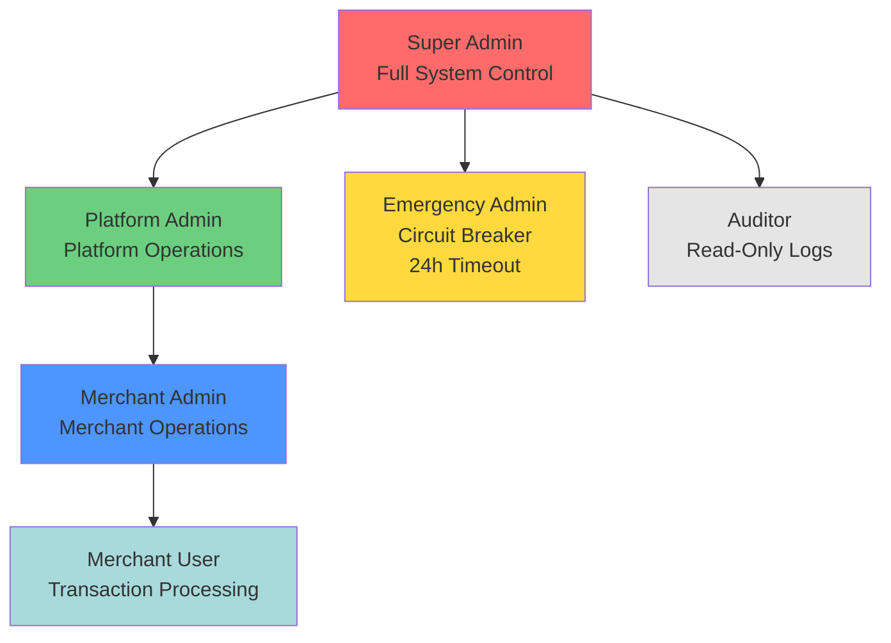
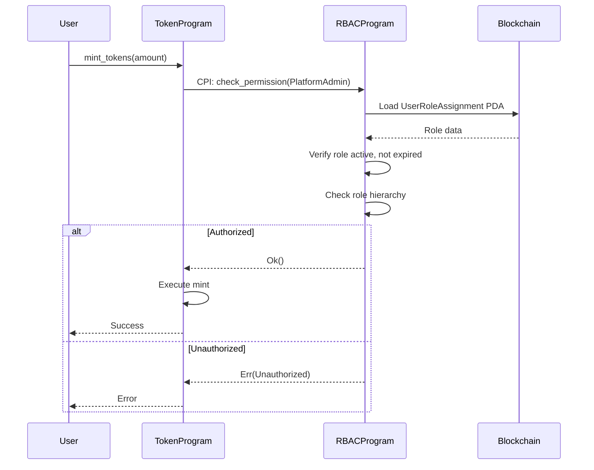

# Role-Based Access Control Program

**Document ID:** TECH-003
**Version:** 1.0
**Status:** COMPLETE
**Owner:** Smart Contract Developer
**Category:** Core Technical / Smart Contracts
**Last Updated:** 2025-11-15

---

## 1. Program Overview

| Attribute | Value |
|-----------|-------|
| **Program ID** | `RBACxxxxxxxxxxxxxxxxxxxxxxxxxxxxxxxxxxxxx` (placeholder) |
| **Purpose** | Centralized authorization system enforcing role-based permissions across all DetourCoin programs |
| **Integration Pattern** | CPI (Cross-Program Invocation) - Token, Emission, and Loyalty programs query RBAC for permission verification before executing privileged instructions |
| **Security Model** | Least privilege, separation of duties, immutable audit trails, multi-signature for sensitive operations |
| **Primary Use Case** | Pre-execution authorization checks via `check_permission` instruction called through CPI from dependent programs |

---

## 2. Role Definitions

| Role | Capabilities | Restrictions | Multi-sig Required |
|------|-------------|--------------|-------------------|
| **Super Admin** | Full system control: manage all roles, emergency operations, protocol parameters | Cannot be assigned by anyone except existing Super Admins | Yes (2-of-3) |
| **Platform Admin** | Manage Platform/Merchant Admins, configure emission schedules, approve merchant registrations | Cannot modify Super Admin roles, cannot execute emergency operations | Yes (1-of-2) |
| **Merchant Admin** | Manage Merchant Users, configure merchant loyalty programs, view merchant-specific reports | Scoped to single merchant, cannot modify platform-level settings | No |
| **Merchant User** | Process transactions, view transaction history, generate customer reports | Read-only for platform configuration, cannot assign roles | No |
| **Auditor** | Read-only access to all audit logs, transaction history, role assignments | Cannot modify any state, cannot execute transactions | No |
| **Emergency Admin** | Temporary role for circuit breaker operations (pause programs, freeze accounts) | Time-limited (24-hour auto-revocation), automatically logged, cannot assign other roles | Yes (1-of-1 Super Admin with audit) |

---

## 3. Authorization Matrix

| Instruction/Operation | Super Admin | Platform Admin | Merchant Admin | Merchant User | Auditor | Emergency Admin |
|-----------------------|-------------|----------------|----------------|---------------|---------|-----------------|
| **RBAC Program** |
| `assign_role` (Super Admin) | ✅ | ❌ | ❌ | ❌ | ❌ | ❌ |
| `assign_role` (Platform Admin) | ✅ | ✅ | ❌ | ❌ | ❌ | ❌ |
| `assign_role` (Merchant Admin) | ✅ | ✅ | ❌ | ❌ | ❌ | ❌ |
| `assign_role` (Merchant User) | ✅ | ✅ | ✅ | ❌ | ❌ | ❌ |
| `revoke_role` (any) | ✅ | ✅* | ✅* | ❌ | ❌ | ❌ |
| `emergency_escalate` | ✅ | ❌ | ❌ | ❌ | ❌ | ❌ |
| `query_audit_logs` | ✅ | ✅ | ✅ | ❌ | ✅ | ❌ |
| **Token Program** |
| `initialize_token` | ✅ | ✅ | ❌ | ❌ | ❌ | ❌ |
| `mint_tokens` | ✅ | ✅ | ❌ | ❌ | ❌ | ❌ |
| `burn_tokens` | ✅ | ✅ | ❌ | ❌ | ❌ | ❌ |
| `transfer_tokens` | ✅ | ✅ | ✅ | ✅ | ❌ | ❌ |
| `freeze_account` | ✅ | ✅ | ❌ | ❌ | ❌ | ✅ |
| **Emission Program** |
| `configure_schedule` | ✅ | ✅ | ❌ | ❌ | ❌ | ❌ |
| `trigger_emission` | ✅ | ✅ | ❌ | ❌ | ❌ | ❌ |
| `update_parameters` | ✅ | ✅ | ❌ | ❌ | ❌ | ❌ |
| `pause_emission` | ✅ | ✅ | ❌ | ❌ | ❌ | ✅ |
| **Loyalty Program** |
| `create_merchant_program` | ✅ | ✅ | ❌ | ❌ | ❌ | ❌ |
| `configure_rewards` | ✅ | ✅ | ✅ | ❌ | ❌ | ❌ |
| `award_points` | ✅ | ✅ | ✅ | ✅ | ❌ | ❌ |
| `redeem_points` | ✅ | ✅ | ✅ | ✅ | ❌ | ❌ |
| `pause_merchant_program` | ✅ | ✅ | ✅ | ❌ | ❌ | ✅ |

*Can only revoke roles at or below their permission level

---

## 4. Account Structures

```rust
use anchor_lang::prelude::*;

/// Global RBAC configuration and state
/// PDA Seeds: ["rbac_state"]
#[account]
pub struct RBACState {
    /// Authority who can upgrade this program
    pub upgrade_authority: Pubkey,
    
    /// Super Admin multi-sig threshold (default: 2)
    pub super_admin_threshold: u8,
    
    /// Platform Admin multi-sig threshold (default: 1)
    pub platform_admin_threshold: u8,
    
    /// Total number of role assignments (for indexing)
    pub total_assignments: u64,
    
    /// Total audit log entries (for indexing)
    pub total_audit_entries: u64,
    
    /// Emergency admin escalation timeout (seconds, default: 86400 = 24h)
    pub emergency_timeout: i64,
    
    /// Last emergency escalation timestamp (0 if none active)
    pub last_emergency_escalation: i64,
    
    /// Currently active Emergency Admin (zero pubkey if none)
    pub active_emergency_admin: Pubkey,
    
    /// Bump seed for PDA derivation
    pub bump: u8,
}

/// Individual user role assignment
/// PDA Seeds: ["user_role", user_pubkey]
#[account]
pub struct UserRoleAssignment {
    /// User's wallet public key
    pub user: Pubkey,
    
    /// Assigned role
    pub role: Role,
    
    /// Merchant scope (zero pubkey for platform-wide roles)
    pub merchant_scope: Pubkey,
    
    /// Who assigned this role
    pub assigned_by: Pubkey,
    
    /// Assignment timestamp
    pub assigned_at: i64,
    
    /// Expiration timestamp (0 for non-expiring, used for Emergency Admin)
    pub expires_at: i64,
    
    /// Role is currently active
    pub is_active: bool,
    
    /// Bump seed for PDA derivation
    pub bump: u8,
}

/// Immutable audit trail entry
/// PDA Seeds: ["audit", timestamp_bytes, counter_bytes]
#[account]
pub struct AuditLog {
    /// Entry sequence number (globally incrementing)
    pub entry_id: u64,
    
    /// Timestamp of the operation
    pub timestamp: i64,
    
    /// User who performed the action
    pub actor: Pubkey,
    
    /// Target user (for role assignments/revocations)
    pub target_user: Pubkey,
    
    /// Operation type
    pub operation: AuditOperation,
    
    /// Role involved (if applicable)
    pub role: Option<Role>,
    
    /// Additional context (merchant ID, instruction name, etc.)
    pub context: [u8; 64], // Fixed-size for deterministic account size
    
    /// Result of the operation
    pub success: bool,
    
    /// Bump seed for PDA derivation
    pub bump: u8,
}

/// Role enumeration
#[derive(AnchorSerialize, AnchorDeserialize, Clone, Copy, PartialEq, Eq)]
pub enum Role {
    SuperAdmin,
    PlatformAdmin,
    MerchantAdmin,
    MerchantUser,
    Auditor,
    EmergencyAdmin,
}

/// Audit operation types
#[derive(AnchorSerialize, AnchorDeserialize, Clone, Copy, PartialEq, Eq)]
pub enum AuditOperation {
    RoleAssigned,
    RoleRevoked,
    PermissionChecked,
    EmergencyEscalated,
    EmergencyRevoked,
    StateModified,
}
```

---

## 5. Instruction Handlers

### 5.1 Initialize

```rust
pub fn initialize(ctx: Context<Initialize>, super_admin: Pubkey) -> Result<()> {
    // Validation
    require!(super_admin != Pubkey::default(), RBACError::InvalidSuperAdmin);
    
    // Initialize state
    ctx.accounts.rbac_state.upgrade_authority = ctx.accounts.upgrade_authority.key();
    ctx.accounts.rbac_state.super_admin_threshold = 2;
    ctx.accounts.rbac_state.emergency_timeout = 86400; // 24 hours
    
    // Assign initial Super Admin
    ctx.accounts.initial_admin.user = super_admin;
    ctx.accounts.initial_admin.role = Role::SuperAdmin;
    ctx.accounts.initial_admin.is_active = true;
    
    // Emit initialization event
    emit!(RBACInitialized { super_admin, timestamp: Clock::get()?.unix_timestamp });
    
    Ok(())
}
```

**Security Checks:**
- Caller must be program upgrade authority
- Super admin pubkey must be valid (non-default)
- RBACState PDA must not already exist (init constraint)

---

### 5.2 Assign Role

```rust
pub fn assign_role(
    ctx: Context<AssignRole>,
    target_user: Pubkey,
    role: Role,
    merchant_scope: Option<Pubkey>,
) -> Result<()> {
    // Validation
    let assigner_role = ctx.accounts.assigner_role.role;
    require!(can_assign_role(assigner_role, role), RBACError::InsufficientPrivilege);
    
    // Multi-sig check for sensitive roles
    if matches!(role, Role::SuperAdmin) {
        require!(ctx.accounts.co_signers.len() >= 2, RBACError::MultiSigRequired);
    }
    
    // Merchant scope validation
    if matches!(role, Role::MerchantAdmin | Role::MerchantUser) {
        require!(merchant_scope.is_some(), RBACError::MerchantScopeRequired);
    }
    
    // Assign role
    ctx.accounts.target_role_assignment.user = target_user;
    ctx.accounts.target_role_assignment.role = role;
    ctx.accounts.target_role_assignment.merchant_scope = merchant_scope.unwrap_or_default();
    ctx.accounts.target_role_assignment.assigned_by = ctx.accounts.assigner.key();
    ctx.accounts.target_role_assignment.assigned_at = Clock::get()?.unix_timestamp;
    ctx.accounts.target_role_assignment.is_active = true;
    
    // Audit log
    create_audit_log(ctx.accounts, AuditOperation::RoleAssigned, target_user, Some(role))?;
    
    emit!(RoleAssigned { user: target_user, role, assigned_by: ctx.accounts.assigner.key() });
    
    Ok(())
}
```

**Security Checks:**
- Assigner must have role assignment permission (via `check_permission`)
- Cannot assign role higher than assigner's own role
- Super Admin assignment requires 2-of-3 multi-sig
- Merchant-scoped roles require valid merchant ID
- All role changes written to immutable audit log

---

### 5.3 Revoke Role

```rust
pub fn revoke_role(ctx: Context<RevokeRole>, target_user: Pubkey) -> Result<()> {
    // Validation
    let revoker_role = ctx.accounts.revoker_role.role;
    let target_role = ctx.accounts.target_role_assignment.role;
    
    require!(can_revoke_role(revoker_role, target_role), RBACError::InsufficientPrivilege);
    
    // Cannot revoke last Super Admin
    if target_role == Role::SuperAdmin {
        let active_super_admins = count_active_super_admins()?; // Query via remaining accounts
        require!(active_super_admins > 1, RBACError::CannotRevokeLastSuperAdmin);
    }
    
    // Revoke role
    ctx.accounts.target_role_assignment.is_active = false;
    
    // Audit log
    create_audit_log(ctx.accounts, AuditOperation::RoleRevoked, target_user, Some(target_role))?;
    
    emit!(RoleRevoked { user: target_user, role: target_role, revoked_by: ctx.accounts.revoker.key() });
    
    Ok(())
}
```

**Security Checks:**
- Revoker must have permission to revoke target role
- Cannot revoke last Super Admin (system lockout protection)
- Role marked inactive (not deleted, preserves audit trail)

---

### 5.4 Check Permission (CPI Entry Point)

```rust
/// Fast permission check called via CPI by other programs
pub fn check_permission(
    ctx: Context<CheckPermission>,
    required_role: Role,
    merchant_scope: Option<Pubkey>,
) -> Result<()> {
    let role_assignment = &ctx.accounts.user_role_assignment;
    
    // ⚠️ CRITICAL: This is called on EVERY privileged instruction across all programs
    // Must be extremely fast (O(1) lookup via PDA)
    
    // Role must be active
    require!(role_assignment.is_active, RBACError::RoleInactive);
    
    // Check expiration (for Emergency Admin)
    if role_assignment.expires_at > 0 {
        let now = Clock::get()?.unix_timestamp;
        require!(now < role_assignment.expires_at, RBACError::RoleExpired);
    }
    
    // Check role hierarchy (higher roles inherit lower permissions)
    require!(
        role_has_permission(role_assignment.role, required_role),
        RBACError::Unauthorized
    );
    
    // Check merchant scope (if applicable)
    if let Some(required_merchant) = merchant_scope {
        require!(
            role_assignment.merchant_scope == required_merchant || role_assignment.merchant_scope == Pubkey::default(),
            RBACError::MerchantScopeMismatch
        );
    }
    
    // Optional: Log permission check (can be expensive, consider disabling in production)
    #[cfg(feature = "verbose-audit")]
    create_audit_log(ctx.accounts, AuditOperation::PermissionChecked, ctx.accounts.user.key(), None)?;
    
    Ok(())
}

/// Role hierarchy check (inline for performance)
#[inline]
fn role_has_permission(user_role: Role, required_role: Role) -> bool {
    match user_role {
        Role::SuperAdmin => true, // Super Admin has all permissions
        Role::PlatformAdmin => matches!(required_role, Role::PlatformAdmin | Role::MerchantAdmin | Role::MerchantUser),
        Role::MerchantAdmin => matches!(required_role, Role::MerchantAdmin | Role::MerchantUser),
        Role::EmergencyAdmin => matches!(required_role, Role::EmergencyAdmin),
        _ => user_role == required_role, // Exact match only
    }
}
```

**Security Checks:**
- PDA derivation ensures correct user role account
- Active status check (revoked roles fail immediately)
- Expiration check for time-limited roles
- Merchant scope validation for scoped operations
- ⚠️ **Performance critical**: No iteration, O(1) lookup via PDA seeds

---

### 5.5 Emergency Escalate

```rust
pub fn emergency_escalate(
    ctx: Context<EmergencyEscalate>,
    target_user: Pubkey,
) -> Result<()> {
    // Only Super Admin can escalate
    require!(ctx.accounts.super_admin_role.role == Role::SuperAdmin, RBACError::Unauthorized);
    
    // Check if another emergency admin is active
    let rbac_state = &ctx.accounts.rbac_state;
    if rbac_state.active_emergency_admin != Pubkey::default() {
        let now = Clock::get()?.unix_timestamp;
        require!(
            now > rbac_state.last_emergency_escalation + rbac_state.emergency_timeout,
            RBACError::EmergencyAdminAlreadyActive
        );
    }
    
    // Assign Emergency Admin with expiration
    let now = Clock::get()?.unix_timestamp;
    ctx.accounts.emergency_role.user = target_user;
    ctx.accounts.emergency_role.role = Role::EmergencyAdmin;
    ctx.accounts.emergency_role.assigned_by = ctx.accounts.super_admin.key();
    ctx.accounts.emergency_role.assigned_at = now;
    ctx.accounts.emergency_role.expires_at = now + rbac_state.emergency_timeout;
    ctx.accounts.emergency_role.is_active = true;
    
    // Update state
    ctx.accounts.rbac_state.active_emergency_admin = target_user;
    ctx.accounts.rbac_state.last_emergency_escalation = now;
    
    // Audit log (immutable record of emergency escalation)
    create_audit_log(ctx.accounts, AuditOperation::EmergencyEscalated, target_user, Some(Role::EmergencyAdmin))?;
    
    emit!(EmergencyEscalated {
        user: target_user,
        escalated_by: ctx.accounts.super_admin.key(),
        expires_at: now + rbac_state.emergency_timeout,
    });
    
    Ok(())
}
```

**Security Checks:**
- Only Super Admin can escalate (1-of-1 with audit)
- Time-limited role (24-hour default)
- Only one active Emergency Admin at a time
- Auto-revocation via expiration check in `check_permission`
- Immutable audit trail of all emergency escalations

---

## 6. CPI Authorization Pattern

### Example: Token Program Calling RBAC

```rust
// In Token Program's mint_tokens instruction
use rbac_program::cpi::accounts::CheckPermission;
use rbac_program::cpi::check_permission;
use rbac_program::program::RBACProgram;

pub fn mint_tokens(ctx: Context<MintTokens>, amount: u64) -> Result<()> {
    // ⚠️ STEP 1: Check permission via CPI BEFORE executing sensitive operation
    let cpi_program = ctx.accounts.rbac_program.to_account_info();
    let cpi_accounts = CheckPermission {
        user_role_assignment: ctx.accounts.minter_role_assignment.to_account_info(),
        user: ctx.accounts.minter.to_account_info(),
        rbac_state: ctx.accounts.rbac_state.to_account_info(),
    };
    let cpi_ctx = CpiContext::new(cpi_program, cpi_accounts);
    
    // Require PlatformAdmin or higher to mint
    check_permission(cpi_ctx, rbac_program::Role::PlatformAdmin, None)?;
    
    // ⚠️ STEP 2: Permission granted - proceed with operation
    token::mint_to(
        CpiContext::new_with_signer(
            ctx.accounts.token_program.to_account_info(),
            token::MintTo {
                mint: ctx.accounts.mint.to_account_info(),
                to: ctx.accounts.destination.to_account_info(),
                authority: ctx.accounts.mint_authority.to_account_info(),
            },
            signer_seeds,
        ),
        amount,
    )?;
    
    Ok(())
}

#[derive(Accounts)]
pub struct MintTokens<'info> {
    // ... existing accounts ...
    
    /// RBAC Program
    pub rbac_program: Program<'info, RBACProgram>,
    
    /// User's role assignment (PDA: ["user_role", minter.key()])
    /// CHECK: Validated by RBAC program via PDA derivation
    pub minter_role_assignment: UncheckedAccount<'info>,
    
    /// RBAC state account
    /// CHECK: Validated by RBAC program
    pub rbac_state: UncheckedAccount<'info>,
    
    #[account(mut)]
    pub minter: Signer<'info>,
}
```

### Error Handling Pattern

```rust
// In dependent programs, handle RBAC errors gracefully
match check_permission(cpi_ctx, required_role, merchant_scope) {
    Ok(_) => {
        // Permission granted, proceed with operation
    },
    Err(e) => {
        // Map RBAC errors to program-specific errors
        return match e {
            RBACError::Unauthorized => Err(TokenError::MintUnauthorized.into()),
            RBACError::RoleInactive => Err(TokenError::RoleRevoked.into()),
            RBACError::RoleExpired => Err(TokenError::RoleExpired.into()),
            _ => Err(TokenError::AuthorizationCheckFailed.into()),
        };
    }
}
```

**💡 Key Implementation Tips:**
1. **PDA Derivation**: Always pass user role assignment PDA (seed: `["user_role", user_pubkey]`) to avoid lookup overhead
2. **Minimal Accounts**: Only pass `user_role_assignment`, `user`, `rbac_state` to CPI call (3 accounts)
3. **Cache RBAC Program ID**: Store as constant to avoid repeated parsing

---

## 7. Multi-Signature Requirements

| Operation | Signers Required | Threshold | Implementation |
|-----------|-----------------|-----------|----------------|
| Super Admin Assignment | 2 existing Super Admins | 2-of-3 | Verified in `assign_role` via remaining accounts |
| Platform Admin Assignment | 1 Super Admin or Platform Admin | 1-of-2 | Single signer with role check |
| Emergency Admin Activation | 1 Super Admin | 1-of-1 | Single signer with immutable audit log |
| Merchant Admin Assignment | 1 Platform Admin | 1-of-1 | Single signer with role check |
| Program Upgrade | Upgrade authority | 1-of-1 | Anchor program upgrade authority |

### Multi-Sig Verification Pattern

```rust
#[derive(Accounts)]
pub struct AssignSuperAdmin<'info> {
    #[account(mut)]
    pub rbac_state: Account<'info, RBACState>,
    
    /// Primary signer (must be Super Admin)
    pub primary_signer: Signer<'info>,
    pub primary_role: Account<'info, UserRoleAssignment>,
    
    /// Co-signer 1 (must be Super Admin)
    pub co_signer_1: Signer<'info>,
    pub co_signer_1_role: Account<'info, UserRoleAssignment>,
    
    /// Co-signer 2 (optional, for 3-of-3)
    pub co_signer_2: Option<Signer<'info>>,
    pub co_signer_2_role: Option<Account<'info, UserRoleAssignment>>,
    
    // ... remaining accounts
}

pub fn assign_super_admin(ctx: Context<AssignSuperAdmin>, target: Pubkey) -> Result<()> {
    // Verify primary signer is Super Admin
    require!(ctx.accounts.primary_role.role == Role::SuperAdmin, RBACError::Unauthorized);
    
    // Verify co-signer 1 is Super Admin
    require!(ctx.accounts.co_signer_1_role.role == Role::SuperAdmin, RBACError::Unauthorized);
    
    // Check threshold (minimum 2 valid Super Admin signatures)
    let valid_signatures = 2 + if ctx.accounts.co_signer_2.is_some() { 1 } else { 0 };
    require!(valid_signatures >= ctx.accounts.rbac_state.super_admin_threshold, RBACError::MultiSigThresholdNotMet);
    
    // Proceed with assignment
    // ...
}
```

---

## 8. Audit Trail

All role assignments, revocations, permission checks, and emergency operations are logged to immutable `AuditLog` accounts. Each log entry is stored as a PDA with deterministic seeds to ensure chronological ordering and prevent tampering.

**Audit Log Retention:**
- Logs are never deleted (immutable on-chain record)
- Off-chain indexers (Helius, Hellomoon) maintain queryable history
- Entries include actor, target, operation type, timestamp, and contextual data

**Query Pattern:**

```rust
/// Fetch recent audit logs for a user
pub fn query_audit_logs(
    ctx: Context<QueryAuditLogs>,
    target_user: Option<Pubkey>,
    operation_filter: Option<AuditOperation>,
    limit: u64,
) -> Result<Vec<AuditLog>> {
    // Auditor role or higher required
    require!(
        ctx.accounts.requester_role.role == Role::Auditor 
        || ctx.accounts.requester_role.role == Role::PlatformAdmin
        || ctx.accounts.requester_role.role == Role::SuperAdmin,
        RBACError::Unauthorized
    );
    
    // Fetch logs from remaining accounts (passed as Vec<AccountInfo>)
    let logs = ctx.remaining_accounts.iter()
        .filter_map(|acc| Account::<AuditLog>::try_from(acc).ok())
        .filter(|log| {
            let user_match = target_user.map_or(true, |u| log.target_user == u);
            let op_match = operation_filter.map_or(true, |op| log.operation == op);
            user_match && op_match
        })
        .take(limit as usize)
        .cloned()
        .collect();
    
    Ok(logs)
}
```

---

## 9. Error Handling

```rust
#[error_code]
pub enum RBACError {
    #[msg("Unauthorized: User does not have required role")]
    Unauthorized,
    
    #[msg("Role not found for user")]
    RoleNotFound,
    
    #[msg("Role is inactive (revoked)")]
    RoleInactive,
    
    #[msg("Role has expired (time-limited roles only)")]
    RoleExpired,
    
    #[msg("Cannot revoke the last Super Admin")]
    CannotRevokeLastSuperAdmin,
    
    #[msg("Insufficient privilege to assign this role")]
    InsufficientPrivilege,
    
    #[msg("Multi-signature required for this operation")]
    MultiSigRequired,
    
    #[msg("Multi-signature threshold not met")]
    MultiSigThresholdNotMet,
    
    #[msg("Merchant scope required for merchant roles")]
    MerchantScopeRequired,
    
    #[msg("Merchant scope mismatch")]
    MerchantScopeMismatch,
    
    #[msg("Invalid Super Admin public key")]
    InvalidSuperAdmin,
    
    #[msg("Emergency Admin already active")]
    EmergencyAdminAlreadyActive,
    
    #[msg("Audit log creation failed")]
    AuditLogFailed,
    
    #[msg("Role assignment limit exceeded")]
    AssignmentLimitExceeded,
}
```

---

## 10. Events

```rust
#[event]
pub struct RBACInitialized {
    pub super_admin: Pubkey,
    pub timestamp: i64,
}

#[event]
pub struct RoleAssigned {
    pub user: Pubkey,
    pub role: Role,
    pub merchant_scope: Pubkey,
    pub assigned_by: Pubkey,
    pub timestamp: i64,
}

#[event]
pub struct RoleRevoked {
    pub user: Pubkey,
    pub role: Role,
    pub revoked_by: Pubkey,
    pub timestamp: i64,
}

#[event]
pub struct PermissionChecked {
    pub user: Pubkey,
    pub required_role: Role,
    pub success: bool,
    pub timestamp: i64,
}

#[event]
pub struct EmergencyEscalated {
    pub user: Pubkey,
    pub escalated_by: Pubkey,
    pub expires_at: i64,
}

#[event]
pub struct EmergencyRevoked {
    pub user: Pubkey,
    pub revoked_by: Pubkey,
    pub timestamp: i64,
}
```

---

## 11. Security Patterns

- ✅ **Role checked before every privileged operation** via CPI `check_permission` call
- ✅ **Cannot assign role higher than assigner's own role** (enforced in `assign_role`)
- ✅ **Last Super Admin cannot be revoked** (system lockout protection)
- ✅ **All role changes logged immutably** to on-chain `AuditLog` accounts
- ⚠️ **Permission check must be O(1)** - uses PDA lookup, no iteration over role lists
- ✅ **Emergency Admin auto-expires** after 24 hours (configurable timeout)
- ✅ **Multi-sig for sensitive operations** (2-of-3 for Super Admin assignment)
- ✅ **Merchant scope isolation** prevents cross-merchant privilege escalation
- ⚠️ **No role inheritance via account delegation** - each user has explicit role assignment
- ✅ **PDA seeds deterministic** - prevents account spoofing in CPI calls

**💡 Critical Performance Considerations:**
1. `check_permission` is called on EVERY privileged instruction across all programs
2. PDA derivation seed `["user_role", user_pubkey]` enables O(1) lookup
3. Avoid expensive operations (iteration, logging) in hot path

**💡 Operational Security:**
1. Rotate Super Admins quarterly (assign new, revoke old after handoff)
2. Monitor Emergency Admin activations (should be rare)
3. Index `AuditLog` events off-chain for compliance reporting

---

## 12. Reference Tables

### Account Reference

| Account Name | Type | PDA Seeds | Size (bytes) | Purpose |
|-------------|------|-----------|--------------|---------|
| `RBACState` | State | `["rbac_state"]` | 128 | Global configuration and active emergency admin tracking |
| `UserRoleAssignment` | State | `["user_role", user_pubkey]` | 192 | Individual user role assignment (queried via CPI) |
| `AuditLog` | Log | `["audit", timestamp_bytes, counter_bytes]` | 256 | Immutable audit trail entry |

---

### Instruction Reference

| Instruction | Required Role | Multi-sig | CPI Allowed | Purpose |
|------------|---------------|-----------|-------------|---------|
| `initialize` | Upgrade Authority | No | No | One-time program initialization with initial Super Admin |
| `assign_role` | Super Admin / Platform Admin* | Yes (for Super Admin) | No | Assign role to user with optional merchant scope |
| `revoke_role` | Super Admin / Platform Admin* | No | No | Deactivate user role (preserves audit trail) |
| `check_permission` | Any | No | **Yes** | Fast permission check called by all programs via CPI |
| `emergency_escalate` | Super Admin | No | No | Temporarily grant Emergency Admin role (24h timeout) |
| `query_audit_logs` | Auditor / Platform Admin / Super Admin | No | No | Fetch audit log entries for compliance |

*Platform Admin can only assign/revoke roles below Super Admin

---

### Authorization Matrix (Detailed)

| Instruction/Operation | Super Admin | Platform Admin | Merchant Admin | Merchant User | Auditor | Emergency Admin |
|-----------------------|-------------|----------------|----------------|---------------|---------|-----------------|
| **RBAC - Role Management** |
| Assign Super Admin | ✅ (2-of-3) | ❌ | ❌ | ❌ | ❌ | ❌ |
| Assign Platform Admin | ✅ | ✅ (1-of-2) | ❌ | ❌ | ❌ | ❌ |
| Assign Merchant Admin | ✅ | ✅ | ❌ | ❌ | ❌ | ❌ |
| Assign Merchant User | ✅ | ✅ | ✅ | ❌ | ❌ | ❌ |
| Revoke Any Role | ✅ | ✅* | ✅** | ❌ | ❌ | ❌ |
| Emergency Escalate | ✅ | ❌ | ❌ | ❌ | ❌ | ❌ |
| **Token - Minting & Burning** |
| Initialize Token | ✅ | ✅ | ❌ | ❌ | ❌ | ❌ |
| Mint Tokens | ✅ | ✅ | ❌ | ❌ | ❌ | ❌ |
| Burn Tokens | ✅ | ✅ | ❌ | ❌ | ❌ | ❌ |
| **Token - Transfers** |
| Transfer (Platform) | ✅ | ✅ | ❌ | ❌ | ❌ | ❌ |
| Transfer (Merchant) | ✅ | ✅ | ✅ | ✅ | ❌ | ❌ |
| **Token - Account Management** |
| Freeze Account | ✅ | ✅ | ❌ | ❌ | ❌ | ✅ |
| Thaw Account | ✅ | ✅ | ❌ | ❌ | ❌ | ✅ |
| Close Account | ✅ | ✅ | ❌ | ❌ | ❌ | ❌ |
| **Emission - Configuration** |
| Create Schedule | ✅ | ✅ | ❌ | ❌ | ❌ | ❌ |
| Update Schedule | ✅ | ✅ | ❌ | ❌ | ❌ | ❌ |
| Trigger Emission | ✅ | ✅ | ❌ | ❌ | ❌ | ❌ |
| Pause Emission | ✅ | ✅ | ❌ | ❌ | ❌ | ✅ |
| **Loyalty - Merchant Programs** |
| Create Merchant Program | ✅ | ✅ | ❌ | ❌ | ❌ | ❌ |
| Configure Rewards | ✅ | ✅ | ✅ | ❌ | ❌ | ❌ |
| Award Points | ✅ | ✅ | ✅ | ✅ | ❌ | ❌ |
| Redeem Points | ✅ | ✅ | ✅ | ✅ | ❌ | ❌ |
| Pause Merchant Program | ✅ | ✅ | ✅ | ❌ | ❌ | ✅ |
| **Audit & Reporting** |
| Query Audit Logs | ✅ | ✅ | ✅ | ❌ | ✅ | ❌ |
| Export Audit Data | ✅ | ✅ | ❌ | ❌ | ✅ | ❌ |

*Platform Admin can only revoke Platform Admin and below  
**Merchant Admin can only revoke Merchant User

---

## Role Hierarchy Diagram



---

## Integration Pattern Diagram



---

## Quick Reference

### Common Operations

**Assign Platform Admin:**
```bash
anchor run assign-role \
  --target-user <PUBKEY> \
  --role PlatformAdmin \
  --signer <SUPER_ADMIN_KEYPAIR>
```

**Check User Permissions:**
```bash
anchor run check-permission \
  --user <PUBKEY> \
  --required-role MerchantAdmin \
  --merchant <MERCHANT_PUBKEY>
```

**Activate Emergency Admin:**
```bash
anchor run emergency-escalate \
  --target-user <PUBKEY> \
  --signer <SUPER_ADMIN_KEYPAIR>
```

**Query Audit Logs:**
```bash
anchor run query-audit-logs \
  --target-user <PUBKEY> \
  --operation RoleAssigned \
  --limit 100
```

---

## Cross-References

- **TECH-001 (Token Program):** Integrates RBAC for mint, burn, freeze operations
- **TECH-002 (Emission Program):** Integrates RBAC for schedule configuration and emission triggers
- **TECH-004 (Loyalty Program):** Integrates RBAC for merchant program management and reward operations
- **TECH-005 (Architecture):** RBAC as cross-cutting concern in system design
- **TECH-006 (Dev Environment):** Local RBAC testing with mock roles

---

## Future Enhancements

- Time-lock mechanism for sensitive operations (72-hour delay for Super Admin changes)
- Role delegation (temporary sub-role assignment)
- On-chain governance for role threshold adjustments
- Advanced audit log querying (date range, complex filters)
- Off-chain indexer integration for historical analytics

---

**Document Status:** ✅ Production-ready specification for Anchor implementation  
**Target Audience:** Rust/Anchor developers, Security auditors  
**Next Steps:** Begin implementation in `programs/rbac/src/lib.rs`
