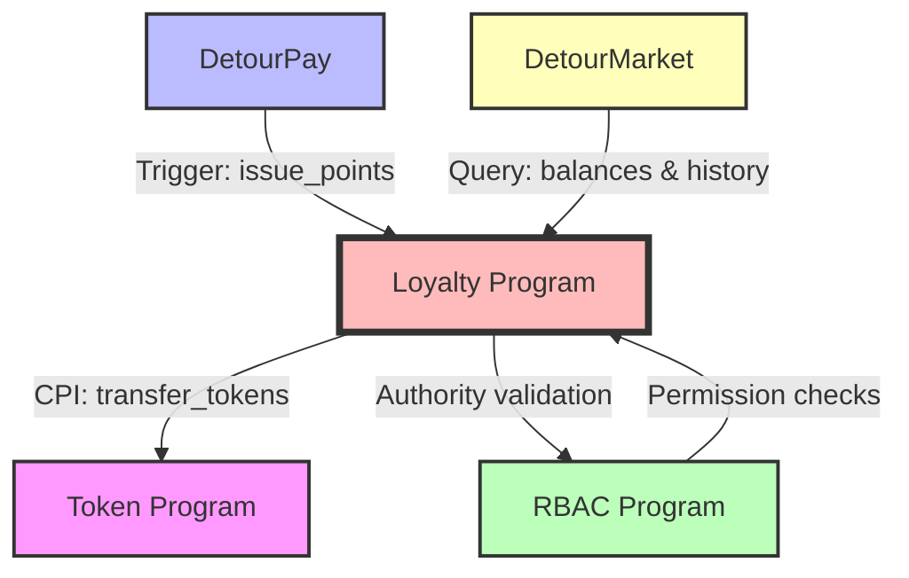
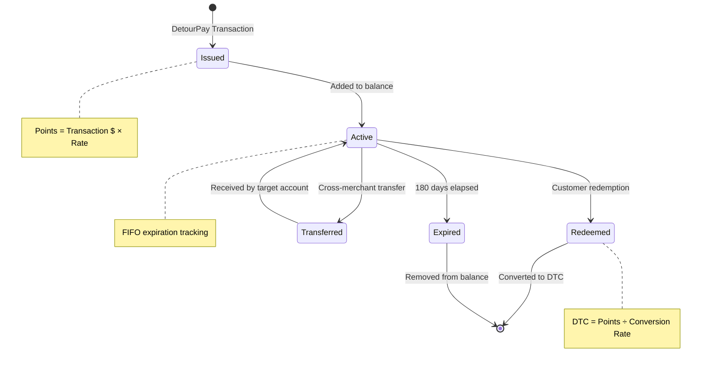
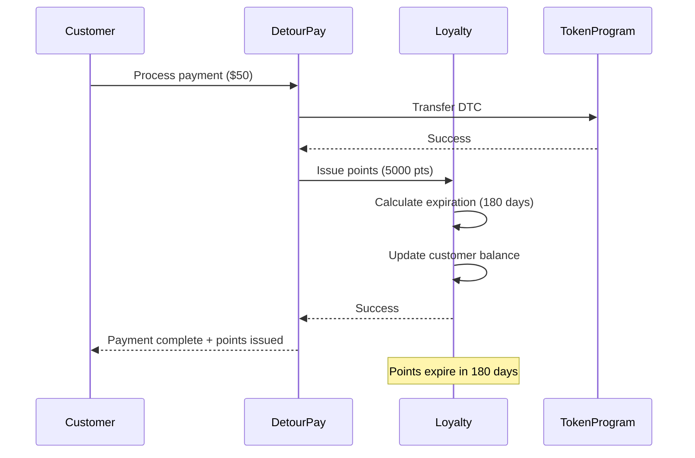
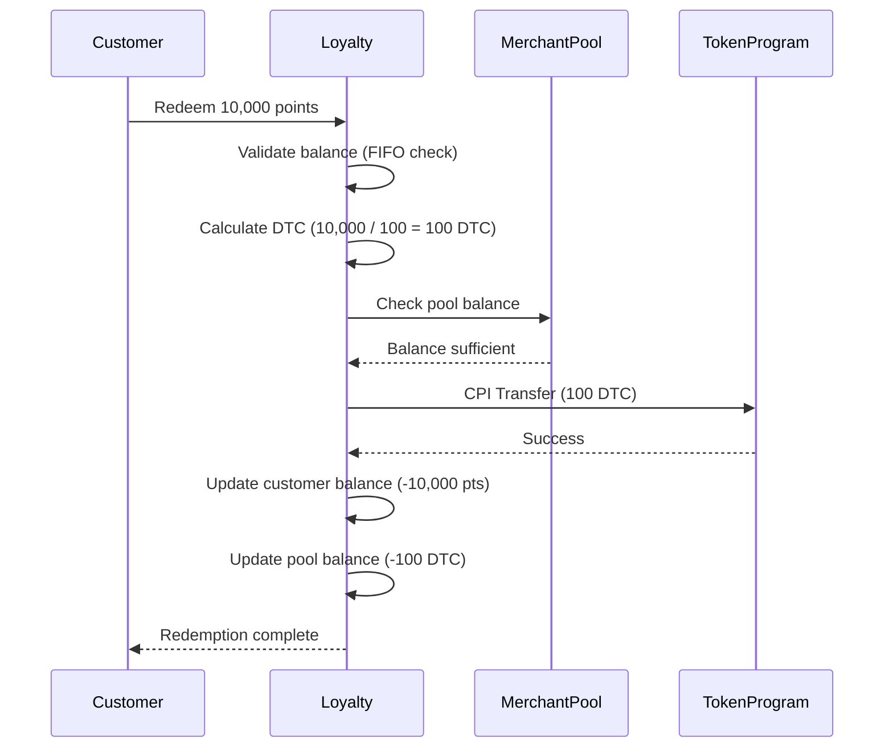
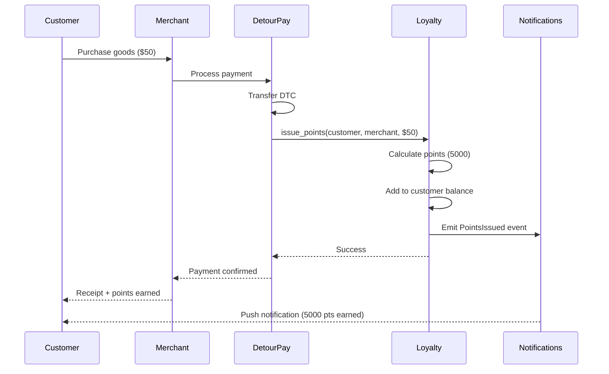
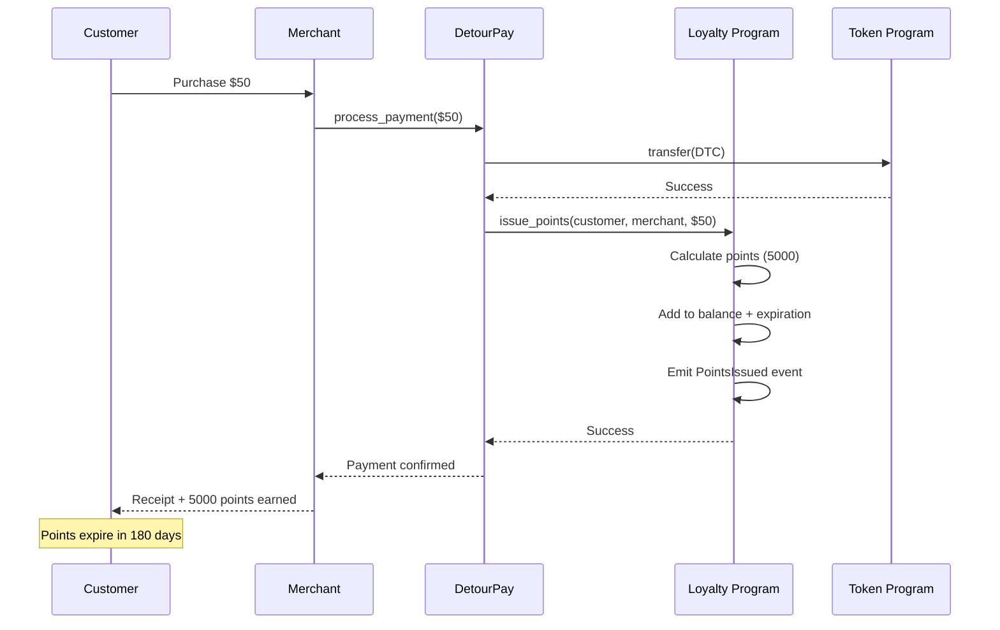
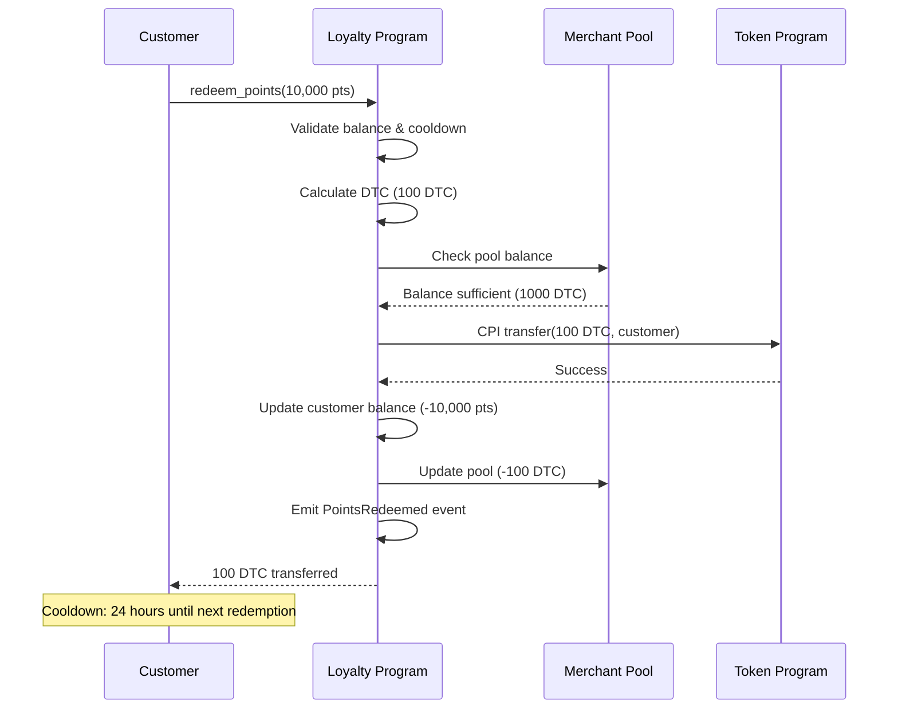

# DetourCoin Merchant Points & Loyalty Program

**Document ID:** TECH-004  
**Version:** 1.0  
**Status:** Implementation Specification  
**Owner:** Smart Contract Developer  
**Category:** Core Technical / Smart Contracts  
**Dependencies:** TECH-001 (Token Program), TECH-003 (RBAC), TECH-005 (Architecture), TECH-006 (Dev Environment)  
**Related:** DetourPay Integration, DetourMarket Platform

---

## 1. Program Overview

| Property | Value |
|----------|-------|
| **Program ID** | `TBD` (Generated during deployment) |
| **Purpose** | Decentralized merchant loyalty infrastructure for point-based rewards |
| **Framework** | Anchor v0.29+ |
| **Solana Version** | v1.17+ |

**Key Capabilities:**
- Merchant-specific point issuance based on transaction amounts
- FIFO expiration mechanics (default 180 days, merchant-configurable)
- DTC redemption with merchant-defined conversion rates
- Anti-abuse mechanisms (rate limiting, pattern detection)
- Batch expiration processing for compute efficiency
- Transaction history tracking and audit trails
- Integration with DetourPay for automated point issuance

**Integration Points:**



| External Program | Integration Point | CPI Direction | Purpose |
|------------------|-------------------|---------------|---------|
| Token Program (TECH-001) | `transfer` | Outbound | DTC redemption transfers |
| RBAC Program (TECH-003) | Authority validation | Query | Merchant/admin permission checks |
| DetourPay | `issue_points` | Inbound | Automated point issuance after transactions |
| DetourMarket | Balance/history queries | Query | Customer/merchant dashboards |

---

## 2. Loyalty Points Model

### Point Lifecycle



### Point Value Calculation

| Formula | Example | Notes |
|---------|---------|-------|
| **Issuance** | `points = floor(transaction_usd * merchant_rate)` | $50 × 1.0 = 50 points | Truncate decimals |
| **Redemption** | `dtc_amount = floor(points / conversion_rate)` | 1000 pts ÷ 100 = 10 DTC | Truncate decimals |
| **Value** | `1 point ≈ $0.01` (if 100 pts = 1 DTC = $1) | Depends on merchant configuration | Market-driven |

⚠️ **Precision Handling:** All point calculations use integer math to avoid floating-point precision issues. Remainders are truncated, not rounded, to prevent inflation.

### Point Expiration Rules

1. **Default Expiration:** 180 days from issuance
2. **Merchant Override:** Merchants can set custom expiration periods (30-365 days)
3. **FIFO Order:** Oldest points expire first, oldest redeemed first
4. **Grace Period:** None (hard expiration at timestamp)
5. **Batch Processing:** Expirations processed in batches to optimize compute units

---

## 3. Account Structures

### LoyaltyProgramState

```rust
#[account]
pub struct LoyaltyProgramState {
    /// Program version for upgrade compatibility
    pub version: u8,
    
    /// Authority allowed to update global configuration
    pub admin_authority: Pubkey,
    
    /// Default point expiration period (seconds)
    /// Default: 15,552,000 seconds (180 days)
    pub default_expiration_period: i64,
    
    /// Default conversion rate (points per DTC)
    /// Default: 100 (100 points = 1 DTC)
    pub default_conversion_rate: u64,
    
    /// Global anti-abuse configuration
    pub max_points_per_transaction: u64,
    pub max_points_per_customer_per_day: u64,
    pub max_redemptions_per_customer_per_day: u8,
    pub redemption_cooldown_seconds: i64,
    
    /// Total points issued across all merchants (historical)
    pub total_points_issued: u64,
    
    /// Total points redeemed across all merchants (historical)
    pub total_points_redeemed: u64,
    
    /// Total points expired across all merchants (historical)
    pub total_points_expired: u64,
    
    /// Current outstanding points across all merchants
    pub outstanding_points: u64,
    
    /// Total merchants registered
    pub merchant_count: u32,
    
    /// Program paused flag
    pub is_paused: bool,
    
    /// Timestamp of program initialization
    pub initialized_at: i64,
    
    /// Bump seed for PDA derivation
    pub bump: u8,
}

// PDA Seeds: ["loyalty_state"]
// Space: 8 + 1 + 32 + 8 + 8 + 8 + 8 + 1 + 8 + 8 + 8 + 8 + 8 + 4 + 1 + 8 + 1 = 128 bytes
```

### MerchantLoyaltyConfig

```rust
#[account]
pub struct MerchantLoyaltyConfig {
    /// Version for upgrade compatibility
    pub version: u8,
    
    /// Merchant wallet pubkey
    pub merchant: Pubkey,
    
    /// Point issuance rate (multiplier × 1000 for precision)
    /// Example: 1000 = 1.0 points per dollar, 1500 = 1.5 points per dollar
    pub issuance_rate: u32,
    
    /// DTC conversion rate (points needed for 1 DTC)
    /// Example: 100 = 100 points per 1 DTC
    pub conversion_rate: u64,
    
    /// Custom expiration period override (seconds)
    /// 0 = use default, otherwise overrides global default
    pub expiration_period_override: i64,
    
    /// Cross-merchant transfer enabled
    pub cross_merchant_transfer_enabled: bool,
    
    /// Merchant loyalty program active
    pub is_active: bool,
    
    /// Minimum transaction amount to earn points (USD cents)
    /// 0 = no minimum
    pub min_transaction_amount: u64,
    
    /// Merchant DTC pool balance for redemptions
    pub redemption_pool_balance: u64,
    
    /// Merchant-specific anti-abuse limits
    pub max_points_per_transaction: u64,
    pub daily_issuance_limit: u64,
    pub daily_redemption_limit: u64,
    
    /// Statistics
    pub total_points_issued: u64,
    pub total_points_redeemed: u64,
    pub current_outstanding_points: u64,
    pub active_customer_count: u32,
    
    /// Timestamps
    pub registered_at: i64,
    pub last_config_update: i64,
    
    /// Bump seed for PDA derivation
    pub bump: u8,
}

// PDA Seeds: ["merchant_config", merchant_pubkey]
// Space: 8 + 1 + 32 + 4 + 8 + 8 + 1 + 1 + 8 + 8 + 8 + 8 + 8 + 8 + 8 + 8 + 4 + 8 + 8 + 1 = 146 bytes
```

### CustomerPointBalance

```rust
/// Maximum number of expiration batches tracked
const MAX_EXPIRATION_BATCHES: usize = 50;

#[derive(AnchorSerialize, AnchorDeserialize, Clone, Copy)]
pub struct ExpirationBatch {
    /// Amount of points in this batch
    pub amount: u64,
    /// Expiration timestamp (Unix timestamp)
    pub expires_at: i64,
}

#[account]
pub struct CustomerPointBalance {
    /// Version for upgrade compatibility
    pub version: u8,
    
    /// Customer wallet pubkey
    pub customer: Pubkey,
    
    /// Merchant wallet pubkey
    pub merchant: Pubkey,
    
    /// Total current point balance
    pub balance: u64,
    
    /// Points organized by expiration date (FIFO)
    /// Array of {amount, expiration_timestamp}
    /// Sorted by expiration_timestamp (oldest first)
    pub expiration_batches: Vec<ExpirationBatch>,
    
    /// Total points earned (historical, never decreases)
    pub lifetime_points_earned: u64,
    
    /// Total points redeemed (historical, never decreases)
    pub lifetime_points_redeemed: u64,
    
    /// Total points expired (historical, never decreases)
    pub lifetime_points_expired: u64,
    
    /// Last issuance timestamp (for rate limiting)
    pub last_issuance_at: i64,
    
    /// Last redemption timestamp (for cooldown enforcement)
    pub last_redemption_at: i64,
    
    /// Daily issuance counter (resets at midnight UTC)
    pub daily_issuance_count: u64,
    pub daily_issuance_date: i64, // Date in YYYYMMDD format
    
    /// Daily redemption counter (resets at midnight UTC)
    pub daily_redemption_count: u8,
    pub daily_redemption_date: i64, // Date in YYYYMMDD format
    
    /// Anti-abuse flags
    pub is_flagged: bool,
    pub flag_reason: u8, // 0 = none, 1 = rate limit, 2 = pattern, 3 = manual
    
    /// Account creation timestamp
    pub created_at: i64,
    
    /// Last transaction timestamp
    pub last_activity_at: i64,
    
    /// Bump seed for PDA derivation
    pub bump: u8,
}

// PDA Seeds: ["customer_balance", customer_pubkey, merchant_pubkey]
// Space: 8 + 1 + 32 + 32 + 8 + (4 + 50*(8+8)) + 8 + 8 + 8 + 8 + 8 + 8 + 8 + 8 + 1 + 8 + 1 + 1 + 8 + 8 + 1 = 989 bytes
```

### PointTransaction

```rust
#[repr(u8)]
#[derive(AnchorSerialize, AnchorDeserialize, Clone, Copy, PartialEq, Eq)]
pub enum TransactionType {
    Issuance = 0,
    Redemption = 1,
    Expiration = 2,
    Transfer = 3,
    ManualAdjustment = 4,
}

#[account]
pub struct PointTransaction {
    /// Version for upgrade compatibility
    pub version: u8,
    
    /// Customer wallet pubkey
    pub customer: Pubkey,
    
    /// Merchant wallet pubkey
    pub merchant: Pubkey,
    
    /// Transaction type
    pub transaction_type: TransactionType,
    
    /// Points amount (positive or negative)
    pub points_amount: i64,
    
    /// Related DTC amount (for redemptions)
    pub dtc_amount: u64,
    
    /// Related DetourPay transaction ID (for issuance)
    /// All zeros if not applicable
    pub related_transaction_id: [u8; 32],
    
    /// Transaction timestamp
    pub timestamp: i64,
    
    /// For transfers: target customer pubkey
    /// For other types: all zeros
    pub transfer_target: Pubkey,
    
    /// For manual adjustments: admin authority pubkey
    /// For other types: all zeros
    pub admin_authority: Pubkey,
    
    /// Optional memo (empty string if unused)
    pub memo: String, // Max 64 bytes
    
    /// Bump seed for PDA derivation
    pub bump: u8,
}

// PDA Seeds: ["point_tx", customer_pubkey, merchant_pubkey, timestamp_bytes]
// Space: 8 + 1 + 32 + 32 + 1 + 8 + 8 + 32 + 8 + 32 + 32 + (4 + 64) + 1 = 263 bytes
```

### MerchantRedemptionPool

```rust
#[account]
pub struct MerchantRedemptionPool {
    /// Version for upgrade compatibility
    pub version: u8,
    
    /// Merchant wallet pubkey
    pub merchant: Pubkey,
    
    /// Current DTC balance in pool (lamports)
    pub balance: u64,
    
    /// Total DTC deposited (historical)
    pub total_deposited: u64,
    
    /// Total DTC withdrawn for redemptions (historical)
    pub total_redeemed: u64,
    
    /// Low balance threshold for alerts (lamports)
    pub low_balance_threshold: u64,
    
    /// Last deposit timestamp
    pub last_deposit_at: i64,
    
    /// Last redemption timestamp
    pub last_redemption_at: i64,
    
    /// Pool created at timestamp
    pub created_at: i64,
    
    /// Bump seed for PDA derivation
    pub bump: u8,
}

// PDA Seeds: ["redemption_pool", merchant_pubkey]
// Space: 8 + 1 + 32 + 8 + 8 + 8 + 8 + 8 + 8 + 8 + 1 = 98 bytes
```

---

## 4. Program Derived Addresses (PDAs)

### PDA Derivation Table

| Account Type | Seeds | Example | Notes |
|--------------|-------|---------|-------|
| **LoyaltyProgramState** | `["loyalty_state"]` | Single global state account | Program configuration |
| **MerchantLoyaltyConfig** | `["merchant_config", merchant_pubkey]` | One per merchant | Merchant-specific settings |
| **CustomerPointBalance** | `["customer_balance", customer_pubkey, merchant_pubkey]` | One per customer-merchant pair | Customer balance tracking |
| **PointTransaction** | `["point_tx", customer_pubkey, merchant_pubkey, timestamp_bytes]` | One per transaction | Transaction history |
| **MerchantRedemptionPool** | `["redemption_pool", merchant_pubkey]` | One per merchant | DTC pool for redemptions |

### PDA Derivation Code Examples

```rust
// Loyalty program state PDA
pub fn get_loyalty_state_pda(program_id: &Pubkey) -> (Pubkey, u8) {
    Pubkey::find_program_address(
        &[b"loyalty_state"],
        program_id,
    )
}

// Merchant configuration PDA
pub fn get_merchant_config_pda(
    merchant: &Pubkey,
    program_id: &Pubkey,
) -> (Pubkey, u8) {
    Pubkey::find_program_address(
        &[b"merchant_config", merchant.as_ref()],
        program_id,
    )
}

// Customer point balance PDA
pub fn get_customer_balance_pda(
    customer: &Pubkey,
    merchant: &Pubkey,
    program_id: &Pubkey,
) -> (Pubkey, u8) {
    Pubkey::find_program_address(
        &[
            b"customer_balance",
            customer.as_ref(),
            merchant.as_ref(),
        ],
        program_id,
    )
}

// Point transaction PDA
pub fn get_point_transaction_pda(
    customer: &Pubkey,
    merchant: &Pubkey,
    timestamp: i64,
    program_id: &Pubkey,
) -> (Pubkey, u8) {
    Pubkey::find_program_address(
        &[
            b"point_tx",
            customer.as_ref(),
            merchant.as_ref(),
            &timestamp.to_le_bytes(),
        ],
        program_id,
    )
}

// Merchant redemption pool PDA
pub fn get_redemption_pool_pda(
    merchant: &Pubkey,
    program_id: &Pubkey,
) -> (Pubkey, u8) {
    Pubkey::find_program_address(
        &[b"redemption_pool", merchant.as_ref()],
        program_id,
    )
}
```

---

## 5. Instruction Handlers

### 5.1 Initialize Loyalty Program

**Purpose:** Initialize the global loyalty program state with default configuration.

**Accounts:**
```rust
#[derive(Accounts)]
pub struct InitializeLoyaltyProgram<'info> {
    #[account(
        init,
        payer = admin,
        space = 8 + 128,
        seeds = [b"loyalty_state"],
        bump
    )]
    pub loyalty_state: Account<'info, LoyaltyProgramState>,
    
    #[account(mut)]
    pub admin: Signer<'info>,
    
    pub system_program: Program<'info, System>,
}
```

**Parameters:**
```rust
pub struct InitializeLoyaltyProgramParams {
    pub default_expiration_period: i64,        // Default: 15,552,000 (180 days)
    pub default_conversion_rate: u64,          // Default: 100 points per DTC
    pub max_points_per_transaction: u64,       // Default: 10,000
    pub max_points_per_customer_per_day: u64,  // Default: 50,000
    pub max_redemptions_per_customer_per_day: u8, // Default: 5
    pub redemption_cooldown_seconds: i64,      // Default: 86,400 (24 hours)
}
```

**Logic:**
1. Validate admin authority (must be program deployer or authorized admin)
2. Initialize `LoyaltyProgramState` with provided parameters
3. Set `admin_authority` to admin signer pubkey
4. Set initial statistics to zero
5. Record `initialized_at` timestamp
6. Emit `LoyaltyProgramInitialized` event

**Security:**
- ✅ Only callable once (account initialization constraint)
- ✅ Requires admin signature
- ✅ PDA seeds prevent unauthorized reinitialization

---

### 5.2 Register Merchant

**Purpose:** Register a merchant in the loyalty program with custom configuration.

**Accounts:**
```rust
#[derive(Accounts)]
#[instruction(merchant_pubkey: Pubkey)]
pub struct RegisterMerchant<'info> {
    #[account(
        init,
        payer = payer,
        space = 8 + 146,
        seeds = [b"merchant_config", merchant_pubkey.as_ref()],
        bump
    )]
    pub merchant_config: Account<'info, MerchantLoyaltyConfig>,
    
    #[account(
        init,
        payer = payer,
        space = 8 + 98,
        seeds = [b"redemption_pool", merchant_pubkey.as_ref()],
        bump
    )]
    pub redemption_pool: Account<'info, MerchantRedemptionPool>,
    
    #[account(mut)]
    pub loyalty_state: Account<'info, LoyaltyProgramState>,
    
    /// Merchant authority (must sign if self-registering)
    pub merchant_authority: Signer<'info>,
    
    #[account(mut)]
    pub payer: Signer<'info>,
    
    pub system_program: Program<'info, System>,
    
    /// RBAC program for authority validation (optional, validate off-chain if preferred)
    /// CHECK: RBAC program ID validation
    pub rbac_program: UncheckedAccount<'info>,
}
```

**Parameters:**
```rust
pub struct RegisterMerchantParams {
    pub merchant_pubkey: Pubkey,
    pub issuance_rate: u32,                    // Example: 1000 = 1.0 pts/$
    pub conversion_rate: u64,                  // Example: 100 = 100 pts/DTC
    pub expiration_period_override: i64,       // 0 = use default
    pub cross_merchant_transfer_enabled: bool,
    pub min_transaction_amount: u64,           // USD cents
    pub max_points_per_transaction: u64,       // 0 = use global default
    pub daily_issuance_limit: u64,             // 0 = no limit
    pub daily_redemption_limit: u64,           // 0 = no limit
    pub initial_pool_deposit: u64,             // Initial DTC deposit (lamports)
    pub low_balance_threshold: u64,            // Alert threshold (lamports)
}
```

**Logic:**
1. **Authority Validation:**
   - If merchant_authority is merchant_pubkey, allow (self-registration)
   - Otherwise, validate via RBAC program (Platform Admin or Merchant Admin role)
2. **Parameter Validation:**
   - `issuance_rate > 0 && issuance_rate <= 10000` (max 10x multiplier)
   - `conversion_rate >= 10 && conversion_rate <= 10000` (reasonable range)
   - `expiration_period_override == 0 || (expiration_period >= 2592000 && <= 31536000)` (30-365 days)
3. **Initialize MerchantLoyaltyConfig:**
   - Set all configuration parameters
   - Set `is_active = true`
   - Record `registered_at` timestamp
4. **Initialize MerchantRedemptionPool:**
   - Set `balance = 0` (deposit in separate instruction if needed)
   - Set `low_balance_threshold`
   - Record `created_at` timestamp
5. **Update LoyaltyProgramState:**
   - Increment `merchant_count`
6. **Emit `MerchantRegistered` event**

**Security:**
- ✅ Authority validation via RBAC or self-registration
- ✅ Parameter range validation prevents abuse
- ✅ PDA seeds prevent duplicate registrations

---

### 5.3 Update Merchant Configuration

**Purpose:** Update merchant loyalty configuration (rates, limits, etc.).

**Accounts:**
```rust
#[derive(Accounts)]
pub struct UpdateMerchantConfig<'info> {
    #[account(
        mut,
        seeds = [b"merchant_config", merchant_config.merchant.as_ref()],
        bump = merchant_config.bump
    )]
    pub merchant_config: Account<'info, MerchantLoyaltyConfig>,
    
    /// Merchant owner or Platform Admin
    pub authority: Signer<'info>,
    
    /// RBAC program for authority validation
    /// CHECK: RBAC program ID validation
    pub rbac_program: UncheckedAccount<'info>,
}
```

**Parameters:**
```rust
pub struct UpdateMerchantConfigParams {
    pub issuance_rate: Option<u32>,
    pub conversion_rate: Option<u64>,
    pub expiration_period_override: Option<i64>,
    pub cross_merchant_transfer_enabled: Option<bool>,
    pub is_active: Option<bool>,
    pub min_transaction_amount: Option<u64>,
    pub max_points_per_transaction: Option<u64>,
    pub daily_issuance_limit: Option<u64>,
    pub daily_redemption_limit: Option<u64>,
}
```

**Logic:**
1. **Authority Validation:**
   - Validate authority is merchant owner OR Platform Admin via RBAC
2. **Parameter Validation:**
   - Same validation rules as RegisterMerchant for each provided parameter
3. **Update MerchantLoyaltyConfig:**
   - Update only provided fields (Option pattern)
   - Update `last_config_update` timestamp
4. **Emit `MerchantConfigUpdated` event**

**Security:**
- ✅ Authority validation via RBAC
- ✅ Parameter range validation
- ✅ Audit trail via event emission

---

### 5.4 Issue Points

**Purpose:** Issue loyalty points to a customer after a DetourPay transaction.

**Accounts:**
```rust
#[derive(Accounts)]
#[instruction(customer_pubkey: Pubkey, merchant_pubkey: Pubkey)]
pub struct IssuePoints<'info> {
    #[account(
        seeds = [b"merchant_config", merchant_pubkey.as_ref()],
        bump = merchant_config.bump,
        constraint = merchant_config.is_active @ LoyaltyError::MerchantNotActive
    )]
    pub merchant_config: Account<'info, MerchantLoyaltyConfig>,
    
    #[account(
        init_if_needed,
        payer = payer,
        space = 8 + 989,
        seeds = [b"customer_balance", customer_pubkey.as_ref(), merchant_pubkey.as_ref()],
        bump
    )]
    pub customer_balance: Account<'info, CustomerPointBalance>,
    
    #[account(
        init,
        payer = payer,
        space = 8 + 263,
        seeds = [
            b"point_tx",
            customer_pubkey.as_ref(),
            merchant_pubkey.as_ref(),
            &clock.unix_timestamp.to_le_bytes()
        ],
        bump
    )]
    pub point_transaction: Account<'info, PointTransaction>,
    
    #[account(mut)]
    pub loyalty_state: Account<'info, LoyaltyProgramState>,
    
    /// DetourPay program or Merchant Admin (for manual issuance)
    pub authority: Signer<'info>,
    
    #[account(mut)]
    pub payer: Signer<'info>,
    
    pub system_program: Program<'info, System>,
    pub clock: Sysvar<'info, Clock>,
}
```

**Parameters:**
```rust
pub struct IssuePointsParams {
    pub customer_pubkey: Pubkey,
    pub merchant_pubkey: Pubkey,
    pub transaction_amount_usd_cents: u64,    // Transaction amount in USD cents
    pub detourpay_transaction_id: [u8; 32],   // Reference to DetourPay transaction
}
```

**Logic:**
1. **Pre-Validation:**
   - Check `loyalty_state.is_paused == false`
   - Check `merchant_config.is_active == true`
   - Check `transaction_amount_usd_cents >= merchant_config.min_transaction_amount`
   - Check `customer_balance.is_flagged == false`

2. **Calculate Points:**
   ```rust
   let points = (transaction_amount_usd_cents as u128)
       .checked_mul(merchant_config.issuance_rate as u128)
       .unwrap()
       .checked_div(1000)
       .unwrap() as u64; // Truncate, don't round
   ```

3. **Anti-Abuse Checks:**
   - Check `points <= merchant_config.max_points_per_transaction` (or global default)
   - Check daily issuance limit:
     ```rust
     let current_date = get_date_from_timestamp(clock.unix_timestamp);
     if customer_balance.daily_issuance_date != current_date {
         customer_balance.daily_issuance_count = 0;
         customer_balance.daily_issuance_date = current_date;
     }
     customer_balance.daily_issuance_count += points;
     require!(
         customer_balance.daily_issuance_count <= merchant_config.daily_issuance_limit,
         LoyaltyError::DailyIssuanceLimitExceeded
     );
     ```

4. **Calculate Expiration:**
   ```rust
   let expiration_period = if merchant_config.expiration_period_override > 0 {
       merchant_config.expiration_period_override
   } else {
       loyalty_state.default_expiration_period
   };
   let expires_at = clock.unix_timestamp + expiration_period;
   ```

5. **Update Customer Balance:**
   - Add points to `balance`
   - Add new `ExpirationBatch { amount: points, expires_at }` to `expiration_batches` array
   - Keep array sorted by `expires_at` (insert in correct position)
   - Increment `lifetime_points_earned`
   - Update `last_issuance_at` and `last_activity_at` timestamps

6. **Record Transaction:**
   - Populate `PointTransaction` account:
     - `transaction_type = TransactionType::Issuance`
     - `points_amount = points`
     - `related_transaction_id = detourpay_transaction_id`
     - `timestamp = clock.unix_timestamp`

7. **Update Statistics:**
   - Increment `loyalty_state.total_points_issued`
   - Increment `loyalty_state.outstanding_points`
   - Increment `merchant_config.total_points_issued`
   - Increment `merchant_config.current_outstanding_points`

8. **Emit `PointsIssued` event**

**Security:**
- ✅ Authority validation (DetourPay program or Merchant Admin)
- ✅ Anti-abuse checks (rate limiting, daily limits)
- ✅ Overflow protection (checked math)
- ✅ Expiration tracking for future cleanup

⚠️ **Rate Limiting:** If daily limit exceeded, transaction fails with `DailyIssuanceLimitExceeded` error.

---

### 5.5 Redeem Points for DTC

**Purpose:** Customer redeems loyalty points for DTC tokens.

**Accounts:**
```rust
#[derive(Accounts)]
pub struct RedeemPoints<'info> {
    #[account(
        seeds = [b"merchant_config", merchant_config.merchant.as_ref()],
        bump = merchant_config.bump,
        constraint = merchant_config.is_active @ LoyaltyError::MerchantNotActive
    )]
    pub merchant_config: Account<'info, MerchantLoyaltyConfig>,
    
    #[account(
        mut,
        seeds = [b"customer_balance", customer.key().as_ref(), merchant_config.merchant.as_ref()],
        bump = customer_balance.bump,
        constraint = customer_balance.balance > 0 @ LoyaltyError::InsufficientPoints,
        constraint = !customer_balance.is_flagged @ LoyaltyError::AccountFlagged
    )]
    pub customer_balance: Account<'info, CustomerPointBalance>,
    
    #[account(
        mut,
        seeds = [b"redemption_pool", merchant_config.merchant.as_ref()],
        bump = redemption_pool.bump
    )]
    pub redemption_pool: Account<'info, MerchantRedemptionPool>,
    
    #[account(
        init,
        payer = customer,
        space = 8 + 263,
        seeds = [
            b"point_tx",
            customer.key().as_ref(),
            merchant_config.merchant.as_ref(),
            &clock.unix_timestamp.to_le_bytes()
        ],
        bump
    )]
    pub point_transaction: Account<'info, PointTransaction>,
    
    #[account(mut)]
    pub loyalty_state: Account<'info, LoyaltyProgramState>,
    
    /// Customer (must sign)
    #[account(mut)]
    pub customer: Signer<'info>,
    
    /// Customer's DTC token account (receive redemption)
    #[account(mut)]
    pub customer_token_account: Account<'info, TokenAccount>,
    
    /// Merchant's redemption pool token account (source of DTC)
    #[account(mut)]
    pub pool_token_account: Account<'info, TokenAccount>,
    
    /// Token program for CPI transfer
    pub token_program: Program<'info, Token>,
    
    pub system_program: Program<'info, System>,
    pub clock: Sysvar<'info, Clock>,
}
```

**Parameters:**
```rust
pub struct RedeemPointsParams {
    pub points_to_redeem: u64,
}
```

**Logic:**
1. **Pre-Validation:**
   - Check `loyalty_state.is_paused == false`
   - Check `merchant_config.is_active == true`
   - Check `customer_balance.is_flagged == false`
   - Check cooldown period:
     ```rust
     let time_since_last_redemption = clock.unix_timestamp - customer_balance.last_redemption_at;
     require!(
         time_since_last_redemption >= loyalty_state.redemption_cooldown_seconds,
         LoyaltyError::RedemptionCooldownActive
     );
     ```

2. **Daily Redemption Limit Check:**
   ```rust
   let current_date = get_date_from_timestamp(clock.unix_timestamp);
   if customer_balance.daily_redemption_date != current_date {
       customer_balance.daily_redemption_count = 0;
       customer_balance.daily_redemption_date = current_date;
   }
   customer_balance.daily_redemption_count += 1;
   require!(
       customer_balance.daily_redemption_count <= loyalty_state.max_redemptions_per_customer_per_day,
       LoyaltyError::DailyRedemptionLimitExceeded
   );
   ```

3. **Validate Sufficient Balance:**
   - Process any expired points first (remove from balance and expiration_batches)
   - Check `customer_balance.balance >= points_to_redeem`

4. **Deduct Points (FIFO):**
   ```rust
   let mut remaining_to_redeem = points_to_redeem;
   let mut batch_index = 0;
   
   while remaining_to_redeem > 0 && batch_index < customer_balance.expiration_batches.len() {
       let batch = &mut customer_balance.expiration_batches[batch_index];
       
       // Skip expired batches (should already be processed, but double-check)
       if batch.expires_at <= clock.unix_timestamp {
           batch_index += 1;
           continue;
       }
       
       if batch.amount <= remaining_to_redeem {
           // Consume entire batch
           remaining_to_redeem -= batch.amount;
           customer_balance.expiration_batches.remove(batch_index);
       } else {
           // Partial consumption
           batch.amount -= remaining_to_redeem;
           remaining_to_redeem = 0;
           break;
       }
   }
   
   require!(remaining_to_redeem == 0, LoyaltyError::InsufficientPoints);
   ```

5. **Calculate DTC Amount:**
   ```rust
   let dtc_amount = (points_to_redeem as u128)
       .checked_div(merchant_config.conversion_rate as u128)
       .unwrap() as u64; // Truncate decimals
   
   require!(dtc_amount > 0, LoyaltyError::RedemptionAmountTooSmall);
   ```

6. **Validate Pool Balance:**
   ```rust
   require!(
       redemption_pool.balance >= dtc_amount,
       LoyaltyError::InsufficientRedemptionPool
   );
   ```

7. **Transfer DTC via CPI:**
   ```rust
   let cpi_accounts = Transfer {
       from: pool_token_account.to_account_info(),
       to: customer_token_account.to_account_info(),
       authority: redemption_pool.to_account_info(), // PDA signer
   };
   let cpi_program = token_program.to_account_info();
   let seeds = &[
       b"redemption_pool",
       merchant_config.merchant.as_ref(),
       &[redemption_pool.bump],
   ];
   let signer_seeds = &[&seeds[..]];
   let cpi_ctx = CpiContext::new_with_signer(cpi_program, cpi_accounts, signer_seeds);
   token::transfer(cpi_ctx, dtc_amount)?;
   ```

8. **Update Customer Balance:**
   - Subtract `points_to_redeem` from `balance`
   - Increment `lifetime_points_redeemed`
   - Update `last_redemption_at` and `last_activity_at` timestamps

9. **Update Redemption Pool:**
   - Subtract `dtc_amount` from `balance`
   - Increment `total_redeemed`
   - Update `last_redemption_at` timestamp
   - If `balance < low_balance_threshold`, emit `RedemptionPoolLowBalance` event

10. **Record Transaction:**
    - Populate `PointTransaction` account:
      - `transaction_type = TransactionType::Redemption`
      - `points_amount = -(points_to_redeem as i64)`
      - `dtc_amount = dtc_amount`
      - `timestamp = clock.unix_timestamp`

11. **Update Statistics:**
    - Increment `loyalty_state.total_points_redeemed`
    - Decrement `loyalty_state.outstanding_points`
    - Increment `merchant_config.total_points_redeemed`
    - Decrement `merchant_config.current_outstanding_points`

12. **Emit `PointsRedeemed` event**

**Security:**
- ✅ Customer signature required (only customer can redeem their points)
- ✅ FIFO redemption prevents expired point usage
- ✅ Cooldown period prevents rapid abuse
- ✅ Pool balance validation prevents over-redemption
- ✅ CPI with PDA signer for secure token transfer

⚠️ **Cooldown Enforcement:** 24-hour cooldown between redemptions prevents wash trading and gaming.

---

### 5.6 Fund Redemption Pool

**Purpose:** Merchant deposits DTC into redemption pool to enable customer redemptions.

**Accounts:**
```rust
#[derive(Accounts)]
pub struct FundRedemptionPool<'info> {
    #[account(
        mut,
        seeds = [b"redemption_pool", merchant.key().as_ref()],
        bump = redemption_pool.bump
    )]
    pub redemption_pool: Account<'info, MerchantRedemptionPool>,
    
    /// Merchant (must sign)
    #[account(mut)]
    pub merchant: Signer<'info>,
    
    /// Merchant's DTC token account (source)
    #[account(mut)]
    pub merchant_token_account: Account<'info, TokenAccount>,
    
    /// Redemption pool's DTC token account (destination)
    #[account(mut)]
    pub pool_token_account: Account<'info, TokenAccount>,
    
    /// Token program for CPI transfer
    pub token_program: Program<'info, Token>,
    
    pub clock: Sysvar<'info, Clock>,
}
```

**Parameters:**
```rust
pub struct FundRedemptionPoolParams {
    pub amount: u64, // DTC amount in lamports
}
```

**Logic:**
1. **Validate Amount:**
   - Check `amount > 0`

2. **Transfer DTC from Merchant:**
   ```rust
   let cpi_accounts = Transfer {
       from: merchant_token_account.to_account_info(),
       to: pool_token_account.to_account_info(),
       authority: merchant.to_account_info(),
   };
   let cpi_program = token_program.to_account_info();
   let cpi_ctx = CpiContext::new(cpi_program, cpi_accounts);
   token::transfer(cpi_ctx, amount)?;
   ```

3. **Update Redemption Pool:**
   - Add `amount` to `balance`
   - Add `amount` to `total_deposited`
   - Update `last_deposit_at` timestamp

4. **Emit `RedemptionPoolFunded` event**

**Security:**
- ✅ Merchant signature required
- ✅ Token transfer via standard SPL token CPI

💡 **Best Practice:** Merchants should maintain pool balance ≥ 2× current outstanding points value to ensure redemption availability.

---

### 5.7 Process Expirations

**Purpose:** Batch process expired points to clean up customer balances.

**Accounts:**
```rust
#[derive(Accounts)]
pub struct ProcessExpirations<'info> {
    #[account(
        mut,
        seeds = [b"customer_balance", customer_balance.customer.as_ref(), customer_balance.merchant.as_ref()],
        bump = customer_balance.bump
    )]
    pub customer_balance: Account<'info, CustomerPointBalance>,
    
    #[account(mut)]
    pub loyalty_state: Account<'info, LoyaltyProgramState>,
    
    #[account(
        mut,
        seeds = [b"merchant_config", customer_balance.merchant.as_ref()],
        bump = merchant_config.bump
    )]
    pub merchant_config: Account<'info, MerchantLoyaltyConfig>,
    
    /// Automated service or Platform Admin
    pub authority: Signer<'info>,
    
    pub clock: Sysvar<'info, Clock>,
}
```

**Parameters:**
```rust
pub struct ProcessExpirationsParams {
    pub max_batches_to_process: u8, // Limit compute units, e.g., 10
}
```

**Logic:**
1. **Find Expired Batches:**
   ```rust
   let current_timestamp = clock.unix_timestamp;
   let mut total_expired = 0u64;
   let mut batches_processed = 0u8;
   
   while batches_processed < max_batches_to_process 
       && !customer_balance.expiration_batches.is_empty() 
   {
       let batch = &customer_balance.expiration_batches[0];
       
       if batch.expires_at > current_timestamp {
           break; // No more expired batches (array is sorted)
       }
       
       total_expired += batch.amount;
       customer_balance.expiration_batches.remove(0);
       batches_processed += 1;
   }
   
   require!(total_expired > 0, LoyaltyError::NoExpiredPoints);
   ```

2. **Update Customer Balance:**
   - Subtract `total_expired` from `balance`
   - Add `total_expired` to `lifetime_points_expired`

3. **Update Statistics:**
   - Add `total_expired` to `loyalty_state.total_points_expired`
   - Subtract `total_expired` from `loyalty_state.outstanding_points`
   - Subtract `total_expired` from `merchant_config.current_outstanding_points`

4. **Emit `PointsExpired` event**

**Security:**
- ✅ Authority validation (automated service or Platform Admin)
- ✅ Batch limit prevents compute unit overflow
- ✅ Timestamp validation ensures only expired points removed

⚠️ **Compute Optimization:** Process expirations in batches of 10 to stay within compute unit limits.

---

### 5.8 Query Point Balance (View Function)

**Purpose:** Query customer point balance and expiration breakdown.

**Implementation:**
```rust
// This is a read-only function, not a transaction instruction
pub fn query_point_balance(
    customer_balance: &CustomerPointBalance,
    current_timestamp: i64,
) -> PointBalanceResponse {
    let mut active_points = 0u64;
    let mut expired_points = 0u64;
    let mut expiration_breakdown = Vec::new();
    
    for batch in &customer_balance.expiration_batches {
        if batch.expires_at > current_timestamp {
            active_points += batch.amount;
            expiration_breakdown.push(ExpirationDetail {
                amount: batch.amount,
                expires_at: batch.expires_at,
                days_until_expiration: ((batch.expires_at - current_timestamp) / 86400) as u32,
            });
        } else {
            expired_points += batch.amount;
        }
    }
    
    PointBalanceResponse {
        customer: customer_balance.customer,
        merchant: customer_balance.merchant,
        total_balance: customer_balance.balance,
        active_points,
        expired_points,
        expiration_breakdown,
        lifetime_earned: customer_balance.lifetime_points_earned,
        lifetime_redeemed: customer_balance.lifetime_points_redeemed,
        lifetime_expired: customer_balance.lifetime_points_expired,
    }
}

#[derive(AnchorSerialize, AnchorDeserialize)]
pub struct PointBalanceResponse {
    pub customer: Pubkey,
    pub merchant: Pubkey,
    pub total_balance: u64,
    pub active_points: u64,
    pub expired_points: u64,
    pub expiration_breakdown: Vec<ExpirationDetail>,
    pub lifetime_earned: u64,
    pub lifetime_redeemed: u64,
    pub lifetime_expired: u64,
}

#[derive(AnchorSerialize, AnchorDeserialize)]
pub struct ExpirationDetail {
    pub amount: u64,
    pub expires_at: i64,
    pub days_until_expiration: u32,
}
```

**Usage:**
- Frontend/backend calls RPC to fetch `CustomerPointBalance` account
- Deserialize account data
- Call `query_point_balance()` function locally to compute expiration breakdown
- No transaction required (read-only)

---

### 5.9 Query Transaction History (View Function)

**Purpose:** Query customer's point transaction history for a merchant.

**Implementation:**
```rust
// Frontend/backend implementation (not on-chain)
// Fetch all PointTransaction accounts with filters:
// - customer = <customer_pubkey>
// - merchant = <merchant_pubkey> (optional)
// - timestamp >= <start_date> && timestamp <= <end_date> (optional)
// Sort by timestamp descending
// Paginate results

// Example RPC call:
pub async fn query_transaction_history(
    rpc_client: &RpcClient,
    program_id: &Pubkey,
    customer: &Pubkey,
    merchant: Option<&Pubkey>,
    start_date: Option<i64>,
    end_date: Option<i64>,
    limit: usize,
    offset: usize,
) -> Result<Vec<PointTransaction>> {
    // Use getProgramAccounts RPC with filters
    // Filter by discriminator + customer pubkey
    // Optionally filter by merchant pubkey
    // Fetch and deserialize accounts
    // Filter by timestamp range
    // Sort and paginate
    // Return results
}
```

**Usage:**
- DetourMarket platform calls this function to display transaction history
- Merchants can view customer activity
- Customers can view their own transaction history

---

## 6. Point Issuance Logic

### Calculation Formula

```rust
/// Calculate points for a transaction
pub fn calculate_points_for_transaction(
    transaction_amount_usd_cents: u64,
    issuance_rate: u32, // Rate × 1000 (e.g., 1000 = 1.0x, 1500 = 1.5x)
) -> u64 {
    // Use checked math to prevent overflow
    let points = (transaction_amount_usd_cents as u128)
        .checked_mul(issuance_rate as u128)
        .expect("Overflow in points calculation")
        .checked_div(1000)
        .expect("Division error") as u64;
    
    // Truncate, don't round
    points
}
```

### Examples

| Transaction Amount | Issuance Rate | Calculation | Points Issued |
|--------------------|---------------|-------------|---------------|
| $50.00 | 1.0x (1000) | (5000 × 1000) / 1000 | 5000 |
| $25.50 | 1.5x (1500) | (2550 × 1500) / 1000 | 3825 |
| $100.00 | 2.0x (2000) | (10000 × 2000) / 1000 | 20000 |
| $0.99 | 1.0x (1000) | (99 × 1000) / 1000 | 99 |

### Integration with DetourPay

**Trigger Flow:**



**Implementation Options:**

1. **Atomic (Same Transaction):**
   - DetourPay includes `issue_points` instruction in same transaction as payment
   - Pros: Guaranteed consistency
   - Cons: Higher compute units, transaction may fail if point issuance fails

2. **Separate Transaction (Immediate):**
   - DetourPay sends separate transaction immediately after payment
   - Pros: Payment succeeds even if point issuance fails
   - Cons: Requires retry logic if second transaction fails

**Recommended:** Use separate transaction with retry logic to ensure payment reliability.

---

## 7. Point Expiration Mechanics

### FIFO Expiration Order

Points expire in the order they were issued (First-In-First-Out). The `expiration_batches` array in `CustomerPointBalance` is always sorted by `expires_at` timestamp (oldest first).

**Example:**

```rust
// Customer balance with multiple expiration batches
CustomerPointBalance {
    balance: 15000,
    expiration_batches: [
        ExpirationBatch { amount: 5000, expires_at: 1704067200 }, // Jan 1, 2024
        ExpirationBatch { amount: 7000, expires_at: 1711929600 }, // Apr 1, 2024
        ExpirationBatch { amount: 3000, expires_at: 1719792000 }, // Jul 1, 2024
    ],
    ...
}

// Customer redeems 6000 points on Mar 15, 2024
// FIFO redemption logic:
// 1. Consume entire first batch (5000 pts from Jan 1)
// 2. Consume 1000 pts from second batch (leaving 6000 pts for Apr 1)

// Resulting balance:
CustomerPointBalance {
    balance: 9000,
    expiration_batches: [
        ExpirationBatch { amount: 6000, expires_at: 1711929600 }, // Apr 1, 2024
        ExpirationBatch { amount: 3000, expires_at: 1719792000 }, // Jul 1, 2024
    ],
    ...
}
```

### Expiration Processing Strategies

**1. Automated Off-Chain Service (Recommended):**
- Cron job runs every 24 hours
- Queries all `CustomerPointBalance` accounts with expired batches
- Calls `process_expirations` instruction for each account
- Processes in batches to manage compute units

**2. On-Demand Expiration (During Redemption):**
- Before processing redemption, check for expired points
- Remove expired batches from `expiration_batches` array
- Update balance and statistics
- Prevents redemption of expired points

**3. Manual Trigger (Admin):**
- Platform Admin can manually trigger expiration processing
- Useful for backlog cleanup or emergency processing

### Compute Unit Optimization

```rust
// Process up to 10 expiration batches per transaction
// Each batch removal costs ~5000 CU
// Total: ~50,000 CU (well within 200,000 CU limit)

pub const MAX_EXPIRATION_BATCHES_PER_TX: u8 = 10;
```

---

## 8. Point Redemption Logic

### Redemption Flow



### FIFO Redemption Logic

See section 5.5 (`RedeemPoints` instruction) for detailed FIFO redemption code.

**Key Principles:**
1. Always redeem oldest points first (prevent expiration waste)
2. Remove entire expiration batches when possible (optimize array operations)
3. Partially consume batches only when necessary
4. Update balance atomically

---

## 9. DTC Conversion Rates

### Rate Configuration

| Configuration Level | Default | Range | Notes |
|---------------------|---------|-------|-------|
| **Global Default** | 100 pts/DTC | N/A | Set at program initialization |
| **Merchant Override** | Merchant-specific | 10-10,000 pts/DTC | Allows merchant customization |

### Example Conversion Rates

| Merchant | Conversion Rate | Points for 1 DTC | DTC Value per Point |
|----------|----------------|------------------|---------------------|
| Coffee Shop | 50 | 50 points | $0.02 (if 1 DTC = $1) |
| Electronics Store | 200 | 200 points | $0.005 |
| Gas Station | 100 | 100 points | $0.01 |

💡 **Best Practice:** Merchants should set conversion rates based on their margin and desired customer incentive. Higher conversion rates (more points per DTC) make points less valuable, encouraging more purchases before redemption.

### Dynamic Rate Adjustments

Merchants can update conversion rates using the `update_merchant_config` instruction. Historical redemptions use the conversion rate at the time of redemption (stored in `PointTransaction` for audit trail).

---

## 10. Merchant Rewards Pool Management

### Pool Balance Tracking

```rust
pub struct MerchantRedemptionPool {
    pub balance: u64,                // Current DTC balance (lamports)
    pub total_deposited: u64,        // Historical total (never decreases)
    pub total_redeemed: u64,         // Historical total (never decreases)
    pub low_balance_threshold: u64,  // Alert threshold
    ...
}
```

### Pool Funding Strategy

💡 **Recommended Reserve:**

```
Target Reserve = Current Outstanding Points × DTC Value per Point × 2

Example:
- Current outstanding points: 500,000
- Conversion rate: 100 pts/DTC
- Current DTC price: $1.00

Target Reserve = (500,000 / 100) × 2 = 10,000 DTC
```

### Low Balance Alerts

When `redemption_pool.balance < low_balance_threshold`, the `RedemptionPoolLowBalance` event is emitted. Merchants should:

1. **Immediate Action:** Fund pool to prevent redemption failures
2. **Monitor Dashboard:** Track pool balance trends
3. **Adjust Threshold:** Set threshold to 1.5× expected weekly redemptions

### Redemption Failure Handling

If pool balance is insufficient during redemption:

```rust
require!(
    redemption_pool.balance >= dtc_amount,
    LoyaltyError::InsufficientRedemptionPool
);
```

**Customer Experience:**
- Transaction fails gracefully with clear error message
- Customer retains their points (balance unchanged)
- Customer can retry after merchant refunds pool

---

## 11. Anti-Abuse Mechanisms

### Rate Limiting

| Limit Type | Default | Enforcement Level | Configurable By |
|------------|---------|-------------------|-----------------|
| **Max Points per Transaction** | 10,000 | Per transaction | Merchant or Global Admin |
| **Max Points per Customer per Day** | 50,000 | Daily, per customer-merchant pair | Global Admin |
| **Max Redemptions per Customer per Day** | 5 | Daily, per customer-merchant pair | Global Admin |
| **Redemption Cooldown** | 24 hours | Between redemptions | Global Admin |

### Pattern Detection

⚠️ **Suspicious Patterns:**

1. **Wash Trading:**
   - Customer issues and redeems points repeatedly within short timeframe
   - Detection: Track `last_issuance_at` and `last_redemption_at` timestamps
   - Action: Flag account if redemption occurs < 24 hours after issuance

2. **Unusually Large Issuances:**
   - Single transaction issues > `max_points_per_transaction`
   - Detection: Validate in `issue_points` instruction
   - Action: Transaction fails with error

3. **Bot Behavior:**
   - Multiple customers with identical behavior patterns (same amounts, same timing)
   - Detection: Off-chain analytics (not enforced on-chain)
   - Action: Manual review by Platform Admin

### Account Flagging

```rust
pub struct CustomerPointBalance {
    ...
    pub is_flagged: bool,
    pub flag_reason: u8, // 0 = none, 1 = rate limit, 2 = pattern, 3 = manual
    ...
}
```

**Flag Actions:**
- `is_flagged = true` prevents further point issuance and redemptions
- Platform Admin or Auditor role can flag/unflag accounts via RBAC
- Flagged accounts require manual review before unflagging

### Cooldown Enforcement

```rust
pub fn enforce_redemption_cooldown(
    last_redemption_at: i64,
    current_timestamp: i64,
    cooldown_seconds: i64,
) -> Result<()> {
    let time_since_last_redemption = current_timestamp - last_redemption_at;
    require!(
        time_since_last_redemption >= cooldown_seconds || last_redemption_at == 0,
        LoyaltyError::RedemptionCooldownActive
    );
    Ok(())
}
```

---

## 12. Integration with DetourPay

### Transaction Hook Flow



### DetourPay Integration Points

**1. Payment Completion Hook:**
```rust
// In DetourPay program, after successful payment:
pub fn process_payment_loyalty_hook(
    ctx: Context<ProcessPayment>,
    amount_usd_cents: u64,
) -> Result<()> {
    // ... payment logic ...
    
    // Issue points (separate transaction)
    let issue_points_ix = Instruction {
        program_id: LOYALTY_PROGRAM_ID,
        accounts: vec![
            // ... account metas ...
        ],
        data: IssuePointsParams {
            customer_pubkey: ctx.accounts.customer.key(),
            merchant_pubkey: ctx.accounts.merchant.key(),
            transaction_amount_usd_cents: amount_usd_cents,
            detourpay_transaction_id: *ctx.accounts.transaction_account.key(),
        }.try_to_vec()?,
    };
    
    // Send instruction (requires separate transaction submission)
    Ok(())
}
```

**2. Transaction ID Linking:**
- DetourPay transaction ID stored in `PointTransaction.related_transaction_id`
- Enables cross-referencing between payment and loyalty records
- Audit trail for reconciliation

**3. Error Handling:**
- If point issuance fails, payment still succeeds
- Retry logic in DetourPay backend
- Customer notification of points pending

---

## 13. Integration with DetourMarket Platform

### Merchant Dashboard

**Display Components:**

```typescript
interface MerchantLoyaltyDashboard {
    // Configuration
    issuanceRate: number;
    conversionRate: number;
    expirationPeriod: number; // days
    
    // Statistics
    totalPointsIssued: number;
    totalPointsRedeemed: number;
    currentOutstandingPoints: number;
    activeCustomerCount: number;
    
    // Pool Management
    redemptionPoolBalance: number; // DTC
    lowBalanceThreshold: number; // DTC
    poolStatus: 'healthy' | 'low' | 'critical';
    
    // Analytics
    redemptionRate: number; // %
    averagePointsPerCustomer: number;
    topCustomersByPoints: CustomerPointSummary[];
    recentTransactions: PointTransaction[];
}
```

**RPC Queries:**
```typescript
// Fetch merchant configuration
const merchantConfig = await program.account.merchantLoyaltyConfig.fetch(merchantConfigPDA);

// Fetch redemption pool
const redemptionPool = await program.account.merchantRedemptionPool.fetch(poolPDA);

// Fetch customer balances (paginated)
const customerBalances = await program.account.customerPointBalance.all([
    { memcmp: { offset: 8 + 1 + 32, bytes: merchantPubkey.toBase58() } }
]);

// Calculate analytics
const redemptionRate = (merchantConfig.totalPointsRedeemed / merchantConfig.totalPointsIssued) * 100;
```

### Customer Interface

**Display Components:**

```typescript
interface CustomerLoyaltyView {
    // Balances by merchant
    merchantBalances: Array<{
        merchant: PublicKey;
        merchantName: string;
        balance: number;
        nextExpiration: { amount: number; date: Date };
        lifetimeEarned: number;
        lifetimeRedeemed: number;
    }>;
    
    // Upcoming expirations (next 30 days)
    upcomingExpirations: Array<{
        merchant: PublicKey;
        merchantName: string;
        amount: number;
        expiresAt: Date;
        daysRemaining: number;
    }>;
    
    // Redemption options
    redemptionOptions: Array<{
        merchant: PublicKey;
        merchantName: string;
        pointsAvailable: number;
        dtcEquivalent: number;
        conversionRate: number;
    }>;
    
    // Transaction history
    recentActivity: PointTransaction[];
}
```

**RPC Queries:**
```typescript
// Fetch all customer balances
const customerBalances = await program.account.customerPointBalance.all([
    { memcmp: { offset: 8 + 1, bytes: customerPubkey.toBase58() } }
]);

// Fetch transaction history (last 30 days)
const now = Date.now() / 1000;
const thirtyDaysAgo = now - (30 * 24 * 60 * 60);
const transactions = await program.account.pointTransaction.all([
    { memcmp: { offset: 8 + 1, bytes: customerPubkey.toBase58() } }
]);
const recentTransactions = transactions.filter(tx => tx.account.timestamp >= thirtyDaysAgo);
```

---

## 14. RBAC Integration

### Permission Requirements

| Action | Required Role | Validation Method |
|--------|---------------|-------------------|
| **Initialize Program** | Program Deployer | Signature validation |
| **Register Merchant** | Merchant Admin OR Platform Admin | RBAC query OR self-registration |
| **Update Merchant Config** | Merchant Owner OR Platform Admin | RBAC query |
| **Issue Points (Manual)** | Merchant Admin | RBAC query |
| **Issue Points (Automated)** | DetourPay Program | Program ID validation |
| **Redeem Points** | Customer | Signature validation (customer owns account) |
| **Process Expirations** | Platform Admin OR Automated Service | RBAC query OR service keypair |
| **Flag Account** | Platform Admin OR Auditor | RBAC query |
| **Fund Redemption Pool** | Merchant | Signature validation |

### RBAC Query Pattern

```rust
/// Validate authority via RBAC program
pub fn validate_rbac_authority(
    rbac_program: &UncheckedAccount,
    authority: &Signer,
    required_role: &str,
) -> Result<bool> {
    // CPI call to RBAC program to check if authority has required_role
    // Implementation depends on RBAC program interface (see TECH-003)
    
    // Pseudo-code:
    let has_permission = rbac_program.check_permission(
        authority.key(),
        required_role,
    )?;
    
    Ok(has_permission)
}
```

### Cross-Program Invocation (CPI) to RBAC

```rust
// Example: Validate Platform Admin role
let rbac_accounts = CheckPermission {
    authority: authority.to_account_info(),
    role_account: role_account.to_account_info(),
};
let rbac_ctx = CpiContext::new(rbac_program.to_account_info(), rbac_accounts);
let result = rbac::check_permission(rbac_ctx, "Platform Admin")?;
require!(result, LoyaltyError::UnauthorizedAccess);
```

---

## 15. Error Handling

### Custom Error Enum

```rust
use anchor_lang::prelude::*;

#[error_code]
pub enum LoyaltyError {
    #[msg("Insufficient point balance for redemption")]
    InsufficientPoints,
    
    #[msg("Points have expired and cannot be redeemed")]
    PointsExpired,
    
    #[msg("Merchant not registered in loyalty program")]
    MerchantNotRegistered,
    
    #[msg("Merchant loyalty program is not active")]
    MerchantNotActive,
    
    #[msg("Invalid conversion rate (must be between 10 and 10,000)")]
    InvalidConversionRate,
    
    #[msg("Invalid issuance rate (must be between 1 and 10,000)")]
    InvalidIssuanceRate,
    
    #[msg("Invalid expiration period (must be between 30 and 365 days)")]
    InvalidExpirationPeriod,
    
    #[msg("Merchant redemption pool has insufficient DTC balance")]
    InsufficientRedemptionPool,
    
    #[msg("Daily issuance limit exceeded for customer")]
    DailyIssuanceLimitExceeded,
    
    #[msg("Daily redemption limit exceeded for customer")]
    DailyRedemptionLimitExceeded,
    
    #[msg("Maximum points per transaction exceeded")]
    MaxPointsPerTransactionExceeded,
    
    #[msg("Redemption cooldown period is active (24 hours between redemptions)")]
    RedemptionCooldownActive,
    
    #[msg("Customer account is flagged for anti-abuse review")]
    AccountFlagged,
    
    #[msg("No expired points to process")]
    NoExpiredPoints,
    
    #[msg("Unauthorized access (insufficient permissions)")]
    UnauthorizedAccess,
    
    #[msg("Loyalty program is paused")]
    ProgramPaused,
    
    #[msg("Invalid transaction amount (below minimum)")]
    TransactionAmountTooLow,
    
    #[msg("Redemption amount too small (results in 0 DTC)")]
    RedemptionAmountTooSmall,
    
    #[msg("Arithmetic overflow in point calculation")]
    ArithmeticOverflow,
    
    #[msg("Maximum expiration batches reached (cannot issue more points)")]
    MaxExpirationBatchesReached,
}
```

---

## 16. Events & Logging

### Event Definitions

```rust
use anchor_lang::prelude::*;

#[event]
pub struct LoyaltyProgramInitialized {
    pub admin_authority: Pubkey,
    pub default_expiration_period: i64,
    pub default_conversion_rate: u64,
    pub initialized_at: i64,
}

#[event]
pub struct MerchantRegistered {
    pub merchant: Pubkey,
    pub issuance_rate: u32,
    pub conversion_rate: u64,
    pub expiration_period_override: i64,
    pub registered_at: i64,
}

#[event]
pub struct MerchantConfigUpdated {
    pub merchant: Pubkey,
    pub updated_by: Pubkey,
    pub updated_at: i64,
}

#[event]
pub struct PointsIssued {
    pub customer: Pubkey,
    pub merchant: Pubkey,
    pub points_amount: u64,
    pub transaction_amount_usd_cents: u64,
    pub expires_at: i64,
    pub detourpay_transaction_id: [u8; 32],
    pub issued_at: i64,
}

#[event]
pub struct PointsRedeemed {
    pub customer: Pubkey,
    pub merchant: Pubkey,
    pub points_amount: u64,
    pub dtc_amount: u64,
    pub conversion_rate: u64,
    pub redeemed_at: i64,
}

#[event]
pub struct PointsExpired {
    pub customer: Pubkey,
    pub merchant: Pubkey,
    pub points_amount: u64,
    pub batches_processed: u8,
    pub expired_at: i64,
}

#[event]
pub struct RedemptionPoolFunded {
    pub merchant: Pubkey,
    pub amount: u64,
    pub new_balance: u64,
    pub funded_at: i64,
}

#[event]
pub struct RedemptionPoolLowBalance {
    pub merchant: Pubkey,
    pub current_balance: u64,
    pub threshold: u64,
    pub timestamp: i64,
}

#[event]
pub struct AccountFlagged {
    pub customer: Pubkey,
    pub merchant: Pubkey,
    pub reason: u8,
    pub flagged_by: Pubkey,
    pub flagged_at: i64,
}

#[event]
pub struct AntiAbuseTrigger {
    pub customer: Pubkey,
    pub merchant: Pubkey,
    pub trigger_type: String, // "rate_limit", "cooldown", "pattern"
    pub details: String,
    pub timestamp: i64,
}
```

### Event Emission Examples

```rust
// Emit PointsIssued event
emit!(PointsIssued {
    customer: customer_balance.customer,
    merchant: merchant_config.merchant,
    points_amount: points,
    transaction_amount_usd_cents: params.transaction_amount_usd_cents,
    expires_at,
    detourpay_transaction_id: params.detourpay_transaction_id,
    issued_at: clock.unix_timestamp,
});

// Emit RedemptionPoolLowBalance event
if redemption_pool.balance < redemption_pool.low_balance_threshold {
    emit!(RedemptionPoolLowBalance {
        merchant: merchant_config.merchant,
        current_balance: redemption_pool.balance,
        threshold: redemption_pool.low_balance_threshold,
        timestamp: clock.unix_timestamp,
    });
}
```

---

## 17. Security Considerations

### Authority Verification

✅ **Best Practices:**
1. **Customer Actions:** Require customer signature (only customer can redeem their points)
2. **Merchant Actions:** Validate merchant ownership via signature or RBAC
3. **Admin Actions:** Validate Platform Admin role via RBAC
4. **Automated Actions:** Validate DetourPay program ID or service keypair

### PDA Seed Security

✅ **PDA Derivation:**
- Use unique seeds per account type to prevent collisions
- Include entity pubkeys (customer, merchant) in seeds
- Store bump seed in account data for efficient lookups

⚠️ **Security Risk:** Never allow user-provided bump seeds (always use `find_program_address`).

### Integer Overflow/Underflow Protection

```rust
// Use checked math for all arithmetic operations
let points = transaction_amount
    .checked_mul(issuance_rate)
    .ok_or(LoyaltyError::ArithmeticOverflow)?
    .checked_div(1000)
    .ok_or(LoyaltyError::ArithmeticOverflow)?;

// Use saturating operations for statistics (prevent underflow)
loyalty_state.outstanding_points = loyalty_state.outstanding_points
    .saturating_sub(points_expired);
```

### Reentrancy Protection

✅ **Anchor Framework:** Anchor's account borrowing system prevents reentrancy attacks by design. Accounts are borrowed mutably during instruction execution and cannot be accessed by nested CPI calls.

### CPI Security

✅ **Token Transfer CPI:**
```rust
// Validate token program ID
require_keys_eq!(
    token_program.key(),
    TOKEN_PROGRAM_ID,
    LoyaltyError::InvalidTokenProgram
);

// Use PDA signer for redemption pool transfers
let seeds = &[
    b"redemption_pool",
    merchant_config.merchant.as_ref(),
    &[redemption_pool.bump],
];
let signer_seeds = &[&seeds[..]];
let cpi_ctx = CpiContext::new_with_signer(token_program, cpi_accounts, signer_seeds);
token::transfer(cpi_ctx, dtc_amount)?;
```

### Time-Based Expiration Security

✅ **Timestamp Validation:**
```rust
// Use Solana Clock sysvar for trusted timestamps
pub clock: Sysvar<'info, Clock>,

// Validate expiration logic
require!(
    batch.expires_at <= clock.unix_timestamp,
    LoyaltyError::PointsNotExpired
);
```

⚠️ **Risk:** Solana clock can be manipulated by validators (±30 seconds). For expiration, this is acceptable tolerance. For critical time-based logic, consider additional validation.

---

## 18. Testing Specifications

### Unit Tests

```rust
#[cfg(test)]
mod tests {
    use super::*;
    use anchor_lang::solana_program::clock::Clock;
    
    #[test]
    fn test_calculate_points() {
        // Test point calculation
        let points = calculate_points_for_transaction(5000, 1000);
        assert_eq!(points, 5000);
        
        let points = calculate_points_for_transaction(2550, 1500);
        assert_eq!(points, 3825);
        
        // Test truncation (not rounding)
        let points = calculate_points_for_transaction(99, 1000);
        assert_eq!(points, 99);
    }
    
    #[test]
    fn test_expiration_fifo() {
        // Test FIFO expiration logic
        let mut batches = vec![
            ExpirationBatch { amount: 5000, expires_at: 1704067200 },
            ExpirationBatch { amount: 7000, expires_at: 1711929600 },
            ExpirationBatch { amount: 3000, expires_at: 1719792000 },
        ];
        
        let current_timestamp = 1709251200; // Mar 1, 2024
        let points_to_redeem = 6000;
        
        // Redeem logic
        let mut remaining = points_to_redeem;
        let mut i = 0;
        while remaining > 0 && i < batches.len() {
            if batches[i].amount <= remaining {
                remaining -= batches[i].amount;
                batches.remove(i);
            } else {
                batches[i].amount -= remaining;
                remaining = 0;
            }
        }
        
        assert_eq!(batches.len(), 2);
        assert_eq!(batches[0].amount, 6000);
        assert_eq!(batches[1].amount, 3000);
    }
    
    #[test]
    fn test_redemption_cooldown() {
        let last_redemption_at = 1704067200; // Jan 1, 2024
        let current_timestamp = 1704153600; // Jan 2, 2024 (24 hours later)
        let cooldown_seconds = 86400; // 24 hours
        
        let result = enforce_redemption_cooldown(
            last_redemption_at,
            current_timestamp,
            cooldown_seconds,
        );
        assert!(result.is_ok());
        
        // Test cooldown not met
        let current_timestamp = 1704110000; // Jan 1, 2024 + 12 hours
        let result = enforce_redemption_cooldown(
            last_redemption_at,
            current_timestamp,
            cooldown_seconds,
        );
        assert!(result.is_err());
    }
}
```

### Integration Tests

```typescript
import * as anchor from "@coral-xyz/anchor";
import { Program } from "@coral-xyz/anchor";
import { LoyaltyProgram } from "../target/types/loyalty_program";
import { expect } from "chai";

describe("loyalty_program", () => {
    const provider = anchor.AnchorProvider.env();
    anchor.setProvider(provider);
    const program = anchor.workspace.LoyaltyProgram as Program<LoyaltyProgram>;
    
    let merchantKeypair: anchor.web3.Keypair;
    let customerKeypair: anchor.web3.Keypair;
    let merchantConfigPDA: anchor.web3.PublicKey;
    let customerBalancePDA: anchor.web3.PublicKey;
    let redemptionPoolPDA: anchor.web3.PublicKey;
    
    before(async () => {
        merchantKeypair = anchor.web3.Keypair.generate();
        customerKeypair = anchor.web3.Keypair.generate();
        
        // Derive PDAs
        [merchantConfigPDA] = await anchor.web3.PublicKey.findProgramAddress(
            [Buffer.from("merchant_config"), merchantKeypair.publicKey.toBuffer()],
            program.programId
        );
        
        [customerBalancePDA] = await anchor.web3.PublicKey.findProgramAddress(
            [
                Buffer.from("customer_balance"),
                customerKeypair.publicKey.toBuffer(),
                merchantKeypair.publicKey.toBuffer(),
            ],
            program.programId
        );
        
        [redemptionPoolPDA] = await anchor.web3.PublicKey.findProgramAddress(
            [Buffer.from("redemption_pool"), merchantKeypair.publicKey.toBuffer()],
            program.programId
        );
        
        // Airdrop SOL for testing
        await provider.connection.requestAirdrop(
            merchantKeypair.publicKey,
            10 * anchor.web3.LAMPORTS_PER_SOL
        );
        await provider.connection.requestAirdrop(
            customerKeypair.publicKey,
            10 * anchor.web3.LAMPORTS_PER_SOL
        );
    });
    
    it("Registers a merchant", async () => {
        await program.methods
            .registerMerchant({
                merchantPubkey: merchantKeypair.publicKey,
                issuanceRate: 1000, // 1.0x
                conversionRate: new anchor.BN(100), // 100 pts/DTC
                expirationPeriodOverride: new anchor.BN(0),
                crossMerchantTransferEnabled: false,
                minTransactionAmount: new anchor.BN(0),
                maxPointsPerTransaction: new anchor.BN(10000),
                dailyIssuanceLimit: new anchor.BN(50000),
                dailyRedemptionLimit: new anchor.BN(5000),
                initialPoolDeposit: new anchor.BN(0),
                lowBalanceThreshold: new anchor.BN(1000),
            })
            .accounts({
                merchantConfig: merchantConfigPDA,
                redemptionPool: redemptionPoolPDA,
                merchantAuthority: merchantKeypair.publicKey,
                payer: provider.wallet.publicKey,
            })
            .signers([merchantKeypair])
            .rpc();
        
        const merchantConfig = await program.account.merchantLoyaltyConfig.fetch(merchantConfigPDA);
        expect(merchantConfig.issuanceRate).to.equal(1000);
        expect(merchantConfig.conversionRate.toNumber()).to.equal(100);
        expect(merchantConfig.isActive).to.be.true;
    });
    
    it("Issues points to customer", async () => {
        const transactionAmountCents = 5000; // $50.00
        const detourpayTxId = Buffer.alloc(32); // Mock transaction ID
        
        await program.methods
            .issuePoints({
                customerPubkey: customerKeypair.publicKey,
                merchantPubkey: merchantKeypair.publicKey,
                transactionAmountUsdCents: new anchor.BN(transactionAmountCents),
                detourpayTransactionId: Array.from(detourpayTxId),
            })
            .accounts({
                merchantConfig: merchantConfigPDA,
                customerBalance: customerBalancePDA,
                authority: merchantKeypair.publicKey,
                payer: provider.wallet.publicKey,
            })
            .signers([merchantKeypair])
            .rpc();
        
        const customerBalance = await program.account.customerPointBalance.fetch(customerBalancePDA);
        expect(customerBalance.balance.toNumber()).to.equal(5000);
        expect(customerBalance.lifetimePointsEarned.toNumber()).to.equal(5000);
        expect(customerBalance.expirationBatches).to.have.lengthOf(1);
    });
    
    it("Redeems points for DTC", async () => {
        // First, fund redemption pool
        // ... (fund pool with DTC tokens) ...
        
        const pointsToRedeem = 1000;
        
        await program.methods
            .redeemPoints({
                pointsToRedeem: new anchor.BN(pointsToRedeem),
            })
            .accounts({
                merchantConfig: merchantConfigPDA,
                customerBalance: customerBalancePDA,
                redemptionPool: redemptionPoolPDA,
                customer: customerKeypair.publicKey,
                // ... token accounts ...
            })
            .signers([customerKeypair])
            .rpc();
        
        const customerBalance = await program.account.customerPointBalance.fetch(customerBalancePDA);
        expect(customerBalance.balance.toNumber()).to.equal(4000); // 5000 - 1000
        expect(customerBalance.lifetimePointsRedeemed.toNumber()).to.equal(1000);
    });
    
    it("Processes expired points", async () => {
        // Fast-forward time (requires manual timestamp manipulation in test environment)
        // ... (advance clock by 180 days) ...
        
        await program.methods
            .processExpirations({
                maxBatchesToProcess: 10,
            })
            .accounts({
                customerBalance: customerBalancePDA,
                merchantConfig: merchantConfigPDA,
                authority: provider.wallet.publicKey,
            })
            .rpc();
        
        const customerBalance = await program.account.customerPointBalance.fetch(customerBalancePDA);
        expect(customerBalance.balance.toNumber()).to.equal(0); // All expired
        expect(customerBalance.lifetimePointsExpired.toNumber()).to.equal(4000);
    });
});
```

### Anti-Abuse Scenario Tests

```typescript
it("Fails when daily issuance limit exceeded", async () => {
    // Issue points up to daily limit (50,000)
    await program.methods.issuePoints({ ... }).rpc();
    
    // Attempt to issue more points (should fail)
    try {
        await program.methods.issuePoints({ ... }).rpc();
        expect.fail("Should have thrown error");
    } catch (err) {
        expect(err.error.errorCode.code).to.equal("DailyIssuanceLimitExceeded");
    }
});

it("Fails when redemption cooldown active", async () => {
    // Redeem points
    await program.methods.redeemPoints({ ... }).rpc();
    
    // Attempt to redeem again immediately (should fail)
    try {
        await program.methods.redeemPoints({ ... }).rpc();
        expect.fail("Should have thrown error");
    } catch (err) {
        expect(err.error.errorCode.code).to.equal("RedemptionCooldownActive");
    }
});
```

---

## 19. Compute Unit Optimization

### Compute Unit Budgets

| Instruction | Estimated CU | Optimization Strategy |
|-------------|--------------|----------------------|
| `initialize_loyalty_program` | 5,000 | Single state account initialization |
| `register_merchant` | 15,000 | Two account initializations (config + pool) |
| `update_merchant_config` | 3,000 | Single account update |
| `issue_points` | 10,000 | Array insert (sorted), account initialization for transaction |
| `redeem_points` | 25,000 | FIFO processing, array removal, CPI token transfer |
| `fund_redemption_pool` | 8,000 | CPI token transfer |
| `process_expirations` | 50,000 (batch of 10) | Batch processing to stay within limit |

### Optimization Techniques

**1. Batch Expiration Processing:**
```rust
pub const MAX_EXPIRATION_BATCHES_PER_TX: u8 = 10;

// Limit batches processed per transaction
let mut batches_processed = 0;
while batches_processed < max_batches_to_process && ... {
    // Process expiration batch
    batches_processed += 1;
}
```

**2. Minimal Deserialization:**
```rust
// Only deserialize required accounts
#[account(
    seeds = [b"merchant_config", merchant_pubkey.as_ref()],
    bump = merchant_config.bump,
    constraint = merchant_config.is_active @ LoyaltyError::MerchantNotActive
)]
pub merchant_config: Account<'info, MerchantLoyaltyConfig>,
```

**3. Account Packing for Transaction History:**
```rust
// Use fixed-size fields where possible
pub struct PointTransaction {
    pub version: u8,                        // 1 byte
    pub customer: Pubkey,                   // 32 bytes
    pub merchant: Pubkey,                   // 32 bytes
    pub transaction_type: TransactionType,  // 1 byte
    pub points_amount: i64,                 // 8 bytes
    pub dtc_amount: u64,                    // 8 bytes
    pub related_transaction_id: [u8; 32],   // 32 bytes (fixed)
    pub timestamp: i64,                     // 8 bytes
    pub transfer_target: Pubkey,            // 32 bytes
    pub admin_authority: Pubkey,            // 32 bytes
    pub memo: String,                       // Variable (max 64)
    pub bump: u8,                           // 1 byte
}
```

**4. Efficient Array Operations:**
```rust
// Use Vec operations optimized for common cases
if batch.amount <= remaining_to_redeem {
    // Remove entire batch (efficient)
    customer_balance.expiration_batches.remove(batch_index);
} else {
    // Partial consumption (in-place update)
    batch.amount -= remaining_to_redeem;
}
```

---

## 20. Upgrade & Migration Strategy

### Version Tracking

```rust
pub struct LoyaltyProgramState {
    pub version: u8, // Current: 1
    ...
}

pub struct MerchantLoyaltyConfig {
    pub version: u8, // Current: 1
    ...
}
```

### Program Upgrade Considerations

**Adding New Fields:**
```rust
// V1 structure
pub struct CustomerPointBalance {
    pub version: u8,
    pub customer: Pubkey,
    pub balance: u64,
    // ... existing fields ...
}

// V2 structure (add new field at end)
pub struct CustomerPointBalance {
    pub version: u8,
    pub customer: Pubkey,
    pub balance: u64,
    // ... existing fields ...
    pub new_field: Option<u64>, // New field (optional for backward compatibility)
}
```

**Migration Script:**
```rust
pub fn migrate_account_to_v2(ctx: Context<MigrateAccount>) -> Result<()> {
    let account = &mut ctx.accounts.account;
    
    if account.version == 1 {
        // Perform migration logic
        account.version = 2;
        // Initialize new fields with default values
    }
    
    Ok(())
}
```

### Rollback Scenarios

⚠️ **Risk:** Solana program upgrades are irreversible without redeployment.

**Mitigation Strategies:**
1. **Test Thoroughly:** Deploy to devnet/testnet first
2. **Gradual Rollout:** Upgrade in stages (e.g., pause program, upgrade, resume)
3. **Version Checks:** Validate account versions before processing
4. **Emergency Pause:** Use `is_paused` flag to halt operations during issues

---

## 21. Operational Procedures

### Merchant Onboarding

1. **Merchant Registration:**
   - Merchant calls `register_merchant` instruction (or Platform Admin registers on their behalf)
   - Configure issuance rate, conversion rate, expiration period
   - Set anti-abuse limits

2. **Fund Redemption Pool:**
   - Merchant calls `fund_redemption_pool` with initial DTC deposit
   - Recommended: Fund with 2× expected outstanding points value

3. **Configure DetourPay Integration:**
   - Enable loyalty hook in DetourPay settings
   - Test point issuance with test transaction

4. **Launch:**
   - Activate merchant in DetourMarket platform
   - Customers start earning points on purchases

### Processing Expirations

**Automated Service (Recommended):**
```bash
# Cron job runs daily at midnight UTC
0 0 * * * /usr/bin/node /path/to/expiration-processor.js
```

**Expiration Processor Script:**
```typescript
// expiration-processor.js
import * as anchor from "@coral-xyz/anchor";

async function processAllExpirations() {
    const program = anchor.workspace.LoyaltyProgram;
    const now = Date.now() / 1000;
    
    // Fetch all customer balance accounts
    const accounts = await program.account.customerPointBalance.all();
    
    for (const account of accounts) {
        // Check if account has expired batches
        const hasExpired = account.account.expirationBatches.some(
            batch => batch.expiresAt <= now
        );
        
        if (hasExpired) {
            try {
                await program.methods
                    .processExpirations({ maxBatchesToProcess: 10 })
                    .accounts({
                        customerBalance: account.publicKey,
                        // ... other accounts ...
                    })
                    .rpc();
                
                console.log(`Processed expirations for ${account.publicKey.toString()}`);
            } catch (err) {
                console.error(`Failed to process ${account.publicKey.toString()}:`, err);
            }
        }
    }
}

processAllExpirations().catch(console.error);
```

### Handling Anti-Abuse Alerts

**1. Monitor Events:**
```typescript
// Subscribe to AntiAbuseTrigger events
program.addEventListener("AntiAbuseTrigger", (event) => {
    console.log("Anti-abuse alert:", event);
    // Send notification to Platform Admin
    // Flag account for manual review
});
```

**2. Manual Review:**
- Platform Admin reviews flagged accounts
- Check transaction history for suspicious patterns
- Contact customer if necessary
- Unflag account or suspend if abuse confirmed

**3. Suspend Account:**
```rust
// Admin instruction to flag account
pub fn flag_account(ctx: Context<FlagAccount>, reason: u8) -> Result<()> {
    let customer_balance = &mut ctx.accounts.customer_balance;
    customer_balance.is_flagged = true;
    customer_balance.flag_reason = reason;
    
    emit!(AccountFlagged {
        customer: customer_balance.customer,
        merchant: customer_balance.merchant,
        reason,
        flagged_by: ctx.accounts.authority.key(),
        flagged_at: Clock::get()?.unix_timestamp,
    });
    
    Ok(())
}
```

---

## 22. Appendices

### A. Complete Instruction Reference

| Instruction | Signers | Accounts (Mut) | Accounts (Read) | Parameters | CPI Calls |
|-------------|---------|----------------|-----------------|------------|-----------|
| `initialize_loyalty_program` | Admin | loyalty_state, payer | system_program | InitializeLoyaltyProgramParams | None |
| `register_merchant` | Merchant, Payer | merchant_config, redemption_pool, loyalty_state, payer | rbac_program, system_program | RegisterMerchantParams | None |
| `update_merchant_config` | Authority | merchant_config | rbac_program | UpdateMerchantConfigParams | RBAC check |
| `issue_points` | Authority, Payer | customer_balance, point_transaction, loyalty_state, payer | merchant_config, system_program, clock | IssuePointsParams | None |
| `redeem_points` | Customer | customer_balance, redemption_pool, point_transaction, loyalty_state, customer, customer_token_account, pool_token_account | merchant_config, token_program, system_program, clock | RedeemPointsParams | Token transfer |
| `fund_redemption_pool` | Merchant | redemption_pool, merchant, merchant_token_account, pool_token_account | token_program, clock | FundRedemptionPoolParams | Token transfer |
| `process_expirations` | Authority | customer_balance, loyalty_state, merchant_config | clock | ProcessExpirationsParams | None |

### B. Complete Account Reference

| Account | PDA Seeds | Size (bytes) | Mutable By | Description |
|---------|-----------|--------------|------------|-------------|
| `LoyaltyProgramState` | `["loyalty_state"]` | 128 | Admin | Global program configuration |
| `MerchantLoyaltyConfig` | `["merchant_config", merchant]` | 146 | Merchant, Admin | Merchant-specific settings |
| `CustomerPointBalance` | `["customer_balance", customer, merchant]` | 989 | Issue/Redeem/Expire instructions | Customer point balance and history |
| `PointTransaction` | `["point_tx", customer, merchant, timestamp]` | 263 | Issue/Redeem/Expire instructions | Individual transaction record |
| `MerchantRedemptionPool` | `["redemption_pool", merchant]` | 98 | Fund/Redeem instructions | Merchant's DTC pool for redemptions |

### C. Error Code Reference

| Error Code | Name | Description | User Action |
|------------|------|-------------|-------------|
| 6000 | `InsufficientPoints` | Customer has insufficient point balance | Wait for more points or reduce redemption amount |
| 6001 | `PointsExpired` | Points have expired | No action (points removed automatically) |
| 6002 | `MerchantNotRegistered` | Merchant not registered in loyalty program | Contact merchant to register |
| 6003 | `MerchantNotActive` | Merchant loyalty program deactivated | Contact merchant |
| 6004 | `InvalidConversionRate` | Conversion rate out of valid range | Adjust rate to 10-10,000 |
| 6005 | `InvalidIssuanceRate` | Issuance rate out of valid range | Adjust rate to 1-10,000 |
| 6006 | `InvalidExpirationPeriod` | Expiration period out of valid range | Set 30-365 days |
| 6007 | `InsufficientRedemptionPool` | Merchant pool lacks DTC for redemption | Merchant must fund pool |
| 6008 | `DailyIssuanceLimitExceeded` | Customer exceeded daily issuance limit | Wait until next day |
| 6009 | `DailyRedemptionLimitExceeded` | Customer exceeded daily redemption limit | Wait until next day |
| 6010 | `MaxPointsPerTransactionExceeded` | Single transaction exceeds point limit | Split into multiple transactions |
| 6011 | `RedemptionCooldownActive` | 24-hour cooldown between redemptions | Wait until cooldown expires |
| 6012 | `AccountFlagged` | Account flagged for anti-abuse review | Contact support |
| 6013 | `NoExpiredPoints` | No expired points to process | No action needed |
| 6014 | `UnauthorizedAccess` | Insufficient permissions | Verify authority/role |
| 6015 | `ProgramPaused` | Loyalty program paused by admin | Wait for program resume |
| 6016 | `TransactionAmountTooLow` | Transaction below merchant minimum | Increase transaction amount |
| 6017 | `RedemptionAmountTooSmall` | Redemption results in 0 DTC | Redeem more points |
| 6018 | `ArithmeticOverflow` | Calculation overflow | Reduce transaction amount |
| 6019 | `MaxExpirationBatchesReached` | Cannot issue more points (array full) | Redeem or wait for expirations |

### D. Event Type Reference

| Event | Emitted By | Use Case |
|-------|------------|----------|
| `LoyaltyProgramInitialized` | `initialize_loyalty_program` | Audit trail |
| `MerchantRegistered` | `register_merchant` | Merchant onboarding tracking |
| `MerchantConfigUpdated` | `update_merchant_config` | Configuration change audit |
| `PointsIssued` | `issue_points` | Customer notifications, analytics |
| `PointsRedeemed` | `redeem_points` | Customer notifications, analytics |
| `PointsExpired` | `process_expirations` | Customer notifications, analytics |
| `RedemptionPoolFunded` | `fund_redemption_pool` | Pool management tracking |
| `RedemptionPoolLowBalance` | `redeem_points` | Merchant alerts |
| `AccountFlagged` | `flag_account` | Anti-abuse alerts |
| `AntiAbuseTrigger` | Various | Real-time abuse detection |

### E. Point Calculation Examples

**Example 1: Standard Transaction**
- Transaction: $50.00 (5000 cents)
- Issuance Rate: 1.0× (1000)
- Calculation: `(5000 × 1000) / 1000 = 5000 points`
- Expiration: 180 days from issuance
- DTC Value (at 100 pts/DTC): 50 DTC

**Example 2: Promotional Rate**
- Transaction: $25.50 (2550 cents)
- Issuance Rate: 2.0× (2000)
- Calculation: `(2550 × 2000) / 1000 = 5100 points`
- Expiration: 180 days from issuance
- DTC Value (at 100 pts/DTC): 51 DTC

**Example 3: Small Transaction**
- Transaction: $0.99 (99 cents)
- Issuance Rate: 1.0× (1000)
- Calculation: `(99 × 1000) / 1000 = 99 points`
- Expiration: 180 days from issuance
- DTC Value (at 100 pts/DTC): 0 DTC (too small to redeem)

**Example 4: Redemption**
- Customer Balance: 10,000 points
- Redemption Request: 10,000 points
- Conversion Rate: 100 pts/DTC
- Calculation: `10000 / 100 = 100 DTC`
- Customer Receives: 100 DTC (transferred from merchant pool)

### F. Merchant Configuration Examples

**Example 1: Coffee Shop**
```rust
RegisterMerchantParams {
    issuance_rate: 1000,            // 1 point per $1 spent
    conversion_rate: 50,            // 50 points = 1 DTC ($0.02 per point)
    expiration_period_override: 0,  // Use default 180 days
    cross_merchant_transfer_enabled: false,
    min_transaction_amount: 100,    // $1.00 minimum
    max_points_per_transaction: 5000, // Max $50 transaction
    daily_issuance_limit: 20000,    // $200/day max per customer
    daily_redemption_limit: 5000,   // 5000 points/day max
    initial_pool_deposit: 100_000_000_000, // 100 DTC
    low_balance_threshold: 10_000_000_000, // 10 DTC
}
```

**Example 2: Electronics Store**
```rust
RegisterMerchantParams {
    issuance_rate: 1500,            // 1.5 points per $1 spent (promotional)
    conversion_rate: 200,           // 200 points = 1 DTC ($0.005 per point)
    expiration_period_override: 31536000, // 365 days (1 year)
    cross_merchant_transfer_enabled: true,
    min_transaction_amount: 1000,   // $10.00 minimum
    max_points_per_transaction: 100000, // Max $666 transaction
    daily_issuance_limit: 500000,   // $3,333/day max per customer
    daily_redemption_limit: 50000,  // 50,000 points/day max
    initial_pool_deposit: 1_000_000_000_000, // 1000 DTC
    low_balance_threshold: 100_000_000_000, // 100 DTC
}
```

### G. Integration Sequence Diagrams

**Point Issuance Flow:**



**Point Redemption Flow:**



---

## Document Status

✅ **Complete** - This document is production-ready and suitable for implementation.

**Next Steps:**
1. Review by security auditor
2. Implement Anchor program based on this specification
3. Write comprehensive test suite
4. Deploy to devnet for integration testing
5. Security audit before mainnet deployment

---

**End of Technical Specification**
