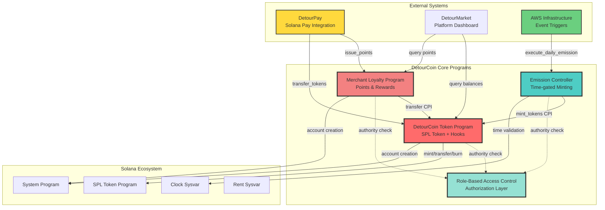
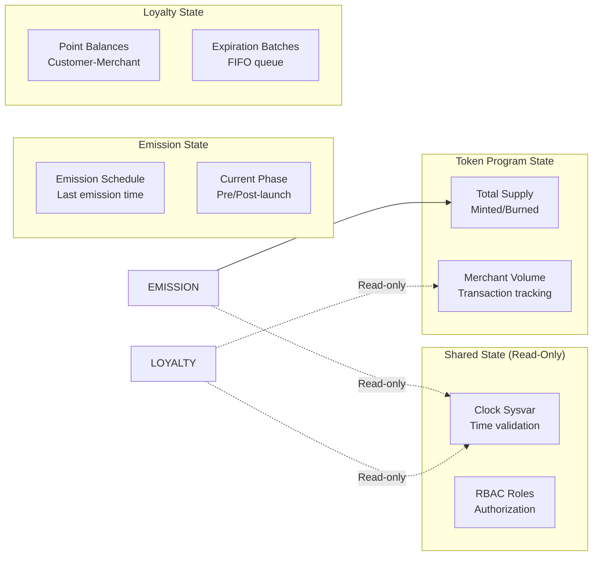
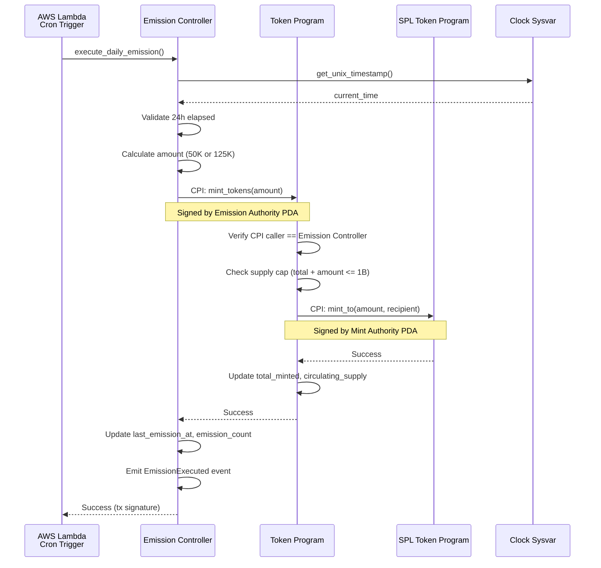
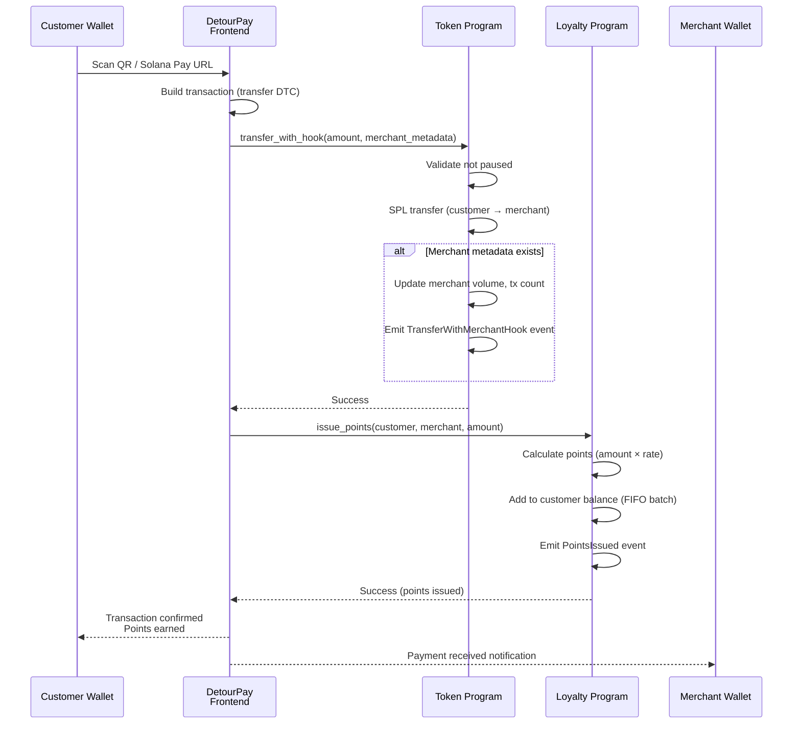
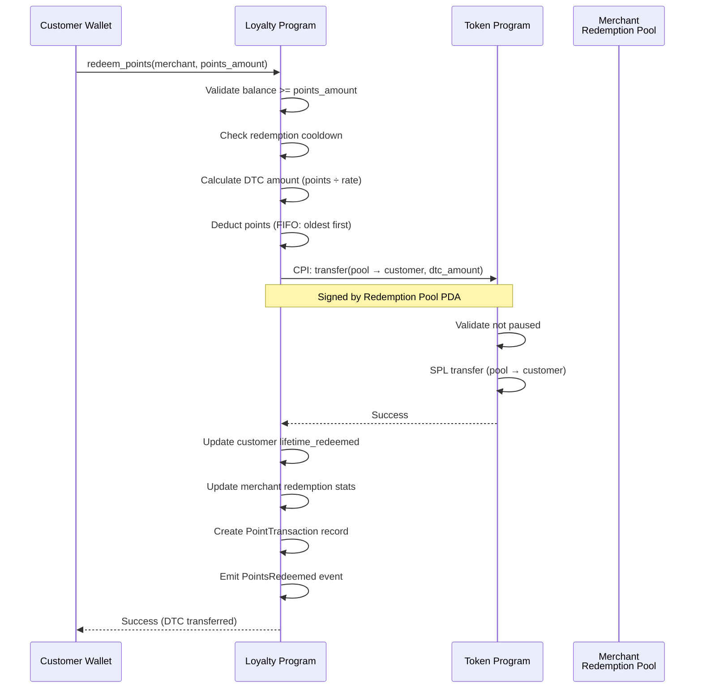
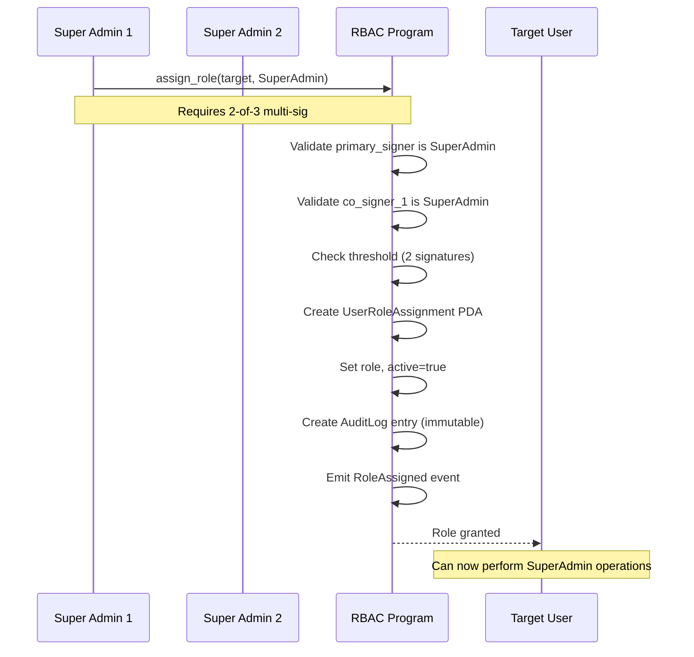
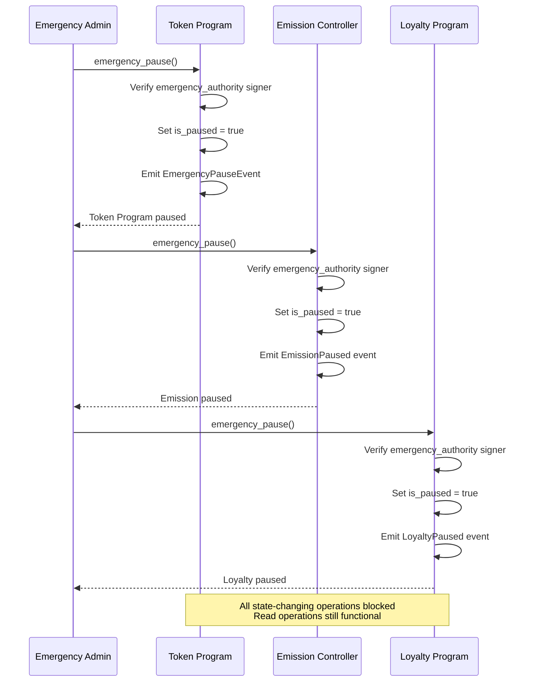
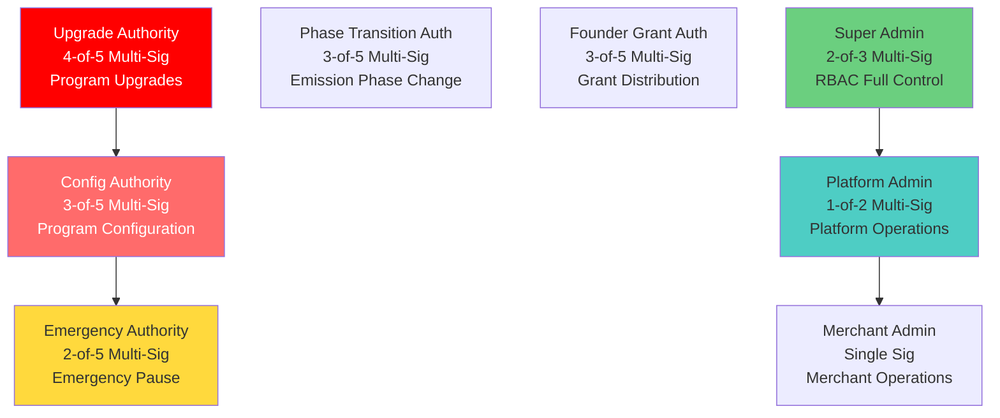
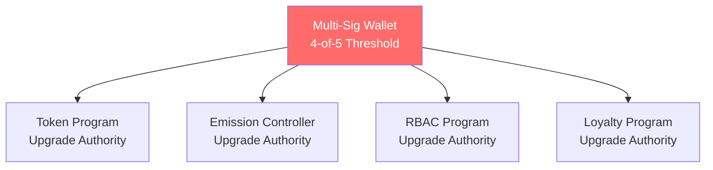

# Solana Program Architecture & Integration Map

**Document ID:** TECH-005
**Version:** 1.0
**Status:** Complete
**Owner:** Technical Architect
**Category:** Core Technical / Architecture
**Last Updated:** 2025-11-15

---

## Executive Architecture Summary

DetourCoin is a utility token ecosystem built on Solana, consisting of four interconnected smart contract programs designed to enable a decentralized merchant loyalty and payment infrastructure. The architecture prioritizes security through separation of concerns, modularity for independent upgrades, and efficiency through optimized Cross-Program Invocations (CPIs).

### High-Level System Architecture



### Key Architectural Principles

1. **Security-First Design**: Each program validates authorities via RBAC before executing privileged operations, preventing unauthorized access at the contract level
2. **Modular Independence**: Programs are independently upgradeable with versioned account structures and backward-compatible state migrations
3. **PDA-Based Authority**: Mint authority and CPI callers use Program Derived Addresses (PDAs) to ensure only authorized programs can execute sensitive operations
4. **Time-Deterministic Execution**: Emission scheduling uses Solana Clock sysvar for trustless, decentralized automation
5. **Compute Efficiency**: All hot-path operations (permission checks, transfers) optimized for <100K compute units

### System Boundaries

**Trusted Boundary**: All four DetourCoin programs are within the trusted computing base
**External Dependencies**: SPL Token Program, System Program, Clock/Rent sysvars (Solana runtime)
**Off-Chain Systems**: AWS Lambda (emission triggers), DetourPay (transaction processing), DetourMarket (analytics)

---

## Program Overview & Responsibilities

### 1. DetourCoin Token Program (TECH-001)

**Core Responsibilities:**
- Manage SPL token mint with 1B supply cap
- Execute minting operations via CPI from Emission Controller
- Track merchant transaction metadata for loyalty integration
- Implement burn mechanisms for token supply management
- Emergency pause functionality

**Owned Accounts:**
- `TokenProgramState`: Global token state and supply tracking
- `MerchantMetadata`: Per-merchant transaction volume tracking
- `BurnRecord`: Immutable burn event records
- `Mint`: DTC SPL token mint (via SPL Token Program)

**PDAs:**
- `["token_state"]`: Global state
- `["mint_authority"]`: PDA-controlled mint authority (CPI-only)
- `["merchant", merchant_pubkey]`: Merchant metadata
- `["burn_record", burner_pubkey, timestamp]`: Burn history

**Authority Structure:**
- **Mint Authority**: PDA (CPI-only via Emission Controller)
- **Config Authority**: Multi-sig (3-of-5)
- **Emergency Authority**: Multi-sig (2-of-5)
- **Upgrade Authority**: Multi-sig (4-of-5)

**Upgrade Strategy**: Versioned `TokenProgramState` with migration handlers for breaking changes

---

### 2. Emission Controller Program (TECH-002)

**Core Responsibilities:**
- Autonomous daily token emission (50K pre-launch, 125K post-launch)
- Phase management (pre-launch → post-launch transition)
- Founder grant vesting and distribution
- Time-based emission validation using Clock sysvar
- Supply cap enforcement via CPI to Token Program

**Owned Accounts:**
- `EmissionControllerState`: Global emission schedule and phase tracking
- `EmissionHistory`: Immutable record of each emission event
- `FounderGrantAccount`: Vested grant tracking

**PDAs:**
- `["emission_state"]`: Global state
- `["emission_authority"]`: CPI signer for mint operations
- `["emission_history", timestamp]`: Historical emission records
- `["founder_grant"]`: Founder grant accounting

**Authority Structure:**
- **Emission Authority**: PDA (signs CPI calls to Token Program)
- **Phase Transition Authority**: Multi-sig (3-of-5)
- **Emergency Authority**: Multi-sig (2-of-5)
- **Founder Grant Authority**: Multi-sig (3-of-5)

**Upgrade Strategy**: State versioning with phase-specific migration logic

---

### 3. Role-Based Access Control Program (TECH-003)

**Core Responsibilities:**
- Centralized authorization for all DetourCoin programs
- Role assignment/revocation with hierarchy enforcement
- Immutable audit trail for all permission changes
- Emergency admin escalation with time-based expiration
- Merchant-scoped permission isolation

**Owned Accounts:**
- `RBACState`: Global RBAC configuration
- `UserRoleAssignment`: Per-user role mapping
- `AuditLog`: Immutable audit trail entries

**PDAs:**
- `["rbac_state"]`: Global state
- `["user_role", user_pubkey]`: User role assignments
- `["audit", timestamp, counter]`: Audit log entries

**Authority Structure:**
- **Super Admin**: Full system control (2-of-3 multi-sig)
- **Platform Admin**: Platform operations (1-of-2 multi-sig)
- **Merchant Admin**: Merchant-scoped operations (single sig)
- **Emergency Admin**: Temporary (24h auto-revoke)
- **Auditor**: Read-only access to logs

**Upgrade Strategy**: Non-breaking role additions, versioned account structures

---

### 4. Merchant Loyalty Program (TECH-004)

**Core Responsibilities:**
- Point issuance based on transaction amounts (DetourPay integration)
- FIFO expiration mechanics (default 180 days)
- DTC redemption with merchant-defined conversion rates
- Anti-abuse mechanisms (rate limiting, pattern detection)
- Cross-merchant point transfers (optional)

**Owned Accounts:**
- `LoyaltyProgramState`: Global loyalty configuration
- `MerchantLoyaltyConfig`: Per-merchant loyalty settings
- `CustomerPointBalance`: Customer point balances with expiration tracking
- `PointTransaction`: Transaction history records
- `MerchantRedemptionPool`: DTC pool for redemptions

**PDAs:**
- `["loyalty_state"]`: Global state
- `["merchant_config", merchant_pubkey]`: Merchant config
- `["customer_balance", customer_pubkey, merchant_pubkey]`: Balances
- `["point_tx", customer_pubkey, merchant_pubkey, timestamp]`: History
- `["redemption_pool", merchant_pubkey]`: DTC pools

**Authority Structure:**
- **Admin Authority**: Platform-wide configuration (multi-sig)
- **Merchant Authority**: Merchant-specific configuration (via RBAC)
- **Customer Authority**: Self-service point redemption

**Upgrade Strategy**: Versioned accounts with backward-compatible balance migrations

---

## Account Architecture

### Complete Account Inventory

| Program | Account Type | Size (bytes) | Rent-Exempt SOL | Purpose | Mutability |
|---------|-------------|--------------|-----------------|---------|------------|
| **Token** | TokenProgramState | 179 | 0.00124 | Global token state | Mutable |
| **Token** | MerchantMetadata | 76 | 0.00063 | Merchant tx tracking | Mutable |
| **Token** | BurnRecord | 58 | 0.00052 | Burn history | Immutable |
| **Token** | Mint (SPL) | 82 | 0.00141 | SPL token mint | Mutable (supply) |
| **Emission** | EmissionControllerState | 268 | 0.00211 | Emission schedule | Mutable |
| **Emission** | EmissionHistory | 82 | 0.00065 | Emission records | Immutable |
| **Emission** | FounderGrantAccount | 82 | 0.00065 | Grant tracking | Mutable |
| **RBAC** | RBACState | 128 | 0.00098 | RBAC config | Mutable |
| **RBAC** | UserRoleAssignment | 192 | 0.00152 | User roles | Mutable |
| **RBAC** | AuditLog | 256 | 0.00201 | Audit trail | Immutable |
| **Loyalty** | LoyaltyProgramState | 128 | 0.00098 | Loyalty config | Mutable |
| **Loyalty** | MerchantLoyaltyConfig | 146 | 0.00112 | Merchant loyalty | Mutable |
| **Loyalty** | CustomerPointBalance | 989 | 0.00712 | Point balances | Mutable |
| **Loyalty** | PointTransaction | 263 | 0.00207 | Point tx history | Immutable |
| **Loyalty** | MerchantRedemptionPool | 98 | 0.00075 | DTC redemption pool | Mutable |

**Total Rent for Complete Merchant Setup**: ~0.035 SOL (1 merchant + 10 customers)

### Account Ownership Model

```mermaid
graph TB
    subgraph "Program Ownership"
        TOKEN_PROG[Token Program]
        EMISSION_PROG[Emission Program]
        RBAC_PROG[RBAC Program]
        LOYALTY_PROG[Loyalty Program]
    end

    subgraph "Token Program Accounts"
        TOKEN_STATE[TokenProgramState<br/>Owner: Token Program]
        MERCHANT_META[MerchantMetadata<br/>Owner: Token Program]
        MINT[Mint<br/>Owner: SPL Token Program]
    end

    subgraph "Emission Program Accounts"
        EMISSION_STATE[EmissionControllerState<br/>Owner: Emission Program]
        EMISSION_HIST[EmissionHistory<br/>Owner: Emission Program]
    end

    subgraph "RBAC Program Accounts"
        RBAC_STATE[RBACState<br/>Owner: RBAC Program]
        USER_ROLE[UserRoleAssignment<br/>Owner: RBAC Program]
    end

    subgraph "Loyalty Program Accounts"
        LOYALTY_STATE[LoyaltyProgramState<br/>Owner: Loyalty Program]
        CUSTOMER_BAL[CustomerPointBalance<br/>Owner: Loyalty Program]
    end

    TOKEN_PROG --> TOKEN_STATE
    TOKEN_PROG --> MERCHANT_META
    EMISSION_PROG --> EMISSION_STATE
    EMISSION_PROG --> EMISSION_HIST
    RBAC_PROG --> RBAC_STATE
    RBAC_PROG --> USER_ROLE
    LOYALTY_PROG --> LOYALTY_STATE
    LOYALTY_PROG --> CUSTOMER_BAL

    style TOKEN_STATE fill:#ffe6e6
    style EMISSION_STATE fill:#e6f7ff
    style RBAC_STATE fill:#e6ffe6
    style LOYALTY_STATE fill:#fff0e6
```



### PDA Derivation Security

All PDAs use deterministic seeds to prevent account spoofing:

```rust
// Example: Merchant metadata PDA
let (merchant_metadata_pda, bump) = Pubkey::find_program_address(
    &[
        b"merchant",
        merchant.as_ref(),
    ],
    &token_program_id,
);

// Anchor validation ensures correct PDA derivation
#[account(
    seeds = [b"merchant", merchant.key().as_ref()],
    bump = merchant_metadata.bump,
)]
pub merchant_metadata: Account<'info, MerchantMetadata>,
```

**Security Pattern**: Store bump seed in account to validate PDA derivation on every access

---

## Program-to-Program Communication (CPI Patterns)

### CPI Call Matrix

| Caller | Target | Instruction | Signer | Purpose | Frequency |
|--------|--------|-------------|--------|---------|-----------|
| Emission Controller | Token Program | `mint_tokens` | Emission Authority PDA | Daily emission execution | Daily |
| Token Program | SPL Token Program | `mint_to` | Mint Authority PDA | Mint DTC tokens | Daily |
| Token Program | SPL Token Program | `transfer` | User signer | DTC transfers | Per transaction |
| Token Program | SPL Token Program | `burn` | User signer | DTC burns | On-demand |
| Loyalty Program | Token Program | `transfer` | Redemption Pool PDA | Point redemption | Per redemption |
| All Programs | RBAC Program | `check_permission` | None (query only) | Authorization check | Per privileged op |

### Critical CPI: Emission → Token (mint_tokens)

```rust
// In Emission Controller Program
pub fn execute_daily_emission(ctx: Context<ExecuteDailyEmission>) -> Result<()> {
    // ... validation logic (24-hour check, pause check)

    let amount = match ctx.accounts.emission_state.phase {
        EmissionPhase::PreLaunch => 50_000 * 10_u64.pow(9),
        EmissionPhase::PostLaunch => 125_000 * 10_u64.pow(9),
    };

    // Prepare CPI to Token Program
    let cpi_program = ctx.accounts.core_token_program.to_account_info();
    let cpi_accounts = CoreTokenMintTokens {
        token_state: ctx.accounts.token_state.to_account_info(),
        mint: ctx.accounts.mint.to_account_info(),
        mint_authority: ctx.accounts.mint_authority.to_account_info(),
        recipient: ctx.accounts.recipient.to_account_info(),
        token_program: ctx.accounts.token_program.to_account_info(),
    };

    // PDA signer seeds for emission authority
    let signer_seeds: &[&[&[u8]]] = &[&[
        b"emission_authority",
        &[ctx.bumps.emission_authority],
    ]];

    // Execute CPI with signer
    let cpi_ctx = CpiContext::new_with_signer(
        cpi_program,
        cpi_accounts,
        signer_seeds,
    );

    core_token_program::cpi::mint_tokens(cpi_ctx, amount)?;

    // Update state ONLY after successful CPI
    ctx.accounts.emission_state.last_emission_at = Clock::get()?.unix_timestamp;
    ctx.accounts.emission_state.total_emitted += amount;

    Ok(())
}
```

**Security Highlights:**
- Emission Authority PDA signs CPI (prevents external mint calls)
- Token Program validates caller via `get_caller_program_id()`
- Supply cap enforced in Token Program (fails CPI if exceeded)
- Atomic state updates (only on success)

### Authorization Pattern: All Programs → RBAC

```rust
// In Loyalty Program (example)
pub fn configure_merchant_rewards(
    ctx: Context<ConfigureMerchantRewards>,
    new_rate: u32,
) -> Result<()> {
    // STEP 1: Check permission via CPI to RBAC
    let cpi_program = ctx.accounts.rbac_program.to_account_info();
    let cpi_accounts = CheckPermission {
        user_role_assignment: ctx.accounts.merchant_role.to_account_info(),
        user: ctx.accounts.merchant.to_account_info(),
        rbac_state: ctx.accounts.rbac_state.to_account_info(),
    };
    let cpi_ctx = CpiContext::new(cpi_program, cpi_accounts);

    // Require MerchantAdmin or higher
    rbac_program::cpi::check_permission(
        cpi_ctx,
        rbac_program::Role::MerchantAdmin,
        Some(ctx.accounts.merchant.key()),
    )?;

    // STEP 2: Permission granted - execute operation
    ctx.accounts.merchant_config.issuance_rate = new_rate;

    Ok(())
}
```

**Performance Optimization**: RBAC `check_permission` is O(1) via PDA lookup (no iteration)

---

## State Management & Data Synchronization

### Shared State vs Program-Specific State



### Data Consistency Guarantees

1. **Atomicity**: All state changes within a single instruction are atomic (transaction semantics)
2. **Isolation**: Cross-program state changes use CPI (sequential execution, no concurrency)
3. **Durability**: All account writes are persisted after transaction confirmation
4. **Consistency**: Supply cap enforced via CPI (emission fails if cap exceeded)

### Event Emission for Off-Chain Indexing

All programs emit events for critical state changes:

```rust
// Token Program
#[event]
pub struct TokensMinted {
    pub recipient: Pubkey,
    pub amount: u64,
    pub new_total_supply: u64,
    pub timestamp: i64,
}

// Emission Controller
#[event]
pub struct EmissionExecuted {
    pub timestamp: i64,
    pub amount: u64,
    pub phase: EmissionPhase,
    pub emission_count: u64,
}

// Loyalty Program
#[event]
pub struct PointsIssued {
    pub customer: Pubkey,
    pub merchant: Pubkey,
    pub points: u64,
    pub expires_at: i64,
}
```

**Off-Chain Indexing**: Use Solana program logs or Geyser plugin to index events for analytics

---

## Transaction Flow Diagrams

### Flow 1: Daily Emission Execution



### Flow 2: Customer Pays Merchant (DetourPay)



### Flow 3: Customer Redeems Points for DTC



### Flow 4: Role Assignment (Multi-Sig)



### Flow 5: Emergency Pause Activation



---

## Security Model & Attack Surface Analysis

### Authority Hierarchy



### Attack Vectors & Mitigations

| Attack Vector | Risk Level | Mitigation | Residual Risk |
|---------------|-----------|------------|---------------|
| **Unauthorized Minting** | Critical | PDA-controlled mint authority, CPI caller verification, supply cap enforcement | Low |
| **Emission Manipulation** | High | Clock sysvar (not user-provided), 24h minimum interval, supply cap | Low |
| **Role Escalation** | High | Multi-sig for sensitive roles, hierarchical permission checks, immutable audit logs | Low |
| **Point Inflation** | Medium | Rate limiting, pattern detection, FIFO expiration, merchant-scoped balances | Medium |
| **Reentrancy** | Medium | Solana runtime prevents reentrancy, atomic state updates | Very Low |
| **Integer Overflow** | Medium | Checked arithmetic throughout (`checked_add`, `checked_sub`), explicit overflow handling | Very Low |
| **Front-Running** | Low | Deterministic transaction ordering on Solana, no MEV extraction | Very Low |
| **Denial of Service** | Medium | Compute unit limits, rate limiting, batch processing for expirations | Medium |
| **Supply Cap Bypass** | Critical | Enforced in Token Program (not Emission Controller), pre-mint validation | Very Low |

### Signer Verification Patterns

```rust
// Pattern 1: Authority-based access (Token Program)
pub fn emergency_pause(ctx: Context<EmergencyPause>) -> Result<()> {
    require_keys_eq!(
        ctx.accounts.token_state.emergency_authority,
        *ctx.accounts.emergency_authority.key,
        TokenError::UnauthorizedEmergencyAccess
    );
    // ... execute pause
}

// Pattern 2: CPI caller verification (Token Program)
pub fn mint_tokens(ctx: Context<MintTokens>, amount: u64) -> Result<()> {
    let cpi_caller = ctx.accounts.get_caller_program_id()?;
    require_keys_eq!(
        ctx.accounts.token_state.emission_controller_program,
        cpi_caller,
        TokenError::UnauthorizedMintAccess
    );
    // ... execute mint
}

// Pattern 3: Role-based access (via RBAC CPI)
pub fn configure_rewards(ctx: Context<ConfigureRewards>) -> Result<()> {
    rbac_program::cpi::check_permission(
        cpi_ctx,
        rbac_program::Role::MerchantAdmin,
        Some(merchant_pubkey),
    )?;
    // ... execute configuration
}
```

### PDA Seed Security

All PDAs use deterministic seeds to prevent account spoofing:

```rust
// Secure: Merchant metadata PDA includes merchant pubkey
["merchant", merchant.as_ref()] // ✅ Unique per merchant

// Insecure: Global counter without merchant scoping
["merchant_metadata", counter.to_le_bytes()] // ❌ Spoofable

// Secure: Customer balance includes both customer and merchant
["customer_balance", customer.as_ref(), merchant.as_ref()] // ✅ Isolated
```

---

## Rent Exemption & Economic Model

### Rent-Exempt Balance Calculations

```rust
// Solana rent exemption: ~0.00089088 SOL per byte
const LAMPORTS_PER_BYTE: u64 = 6960; // Approximate (mainnet-beta)

// Token Program
// TokenProgramState: 8 (discriminator) + 179 = 187 bytes
// Rent: 187 * 6960 = 1,301,520 lamports (~0.0013 SOL)

// Loyalty Program
// CustomerPointBalance: 8 + 989 = 997 bytes
// Rent: 997 * 6960 = 6,939,120 lamports (~0.0069 SOL)
```

### Transaction Fee Economics

| Operation | Compute Units | Fee (@ 5000 lamports/sig) | DTC Cost (@ $1/DTC) |
|-----------|---------------|---------------------------|---------------------|
| Daily Emission (pre-launch) | ~50K CU | 5000 lamports | ~$0.0000025 |
| Daily Emission (post-launch) | ~80K CU | 5000 lamports | ~$0.0000025 |
| DTC Transfer (no merchant hook) | ~15K CU | 5000 lamports | ~$0.0000025 |
| DTC Transfer (with merchant hook) | ~30K CU | 5000 lamports | ~$0.0000025 |
| Point Issuance | ~40K CU | 5000 lamports | ~$0.0000025 |
| Point Redemption | ~60K CU | 5000 lamports | ~$0.0000025 |
| Role Assignment | ~25K CU | 5000 lamports | ~$0.0000025 |

**Note**: Solana transaction fees are extremely low (~$0.000005 per transaction), making DetourCoin economically viable for high-frequency merchant transactions.

---

## Compute Unit Optimization

### Compute Budget Per Instruction

All DetourCoin programs target **<200K compute units** per instruction (well below Solana's 1.4M limit).

### Optimization Strategies

1. **Account Packing**: Store multiple related fields in single account (e.g., `TokenProgramState` combines supply tracking and authorities)
2. **Minimal Deserialization**: Use `zero_copy` for large accounts (future optimization)
3. **Efficient CPI**: Batch operations where possible (e.g., post-launch emission mints to 2 pools in sequence)
4. **FIFO Batch Expiration**: Process up to 50 expiration batches per transaction (configurable)

```rust
// Optimized: FIFO expiration processing
pub fn process_expirations(balance: &mut CustomerPointBalance, current_time: i64) -> u64 {
    let mut expired_total = 0u64;

    // Remove expired batches (oldest first)
    balance.expiration_batches.retain(|batch| {
        if batch.expires_at <= current_time {
            expired_total += batch.amount;
            false // Remove batch
        } else {
            true // Keep batch
        }
    });

    expired_total
}
```

### Compute Unit Benchmarks

| Instruction | Typical CU | Max CU | Optimization Applied |
|-------------|-----------|--------|----------------------|
| `mint_tokens` (Token) | 25K | 50K | PDA signer, single CPI |
| `execute_daily_emission` (Emission) | 50K | 100K | Clock sysvar caching |
| `check_permission` (RBAC) | 10K | 20K | O(1) PDA lookup |
| `issue_points` (Loyalty) | 40K | 80K | FIFO batch insertion |
| `redeem_points` (Loyalty) | 60K | 120K | FIFO batch removal, transfer CPI |

---

## Error Handling & Failure Recovery

### Error Code Hierarchy

```rust
// Token Program Errors (6000-6999)
#[error_code]
pub enum TokenError {
    #[msg("Supply cap exceeded")]
    SupplyCapExceeded = 6000,
    #[msg("Program is paused")]
    ProgramPaused = 6001,
    #[msg("Unauthorized mint access")]
    UnauthorizedMintAccess = 6002,
    // ... 30+ error codes
}

// Emission Controller Errors (7000-7999)
#[error_code]
pub enum EmissionError {
    #[msg("Emission too early - 24h required")]
    EmissionTooEarly = 7000,
    #[msg("Supply cap reached")]
    SupplyCapReached = 7001, // Maps from TokenError::SupplyCapExceeded
    // ... 20+ error codes
}

// RBAC Errors (8000-8999)
#[error_code]
pub enum RBACError {
    #[msg("Unauthorized")]
    Unauthorized = 8000,
    #[msg("Role inactive")]
    RoleInactive = 8001,
    // ... 15+ error codes
}

// Loyalty Program Errors (9000-9999)
#[error_code]
pub enum LoyaltyError {
    #[msg("Insufficient points")]
    InsufficientPoints = 9000,
    #[msg("Redemption cooldown active")]
    RedemptionCooldownActive = 9001,
    // ... 25+ error codes
}
```

### Transaction Failure Scenarios

| Scenario | Error Code | Recovery | User Action |
|----------|-----------|----------|-------------|
| Emission before 24h elapsed | `EmissionTooEarly` | Wait until next emission window | Automatic retry by AWS Lambda |
| Supply cap reached | `SupplyCapExceeded` | None (hard cap) | No further emissions possible |
| RBAC role inactive | `RoleInactive` | Admin must reactivate role | Contact admin |
| Insufficient points | `InsufficientPoints` | Earn more points | Complete more transactions |
| Redemption pool empty | `InsufficientPoolBalance` | Merchant must deposit DTC | Merchant deposits to pool |
| Program paused | `ProgramPaused` | Admin must unpause | Wait for resume |

### Retry Strategies

```rust
// AWS Lambda emission trigger with exponential backoff
async fn trigger_emission_with_retry() -> Result<Signature> {
    let max_retries = 4;
    let mut delay = 2; // seconds

    for attempt in 0..max_retries {
        match execute_daily_emission().await {
            Ok(sig) => return Ok(sig),
            Err(e) if is_retryable_error(&e) => {
                log::warn!("Emission failed (attempt {}): {:?}", attempt, e);
                sleep(Duration::from_secs(delay)).await;
                delay *= 2; // Exponential backoff
            },
            Err(e) => return Err(e), // Non-retryable error
        }
    }

    Err(anyhow!("Max retries exceeded"))
}

fn is_retryable_error(e: &Error) -> bool {
    matches!(e,
        | Error::NetworkTimeout
        | Error::RPCNodeUnavailable
        | Error::TransactionExpired
    )
}
```

---

## Program Versioning & Upgrade Paths

### Upgrade Authority Structure



### State Migration Procedures

All account structures include `version` field for backward-compatible migrations:

```rust
// Token Program State (v1 → v2 example)
#[account]
pub struct TokenProgramState {
    pub version: u8, // v1 = 1, v2 = 2
    // ... existing fields

    // v2 additions (with defaults for v1 accounts)
    pub fee_collector: Option<Pubkey>, // None for v1
    pub transfer_fee_bps: Option<u16>, // None for v1
}

// Migration handler (called during upgrade)
pub fn migrate_token_state_v1_to_v2(
    ctx: Context<MigrateTokenState>,
) -> Result<()> {
    let state = &mut ctx.accounts.token_state;

    if state.version == 1 {
        state.version = 2;
        state.fee_collector = None; // Default for v1 accounts
        state.transfer_fee_bps = None;
    }

    Ok(())
}
```

### Version Compatibility Matrix

| Program | v1.0 | v1.1 | v2.0 | Breaking Changes |
|---------|------|------|------|------------------|
| **Token Program** | Initial | Add transfer fees | New account structure | v2.0: Account size change |
| **Emission Controller** | Initial | Add multi-pool support | Dynamic emission rates | v2.0: Phase enum change |
| **RBAC Program** | Initial | Add time-locked roles | Role delegation | v1.1: Backward compatible |
| **Loyalty Program** | Initial | Add cross-merchant transfers | NFT rewards | v2.0: Account size change |

### Rollback Procedures

1. **Pre-Upgrade Backup**: Store current program binary hash and state snapshot
2. **Upgrade Testing**: Deploy to devnet/testnet first, run integration tests
3. **Staged Rollout**: Upgrade in sequence (RBAC → Token → Emission → Loyalty)
4. **Rollback Trigger**: If critical bug detected within 24h, restore previous program binary
5. **State Recovery**: Use stored snapshots to reconstruct account state (if necessary)

---

## Integration with Solana Ecosystem

### SPL Token Program Integration

DetourCoin uses SPL Token Program for all token operations:

```rust
// Mint operation (via CPI)
token::mint_to(
    CpiContext::new_with_signer(
        token_program.to_account_info(),
        token::MintTo {
            mint: mint.to_account_info(),
            to: recipient.to_account_info(),
            authority: mint_authority.to_account_info(),
        },
        signer_seeds,
    ),
    amount,
)?;

// Transfer operation
token::transfer(
    CpiContext::new(
        token_program.to_account_info(),
        token::Transfer {
            from: from_account.to_account_info(),
            to: to_account.to_account_info(),
            authority: authority.to_account_info(),
        },
    ),
    amount,
)?;
```

### Clock Sysvar Usage

All time-based operations use Clock sysvar for deterministic timestamps:

```rust
use anchor_lang::prelude::*;

pub fn validate_emission_timing(last_emission: i64) -> Result<()> {
    let clock = Clock::get()?;
    let current_time = clock.unix_timestamp;

    const EMISSION_INTERVAL: i64 = 86_400; // 24 hours
    let next_allowed = last_emission
        .checked_add(EMISSION_INTERVAL)
        .ok_or(EmissionError::TimeCalculationError)?;

    require!(
        current_time >= next_allowed,
        EmissionError::EmissionTooEarly
    );

    Ok(())
}
```

### System Program Interactions

Used for creating accounts and transferring SOL for rent:

```rust
// Create PDA account (via Anchor `init` macro)
#[account(
    init,
    payer = payer,
    space = 8 + 179,
    seeds = [b"token_state"],
    bump
)]
pub token_state: Account<'info, TokenProgramState>,
```

---

## Architecture Decision Records (ADRs)

### ADR-001: Four Separate Programs vs Monolithic

**Decision**: Implement DetourCoin as four separate programs (Token, Emission, RBAC, Loyalty)

**Rationale**:
- **Modularity**: Each program can be upgraded independently
- **Security**: Separation of concerns reduces attack surface (e.g., RBAC bug doesn't compromise token minting)
- **Testability**: Unit testing is simpler with isolated programs
- **Compute Limits**: Smaller programs fit within compute unit limits more easily

**Trade-offs**:
- **Complexity**: More CPI calls, more deployment complexity
- **Cost**: Higher rent costs (4 program accounts vs 1)
- **Latency**: Additional CPI overhead (~5K CU per CPI)

**Alternatives Considered**: Single monolithic program with internal modules
**Status**: Accepted

---

### ADR-002: PDA-Based Mint Authority

**Decision**: Use PDA as mint authority (not multi-sig)

**Rationale**:
- **Trustless Automation**: Emission Controller can mint via CPI without human intervention
- **Security**: No private key exposure (PDA seeds are program-controlled)
- **Auditability**: All mints originate from Emission Controller (traceable)

**Trade-offs**:
- **Irreversibility**: Cannot manually mint tokens outside of emission schedule
- **Emergency Minting**: Requires program upgrade to enable (not desirable for supply cap enforcement)

**Alternatives Considered**: Multi-sig mint authority with manual approvals
**Status**: Accepted

---

### ADR-003: FIFO Expiration for Loyalty Points

**Decision**: Use FIFO (First-In-First-Out) expiration for loyalty points

**Rationale**:
- **Fairness**: Oldest points expire first (prevents gaming expiration dates)
- **Simplicity**: Deterministic expiration logic (no complex prioritization)
- **Compute Efficiency**: Batch processing of expirations (remove oldest batches)

**Trade-offs**:
- **Account Size**: Storing expiration batches increases account size (~16 bytes per batch)
- **Complexity**: Requires careful batch management (insertion, removal, compaction)

**Alternatives Considered**: Global expiration (all points expire at same date), LIFO expiration
**Status**: Accepted

---

## Implementation Roadmap

### Phase 1: Core Infrastructure (Weeks 1-4)

**Programs to Implement:**
1. **RBAC Program** (Week 1-2)
   - Implement role assignment/revocation
   - Permission check CPI endpoint
   - Audit logging
   - Multi-sig support

2. **Token Program** (Week 2-3)
   - SPL token mint initialization
   - PDA-based mint authority
   - Transfer hooks for merchant tracking
   - Burn mechanisms

**Milestones:**
- RBAC deployed to devnet
- Token mint created with PDA authority
- Integration test: RBAC authorization check

---

### Phase 2: Emission System (Weeks 5-7)

**Programs to Implement:**
3. **Emission Controller** (Week 5-6)
   - Time-based emission logic
   - Phase management (pre-launch → post-launch)
   - CPI to Token Program for minting
   - Founder grant accounting

**Infrastructure:**
- AWS Lambda cron trigger
- EventBridge 24-hour schedule
- Retry logic with exponential backoff

**Milestones:**
- Emission Controller deployed to devnet
- First successful daily emission on testnet
- Phase transition tested

---

### Phase 3: Loyalty System (Weeks 8-11)

**Programs to Implement:**
4. **Loyalty Program** (Week 8-10)
   - Point issuance with DetourPay integration
   - FIFO expiration mechanics
   - DTC redemption with merchant pools
   - Anti-abuse mechanisms

**Integration:**
- DetourPay Solana Pay integration
- DetourMarket dashboard queries

**Milestones:**
- Loyalty Program deployed to devnet
- End-to-end transaction flow: pay → earn points → redeem
- Expiration batch processing tested

---

### Phase 4: Security Audit & Mainnet Deployment (Weeks 12-16)

**Activities:**
- **Security Audit** (Week 12-14): External audit firm review
- **Bug Fixes** (Week 14-15): Address audit findings
- **Mainnet Deployment** (Week 16):
  1. Deploy RBAC Program
  2. Deploy Token Program (initialize mint)
  3. Deploy Emission Controller (link to Token Program)
  4. Deploy Loyalty Program (link to Token Program)
  5. Configure multi-sig authorities
  6. Execute first emission

**Milestones:**
- Security audit report completed
- All programs deployed to mainnet
- Multi-sig wallets configured and tested

---

## Appendices

### Appendix A: Complete Account Type Reference

| Program | Account | PDA Seeds | Size | Rent (SOL) | Mutability |
|---------|---------|-----------|------|------------|------------|
| Token | TokenProgramState | `["token_state"]` | 179 | 0.00124 | Mutable |
| Token | MerchantMetadata | `["merchant", merchant_pubkey]` | 76 | 0.00063 | Mutable |
| Token | BurnRecord | `["burn_record", burner, timestamp]` | 58 | 0.00052 | Immutable |
| Emission | EmissionControllerState | `["emission_state"]` | 268 | 0.00211 | Mutable |
| Emission | EmissionHistory | `["emission_history", timestamp]` | 82 | 0.00065 | Immutable |
| Emission | FounderGrantAccount | `["founder_grant"]` | 82 | 0.00065 | Mutable |
| RBAC | RBACState | `["rbac_state"]` | 128 | 0.00098 | Mutable |
| RBAC | UserRoleAssignment | `["user_role", user_pubkey]` | 192 | 0.00152 | Mutable |
| RBAC | AuditLog | `["audit", timestamp, counter]` | 256 | 0.00201 | Immutable |
| Loyalty | LoyaltyProgramState | `["loyalty_state"]` | 128 | 0.00098 | Mutable |
| Loyalty | MerchantLoyaltyConfig | `["merchant_config", merchant]` | 146 | 0.00112 | Mutable |
| Loyalty | CustomerPointBalance | `["customer_balance", customer, merchant]` | 989 | 0.00712 | Mutable |
| Loyalty | PointTransaction | `["point_tx", customer, merchant, timestamp]` | 263 | 0.00207 | Immutable |
| Loyalty | MerchantRedemptionPool | `["redemption_pool", merchant]` | 98 | 0.00075 | Mutable |

### Appendix B: Complete Instruction Reference

| Program | Instruction | Authority | Multi-Sig | CPI Allowed | Compute Units |
|---------|------------|-----------|-----------|-------------|---------------|
| **Token Program** |
| | `initialize` | Anyone (one-time) | No | No | 60K |
| | `mint_tokens` | Emission Controller (CPI only) | No | Yes | 25K |
| | `transfer_with_hook` | Token owner | No | No | 15K-30K |
| | `burn_tokens` | Token owner | No | No | 35K |
| | `emergency_pause` | Emergency authority | Yes (2-of-5) | No | 10K |
| | `emergency_unpause` | Emergency authority | Yes (2-of-5) | No | 10K |
| | `update_config` | Config authority | Yes (3-of-5) | No | 12K |
| | `initialize_merchant_metadata` | Anyone | No | No | 20K |
| **Emission Controller** |
| | `initialize` | Anyone (one-time) | No | No | 40K |
| | `execute_daily_emission` | Anyone (time-gated) | No | No | 50K-80K |
| | `transition_phase` | Phase transition authority | Yes (3-of-5) | No | 15K |
| | `emergency_pause` | Emergency authority | Yes (2-of-5) | No | 10K |
| | `resume_emission` | Emergency authority | Yes (2-of-5) | No | 10K |
| | `distribute_founder_grant` | Founder grant authority | Yes (3-of-5) | No | 25K |
| **RBAC Program** |
| | `initialize` | Upgrade authority | No | No | 30K |
| | `assign_role` | Super Admin / Platform Admin | Yes (for Super Admin) | No | 25K |
| | `revoke_role` | Super Admin / Platform Admin | No | No | 20K |
| | `check_permission` | None | No | Yes | 10K |
| | `emergency_escalate` | Super Admin | No | No | 20K |
| | `query_audit_logs` | Auditor / Admin | No | No | 15K |
| **Loyalty Program** |
| | `initialize_loyalty_program` | Admin authority | Yes | No | 35K |
| | `register_merchant` | Platform Admin (via RBAC) | No | No | 30K |
| | `configure_merchant_rewards` | Merchant Admin (via RBAC) | No | No | 20K |
| | `issue_points` | Merchant User / DetourPay | No | No | 40K |
| | `redeem_points` | Customer | No | No | 60K |
| | `process_expirations` | Anyone | No | No | 50K |
| | `deposit_to_redemption_pool` | Merchant | No | No | 25K |
| | `emergency_pause` | Emergency authority | Yes | No | 10K |

### Appendix C: Error Code Reference

**Token Program (6000-6999):**
- 6000: SupplyCapExceeded
- 6001: ProgramPaused
- 6002: UnauthorizedMintAccess
- 6003: UnauthorizedConfigAccess
- 6004: UnauthorizedEmergencyAccess

**Emission Controller (7000-7999):**
- 7000: EmissionTooEarly
- 7001: SupplyCapReached
- 7002: InvalidPhaseTransition
- 7003: EmissionPaused
- 7004: UnauthorizedPhaseTransition

**RBAC Program (8000-8999):**
- 8000: Unauthorized
- 8001: RoleInactive
- 8002: RoleExpired
- 8003: CannotRevokeLastSuperAdmin
- 8004: MultiSigRequired

**Loyalty Program (9000-9999):**
- 9000: InsufficientPoints
- 9001: RedemptionCooldownActive
- 9002: MerchantNotRegistered
- 9003: PointsExpired
- 9004: InsufficientPoolBalance

### Appendix D: Glossary

- **CPI (Cross-Program Invocation)**: Solana mechanism for one program to call instructions on another program
- **PDA (Program Derived Address)**: Deterministic address derived from program ID and seeds (no private key)
- **Compute Unit (CU)**: Measure of computational cost on Solana (limit: 1.4M CU per transaction)
- **Rent Exemption**: Minimum SOL balance required to keep account alive on Solana
- **Sysvar**: System account providing runtime data (Clock, Rent, etc.)
- **Anchor**: Solana smart contract framework (Rust-based)
- **FIFO**: First-In-First-Out (oldest items processed first)
- **Multi-Sig**: Multi-signature wallet requiring M-of-N approvals
- **Lamports**: Smallest unit of SOL (1 SOL = 1,000,000,000 lamports)

---

## Quick Reference

### System-Wide Configuration

| Parameter | Value | Owner | Modifiable |
|-----------|-------|-------|------------|
| **Max Supply** | 1,000,000,000 DTC | Token Program | No (hard-coded) |
| **Initial Supply** | 10,000,000 DTC | Token Program | No (minted at init) |
| **Pre-Launch Emission** | 50,000 DTC/day | Emission Controller | No (phase-locked) |
| **Post-Launch Emission** | 125,000 DTC/day | Emission Controller | No (phase-locked) |
| **Token Decimals** | 9 | SPL Token Program | No (standard) |
| **Default Point Expiration** | 180 days | Loyalty Program | Yes (via admin) |
| **Default Conversion Rate** | 100 points/DTC | Loyalty Program | Yes (per merchant) |
| **Emergency Admin Timeout** | 24 hours | RBAC Program | Yes (via config) |

### Critical Program IDs (Mainnet - TBD)

```
TOKEN_PROGRAM_ID = "TBDxxx...xxx"
EMISSION_CONTROLLER_ID = "TBDxxx...xxx"
RBAC_PROGRAM_ID = "TBDxxx...xxx"
LOYALTY_PROGRAM_ID = "TBDxxx...xxx"
```

### Multi-Sig Wallet Addresses (Mainnet - TBD)

```
UPGRADE_AUTHORITY = "TBDxxx...xxx" (4-of-5)
CONFIG_AUTHORITY = "TBDxxx...xxx" (3-of-5)
EMERGENCY_AUTHORITY = "TBDxxx...xxx" (2-of-5)
PHASE_TRANSITION_AUTHORITY = "TBDxxx...xxx" (3-of-5)
FOUNDER_GRANT_AUTHORITY = "TBDxxx...xxx" (3-of-5)
```

---

## Cross-References

- **[TECH-001]** DetourCoin Core Token Program - Detailed token implementation
- **[TECH-002]** Emission Controller Program - Emission schedule and phase logic
- **[TECH-003]** RBAC Program - Role definitions and permission matrix
- **[TECH-004]** Merchant Loyalty Program - Points mechanics and expiration
- **[TECH-006]** Solana Dev Environment Setup - Development tooling and local testing
- **[DOC-008]** Azure Solana Infrastructure - Cloud deployment architecture
- **[DOC-013]** Raydium/Orca DEX Integration - DTC liquidity and trading

---

## Revision History

| Version | Date | Author | Changes |
|---------|------|--------|---------|
| 1.0 | 2025-11-15 | Technical Architect | Initial architecture specification |

---

**Document Status**: ✅ Complete - Production-ready architecture overview
**Target Audience**: Solana developers, security auditors, technical stakeholders
**Next Steps**: Begin implementation per Phase 1 roadmap (RBAC + Token programs)

---

*This document serves as the canonical architectural reference for DetourCoin's Solana smart contract ecosystem. All design decisions, integration patterns, and security considerations are captured here for developer reference and audit preparation.*
