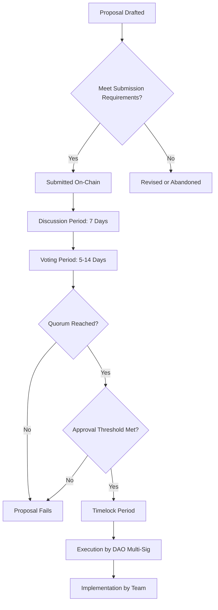

# Community Building & Engagement Strategy

**Document ID:** OPS-021  
**Version:** 1.0  
**Status:** Strategic Framework  
**Owner:** Marketing / Community Manager  
**Category:** Operations / Community Management  
**Dependencies:** BIZ-001 (Business Model), MKT-001 (Marketing Strategy), OPS-001 (Launch Roadmap)

---

## Executive Summary

DetourPay's community building strategy is designed to cultivate an engaged, utility-focused ecosystem that prioritizes real-world adoption over speculative trading. This comprehensive 5-year framework addresses the unique challenges of building community during a stealth development phase while positioning for explosive growth post-launch.

**Strategic Pillars:**
1. **Utility-First Narrative** - Every communication emphasizes real-world use cases
2. **Merchant-Centric Growth** - Business partnerships drive token adoption
3. **Educational Foundation** - Building crypto literacy among travel/hospitality users
4. **Organic Community** - Authentic engagement over paid acquisition
5. **Transparent Governance** - Progressive decentralization toward DAO structure

**Key Metrics (5-Year Targets):**
- **Discord/Telegram:** 50,000+ active community members
- **Twitter/X:** 100,000+ engaged followers
- **Merchant Ambassadors:** 500+ active business advocates
- **User Ambassadors:** 1,000+ community leaders
- **Monthly Active Participants:** 15,000+ (Discord/Telegram combined)
- **User-Generated Content:** 200+ pieces per month
- **Community Satisfaction Score:** 4.5/5.0+

---

## 1. Platform Selection & Architecture

### 1.1 Multi-Platform Strategy Rationale

DetourPay will maintain presence across three primary platforms, each serving distinct strategic purposes:

| Platform | Primary Purpose | Target Audience | Content Type | Moderation Level |
|----------|----------------|-----------------|--------------|------------------|
| **Discord** | Community hub, technical support, governance discussions | Token holders, developers, power users | Long-form discussions, AMAs, technical docs | High |
| **Telegram** | Quick updates, merchant support, regional communities | Merchants, casual users, international audience | Announcements, quick support, regional content | Medium |
| **Twitter/X** | Brand awareness, thought leadership, ecosystem updates | General public, crypto community, media | Short-form content, news, partnerships | Low |

### 1.2 Discord Infrastructure (Primary Community Hub)

**Why Discord?**
- Superior moderation tools and bot integration
- Rich media support for educational content
- Voice channels for AMAs and community calls
- Better organization for technical discussions
- Preferred by crypto-native users
- Strong search and archival capabilities

**Server Structure (Launch Configuration):**

```
📢 INFORMATION
├─ 📌 welcome-and-rules
├─ 📰 announcements
├─ 🗺️ roadmap-updates
├─ 🎯 getting-started
└─ ❓ faq

💬 COMMUNITY
├─ 💭 general-chat
├─ 🌍 travel-stories
├─ 🏪 merchant-spotlight
├─ 💡 feature-requests
└─ 🎨 community-creations

🛠️ SUPPORT
├─ 🆘 help-desk
├─ 🔧 technical-support
├─ 🏢 merchant-onboarding
└─ 🐛 bug-reports

🧑‍💻 DEVELOPERS
├─ 💻 dev-chat
├─ 📚 api-documentation
├─ 🔗 integration-help
└─ 🏗️ testnet-sandbox

📊 GOVERNANCE
├─ 🗳️ proposals
├─ 💬 governance-discussion
├─ 📈 treasury-updates
└─ 🤝 partnership-votes

🎤 VOICE CHANNELS
├─ 🎙️ community-stage
├─ 🗣️ ama-lounge
├─ 🌐 regional-meetups
└─ 🎮 casual-hangout

🌏 REGIONAL HUBS
├─ 🇺🇸 north-america
├─ 🇪🇺 europe
├─ 🇦🇺 asia-pacific
├─ 🇧🇷 latam
└─ 🌍 global-general
```

**Discord Bot Stack:**
- **Moderation:** Carl-bot, Dyno (auto-moderation, role management)
- **Verification:** Collab.Land (token-holder verification), Captcha.bot (anti-spam)
- **Engagement:** MEE6 (leveling system), Tatsu (gamification)
- **Utility:** Notification Bot (cross-platform alerts), Sesh (event scheduling)
- **Custom Bot:** DetourPay Community Bot (wallet linking, merchant verification, loyalty status display)

**Role Hierarchy:**

| Role | Requirements | Permissions | Color |
|------|-------------|-------------|-------|
| **Founding Team** | Core team members | Full administrative | 🟣 Purple |
| **Moderators** | Community-elected, 3+ months active | Kick, timeout, delete messages | 🔴 Red |
| **Merchant Verified** | Verified business owner | Access to merchant channels | 🟠 Orange |
| **Diamond Holder** | 100,000+ DTC | Early proposal voting, exclusive channels | 💎 Diamond Blue |
| **Gold Holder** | 25,000+ DTC | Governance channel access | 🟡 Gold |
| **Silver Holder** | 5,000+ DTC | Feature request priority | ⚪ Silver |
| **Ambassador** | Application + community vote | Event hosting, content creation perks | 🟢 Green |
| **Developer** | GitHub contributor | Developer channel access | 🔵 Blue |
| **Early Supporter** | Pre-launch community | Exclusive badge, recognition | 🟤 Bronze |
| **Member** | Verified human | Basic channel access | ⚫ Gray |

### 1.3 Telegram Infrastructure (Merchant & Regional Focus)

**Why Telegram?**
- Dominant in Asia-Pacific and Latin America markets
- Preferred by small business owners (merchants)
- Lower barrier to entry than Discord
- Better mobile experience for quick updates
- Strong group chat features for regional communities

**Channel Structure:**

```
PRIMARY CHANNELS:
├─ @DetourPay_Official (Announcements only, comments off)
├─ @DetourPay_Community (Main discussion group)
├─ @DetourPay_Merchants (Merchant-specific support)
└─ @DetourPay_Price (Price discussion quarantine)

REGIONAL GROUPS:
├─ @DetourPay_USA
├─ @DetourPay_Europe
├─ @DetourPay_APAC
├─ @DetourPay_SEA (Southeast Asia focus)
├─ @DetourPay_LATAM
└─ @DetourPay_Africa

SPECIALIZED:
├─ @DetourPay_Developers (Technical discussions)
├─ @DetourPay_Traders (Designated price talk channel)
└─ @DetourPay_Spanish, @DetourPay_Korean, etc. (Language-specific)
```

**Telegram Bot Features:**
- Auto-welcome with quick links to wallet setup
- Merchant verification workflow
- Transaction lookup (anonymized)
- Loyalty tier checking
- Simple governance voting
- Price alerts (segmented to trader channel only)
- Anti-spam with captcha verification

**Moderation Philosophy:**
- **Zero Tolerance:** Scams, impersonation, doxxing
- **Strict Limits:** Price speculation redirected to @DetourPay_Traders
- **Encouraged:** Use case discussions, merchant stories, travel tips

### 1.4 Twitter/X Strategy (Brand & Thought Leadership)

**Strategic Objectives:**
1. Position DetourPay as thought leader in crypto payments
2. Drive awareness among non-crypto travel/hospitality businesses
3. Amplify merchant success stories
4. Engage with broader Solana ecosystem
5. Media outreach and press coverage coordination

**Content Pillars (Weekly Distribution):**

| Content Type | Weekly Posts | Examples | Primary Goal |
|--------------|--------------|----------|--------------|
| **Merchant Stories** | 3-4 | "Meet Sarah's Coffee Shop - Saved $500/month switching to DTC payments" | Social proof, business adoption |
| **Educational Content** | 3-4 | Infographics on crypto payment benefits, thread explainers | Onboarding new users |
| **Community Highlights** | 2-3 | User travel stories paid with DTC, community member spotlights | Engagement, FOMO |
| **Technical Updates** | 1-2 | New features, integration announcements, security updates | Transparency, dev community |
| **Industry Commentary** | 2-3 | Travel industry trends, crypto regulation analysis | Thought leadership |
| **Ecosystem Engagement** | 3-5 | Reply to Solana projects, participate in crypto Twitter convos | Network effects |

**Growth Tactics (Organic Only - Years 1-3):**
- **Threaded Content:** Long-form educational threads (10-15 tweets) weekly
- **Merchant Takeovers:** Partner businesses tweet from official account for a day
- **#TravelWithDTC Campaign:** UGC campaign encouraging travel story sharing
- **Solana Ecosystem Collaboration:** Cross-promotion with complementary projects
- **Influencer Engagement:** Organic relationships with travel/crypto micro-influencers (5K-50K followers)
- **Twitter Spaces:** Bi-weekly audio sessions on crypto adoption, travel industry trends

**Handle Strategy:**
- **Primary:** @DetourPay (brand consistency)
- **Secondary:** @DetourCoin (community might use interchangeably)
- **Founder Accounts:** Personal accounts of co-founders active in crypto Twitter space

### 1.5 Secondary Platforms (Opportunistic Presence)

**Reddit:**
- Subreddit: r/DetourPay (created, minimal active moderation until 1,000+ subs)
- Participate authentically in r/CryptoCurrency, r/Solana, r/digitalnomad, r/TravelHacks
- No brigading or vote manipulation - genuine participation only

**YouTube:**
- Official channel for tutorial videos, merchant onboarding guides
- No regular content schedule until Year 3 (resource-intensive)
- Priority: High-quality evergreen content over frequency

**LinkedIn:**
- B2B focus: Merchant acquisition, partnership announcements
- Thought leadership articles on crypto payment adoption
- Company page maintained, posting 2x/week

**Medium/Blog:**
- Long-form technical articles, case studies, quarterly reports
- SEO-optimized content for organic discovery
- Republish to crypto-focused publications (Coindesk, CoinTelegraph via guest posts)

---

## 2. Content Strategy & Calendar

### 2.1 Content Principles

**The DetourPay Voice:**
- **Approachable, Not Jargony:** Explain crypto concepts simply
- **Business-Focused:** Emphasize ROI, savings, practical benefits
- **Authentic:** Real merchant stories > marketing fluff
- **Educational:** Always teaching, never assuming knowledge
- **Optimistic but Realistic:** Acknowledge challenges while highlighting solutions

**Content Production Capacity:**

| Phase | Team Size | Weekly Output | Quality Standard |
|-------|-----------|---------------|------------------|
| **Year 1 (Stealth)** | 1 part-time CM | 10-15 pieces | High - limited but polished |
| **Year 2 (Pre-Launch)** | 1 full-time CM | 25-30 pieces | High - scaling quality |
| **Year 3 (Launch)** | 2 CMs + contractors | 50-60 pieces | Mixed - volume + quality |
| **Year 4-5 (Growth)** | 3-4 CMs + agency | 80-100 pieces | High - professionalized |

### 2.2 Year 1 Content Calendar (Stealth Phase - Months 1-12)

**Objectives:** 
- Build foundational educational content library
- Establish brand voice and visual identity
- Create merchant recruitment materials
- Develop internal community (advisors, early partners)

**Monthly Themes:**

| Month | Theme | Key Content | Platform Focus |
|-------|-------|-------------|----------------|
| **M1** | Foundation | Brand guidelines, website copy, whitepaper | Website, Medium |
| **M2** | Merchant Education | "Why Accept Crypto Payments" guide series | LinkedIn, Medium |
| **M3** | Technical Foundations | Developer documentation, GitHub README | GitHub, Dev Twitter |
| **M4** | Use Case Development | Travel payment scenario mapping | Internal docs |
| **M5** | Partnership Materials | One-pagers, pitch decks, case study templates | Sales collateral |
| **M6** | Community Prep | Discord server setup, moderation guidelines | Discord (invite-only) |
| **M7** | Merchant Pilot Stories | Document first 5 pilot merchant experiences | Video testimonials |
| **M8** | Educational Video | "Crypto Payments 101" YouTube series (5 episodes) | YouTube |
| **M9** | PR Foundation | Press kit, media list building, journalist outreach | PR materials |
| **M10** | Testnet Launch Content | Developer tutorials, testnet participation guides | GitHub, Discord |
| **M11** | Pre-Launch Hype | Countdown campaign assets, ambassador recruitment | Twitter, Discord |
| **M12** | Launch Preparation | Launch day content calendar (30 days pre-written) | All platforms |

**Weekly Content Production (Months 1-6):**
- **Blog Posts:** 1 long-form educational article (1,500-2,000 words)
- **Social Media:** 3-5 Twitter posts (focus on travel industry insights, crypto education)
- **Internal Updates:** Weekly email to advisors/early partners
- **Documentation:** Continuous improvement of merchant/developer guides

**Weekly Content Production (Months 7-12):**
- **Blog Posts:** 1-2 articles (merchant stories, technical updates)
- **Twitter:** 5-7 posts + engagement with Solana ecosystem
- **Discord:** 2-3 announcements to private community
- **Video:** 1 tutorial or testimonial every 2 weeks
- **LinkedIn:** 2 posts targeting business audience

### 2.3 Year 2 Content Calendar (Pre-Launch Ramp - Months 13-24)

**Objectives:**
- Expand merchant testimonials and case studies
- Build anticipation for mainnet launch
- Grow Discord/Telegram to 1,000+ members
- Establish thought leadership in crypto payments niche

**Quarterly Themes:**

**Q1 (Months 13-15): Merchant Proof**
- **Content Focus:** 10 detailed merchant case studies, ROI calculators, "Crypto Payments Saved My Business" series
- **Campaign:** #MerchantsOfDetour - spotlight different business types
- **Milestone:** Announce 50 merchants in pipeline

**Q2 (Months 16-18): Technical Readiness**
- **Content Focus:** Security audits transparency, developer onboarding, API documentation
- **Campaign:** Testnet Bug Bounty program announcements
- **Milestone:** Public testnet launch

**Q3 (Months 19-21): Community Ignition**
- **Content Focus:** Ambassador program launch, governance framework previews, DAO roadmap
- **Campaign:** "Founding Members" recruitment - first 1,000 Discord members get special role
- **Milestone:** 1,000 Discord members, 5,000 Twitter followers

**Q4 (Months 22-24): Launch Countdown**
- **Content Focus:** Daily countdown content, exchange listing announcements, partnership reveals
- **Campaign:** "30 Days to Mainnet" - daily feature highlights
- **Milestone:** Mainnet launch

**Weekly Content Volume (Months 13-24):**

| Platform | Posts/Week | Content Types |
|----------|------------|---------------|
| **Twitter** | 10-14 | Threads (2), single tweets (8-10), replies (5+) |
| **Discord** | 5-7 | Announcements (2), AMA recaps (1), community highlights (2-4) |
| **Telegram** | 7-10 | Quick updates (5), merchant spotlights (2), educational tips (3) |
| **Blog/Medium** | 2 | Long-form articles (1), merchant case study (1) |
| **LinkedIn** | 3-4 | Business-focused insights (2), partnership announcements (1-2) |
| **YouTube** | 1-2 videos | Tutorials, merchant testimonials, AMA recordings |

### 2.4 Year 3 Content Calendar (Launch Year - Months 25-36)

**Objectives:**
- Support explosive user growth post-launch
- Maintain engagement during inevitable volatility
- Scale content production with community contributions
- Establish regular content cadences (AMAs, reports, etc.)

**Launch Month (Month 25) Content Blitz:**

**Week 1 (Launch Week):**
- **Daily Twitter Posts:** 5-8/day (launch announcement, exchange listings, how-to guides)
- **Discord:** Hourly updates during launch window, 24/7 mod coverage
- **Blog:** Launch retrospective article, "What's Next" roadmap post
- **Video:** Launch day recap, founder thank-you message
- **Press:** Coordinated press release distribution, journalist interviews

**Week 2-4 (Stabilization):**
- Return to regular cadence but elevated frequency
- Focus on troubleshooting common issues
- Merchant success stories from first DTC transactions
- Community spotlights - early adopters

**Post-Launch Regular Cadence:**

**Daily:**
- **Twitter:** 3-5 posts (mix of educational, engagement, announcements)
- **Discord/Telegram:** Community engagement by CMs, response to questions
- **Reddit:** Monitor mentions, participate authentically

**Weekly:**
- **Twitter Space/Discord AMA:** Every Wednesday 2pm EST - 1 hour session
- **Merchant Spotlight:** Detailed story on blog + social amplification
- **Community Newsletter:** Friday recap of week's developments
- **Technical Update:** Progress on roadmap items (GitHub + Discord)

**Biweekly:**
- **YouTube Tutorial:** Rotating topics (wallet setup, merchant integration, loyalty program usage)
- **Partnership Announcement:** Strategic collaborations, integration launches

**Monthly:**
- **Town Hall:** Discord voice + Twitter Space simulcast, 2-hour deep dive
- **Community Report:** Metrics, treasury updates, governance summary
- **Ambassador Spotlight:** Feature top community contributors
- **Contest/Campaign Launch:** Rotating engagement campaigns

**Quarterly:**
- **Comprehensive Report:** Detailed metrics, financial transparency, roadmap progress (published as blog post + PDF)
- **Governance Vote:** Major decisions presented to community
- **Strategic Update:** Founder-led presentation on long-term vision adjustments

### 2.5 Year 4-5 Content Calendar (Maturity & Scale - Months 37-60)

**Objectives:**
- Maintain high engagement despite larger community size
- Professionalize content with dedicated resources
- Empower community-generated content
- Expand into new markets and languages

**Content Evolution:**

**Year 4 Focus:**
- **Localization:** Translate core content into 5 languages (Spanish, Portuguese, Korean, Japanese, Mandarin)
- **Regional Community Management:** Hire regional CMs for key markets
- **Video Production:** Weekly video series (merchant interviews, travel vlogs paid with DTC)
- **Podcast Launch:** "Detour Diaries" - travel + crypto payment stories
- **Educational Partnerships:** Collaborate with crypto education platforms for co-branded content

**Year 5 Focus:**
- **User-Generated Content Dominance:** 60%+ of content from community, 40% official
- **Documentary/Long-form:** Professional production showcasing DetourPay's real-world impact
- **Academic Partnerships:** Case studies with university business schools
- **Conference Presence:** Speaking slots at major crypto/travel conferences, booth presence
- **Community Content Fund:** Grant program funding community members to create content

**Scaling Content Production:**

| Year | Internal Team | External Contributors | Weekly Content Output |
|------|---------------|----------------------|----------------------|
| **Year 4** | 3 CMs + 1 video editor | 10-15 ambassadors | 80-100 pieces |
| **Year 5** | 4 CMs + production agency | 30-50 ambassadors + UGC | 120-150 pieces (incl. UGC) |

---

## 3. Community Engagement Programs

### 3.1 Ambassador Program Structure

**Program Objectives:**
- Decentralize community management and content creation
- Reward passionate community members
- Extend DetourPay's reach into niche communities
- Create career pathways within the ecosystem

**Ambassador Tiers:**

**Tier 1: Community Contributor**
- **Requirements:** 3+ months active in Discord/Telegram, 5+ quality contributions (content, support, event organization)
- **Responsibilities:** Answer questions, create occasional content, represent DetourPay positively
- **Benefits:**
  - Exclusive Discord role and channel access
  - Early access to new features (1 week before public)
  - Monthly DTC stipend: 250 DTC (~$25-50 value depending on market)
  - Quarterly swag box
- **Selection:** Community nomination + team approval, rolling applications

**Tier 2: Regional Ambassador**
- **Requirements:** Tier 1 for 6+ months, established local network, bilingual (if non-English market)
- **Responsibilities:** 
  - Manage regional Discord/Telegram channel
  - Organize local meetups (virtual or in-person)
  - Create localized content (2-4 pieces/month)
  - Recruit local merchants
- **Benefits:**
  - Monthly DTC stipend: 1,000 DTC (~$100-200 value)
  - Event budget: $200-500/quarter for meetup expenses
  - Professional development: Conference ticket sponsorship (1/year)
  - Direct line to core team for regional insights
- **Selection:** Application process every 6 months, interview with team

**Tier 3: Global Ambassador**
- **Requirements:** Tier 2 for 12+ months, significant measurable impact, demonstrated leadership
- **Responsibilities:**
  - Lead major initiatives (campaigns, partnerships, events)
  - Mentor lower-tier ambassadors
  - Represent DetourPay at conferences/events
  - Create high-quality content (1-2 major pieces/month: articles, videos, etc.)
- **Benefits:**
  - Monthly DTC stipend: 5,000 DTC (~$500-1,000 value)
  - Annual bonus: Up to 20,000 DTC based on performance
  - Event budget: $2,000-5,000/quarter
  - Professional branding: Listed on website, business cards, official introduction to partners
  - Governance: Weighted vote in ambassador council decisions
- **Selection:** Invitation-only, maximum 10 global ambassadors at any time

**Ambassador Program Management:**
- **Dedicated Channel:** #ambassador-hub on Discord (private)
- **Monthly Calls:** Video sync for all ambassadors, strategy alignment
- **Performance Reviews:** Quarterly check-ins, feedback both directions
- **Ambassador Council:** Tier 3 ambassadors vote on program changes, budget allocation
- **Exit Strategy:** Ambassadors can step down gracefully, emeritus status for long-term contributors

### 3.2 Merchant Co-Marketing Program

**Rationale:** Merchants are DetourPay's most authentic advocates. Their success stories drive adoption more than any marketing spend.

**Program Structure:**

**Bronze Partnership (All Merchants)**
- **Automatic Enrollment:** All verified merchants receive baseline benefits
- **Benefits:**
  - Social media shoutout upon joining (Twitter + Discord)
  - Listing in merchant directory on website
  - Co-branded "We Accept DetourCoin" marketing materials (digital + physical)
  - Access to merchant-only Discord channel

**Silver Partnership (Volume Commitment)**
- **Requirements:** $10,000+ monthly volume in DTC transactions OR 100+ transactions/month
- **Benefits:**
  - Quarterly spotlight feature (blog post + social media)
  - Dedicated account manager
  - Priority technical support
  - Co-marketing campaign collaboration (e.g., "Show your DTC receipt, get 10% off")
  - Early access to new merchant features

**Gold Partnership (Strategic Collaboration)**
- **Requirements:** Application-based, typically $50,000+ monthly volume, willing to be public advocate
- **Benefits:**
  - Monthly spotlight across all channels
  - Joint press releases for major milestones
  - Featured prominently on homepage
  - Speaking opportunities at DetourPay events
  - Collaborative product development (input on features)
  - Revenue share on referred merchants (5% of transaction fees from referrals)

**Merchant Referral Program:**
- **Mechanic:** Existing merchant refers new merchant, both get bonus
- **Reward:** 
  - Referrer: 1,000 DTC + 5% of referred merchant's transaction fees for first year
  - Referee: 500 DTC upon completing first 10 transactions
- **Tracking:** Unique referral codes generated in merchant dashboard

**Co-Marketing Campaign Examples:**

**Campaign: "Detour Diaries"**
- Travel bloggers/vloggers paid entirely in DTC to visit participating merchants
- Documentary-style content showing seamless crypto payments
- Cross-promotion: Blogger's audience discovers DTC, merchant gets exposure
- Budget: 10,000 DTC/month to fund 2-3 travel content creators

**Campaign: "DTC Double Rewards"**
- Month-long promotion: Pay with DTC, earn 2x loyalty points
- Merchants opt-in, DetourPay funds the extra rewards (from marketing budget)
- Drives transaction volume, merchant sees increased sales

**Campaign: "Local Legends"**
- Spotlight small businesses in different cities accepting DTC
- Create city-specific guides: "48 Hours in Austin with DetourCoin"
- Partner with tourism boards for cross-promotion

### 3.3 User Referral & Incentive Programs

**Philosophy:** Incentivize meaningful actions, not passive holding. Rewards for using DTC, not just buying it.

**Referral Tiers:**

**Basic Referral:**
- **Mechanic:** Share unique referral link, friend signs up + completes first transaction
- **Reward:** 
  - Referrer: 50 DTC
  - Referee: 25 DTC (deposited after first transaction)
- **Cap:** 2,000 DTC maximum earnings per user (prevents Sybil abuse)

**Power User Referral:**
- **Unlock Condition:** User completes 25+ transactions AND refers 5+ friends
- **Enhanced Reward:** 
  - Referrer: 100 DTC per successful referral
  - Referee: 50 DTC
- **Cap:** 5,000 DTC maximum, eligible for Ambassador program fast-track

**Transaction Incentives (Launch Promotion - First 90 Days):**

**Week 1-2 (Bootstrapping Liquidity):**
- **Offer:** First 1,000 users to complete a transaction get 100 DTC bonus
- **Budget:** 100,000 DTC
- **Goal:** Create initial transaction momentum

**Month 1-3 (Habit Formation):**
- **Offer:** Complete 5 transactions in 30 days, earn 200 DTC bonus
- **Budget:** 500,000 DTC (assumes 2,500 users complete challenge)
- **Goal:** Drive repeat usage

**Ongoing (Gamification):**
- **Weekly Challenges:** Rotating tasks (e.g., "Make a purchase on a Tuesday", "Try a new merchant category")
- **Reward:** 10-50 DTC per challenge
- **Budget:** 50,000 DTC/month
- **Goal:** Keep users engaged, exploring ecosystem

**Loyalty Integration:**
- Users naturally earn loyalty points through transactions (see TECH-004)
- Community engagement can boost loyalty tier (e.g., verified Discord member gets small point multiplier)
- Highest loyalty tiers get governance voting power

### 3.4 Educational Initiatives

**Objective:** Reduce friction for non-crypto natives entering the ecosystem. Education is user acquisition.

**DetourPay Academy (Online Learning Portal):**

**Module 1: Crypto Basics (30 minutes)**
- What is cryptocurrency? Blockchain explained simply
- Why use crypto for payments? Benefits vs. traditional
- Security fundamentals: Wallets, private keys, basic safety
- **Completion Reward:** 10 DTC + "Academy Graduate" Discord badge

**Module 2: Using DetourCoin (45 minutes)**
- Setting up your DetourPay wallet
- Buying your first DTC (exchange walkthrough)
- Making your first merchant transaction
- Understanding loyalty rewards
- **Completion Reward:** 25 DTC + entered in monthly drawing (1,000 DTC prize)

**Module 3: Advanced Features (60 minutes)**
- Governance participation
- Staking and rewards (if implemented)
- Merchant program for business owners
- Developer tools (API basics)
- **Completion Reward:** 50 DTC + invitation to advanced user group

**Module 4: Becoming an Advocate (30 minutes)**
- Ambassador program overview
- Creating content about DetourPay
- Merchant recruitment strategies
- Community leadership best practices
- **Completion Reward:** Fast-track application to Ambassador program

**Live Educational Events:**

**Weekly Webinars:**
- **Tuesday: "Crypto 101"** - Rotating beginner topics
- **Thursday: "Merchant Masterclass"** - Business owner focused
- **Format:** 30-minute presentation + 30-minute Q&A
- **Recording:** Posted to YouTube, transcribed for blog

**Monthly Deep Dives:**
- Technical topics (smart contracts, tokenomics, security)
- Guest speakers from Solana ecosystem
- 90-minute format, premium content

**Partnership with Crypto Education Platforms:**
- **Coinbase Learn:** List DetourPay educational content, earn rewards for completing
- **Binance Academy:** Guest articles on utility token use cases
- **Solana University:** Sponsor developer workshops

### 3.5 Local Meetups & Events

**Event Ladder (Scaling Community Interactions):**

**Tier 1: Virtual Community Calls (Weekly)**
- **Format:** Discord voice channel, open to all
- **Topics:** Week in review, upcoming features, open forum
- **Host:** Community Manager + rotating community host
- **Cost:** $0 (time only)

**Tier 2: Regional Virtual Meetups (Monthly)**
- **Format:** Zoom/Discord, timezone-specific
- **Topics:** Local merchant spotlights, regional challenges, networking
- **Host:** Regional Ambassador
- **Cost:** Ambassador stipend covers (see Section 3.1)

**Tier 3: In-Person Local Meetups (Quarterly)**
- **Format:** Coffee shop/bar meetup, 20-50 attendees
- **Activities:** Networking, live DTC transactions at venue, swag
- **Host:** Regional Ambassador with DetourPay support
- **Cost:** $200-500 (venue, refreshments, swag) - funded by DetourPay

**Tier 4: Regional Conferences (Semi-Annual)**
- **Format:** Full-day event, 100-300 attendees
- **Activities:** Keynote presentations, merchant exhibition, workshops
- **Host:** DetourPay team + local ambassador team
- **Cost:** $5,000-15,000 (venue, catering, production, speakers)

**Tier 5: Global Summit (Annual - Starting Year 4)**
- **Format:** Multi-day conference, 500-2,000 attendees
- **Activities:** Keynotes, breakout sessions, hackathon, awards ceremony
- **Host:** Full DetourPay team + event production company
- **Cost:** $100,000-250,000 (venue, travel sponsorships, production, marketing)

**Event Content Strategy:**
- **Pre-Event:** Announcement posts, registration campaigns, speaker highlights
- **During Event:** Live tweeting, Instagram stories, real-time Discord updates
- **Post-Event:** Recap blog, video highlights, photo galleries, attendee testimonials

**Sponsorship Opportunities (Year 3+):**
- Partner merchants can sponsor meetups (logo placement, speaking slot)
- Solana ecosystem projects can sponsor larger events
- Revenue offsets event costs, creates networking value for sponsors

---

## 4. Governance & DAO Evolution

### 4.1 Governance Philosophy

**Core Principles:**
- **Progressive Decentralization:** Gradual transition from core team control to community governance
- **Informed Participation:** Voters have context and expertise to make good decisions
- **Aligned Incentives:** Governance power tied to long-term holding and ecosystem participation
- **Practical Scope:** Community governs what it can meaningfully impact, team retains operational control where appropriate

**Governance Scope Over Time:**

| Decision Type | Year 1-2 (Stealth/Pre-Launch) | Year 3 (Launch) | Year 4-5 (Maturity) |
|---------------|-------------------------------|-----------------|---------------------|
| **Technical Architecture** | Team only | Team with advisory vote | Team with binding vote on major changes |
| **Tokenomics Adjustments** | Team only | Binding community vote | Binding community vote |
| **Marketing Budget** | Team only | Advisory vote | Binding vote on large expenditures ($50K+) |
| **Partnership Approvals** | Team only | Advisory vote on strategic partnerships | Binding vote on equity partnerships |
| **Treasury Management** | Team only | Community can propose, team executes | DAO-controlled treasury (multi-sig) |
| **Feature Prioritization** | Team with community input | Community ranking + team execution | Community ranking + team execution |
| **Emergency Actions** | Team only | Team only (with rapid community notification) | Multi-sig with veto capability |

### 4.2 Pre-DAO Governance (Years 1-3)

**Feedback Mechanisms:**

**Discord #governance-discussion:**
- Open forum for proposals, discussions, sentiment checking
- No formal voting, but team actively monitors and responds
- Monthly "You Asked, We Answered" posts summarizing feedback and actions taken

**Quarterly Community Surveys:**
- Formal survey sent to all token holders (via email + Discord announcement)
- Topics: Feature prioritization, satisfaction ratings, pain points
- Results published transparently, action items defined

**Proposal Template (Informal):**
```markdown
## Proposal: [Title]
**Author:** [Discord handle]
**Date:** [Submission date]
**Type:** [Feature Request / Policy Change / Treasury Spend / Other]

### Summary
[2-3 sentence overview]

### Motivation
[Why is this needed? What problem does it solve?]

### Specification
[Detailed description of the proposal]

### Rationale
[Why this approach vs. alternatives?]

### Implementation
[How would this be executed? Resources needed?]

### Risks
[What could go wrong? Downsides?]

### Community Sentiment
[Optional: Link to poll, discussion thread]
```

**Proposal Lifecycle (Informal):**
1. **Submission:** Posted in #governance-discussion
2. **Community Discussion:** 7-14 days of open comment
3. **Team Review:** Core team evaluates feasibility, costs, alignment
4. **Decision:** Team makes final call, posts detailed rationale
5. **Execution:** If approved, added to roadmap with timeline

**Advisory Votes (Starting Month 18):**
- For major decisions, team posts formal poll in Discord
- All members can vote (one account = one vote, not token-weighted yet)
- Results non-binding but heavily influential
- Used for: Feature prioritization, marketing campaign selection, partnership input

### 4.3 DAO Launch (Year 4, Month 37-48)

**Trigger Conditions for DAO Activation:**
1. **Community Maturity:** 10,000+ active Discord/Telegram members
2. **Token Distribution:** No single entity holds >10% of circulating supply (sufficiently decentralized)
3. **Legal Clarity:** Regulatory framework allows DAO governance in operational jurisdiction
4. **Technical Readiness:** Governance smart contracts audited and deployed

**DAO Structure:**

**Governance Token:** DetourCoin (DTC)
- **Voting Power:** 1 DTC = 1 vote (with modifications below)

**Voting Power Modifiers:**
- **Base:** 1 DTC = 1 vote
- **Loyalty Multiplier:** 
  - Diamond tier (100K+ DTC held 12+ months): 1.5x voting power
  - Gold tier (25K+ DTC held 6+ months): 1.25x voting power
  - Silver tier (5K+ DTC held 3+ months): 1.1x voting power
- **Engagement Bonus:** Active community members (verified Discord participation): +5% voting power
- **Merchant Bonus:** Verified merchant account: +10% voting power on merchant-related proposals

**Proposal Types:**

| Type | Vote Threshold | Quorum | Timelock | Examples |
|------|----------------|--------|----------|----------|
| **Standard** | 50%+ approval | 5% of circulating supply | 48 hours | Feature requests, small budget items |
| **Treasury** | 60%+ approval | 10% of circulating supply | 7 days | Large spending ($50K+), grants |
| **Tokenomics** | 75%+ approval | 20% of circulating supply | 14 days | Emission changes, burn mechanisms |
| **Constitutional** | 80%+ approval | 30% of circulating supply | 30 days | Governance rules changes, veto powers |
| **Emergency** | Multi-sig only | N/A | 0 (immediate) | Security vulnerabilities, exploits |

**Proposal Submission Requirements:**
- **Minimum Holding:** 10,000 DTC to submit proposal (anti-spam)
- **Alternative Path:** 100 community members can co-sponsor a proposal (enables smaller holders to participate)
- **Proposal Bond:** 1,000 DTC bond, returned if proposal reaches quorum (even if fails), forfeited if spam/malicious

**Governance Process Flow:**



**DAO Treasury Management:**
- **Multi-Sig Wallet:** 5-of-9 signers (3 core team, 3 elected community, 3 large merchant representatives)
- **Community-Elected Seats:** 1-year terms, elections held annually
- **Spending Authority:**
  - <$10K: Multi-sig can approve without formal proposal (routine operations)
  - $10K-$50K: Standard proposal process
  - >$50K: Treasury proposal process
- **Quarterly Reports:** Full transparency on treasury balance, inflows (transaction fees), outflows (operational expenses, grants)

### 4.4 Governance Participation Incentives

**Challenge:** Low voter turnout is common in DAO governance. DetourPay addresses this proactively.

**Incentive Mechanisms:**

**Voting Rewards:**
- **Participation Reward:** Vote on 80%+ of proposals in a quarter → 100 DTC bonus
- **Consistency Reward:** Vote in 3 consecutive quarters → 500 DTC bonus
- **Informed Voting Badge:** Discord role for consistent, thoughtful voters (prestige, no financial reward)

**Delegation:**
- Users can delegate voting power to trusted community members (ambassadors, knowledgeable users)
- Delegates must publish voting rationale for each proposal (transparency)
- Delegation is revocable at any time
- Delegates receive small rewards for active participation (50 DTC per proposal they vote on)

**Liquid Democracy Model (Year 5 Experiment):**
- Users can delegate on per-topic basis (e.g., delegate technical proposals to dev, marketing to ambassador)
- More sophisticated but higher friction - pilot with subset of decisions

**Anti-Gaming Measures:**
- **Sybil Resistance:** Voting power modifiers (loyalty, engagement) make it costly to split holdings across accounts
- **Proposal Quality Bar:** Submission requirements prevent spam
- **Cooldown Periods:** Can only submit 1 proposal per 30 days per address
- **Reputation System:** Track proposal success rate, factor into future submission privileges

---

## 5. Crisis Communication & Community Management

### 5.1 Crisis Categories & Response Protocols

**Definition:** A crisis is any event that threatens DetourPay's reputation, security, or operational continuity requiring immediate, coordinated response.

**Crisis Classification:**

| Severity | Definition | Examples | Response Time |
|----------|------------|----------|---------------|
| **Critical (P0)** | Existential threat to platform/users | Security breach, smart contract exploit, regulatory shutdown | Immediate (within 1 hour) |
| **High (P1)** | Significant operational impact | Major bug affecting transactions, exchange delisting, key partnership loss | Within 4 hours |
| **Medium (P2)** | Reputational risk or user confusion | Negative press coverage, competitor attacks, community backlash | Within 24 hours |
| **Low (P3)** | Minor issues requiring clarification | Rumors, misinformation, small technical glitches | Within 72 hours |

**Crisis Response Team:**
- **Incident Commander:** CEO or designated executive
- **Technical Lead:** CTO (for technical incidents)
- **Communications Lead:** Head of Marketing/Community
- **Legal Counsel:** External advisor (on standby)
- **Community Managers:** Execute communication plan

**Crisis Communication Principles:**
1. **Speed:** Acknowledge the issue immediately, even if full details unknown
2. **Transparency:** Honest about what happened, what's unknown, what's being done
3. **Accountability:** Own mistakes, no deflection or blame-shifting
4. **Action-Oriented:** Focus on solutions, not excuses
5. **Consistency:** Same message across all platforms, no contradictions

### 5.2 Crisis Response Playbooks

**Playbook 1: Security Breach / Smart Contract Exploit**

**Immediate Actions (Within 1 Hour):**
1. **Technical:** Activate emergency pause if available, assess damage, contain exploit
2. **Communication:** Post holding statement across all channels:
   ```
   🚨 SECURITY ALERT 🚨
   
   We are aware of [brief description of issue]. The team is actively investigating.
   
   IMMEDIATE USER ACTIONS:
   - Do not interact with [affected feature/contract]
   - Do not click links from unverified sources
   - Monitor official channels only for updates
   
   We will provide updates every [1-2 hours] as we learn more.
   
   Official channels:
   - Discord: [link]
   - Twitter: @DetourPay
   - Website: detourpay.com/security-alert
   ```
3. **Internal:** Assemble crisis team, notify investors/advisors, engage security auditor

**Ongoing Actions:**
- **Hourly Updates:** Even if no new info, confirm team is working
- **Dedicated Channel:** Create #security-incident channel in Discord for centralized updates
- **FAQ Document:** Live doc answering common questions, updated continuously
- **Media Coordination:** Prepare statement for press, proactively reach out to crypto media to control narrative

**Resolution Phase:**
- **Incident Report:** Publish detailed post-mortem within 72 hours of resolution
  - What happened (technical details)
  - Root cause analysis
  - Immediate fixes implemented
  - Long-term preventions (audits, monitoring)
  - User impact and remediation (refunds, compensation)
- **Community Call:** Live AMA to address concerns
- **Reputation Rebuild:** Enhanced security messaging in subsequent months

**Playbook 2: Major Negative Press / Coordinated FUD Campaign**

**Assessment (Within 4 Hours):**
1. **Identify Source:** Is this legitimate journalism, competitor attack, or organic concern?
2. **Fact-Check:** Are the claims accurate, partially true, or false?
3. **Impact Analysis:** How widely is this spreading? Sentiment analysis.

**Response Strategy:**

**If Claims Are False:**
- **Rapid Rebuttal:** Detailed post debunking claims with evidence
- **Proactive Outreach:** Contact journalists/influencers with facts
- **Community Activation:** Encourage ambassadors to share factual counter-narrative (organic, not coordinated brigading)

**If Claims Are True/Partially True:**
- **Acknowledge:** Admit what's accurate
- **Context:** Provide missing context or nuance
- **Action Plan:** Outline how issue is being addressed
- **Avoid:** Defensiveness, attacking journalists

**Example Response:**
```
We've seen [article/tweet] raising concerns about [topic]. Here's our response:

✅ ACCURATE: [Acknowledge what's true]

❌ INACCURATE: [Correct misrepresentations]

🔍 MISSING CONTEXT: [Provide fuller picture]

📋 OUR ACTION PLAN:
1. [Step 1]
2. [Step 2]
3. [Step 3]

We welcome scrutiny and are committed to transparency. Full statement: [link]
```

**Playbook 3: Community Backlash / Internal Controversy**

**Common Triggers:**
- Unpopular decision (e.g., tokenomics change)
- Perceived broken promise
- Team member controversy
- Governance dispute

**Response Approach:**
1. **Listen First:** Resist immediate defensiveness, understand root concerns
2. **Acknowledge Emotions:** "We hear your frustration about [issue]"
3. **Explain Rationale:** Transparently share decision-making process
4. **Explore Solutions:** "What would make this better? Let's discuss alternatives"
5. **Commit to Process Improvement:** "Here's how we'll handle similar decisions in the future"

**De-escalation Techniques:**
- **Private Conversations:** Reach out to loudest critics privately, understand concerns
- **Community Call:** Open forum to air grievances, not pre-scripted PR
- **Mediation:** For governance disputes, neutral third-party facilitator
- **Compromise:** Be willing to adjust decisions if community makes valid points

**Example (Tokenomics Change Backlash):**
```
Team Statement on [Recent Decision]:

We hear the community's concerns about [change]. This wasn't a decision we took lightly.

WHY WE MADE THIS DECISION:
[Clear rationale, data-driven if possible]

WHAT WE COULD HAVE DONE BETTER:
- More advance notice (we gave X, should have given Y)
- Clearer explanation (we focused on X, should have also addressed Y)
- Community input earlier in process

NEXT STEPS:
1. [Proposed adjustment based on feedback]
2. [Process improvement for future decisions]
3. Community vote on [specific aspect] - your voices matter

Open Town Hall: [Date/Time] - come with questions, concerns, suggestions.

We're in this together. Thank you for holding us accountable.
```

### 5.3 Moderation Guidelines & Escalation

**Community Standards (Enforced Across All Platforms):**

**Zero Tolerance (Immediate Ban):**
- Scams, phishing, impersonation
- Doxxing, harassment, threats
- Illegal content
- Coordinated manipulation (Sybil attacks, vote brigading)

**Strict Policies (Warning → Timeout → Ban):**
- Excessive price speculation (belongs in designated channel)
- Spam, repetitive shilling
- Misinformation intentionally spread
- Disrespect toward community members or team

**Encouraged to Redirect:**
- Off-topic conversations (guide to appropriate channel)
- Beginner questions asked in advanced channels (gently redirect to #help-desk)
- Heated debates (suggest moving to DMs or voice for productive conversation)

**Moderator Decision-Making Framework:**

```
[User Behavior] → [Assess Intent] → [Apply Proportional Response]

Is it:
- Malicious? → Ban
- Ignorant/Confused? → Educate
- Frustrated/Emotional? → De-escalate
- Pushing Boundaries? → Warn
```

**Escalation Path:**
1. **Tier 1 (Community Mod):** Handles routine violations, warnings, timeouts up to 24 hours
2. **Tier 2 (Senior Mod):** Reviews appeals, handles complex cases, bans up to 7 days
3. **Tier 3 (Community Manager):** Permanent bans, policy decisions, high-profile issues
4. **Tier 4 (Executive):** Legal concerns, media-involved situations, existential decisions

**Transparency in Moderation:**
- **Public Mod Log:** Bot posts moderation actions in #mod-log (visible to all, preserves accountability)
- **Appeal Process:** Banned users can submit appeal via form, reviewed within 48 hours
- **Quarterly Review:** Community can raise concerns about mod decisions in town halls

**Moderator Support:**
- **Training:** All mods complete 2-hour training on DetourPay values, de-escalation techniques
- **Mental Health:** Moderating can be draining; scheduled breaks, access to support
- **Recognition:** Monthly "Mod MVP" award, annual appreciation gifts

---

## 6. Partnership Development & Ecosystem Growth

### 6.1 Strategic Partnership Categories

**Tier 1: Core Infrastructure Partners**
- **Target:** Wallet providers, DEXs, CEXs, payment processors
- **Objective:** Liquidity, accessibility, user onboarding
- **Examples:** Phantom, Backpack (wallets), Orca, Raydium (DEXs), Coinbase, Binance (CEXs), Stripe (if crypto expansion continues)

**Tier 2: Travel & Hospitality Partners**
- **Target:** Booking platforms, loyalty programs, tourism boards
- **Objective:** Direct access to user base, merchant pipeline
- **Examples:** Expedia, Booking.com (aspirational), TripAdvisor, regional tourism alliances

**Tier 3: Solana Ecosystem Partners**
- **Target:** Complementary DeFi/Web3 projects on Solana
- **Objective:** Cross-promotion, technical collaboration, shared liquidity
- **Examples:** Jupiter (aggregator), Marinade (staking), Helium (if mobile payments relevant), Dialect (notifications)

**Tier 4: Business Associations & SMB Networks**
- **Target:** Chambers of Commerce, restaurant associations, hotel chains
- **Objective:** Merchant acquisition at scale
- **Examples:** National Restaurant Association, American Hotel & Lodging Association, local chambers

**Tier 5: Media & Education Partners**
- **Target:** Crypto media, travel blogs, educational platforms
- **Objective:** Brand awareness, credibility, education
- **Examples:** CoinDesk, The Block (media), Nomad List, Travel + Leisure (travel), Coinbase Learn (education)

### 6.2 Partnership Development Process

**Stage 1: Identification & Prioritization**
- **Quarterly Planning:** Core team identifies top 10 partnership targets per quarter
- **Community Input:** Open call in #partnership-ideas for community-suggested partnerships
- **Scoring Matrix:**
  - Strategic Fit (1-10): Alignment with DetourPay mission
  - User Impact (1-10): Potential to drive adoption
  - Feasibility (1-10): Likelihood of success based on outreach capacity
  - Resource Requirement (1-10): Time/money needed (lower score = higher requirement)

**Stage 2: Outreach**
- **Warm Introductions:** Leverage investor/advisor networks
- **Cold Outreach:** Personalized emails, LinkedIn, conference meetings
- **Community Facilitation:** If community member has connection, they can facilitate intro (rewarded with DTC bonus if partnership closes)

**Stage 3: Negotiation & Structuring**
- **Mutual Value:** What does each party gain? (Avoid one-sided deals)
- **Pilot Phase:** Start small, prove value before large commitment
- **Contract Terms:** Legal review, clear KPIs, exit clauses

**Stage 4: Launch & Promotion**
- **Joint Announcement:** Coordinated press release, social media posts
- **Educational Content:** How users/merchants benefit, step-by-step guides
- **Community Excitement:** Discord announcement, AMA with partner team

**Stage 5: Ongoing Management**
- **KPI Tracking:** Monthly review of partnership performance
- **Relationship Maintenance:** Quarterly check-ins, proactive problem-solving
- **Expansion:** Successful pilots scale to full integrations

### 6.3 Community-Driven Partnership Pipeline

**Program: "Partnership Scouts"**
- **Mechanism:** Community members can submit partnership proposals
- **Reward:** If partnership closes and delivers value, scout receives:
  - 5,000-25,000 DTC (based on partnership tier)
  - Public recognition as facilitator
  - Preferred consideration for Ambassador program
- **Process:**
  1. Submit proposal in #partnership-ideas (template provided)
  2. Community votes on feasibility/value
  3. Team evaluates top-voted proposals
  4. If pursued, scout stays involved as liaison

**Partnership Transparency:**
- **Public Partnership Page:** Website lists all active partnerships with brief descriptions
- **Quarterly Partnership Report:** 
  - New partnerships signed
  - Partnerships in negotiation (where appropriate to disclose)
  - Partnership outcomes (users acquired, transaction volume driven)
  - Lessons learned from failed partnership attempts

---

## 7. Metrics, Reporting & Continuous Improvement

### 7.1 Community Health Metrics

**Engagement Metrics:**

| Metric | Measurement | Target (Year 3) | Target (Year 5) |
|--------|-------------|-----------------|-----------------|
| **Discord MAU** | Monthly active users (post/react/join voice) | 5,000 | 20,000 |
| **Telegram MAU** | Monthly active users | 3,000 | 15,000 |
| **Twitter Engagement Rate** | (Likes+RTs+Replies)/Impressions | 2.5% | 4% |
| **Discord Daily Avg Messages** | Total messages/30 days | 500 | 2,000 |
| **Average Session Time** | Time spent in Discord per visit | 12 min | 18 min |
| **Voice Channel Usage** | Weekly hours of voice activity | 50 hrs | 300 hrs |

**Sentiment Metrics:**

| Metric | Measurement | Target |
|--------|-------------|--------|
| **Net Promoter Score (NPS)** | Quarterly survey: "How likely to recommend DetourPay?" (0-10 scale) | 50+ (Excellent) |
| **Community Satisfaction** | Quarterly survey: Overall satisfaction (1-5 scale) | 4.3+ |
| **Brand Sentiment** | Social listening: Positive vs. negative mentions | 70%+ positive |
| **Crisis Response Satisfaction** | Post-crisis survey: "How well did team handle?" | 4.0+ |

**Growth Metrics:**

| Metric | Measurement | Target |
|--------|-------------|--------|
| **New Member Velocity** | New Discord/Telegram joins per month | 2,000+ (Year 3), 5,000+ (Year 5) |
| **Retention Rate** | Members active in Month X who are still active Month X+3 | 60%+ |
| **Activation Rate** | New members who post within first 7 days | 30%+ |
| **Ambassador Pipeline** | Active Tier 1+ ambassadors | 100+ (Year 3), 300+ (Year 5) |

**Content Performance Metrics:**

| Metric | Measurement | Target |
|--------|-------------|--------|
| **Blog Avg. Read Time** | Time spent on article pages | 3+ min (indicates deep engagement) |
| **Video Completion Rate** | % who watch to end | 60%+ (YouTube) |
| **UGC Volume** | User-generated posts per month | 50+ (Year 3), 200+ (Year 5) |
| **Ambassador Content Reach** | Total impressions from ambassador content | 500K+ (Year 5) |

### 7.2 Reporting Cadence

**Weekly Internal Report (Team Only):**
- Community health snapshot (engagement, sentiment, growth)
- Escalations and crises
- Top community feedback themes
- Content performance highlights

**Monthly Community Update (Public):**
- **Format:** Discord announcement + blog post
- **Sections:**
  - Ecosystem metrics (new merchants, transaction volume, token holders)
  - Development progress (features shipped, upcoming)
  - Partnership announcements
  - Community spotlights (members, content, merchants)
  - Next month's focus

**Quarterly Comprehensive Report (Public):**
- **Format:** PDF report + blog post + Town Hall presentation
- **Sections:**
  1. **Executive Summary** (1 page)
  2. **Community Growth** (metrics, charts, analysis)
  3. **Product Developments** (roadmap progress)
  4. **Financial Transparency** (treasury balance, major expenditures)
  5. **Governance Activity** (proposals, votes, participation rates)
  6. **Partnership Ecosystem** (new partnerships, outcomes)
  7. **Merchant Spotlight** (success stories)
  8. **Looking Ahead** (next quarter priorities)
- **Length:** 15-25 pages, professionally designed

**Annual Report (Public - Starting Year 2):**
- **Format:** Website microsite + PDF download
- **Comprehensive Review:** Full year in review, audited financials (if applicable), long-term vision refresh
- **Community Celebration:** Top contributors recognized, milestones celebrated

### 7.3 Feedback Loops & Iteration

**Community Feedback Collection:**

**Always-On Channels:**
- **Discord #feature-requests:** Open suggestion box, community can upvote
- **Quarterly Surveys:** Formal survey sent to all token holders
- **Town Halls:** Open Q&A, concerns raised directly

**Structured Programs:**
- **Community Advisory Board:** 10-15 elected/selected power users, monthly calls with core team to discuss strategy
- **Merchant Council:** Representative merchants provide input on business-facing features
- **Ambassador Feedback:** Monthly ambassador call includes feedback session

**Analysis & Action:**
1. **Categorization:** All feedback tagged by theme (technical, UX, marketing, governance, etc.)
2. **Prioritization:** Team scores feedback on impact/feasibility
3. **Response:** Every piece of feedback gets acknowledged (even if "no, here's why")
4. **Tracking:** Public roadmap shows which community requests are in progress
5. **Close the Loop:** When feature requested by community ships, credit the community in announcement

**Example Feedback Loop:**
```
Week 1: User suggests "merchant search by location" in #feature-requests
Week 2: Suggestion gets 50+ upvotes, team tags as "under consideration"
Week 4: Team responds: "Great idea! Adding to Q3 roadmap. Here's our initial thinking: [details]. Thoughts?"
Week 6: Community refines proposal based on team's questions
Month 3: Feature enters development
Month 5: Feature launches, announcement: "Thanks to @user123 and community for pushing for this!"
```

---

## 8. Budgeting & Resource Allocation

### 8.1 Community Budget Framework (5-Year Projection)

**Total Community Budget as % of Operating Budget:**
- Year 1: 10% (~$50K - mostly content creation, stealth mode)
- Year 2: 20% (~$200K - scaling pre-launch)
- Year 3: 30% (~$600K - launch year, major investments)
- Year 4: 25% (~$750K - optimization, efficiency)
- Year 5: 20% (~$800K - mature operations)

**Budget Allocation by Category (Year 3 Example - $600K Total):**

| Category | Allocation | Key Expenditures |
|----------|------------|------------------|
| **Personnel** | 40% ($240K) | 2 Community Managers, 1 Content Creator, 1 Events Coordinator |
| **Ambassador & Rewards** | 20% ($120K) | Ambassador stipends, referral rewards, contest prizes |
| **Content Production** | 15% ($90K) | Video production, design, freelance writers, tools |
| **Events** | 15% ($90K) | Meetups, conferences, travel sponsorships |
| **Tools & Infrastructure** | 5% ($30K) | Moderation bots, analytics tools, CRM |
| **Partnerships & Sponsorships** | 5% ($30K) | Co-marketing campaigns, conference booth fees |

**DTC Token Budget for Community Incentives:**
- **Total Allocated (5 Years):** 50,000,000 DTC (5% of max supply)
- **Vesting:** 10,000,000 per year, released quarterly
- **Use Cases:**
  - Ambassador stipends
  - Referral rewards
  - Educational completion bonuses
  - Governance participation rewards
  - Contest prizes
  - Community grants

**Budget Management:**
- **Quarterly Reviews:** Assess spend vs. plan, reallocate if needed
- **ROI Tracking:** Measure cost per acquisition, engagement per dollar spent
- **DAO Oversight (Year 4+):** Major budget changes require governance vote

### 8.2 Cost Optimization Strategies

**Efficiency Improvements Over Time:**

**Year 1-2 (Lean):**
- Rely heavily on founder-led community engagement
- Minimal paid tools (free tiers of Discord bots, basic analytics)
- Ambassador program not yet launched (no stipend costs)

**Year 3 (Investment):**
- Hire full-time community team
- Launch paid ambassador program
- Scale events and content production

**Year 4-5 (Optimization):**
- **Community-Generated Content:** 60%+ of content from ambassadors/users (reduces internal production costs)
- **Sponsorships:** Offset event costs with partner sponsorships
- **Tooling Efficiency:** Automate repetitive tasks (moderation, reporting)
- **Regional Ambassadors:** Decentralize community management, reducing need for large central team

**Cost-Saving Tactics:**
- **Remote-First:** No physical office for community team
- **Open Source Tools:** Prioritize free/open-source community tools where viable
- **Bartering:** Negotiate partnerships where DetourPay provides token/marketing in exchange for services (e.g., travel influencer gets DTC, creates content)
- **Volunteer Mod Model:** Augment paid community team with volunteer moderators (rewarded with DTC, not cash)

---

## 9. Risk Mitigation & Contingency Planning

### 9.1 Community-Specific Risks

| Risk | Likelihood | Impact | Mitigation Strategy |
|------|------------|--------|---------------------|
| **Low Engagement / Dead Community** | Medium (if poor execution) | Critical | - Strong launch marketing<br>- Consistent content cadence<br>- Incentive programs<br>- Regular AMAs and events |
| **Toxic Community Culture** | Medium (common in crypto) | High | - Strong moderation from Day 1<br>- Clear community standards<br>- Separate price speculation channels<br>- Reward positive behavior |
| **Ambassador Program Abuse** | Medium | Medium | - Vetting process for ambassadors<br>- Performance reviews<br>- Sybil-resistant reward structures<br>- Clawback provisions for bad actors |
| **Governance Capture** | Low (if well-designed) | High | - Token distribution targets (no whale dominance)<br>- Voting power modifiers (loyalty, engagement)<br>- Time-locks and veto mechanisms |
| **PR Crisis Mismanagement** | Medium | High | - Crisis playbooks (Section 5)<br>- Trained spokespeople<br>- Legal counsel on retainer<br>- Rapid response protocols |
| **Community Fragmentation** | Medium (as scale grows) | Medium | - Strong central platforms (Discord/Telegram)<br>- Regional ambassadors maintain cohesion<br>- Shared identity and values reinforcement |
| **Regulatory Crackdown** | Low-Medium | Critical | - Compliance-first approach<br>- Transparent communication if regulations change<br>- Legal fund for advocacy |

### 9.2 Scenario Planning

**Scenario 1: Bear Market Launch**
- **Situation:** DetourPay launches during prolonged crypto winter, low market interest
- **Impact:** Difficulty attracting users/investors, token price struggles
- **Community Strategy:**
  - **Double Down on Utility:** Focus all messaging on real-world use cases, not price
  - **Merchant Success Stories:** Amplify businesses saving money regardless of crypto market
  - **Long-Term Holder Engagement:** Reward loyalty, discourage speculation
  - **Reduce Token Incentives:** Shift budget to fiat-based rewards to conserve DTC treasury
  - **Educational Content:** Use bear market as opportunity to educate during low noise

**Scenario 2: Competitor Emerges**
- **Situation:** Well-funded competitor launches similar product
- **Impact:** Market confusion, potential user/merchant churn
- **Community Strategy:**
  - **Differentiation Messaging:** Clear articulation of DetourPay's unique advantages
  - **Community Loyalty:** Emphasize DetourPay's authentic community vs. competitor's paid shills
  - **First-Mover Advantage:** Highlight merchant base, transaction history, proven track record
  - **Collaborative Tone:** Don't attack competitor; focus on own strengths
  - **Partnership:** If appropriate, explore collaboration rather than competition

**Scenario 3: Regulatory Challenge**
- **Situation:** SEC or other regulator questions DetourPay's token model
- **Impact:** Uncertainty, potential exchange delistings, user fear
- **Community Strategy:**
  - **Immediate Transparency:** Share what's known, acknowledge uncertainty
  - **Legal Clarity:** Publish legal opinions, compliance efforts
  - **Community Solidarity:** "We're in this together" messaging, not panic
  - **Operational Continuity:** Demonstrate business continues regardless of regulatory outcome
  - **Advocacy:** Mobilize community for comment letters, regulatory engagement (if appropriate)

**Scenario 4: Major Technical Failure**
- **Situation:** Smart contract bug, loss of funds, platform downtime
- **Impact:** User trust destroyed, potential lawsuits, exodus
- **Community Strategy:**
  - **Section 5.2 Playbook 1** (detailed crisis response)
  - **Compensation Plan:** If user funds lost, clear plan to make whole
  - **Technical Transparency:** Full post-mortem, third-party audits
  - **Rebuild Trust:** Long-term reputation repair through actions, not just words
  - **Community Input:** Governance vote on compensation, demonstrating shared ownership of solution

---

## 10. Year-by-Year Strategic Roadmap

### 10.1 Year 1 (Months 1-12): Foundation & Stealth

**Community Objectives:**
- Build foundational content library
- Establish brand voice and visual identity
- Create private community of advisors and pilot merchants
- Develop community infrastructure (Discord/Telegram servers, moderation guidelines)

**Key Milestones:**
- **M3:** Website launch with blog, whitepaper, FAQs
- **M6:** Private Discord server (100 members: advisors, investors, pilot merchants)
- **M9:** First merchant testimonial videos produced
- **M12:** 500 Twitter followers, strong foundation for public launch

**Team:** 1 part-time Community Manager (founder doubles as CM initially)

**Budget:** $50K (mostly content creation, tools)

### 10.2 Year 2 (Months 13-24): Pre-Launch Ramp

**Community Objectives:**
- Grow awareness in crypto and travel communities
- Expand Discord to 1,000+ members
- Recruit first cohort of ambassadors
- Build anticipation for mainnet launch

**Key Milestones:**
- **M15:** Public Discord server opens (invite-only, application required)
- **M18:** Testnet launch, developer community engagement
- **M21:** Ambassador program launched, 20 ambassadors recruited
- **M24:** Mainnet launch, 5,000 Twitter followers, 1,000 Discord members

**Team:** 1 full-time Community Manager + contractors for content

**Budget:** $200K

### 10.3 Year 3 (Months 25-36): Launch & Rapid Growth

**Community Objectives:**
- Support explosive user growth post-launch
- Scale community infrastructure to handle 10,000+ members
- Establish regular engagement cadences (AMAs, reports, events)
- Launch merchant co-marketing program

**Key Milestones:**
- **M25:** Mainnet launch week content blitz
- **M27:** First in-person meetup (major city)
- **M30:** 5,000 Discord members, 20,000 Twitter followers
- **M33:** Governance framework introduced (pre-DAO)
- **M36:** 10,000 Discord members, 100 active ambassadors, first annual community survey

**Team:** 2 Community Managers + 1 Content Creator + 1 Events Coordinator

**Budget:** $600K

### 10.4 Year 4 (Months 37-48): DAO Launch & Optimization

**Community Objectives:**
- Transition to DAO governance
- Professionalize content and events
- Expand internationally with localized communities
- First annual global summit

**Key Milestones:**
- **M39:** DAO governance contracts deployed, first proposals
- **M42:** Global Summit (500+ attendees)
- **M45:** 20,000 Discord members, 5 regional communities active
- **M48:** Quarterly reports show strong community health metrics

**Team:** 3 Community Managers (1 global, 2 regional) + 1 Content Creator + 1 Events Coordinator

**Budget:** $750K

### 10.5 Year 5 (Months 49-60): Maturity & Decentralization

**Community Objectives:**
- Community-driven content and events (60%+ from ambassadors/users)
- Expand to 50,000+ community members across platforms
- Establish DetourPay as thought leader in crypto payments
- Fully functional DAO with active participation

**Key Milestones:**
- **M51:** Documentary released showcasing DetourPay's impact
- **M54:** 30,000 Discord members, 100,000 Twitter followers
- **M57:** Second annual global summit (1,000+ attendees)
- **M60:** 50,000 total community members, mature ecosystem

**Team:** 4 Community Managers + production agency + 300+ active ambassadors

**Budget:** $800K

---

## 11. Success Criteria & KPIs (5-Year Targets)

### 11.1 Quantitative Metrics

| Metric | Year 1 Target | Year 3 Target | Year 5 Target |
|--------|---------------|---------------|---------------|
| **Discord Members** | 500 | 10,000 | 30,000 |
| **Telegram Members** | 300 | 5,000 | 20,000 |
| **Twitter Followers** | 500 | 20,000 | 100,000 |
| **Monthly Active Community** | 100 | 5,000 | 15,000 |
| **Active Ambassadors** | 0 | 100 | 300 |
| **Monthly Content Output** | 15 pieces | 60 pieces | 150 pieces (incl. UGC) |
| **Event Attendees (Annual)** | 0 | 500 | 2,000 |
| **NPS Score** | N/A | 50+ | 60+ |
| **Community Satisfaction** | N/A | 4.0+ | 4.5+ |

### 11.2 Qualitative Success Indicators

**Year 3:**
- DetourPay recognized as having strong, engaged community (vs. other crypto projects)
- Regular organic mentions in crypto Twitter/Reddit without team prompting
- Merchants voluntarily share success stories on their own social media
- Community self-organizes meetups without team initiation

**Year 5:**
- DetourPay cited as case study in successful utility token community building
- Ambassador program seen as gold standard in Web3
- Community-generated content rivals official content in quality and reach
- DAO governance has high participation and thoughtful debate

### 11.3 Continuous Improvement Philosophy

**Quarterly Review Process:**
1. **Metrics Review:** Are we hitting targets? Where are we falling short?
2. **Community Feedback:** What's the qualitative sentiment? What are recurring complaints?
3. **Competitive Benchmark:** How do we compare to similar projects?
4. **Strategy Adjustment:** Based on data, what should we double down on? What should we pivot away from?
5. **Communication:** Share learnings with community, involve them in iteration

**Fail Fast, Learn Faster:**
- Experiment with new community initiatives (e.g., new content format, event type)
- Set clear success criteria upfront
- If not working after 3 months, kill it and try something else
- Document learnings for transparency

---

## Conclusion

DetourPay's community building strategy is designed for the long-term: prioritizing authentic engagement over vanity metrics, utility over speculation, and progressive decentralization over centralized control. By focusing on merchants, educating users, and empowering ambassadors, we aim to build a community that doesn't just hold DTC, but actively uses it and advocates for its real-world value.

**Key Differentiators:**
1. **Merchant-Centric:** Community built around business success stories, not just token holders
2. **Educational Foundation:** Extensive resources to onboard non-crypto natives
3. **Transparency:** Quarterly reports, open governance, crisis communication excellence
4. **Incentive Alignment:** Rewards for using DTC, not just holding it
5. **Sustainable Growth:** Organic community building over paid acquisition

**Critical Success Factors:**
- **Consistent Execution:** Regular content, events, engagement - no radio silence
- **Authentic Voice:** Real stories, honest communication, no hype
- **Community Empowerment:** Ambassadors, governance, co-creation opportunities
- **Long-Term Thinking:** Building for Year 5, not just next quarter

This strategy is a living document. As DetourPay grows and the crypto landscape evolves, we will adapt our approach while staying true to our core principles: utility, transparency, and community.

---

## Appendix A: Content Templates

### A.1 Merchant Spotlight Template

```markdown
# Merchant Spotlight: [Business Name]

**Location:** [City, Country]
**Business Type:** [Coffee shop, Hotel, Restaurant, etc.]
**Accepting DTC Since:** [Date]

## The Story
[2-3 paragraphs about the business, owner's background, what makes them unique]

## Why DetourCoin?
> "[Quote from merchant about why they started accepting DTC]"

[Paragraph elaborating on their decision - pain points with traditional payments, crypto curiosity, customer requests, etc.]

## The Results
- **Transaction Volume:** [X transactions in Y months]
- **Cost Savings:** [Percentage saved vs. credit card fees]
- **Customer Feedback:** [Quotes or anecdotes about customer reactions]
- **Business Impact:** [Increased sales, new customer demographic, etc.]

## Merchant's Advice
> "[Quote with advice for other businesses considering crypto payments]"

## Visit [Business Name]
- **Address:** [Full address]
- **Hours:** [Operating hours]
- **Website:** [URL]
- **Special for DTC Users:** [Any ongoing promotion]

---

*Want to be featured in our next Merchant Spotlight? [Apply here]*
```

### A.2 Weekly Community Newsletter Template

```markdown
# DetourPay Weekly: [Date Range]

## 🎯 Top Stories This Week

### [Headline 1]
[2-3 sentences summary]
[Read more →]

### [Headline 2]
[2-3 sentences summary]
[Read more →]

### [Headline 3]
[2-3 sentences summary]
[Read more →]

## 📊 Ecosystem Metrics
- **Total Transactions:** [Number] ([+/- X%] vs. last week)
- **Active Merchants:** [Number] ([+/- X] new this week)
- **Community Size:** [Discord + Telegram total]

## 🏪 Merchant of the Week
**[Business Name]** in [Location]
[1 sentence description]
[Visit their spotlight →]

## 🌟 Community Highlights
- **Top Post:** [Link to best community-generated content]
- **Welcome New Ambassadors:** [Names of newly appointed ambassadors]
- **User Story:** [Brief highlight of interesting user transaction/story]

## 🗓️ What's Coming Up
- **[Day, Date]:** [Event name] - [Brief description]
- **[Day, Date]:** [Event name] - [Brief description]

## 💬 From the Team
[Personal message from team member - rotating each week]

---

**Stay Connected:**
Discord | Telegram | Twitter | Website
```

### A.3 Crisis Communication Template

```markdown
# [Incident Type] Update: [Date/Time]

## Current Status
[One sentence describing current state]

## What Happened
[Factual, chronological description of the incident]

## Impact
**Who's Affected:** [User groups affected]
**What's Affected:** [Features/functions not working]
**Financial Impact:** [If any funds at risk, be specific]

## What We're Doing
1. [Immediate action taken]
2. [Ongoing investigation step]
3. [Long-term fix planned]

## What You Should Do
- **[Critical Action 1]:** [Clear instruction]
- **[Critical Action 2]:** [Clear instruction]
- **Avoid:** [What NOT to do]

## Next Update
We will provide our next update by [specific time], even if we don't have new information at that point.

## Official Channels
Only trust information from:
- Discord: [link]
- Twitter: @DetourPay
- Website: detourpay.com

**Beware:** Scammers may impersonate our team. We will NEVER DM you first asking for private keys or wallet info.

## Questions?
[Link to FAQ doc being continuously updated]

---
Posted: [Timestamp]
By: [Team Member Name, Title]
```

---

## Appendix B: Community Tools Stack

### B.1 Required Tools (Year 1+)

| Category | Tool | Purpose | Cost (Annual) |
|----------|------|---------|---------------|
| **Chat Platforms** | Discord | Primary community hub | Free (Nitro optional: $100) |
| | Telegram | Regional communities, merchant support | Free |
| **Social Media** | Twitter/X | Brand awareness | Free (API access: $100/mo) |
| | LinkedIn | B2B outreach | Free (Premium: $600) |
| **Moderation** | Carl-bot | Discord auto-moderation | Free |
| | Dyno | Backup moderation, logging | $5/mo premium |
| **Analytics** | Discord Analytics Bot | Community engagement tracking | Free |
| | Social Blade | Social media growth tracking | Free (Pro: $40) |
| **Content** | Canva | Graphics and design | $120 (Pro) |
| | Loom | Video tutorials | $96 (Starter) |
| **Project Management** | Notion | Internal docs, content calendar | $96 (Plus) |
| **Email** | Mailchimp | Newsletter distribution | $300 (500-2,500 subscribers) |

**Total Year 1 Cost:** ~$2,000/year

### B.2 Scaling Tools (Year 3+)

| Category | Tool | Purpose | Cost (Annual) |
|----------|------|---------|---------------|
| **Community Management** | Orbit | Community member tracking, engagement scoring | $4,800 |
| **Social Listening** | Brandwatch | Sentiment analysis, mention tracking | $12,000 |
| **Event Management** | Luma | Event pages, ticketing, check-in | $1,200 |
| **CRM** | HubSpot | Merchant relationship management | $5,400 |
| **Video Production** | Adobe Creative Cloud | Professional content creation | $600 |
| **Analytics** | Dune Analytics | On-chain data visualization | Free (Pro: $400) |

**Total Year 3 Additional Cost:** ~$24,000/year

### B.3 Custom Development

**DetourPay Community Bot (Discord/Telegram):**
- Wallet linking and verification
- Loyalty tier display
- Merchant verification workflow
- Governance voting integration (future)
- **Development Cost:** $15,000 (one-time)
- **Maintenance:** $2,000/year

---

## Appendix C: Ambassador Application Form

```markdown
# DetourPay Ambassador Program Application

Thank you for your interest in representing DetourPay! Please answer the following questions thoroughly.

## Basic Information
- **Name:**
- **Location (City, Country):**
- **Discord Handle:**
- **Telegram Handle (if applicable):**
- **Twitter/X Handle (if applicable):**

## Community Experience
1. **How long have you been active in the DetourPay community?**

2. **What are 3-5 ways you've contributed to the community so far?**
   (Examples: Answering questions, creating content, organizing discussions, recruiting merchants)

3. **List any other communities you're active in (crypto or otherwise) and your role:**

## Skills & Capacity
4. **What skills do you bring to an ambassador role?**
   (Check all that apply)
   - [ ] Content creation (writing, video, graphics)
   - [ ] Event organization
   - [ ] Business development / merchant recruitment
   - [ ] Technical expertise (can answer developer questions)
   - [ ] Multilingual (specify languages)
   - [ ] Social media / marketing
   - [ ] Other: ___________

5. **How many hours per week can you commit to ambassador activities?**

## Motivation & Vision
6. **Why do you want to be a DetourPay ambassador?**

7. **What's your vision for growing DetourPay in your region or niche?**

8. **Describe a specific initiative you'd like to lead as an ambassador:**

## References
9. **List 2-3 DetourPay community members who can vouch for your contributions:**
   (Discord handles)

## Acknowledgment
- [ ] I understand ambassador roles are performance-based and subject to quarterly review
- [ ] I agree to represent DetourPay positively and follow community guidelines
- [ ] I understand DTC stipends are rewards, not employment compensation

**Submit Application**
```

---

## Appendix D: Governance Proposal Template

```markdown
# DIP-[Number]: [Proposal Title]

**Author:** [Discord handle or Name]  
**Co-Sponsors:** [List of 5+ community members supporting this proposal, if applicable]  
**Date:** [Submission date]  
**Type:** [Standard / Treasury / Tokenomics / Constitutional]  
**Status:** [Draft / Under Discussion / Voting / Passed / Rejected]

---

## Simple Summary
[2-3 sentence elevator pitch of the proposal]

## Abstract
[1 paragraph high-level overview]

## Motivation
[Detailed explanation of WHY this proposal is needed]
- What problem does it solve?
- What opportunity does it capture?
- Why is this the right time?

## Specification
[Detailed description of WHAT is being proposed]
- Technical changes (if applicable)
- Operational changes
- Budget requirements
- Timeline for implementation

## Rationale
[Explanation of WHY this approach was chosen]
- Alternatives considered and why rejected
- Tradeoffs acknowledged
- Precedents from other projects (if applicable)

## Implementation
[HOW will this be executed if passed?]
- Responsible parties
- Step-by-step plan
- Success criteria / KPIs
- Rollback plan if something goes wrong

## Financial Impact
**Treasury Impact:** [Amount of DTC or USDC required, if any]  
**Revenue Impact:** [Will this generate income? Cost savings?]  
**Ongoing Costs:** [Any recurring expenses?]

## Risks & Downsides
[Honest assessment of what could go wrong]
- Technical risks
- Financial risks
- Reputational risks
- Mitigations for each

## Community Sentiment
[Link to preliminary discussion thread]  
[Summary of community feedback so far]  
[Informal poll results, if conducted]

## Voting Options
- **For:** [Support the proposal as written]
- **Against:** [Oppose the proposal]
- **Abstain:** [No opinion / need more info]

---

## Changelog
[Track major revisions based on community feedback]
- **[Date]:** [Summary of changes made in response to feedback]

---

**Discussion Thread:** [Link to Discord or forum]  
**Voting Snapshot:** [Link once voting begins]
```

---

**Document Control:**
- **Version:** 1.0
- **Last Updated:** [Date]
- **Next Review:** Quarterly
- **Owner:** Marketing / Community Manager
- **Approved By:** Executive Team

---

*This strategy is a living document and will be updated as DetourPay evolves. Community feedback is welcome at any time via Discord #community-feedback.*
