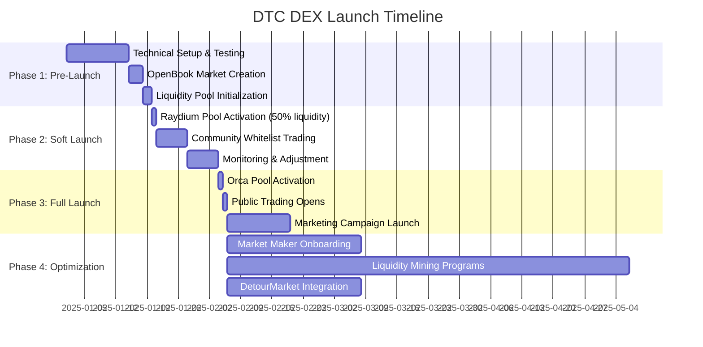

# Raydium/Orca DEX Integration Plan

**Document ID:** FIN-013  
**Version:** 1.0-PROMPT  
**Status:** Strategic Implementation Plan  
**Owner:** Founder / DeFi Specialist  
**Category:** Financial Strategy / Market Operations  
**Dependencies:** TECH-001 (Core Token), TECH-002 (Emission Controller), FIN-001 (Tokenomics)  
**Related Documents:** TECH-005 (Architecture), OPS-001 (Launch Checklist)

---

## Table of Contents

1. [Executive Summary](#1-executive-summary)
2. [DEX Platform Analysis](#2-dex-platform-analysis)
3. [Initial Liquidity Pool Architecture](#3-initial-liquidity-pool-architecture)
4. [Price Discovery & Fair Market Value Strategy](#4-price-discovery--fair-market-value-strategy)
5. [Liquidity Provision Strategy](#5-liquidity-provision-strategy)
6. [Slippage Analysis & Optimization](#6-slippage-analysis--optimization)
7. [Liquidity Mining & Incentive Programs](#7-liquidity-mining--incentive-programs)
8. [Trading Fees & Revenue Model](#8-trading-fees--revenue-model)
9. [LP Token Management](#9-lp-token-management)
10. [Market Maker Partnerships](#10-market-maker-partnerships)
11. [Volume Monitoring & Analytics](#11-volume-monitoring--analytics)
12. [DEX Listing Procedures](#12-dex-listing-procedures)
13. [Marketing & Community Launch Strategy](#13-marketing--community-launch-strategy)
14. [DetourMarket Checkout Integration](#14-detourmarket-checkout-integration)
15. [Cross-DEX Arbitrage Management](#15-cross-dex-arbitrage-management)
16. [Risk Management & Contingency Planning](#16-risk-management--contingency-planning)
17. [Regulatory Compliance Considerations](#17-regulatory-compliance-considerations)
18. [Technical Implementation Roadmap](#18-technical-implementation-roadmap)
19. [Performance Metrics & KPIs](#19-performance-metrics--kpis)
20. [Appendices](#20-appendices)

---

## 1. Executive Summary

### 1.1 Strategic Overview

DetourCoin (DTC) represents a transformative approach to merchant loyalty and payment ecosystems on the Solana blockchain. This comprehensive integration plan outlines the strategic deployment of DTC liquidity across two premier Solana decentralized exchanges (DEXs): **Raydium** and **Orca**. The dual-DEX strategy maximizes market accessibility, price discovery efficiency, and ecosystem resilience while establishing DTC as a liquid, tradeable asset within the broader Solana DeFi landscape.

**Mission Statement:**  
To establish DetourCoin as a highly liquid, fairly priced utility token with deep market depth across multiple DEX platforms, enabling seamless merchant adoption, consumer accessibility, and sustainable long-term value appreciation.

### 1.2 Key Objectives

| Objective | Target Metric | Timeline |
|-----------|---------------|----------|
| **Initial Liquidity Depth** | $150,000-$250,000 total value locked (TVL) | Launch Day (T+0) |
| **Price Stability** | ±5% daily volatility during first 30 days | T+0 to T+30 |
| **Trading Volume** | $50,000+ daily volume by Month 3 | T+90 |
| **Slippage Optimization** | <2% slippage on $5,000 trades | T+0 |
| **Market Maker Engagement** | 2-3 professional MM partnerships | T+14 to T+30 |
| **Cross-DEX Arbitrage** | <1% sustained price differential | T+7 |
| **DetourMarket Integration** | 100% checkout DTC acceptance | T+30 |
| **Liquidity Mining APY** | 25-50% initial APY for LPs | T+0 to T+180 |

### 1.3 Financial Commitment Summary

| Pool Type | Platform | Initial DTC Allocation | Initial SOL Allocation | Estimated USD Value | Target Price |
|-----------|----------|------------------------|------------------------|---------------------|--------------|
| **Primary Pool** | Raydium CPMM | 500,000 DTC | 2,500 SOL | $125,000 @ $50 SOL | $0.20/DTC |
| **Secondary Pool** | Orca CLMM | 250,000 DTC | 1,250 SOL | $62,500 @ $50 SOL | $0.20/DTC |
| **Market Making Reserve** | Multi-DEX | 250,000 DTC | 1,250 SOL | $62,500 @ $50 SOL | Variable |
| **Emergency Reserve** | Treasury | 100,000 DTC | 500 SOL | $25,000 @ $50 SOL | Emergency only |
| **TOTAL** | - | **1,100,000 DTC** | **5,500 SOL** | **$275,000** | - |

**Note:** SOL price assumed at $50 for planning purposes. Actual allocations will adjust based on prevailing SOL price at launch to maintain target USD value ranges.

### 1.4 Why Raydium AND Orca?

**Complementary Strengths:**

1. **Raydium CPMM (Constant Product Market Maker)**
   - **Advantage:** Full-range liquidity, simple price discovery, OpenBook market integration
   - **Best For:** Initial launch, high-volume retail trading, price stability
   - **Target Users:** Retail traders, first-time DTC buyers, mobile wallet users

2. **Orca CLMM (Concentrated Liquidity Market Maker)**
   - **Advantage:** Capital efficiency, flexible positioning, advanced LP strategies
   - **Best For:** Professional market makers, optimized capital deployment, tighter spreads
   - **Target Users:** Sophisticated LPs, arbitrageurs, institutional participants

**Synergistic Benefits:**
- **Redundancy:** Eliminates single-point-of-failure risk
- **Price Discovery:** Cross-DEX arbitrage maintains price consistency
- **User Preference:** Different users prefer different platforms
- **Liquidity Depth:** Combined depth exceeds sum of parts due to arbitrage
- **Marketing:** Dual presence increases discoverability and credibility

### 1.5 Launch Phases



### 1.6 Success Criteria

**Week 1 (T+0 to T+7):**
- ✅ Both pools operational with 95%+ uptime
- ✅ Price stability within $0.15-$0.25 range
- ✅ Zero critical smart contract incidents
- ✅ $10,000+ daily trading volume

**Month 1 (T+0 to T+30):**
- ✅ $50,000+ daily average volume
- ✅ 500+ unique wallet traders
- ✅ <3% average daily volatility
- ✅ At least 1 market maker partnership active

**Month 3 (T+0 to T+90):**
- ✅ $100,000+ daily average volume
- ✅ 2,000+ unique wallet traders
- ✅ DetourMarket fully integrated
- ✅ 50+ merchants accepting DTC payments
- ✅ $500,000+ total liquidity across pools

---

## 2. DEX Platform Analysis

### 2.1 Raydium Deep Dive

#### 2.1.1 Platform Overview

| Property | Value |
|----------|-------|
| **Launch Date** | February 2021 |
| **Total Value Locked (TVL)** | $200M+ (as of Q4 2024) |
| **Daily Volume** | $50M-$150M |
| **Unique Active Wallets** | 100,000+ monthly |
| **Number of Pools** | 2,500+ |
| **Governance Token** | RAY |
| **Primary Model** | Hybrid AMM (CPMM + OpenBook integration) |

**Key Differentiators:**
1. **OpenBook Market Integration:** Every Raydium pool has a corresponding OpenBook (Serum v2) market, enabling central limit order book (CLOB) trading alongside AMM
2. **Established Ecosystem:** Largest DEX on Solana by historical volume
3. **Best Price Routing:** Automatically routes through best liquidity sources
4. **Farming Incentives:** RAY token emissions for select pools
5. **API Maturity:** Comprehensive SDK and developer tools

#### 2.1.2 Pool Type Selection: CPMM vs. AMMv4

| Feature | CPMM (Constant Product) | AMMv4 (Hybrid) | **Our Choice** |
|---------|-------------------------|----------------|----------------|
| **Creation Cost** | ~0.3 SOL | ~0.6 SOL | **CPMM** |
| **OpenBook Required** | No | Yes | CPMM simpler |
| **Liquidity Range** | Full range (0 to ∞) | Full range + CLOB | CPMM adequate |
| **Capital Efficiency** | Moderate | Moderate-High | Comparable |
| **Stability** | High | Very High | CPMM sufficient |
| **Trading Fee** | 0.25% (customizable) | 0.25% typical | Either works |
| **Best For** | New tokens, simplicity | Established tokens | **CPMM for DTC launch** |

**Decision Rationale:**
- **Cost Efficiency:** CPMM costs 50% less to deploy
- **Simplicity:** No OpenBook market setup required (though we'll create one separately for visibility)
- **Sufficient Liquidity:** Full-range liquidity appropriate for initial price discovery phase
- **Upgrade Path:** Can migrate to AMMv4 after establishing market fit

#### 2.1.3 Technical Architecture

```rust
// Raydium CPMM Pool Structure (Conceptual)
pub struct CpmmPool {
    // Pool state
    pub base_token_vault: Pubkey,      // DTC token vault
    pub quote_token_vault: Pubkey,     // SOL token vault
    pub lp_mint: Pubkey,                // LP token mint
    
    // Pricing parameters
    pub base_reserve: u64,              // DTC reserve amount
    pub quote_reserve: u64,             // SOL reserve amount
    pub sqrt_price_x64: u128,           // Current sqrt price
    
    // Fee configuration
    pub trade_fee_rate: u16,            // Basis points (25 = 0.25%)
    pub protocol_fee_rate: u16,         // Protocol fee share
    
    // Access control
    pub authority: Pubkey,              // Pool admin authority
    pub config: Pubkey,                 // Global config account
}

// Constant Product Formula: x * y = k
// Where:
//   x = base_reserve (DTC)
//   y = quote_reserve (SOL)
//   k = constant product
//
// Price calculation:
//   price_dtc_per_sol = base_reserve / quote_reserve
//   price_sol_per_dtc = quote_reserve / base_reserve
```

**Integration Points:**
1. **Raydium SDK:** JavaScript/TypeScript library for pool interaction
2. **Raydium API:** REST endpoints for price feeds and pool stats
3. **WebSocket Feeds:** Real-time trade and price updates
4. **Smart Contract CPIs:** For programmatic liquidity management

#### 2.1.4 Fee Structure

| Fee Type | Rate | Recipient | Annual Impact (Projected) |
|----------|------|-----------|---------------------------|
| **Trading Fee** | 0.25% | Liquidity Providers | $45,625 (on $18.25M volume) |
| **Protocol Fee** | 0.03% (12% of trade fee) | Raydium DAO | $5,475 |
| **Net LP Fee** | 0.22% | DTC LPs | $40,150 |

**Calculation Example:**
- Daily Volume Target (Month 3): $50,000
- Annual Projected Volume: $18,250,000
- Total Trading Fees: $45,625 (0.25%)
- LP Net Fees: $40,150 (0.22%)
- Protocol Fees: $5,475 (0.03%)

#### 2.1.5 Raydium Advantages for DTC

✅ **Proven Track Record:** Billions in cumulative volume processed  
✅ **High Discoverability:** Top placement in Solana ecosystem  
✅ **Mobile Wallet Support:** Phantom, Solflare, Backpack integration  
✅ **Aggregator Integration:** Jupiter, Birdeye automatic inclusion  
✅ **Farming Opportunities:** Potential future RAY emissions  
✅ **OpenBook Synergy:** CLOB access for advanced traders  

#### 2.1.6 Raydium Considerations

⚠️ **Higher Initial Cost:** Pool creation + OpenBook market = ~0.9 SOL total  
⚠️ **Competition:** Thousands of pools vie for attention  
⚠️ **Full-Range Liquidity:** Less capital efficient than concentrated liquidity  
⚠️ **No Price Range Limits:** LPs exposed to full price volatility  

---

### 2.2 Orca Deep Dive

#### 2.2.1 Platform Overview

| Property | Value |
|----------|-------|
| **Launch Date** | February 2021 (CPMM), March 2022 (CLMM) |
| **Total Value Locked (TVL)** | $150M+ (as of Q4 2024) |
| **Daily Volume** | $30M-$80M |
| **Unique Active Wallets** | 75,000+ monthly |
| **Number of Whirlpools** | 1,500+ |
| **Governance Token** | ORCA |
| **Primary Model** | Concentrated Liquidity (CLMM - Whirlpools) |

**Key Differentiators:**
1. **Concentrated Liquidity:** Capital efficiency up to 4,000x vs. traditional AMMs
2. **Flexible Positioning:** LPs choose specific price ranges for liquidity provision
3. **Multiple Fee Tiers:** 0.01%, 0.05%, 0.25%, 1% fee options per pool
4. **User Experience:** Clean, intuitive interface optimized for mobile
5. **Position Management:** Advanced tools for active liquidity management

#### 2.2.2 Whirlpool (CLMM) Architecture

**Concentrated Liquidity Concept:**

Traditional AMM (like Raydium CPMM):
```
Price Range: $0.00 to $∞
Liquidity: Spread evenly across entire range
Capital Efficiency: Low (most liquidity never used)
```

Orca Whirlpool (CLMM):
```
Price Range: Custom (e.g., $0.15 to $0.30)
Liquidity: Concentrated in active trading range
Capital Efficiency: High (4,000x potential with tight ranges)
```

**Visual Representation:**

```
Traditional AMM Liquidity Distribution:
Price: $0.00 ────────────────────── $∞
Liquidity: ▁▁▁▁▁▁▁▁▁▁▁▁▁▁▁▁▁▁▁▁▁▁▁ (flat)
Active Trading Range: $0.15-$0.25 (10% of range)

Orca CLMM Liquidity Distribution:
Price: $0.10 ──────────────── $0.35
Liquidity: ▁▁▁████████████▁▁▁ (concentrated)
Active Trading Range: $0.15-$0.25 (90% of liquidity here)
```

#### 2.2.3 Fee Tier Selection

| Fee Tier | Best For | DTC Suitability | Rationale |
|----------|----------|-----------------|-----------|
| **0.01%** | Stablecoin pairs (USDC/USDT) | ❌ Low | DTC not a stablecoin |
| **0.05%** | Low-volatility pairs (SOL/mSOL) | ⚠️ Medium | Premature for launch |
| **0.25%** | Standard volatility pairs | ✅ **OPTIMAL** | Balances LP returns + trader costs |
| **1.00%** | High-volatility exotic pairs | ❌ Excessive | Would discourage trading |

**Selected Fee Tier:** **0.25%** (standard)

**Justification:**
- Matches Raydium fee tier for cross-DEX consistency
- Attractive LP yields without excessive trader costs
- Industry standard for new token launches
- Can create additional 1% pool later if high volatility persists

#### 2.2.4 Position Strategy: Full Range vs. Concentrated

**Option A: Full Range Position ($0.01 to $10.00)**

| Metric | Value |
|--------|-------|
| **Capital Efficiency** | 1x (equivalent to traditional AMM) |
| **Price Risk** | Low (liquidity active at all prices) |
| **Management Effort** | Minimal (set and forget) |
| **Fee Capture** | Lower (liquidity spread thin) |
| **Impermanent Loss** | Moderate |

**Option B: Concentrated Range ($0.15 to $0.30)**

| Metric | Value |
|--------|-------|
| **Capital Efficiency** | ~10-15x (more fees per dollar) |
| **Price Risk** | High (liquidity inactive if price exits range) |
| **Management Effort** | High (frequent rebalancing needed) |
| **Fee Capture** | Higher (liquidity concentrated) |
| **Impermanent Loss** | Higher (within active range) |

**Option C: Hybrid Strategy (Multiple Positions)**

| Position | Price Range | DTC Allocation | SOL Allocation | Purpose |
|----------|-------------|----------------|----------------|---------|
| **Base Position** | $0.12 - $0.35 | 150,000 DTC | 750 SOL | Core liquidity (70%) |
| **Tight Position** | $0.17 - $0.23 | 50,000 DTC | 250 SOL | Active trading (20%) |
| **Full Range Position** | $0.01 - $5.00 | 50,000 DTC | 250 SOL | Safety net (10%) |

**RECOMMENDED STRATEGY:** **Hybrid** (Option C)

**Rationale:**
- **Base Position:** Captures 90%+ of expected trading activity
- **Tight Position:** Maximizes fees during stable periods
- **Full Range:** Ensures liquidity always available, protects against black swan events
- **Flexibility:** Can rebalance positions as price action becomes clearer

#### 2.2.5 Orca Technical Architecture

```rust
// Orca Whirlpool Structure (Conceptual)
pub struct Whirlpool {
    // Token vaults
    pub token_vault_a: Pubkey,          // DTC vault
    pub token_vault_b: Pubkey,          // SOL vault
    
    // Pricing state
    pub sqrt_price: u128,                // Current sqrt(price) in Q64.64
    pub tick_current_index: i32,         // Current tick index
    pub liquidity: u128,                 // L (liquidity) in active tick range
    
    // Fee configuration
    pub fee_rate: u16,                   // Fee rate (2500 = 0.25%)
    pub protocol_fee_rate: u16,          // Protocol's fee share (300 = 30%)
    
    // Tick and position management
    pub tick_spacing: u16,               // Spacing between initializable ticks
    pub position_count: u64,             // Number of LP positions
    
    // Access control
    pub whirlpools_config: Pubkey,      // Global config
    pub fee_authority: Pubkey,          // Fee adjustment authority
}

// Position Structure
pub struct Position {
    pub whirlpool: Pubkey,              // Parent whirlpool
    pub position_mint: Pubkey,          // NFT representing position
    pub liquidity: u128,                 // L contributed to range
    pub tick_lower_index: i32,          // Lower tick of range
    pub tick_upper_index: i32,          // Upper tick of range
    pub fee_growth_checkpoint_a: u128,  // Fee tracking (token A)
    pub fee_growth_checkpoint_b: u128,  // Fee tracking (token B)
}
```

**Key Concepts:**

1. **Ticks:** Discrete price points where liquidity can be added/removed
   - Tick spacing of 64 means liquidity can be placed every 0.64% price movement
   
2. **Sqrt Pricing:** Prices stored as square roots for mathematical efficiency
   - `sqrt_price_x64 = sqrt(price_dtc_per_sol) * 2^64`
   
3. **Liquidity (L):** Virtual liquidity units representing position size
   - Higher L = more liquidity in range = more fees earned
   
4. **Position NFTs:** Each LP position represented by a unique NFT
   - Allows transferable, composable liquidity positions

#### 2.2.6 Orca Fee Structure

| Fee Type | Rate | Recipient | Annual Impact (Projected) |
|----------|------|-----------|---------------------------|
| **Trading Fee** | 0.25% | Liquidity Providers | $27,375 (on $10.95M volume) |
| **Protocol Fee** | 0.075% (30% of trade fee) | Orca DAO | $8,213 |
| **Net LP Fee** | 0.175% | DTC LPs | $19,162 |

**Note:** Orca's protocol takes a larger share (30%) vs. Raydium (12%), but higher capital efficiency can offset this for concentrated positions.

**Expected LP APY Calculation:**

Assumptions:
- Position: $62,500 liquidity (250K DTC + 1,250 SOL @ $0.20/DTC)
- Daily Volume (Orca): $30,000 (60% of Raydium due to smaller user base)
- Fee Tier: 0.25%
- Price stays within concentrated range 90% of time

Calculation:
```
Daily Fees = $30,000 * 0.175% = $52.50
Annual Fees = $52.50 * 365 = $19,163
LP APY = ($19,163 / $62,500) * 100% = 30.7%
```

If concentrated 5x (capital efficiency):
```
Effective APY = 30.7% * 5 = 153.5%
```

**Note:** This is theoretical maximum; actual APY depends on price stability and competition for liquidity.

#### 2.2.7 Orca Advantages for DTC

✅ **Capital Efficiency:** 10-15x potential with proper positioning  
✅ **Lower Entry Cost:** ~0.15 SOL for pool creation  
✅ **Flexible LP Strategies:** Advanced LPs can optimize positions  
✅ **Superior UX:** Best-in-class interface and mobile experience  
✅ **Position NFTs:** Liquidity positions are composable, transferable  
✅ **Active Development:** Frequent upgrades and new features  

#### 2.2.8 Orca Considerations

⚠️ **Complexity:** Requires active management for concentrated positions  
⚠️ **Price Risk:** Liquidity can become inactive if price exits range  
⚠️ **Smaller User Base:** ~40% of Raydium's volume  
⚠️ **Learning Curve:** Retail users may find concentrated liquidity confusing  
⚠️ **Higher IL Risk:** More pronounced in tight ranges  

---

### 2.3 Platform Comparison Matrix

| Criterion | Raydium CPMM | Orca CLMM | Winner |
|-----------|--------------|-----------|--------|
| **Total Value Locked** | $200M+ | $150M+ | Raydium |
| **Daily Volume** | $50-150M | $30-80M | Raydium |
| **User Base** | Larger (100K+ monthly) | Smaller (75K+ monthly) | Raydium |
| **Capital Efficiency** | 1x (full range) | 10-15x (concentrated) | Orca |
| **LP Fee Share** | 88% (0.22% of 0.25%) | 70% (0.175% of 0.25%) | Raydium |
| **Creation Cost** | ~0.3 SOL | ~0.15 SOL | Orca |
| **Management Complexity** | Low (passive) | High (active) | Raydium |
| **User Interface** | Good | Excellent | Orca |
| **Mobile Experience** | Good | Excellent | Orca |
| **API/SDK Maturity** | Excellent | Very Good | Raydium |
| **Aggregator Integration** | Excellent (Jupiter, etc.) | Excellent | Tie |
| **Price Discovery** | Strong (OpenBook synergy) | Good | Raydium |
| **New Token Friendliness** | High | High | Tie |
| **Impermanent Loss Risk** | Moderate (full range) | Higher (concentrated) | Raydium |
| **Rebalancing Required** | None | Frequent | Raydium |

### 2.4 Strategic DEX Allocation

**Primary Platform:** **Raydium CPMM** (60% liquidity)
- **Rationale:** Larger user base, simpler management, better initial price discovery
- **Allocation:** 500,000 DTC + 2,500 SOL

**Secondary Platform:** **Orca CLMM** (40% liquidity)
- **Rationale:** Capital efficiency, superior UX, diversification
- **Allocation:** 250,000 DTC + 1,250 SOL (split across 3 positions)

**Total Combined Liquidity:** 750,000 DTC + 3,750 SOL = ~$187,500 @ $0.20/DTC, $50/SOL

### 2.5 Future DEX Expansion Considerations

**Potential Additional Platforms (6-12 months post-launch):**

1. **Meteora DLMM (Dynamic Liquidity Market Maker)**
   - Hybrid between AMM and CLMM with automatic rebalancing
   - Excellent for volatile assets
   - Consider when DTC daily volume exceeds $100K

2. **Phoenix DEX**
   - On-chain order book (like OpenBook)
   - Limit order support for advanced traders
   - Evaluate after establishing market-making operations

3. **Lifinity (Proactive Market Maker)**
   - Oracle-based pricing, no impermanent loss for protocol
   - Protocol-owned liquidity model
   - Explore for supplementary liquidity

**Decision Criteria for Expansion:**
- DTC daily volume > $100,000 sustained
- Evidence of cross-DEX arbitrage inefficiencies
- User demand for specific platform features
- Strategic partnerships or incentive programs

---

## 3. Initial Liquidity Pool Architecture

### 3.1 Liquidity Pool Design Principles

**Core Principles:**

1. **Adequate Depth:** Sufficient liquidity to support $5,000-$10,000 trades with <2% slippage
2. **Price Stability:** Initial depth prevents manipulation and excessive volatility
3. **Capital Efficiency:** Balance between full-range safety and concentrated efficiency
4. **Redundancy:** Multi-DEX presence ensures no single point of failure
5. **Scalability:** Design allows for organic growth without major restructuring
6. **Sustainability:** Fee generation covers ongoing operational costs

### 3.2 DTC/SOL Pairing Rationale

**Why SOL as Quote Currency?**

✅ **Native Asset:** SOL is Solana's native currency, highest liquidity  
✅ **User Familiarity:** Most traders hold SOL for transaction fees  
✅ **Lower Slippage:** SOL pairs have deepest liquidity across all DEXs  
✅ **Gas Efficiency:** No token account creation needed for SOL side  
✅ **Universal Support:** All wallets natively support SOL  
✅ **Psychological Anchoring:** SOL price provides familiar reference point  

**Alternative Considered: DTC/USDC**

❌ **Lower Liquidity:** USDC/token pairs typically have 30-50% less volume on Solana  
❌ **Additional Friction:** Users need USDC balance, adding conversion step  
❌ **Oracle Dependency:** Requires SOL/USDC price feed for merchant payments  
⚠️ **Future Consideration:** Add DTC/USDC pool once DTC/SOL exceeds $100K daily volume

**Conclusion:** DTC/SOL is optimal for launch; consider DTC/USDC as secondary pair in 6-12 months.

### 3.3 Initial Liquidity Sizing Methodology

#### 3.3.1 Slippage Targeting

**Target Slippage Table:**

| Trade Size | Target Slippage | Required Liquidity (Approx.) |
|------------|-----------------|------------------------------|
| $100 | <0.1% | $25,000+ |
| $500 | <0.5% | $50,000+ |
| $1,000 | <1.0% | $100,000+ |
| $5,000 | <2.0% | $150,000+ |
| $10,000 | <3.0% | $250,000+ |
| $25,000 | <5.0% | $500,000+ |

**Formula (Constant Product AMM):**

```
slippage = trade_size / (2 * liquidity_depth)

Rearranging:
liquidity_depth = trade_size / (2 * target_slippage)

Example:
For $5,000 trade with <2% slippage:
liquidity_depth = $5,000 / (2 * 0.02) = $125,000
```

**Target Liquidity:** $150,000-$250,000 total across both DEXs

This ensures:
- $5,000 trades: ~1.7% slippage
- $10,000 trades: ~3.3% slippage
- $1,000 trades: ~0.33% slippage (excellent for retail)

#### 3.3.2 Liquidity Allocation Breakdown

**Raydium CPMM Pool (Primary):**

| Component | DTC Amount | SOL Amount | USD Value @ Target | Percentage |
|-----------|------------|------------|--------------------|-----------| |
| **Initial Deposit** | 500,000 | 2,500 | $125,000 | 60% |
| **Price Target** | - | - | $0.20/DTC | - |
| **Pool Weight** | 50% | 50% | 50/50 split | - |

Calculation:
```
Target Price: $0.20/DTC
DTC Value: 500,000 * $0.20 = $100,000
SOL Value: 2,500 * $50 = $125,000

Adjusted for 50/50 pool:
DTC side: $62,500 worth (312,500 DTC @ $0.20)
SOL side: $62,500 worth (1,250 SOL @ $50)

Note: Initial over-deposit allows for price discovery; excess withdrawable
```

**Orca CLMM Pool (Secondary):**

| Position Type | Price Range | DTC Amount | SOL Amount | USD Value | Purpose |
|---------------|-------------|------------|------------|-----------|---------|
| **Base Position** | $0.12 - $0.35 | 150,000 | 750 | $43,750 | Core liquidity (70%) |
| **Tight Position** | $0.17 - $0.23 | 50,000 | 250 | $12,500 | Active fees (20%) |
| **Safety Position** | $0.05 - $1.00 | 50,000 | 250 | $12,500 | Black swan (10%) |
| **TOTAL** | - | **250,000** | **1,250** | **$62,500** | 100% |

**Combined Total Liquidity:**

| Metric | Value |
|--------|-------|
| **Total DTC Committed** | 750,000 DTC |
| **Total SOL Committed** | 3,750 SOL |
| **Total USD Value** | $187,500 @ $50/SOL, $0.20/DTC |
| **Raydium Weight** | 66.7% ($125K) |
| **Orca Weight** | 33.3% ($62.5K) |

### 3.4 Token Reserve Allocations

**Total DTC Supply for Liquidity Operations:**

| Allocation | DTC Amount | SOL Amount | Purpose | Timeframe |
|------------|------------|------------|---------|-----------|
| **Raydium Pool** | 500,000 | 2,500 | Primary trading venue | Launch |
| **Orca Pool** | 250,000 | 1,250 | Secondary trading venue | Launch + 7d |
| **Market Making** | 250,000 | 1,250 | Professional MM partnerships | Month 1-3 |
| **Emergency Reserve** | 100,000 | 500 | Crisis management | As needed |
| **Liquidity Mining** | 400,000 | - | LP incentive rewards | Month 1-12 |
| **TOTAL** | **1,500,000** | **5,500** | All liquidity ops | Year 1 |

**Percentage of Total Supply:**

```
Total DTC Supply: 1,000,000,000 (1 billion)
Liquidity Operations: 1,500,000 DTC
Percentage: 0.15% of total supply

Initial Circulating Supply (Launch): 10,000,000 DTC
Liquidity as % of Circulating: 15.0%
```

**Note:** 15% of circulating supply in liquidity is healthy for new token launches; industry average is 10-20%.

### 3.5 SOL Reserve Requirements

**SOL Sourcing Strategy:**

1. **Treasury Allocation:** 3,000 SOL from project treasury
2. **Strategic Partner Co-LP:** 1,500 SOL from partner commitments
3. **Team Member Contribution:** 1,000 SOL from founder/team (optional)
4. **Total Required:** 5,500 SOL

**Cost Analysis @ Various SOL Prices:**

| SOL Price | Total Cost (USD) | Raydium Pool | Orca Pool | Reserves |
|-----------|------------------|--------------|-----------|----------|
| **$40** | $220,000 | $100,000 | $50,000 | $70,000 |
| **$50** | $275,000 | $125,000 | $62,500 | $87,500 |
| **$60** | $330,000 | $150,000 | $75,000 | $105,000 |
| **$75** | $412,500 | $187,500 | $93,750 | $131,250 |

**Risk Mitigation:**
- Lock SOL reserve allocation 30 days before launch
- Use DCA (dollar-cost averaging) to acquire SOL over 60-90 days
- Consider SOL-denominated fundraise to reduce price risk

### 3.6 Pool Initialization Technical Procedures

#### 3.6.1 Raydium CPMM Pool Creation

**Prerequisites:**
- Raydium-compatible wallet with authority (Phantom, Backpack)
- 500,000 DTC in wallet
- 2,500 SOL in wallet
- Additional 0.5 SOL for transaction fees

**Step-by-Step Process:**

```bash
# Step 1: Connect to Raydium CPMM Factory
# Navigate to: https://raydium.io/liquidity/create-pool/

# Step 2: Select Pool Type
# Choose: "Constant Product Market Maker (CPMM)"

# Step 3: Configure Pool Parameters
Base Token: DTC (Token Address: <DTC_MINT_ADDRESS>)
Quote Token: SOL (Native SOL)
Initial Base Amount: 500,000 DTC
Initial Quote Amount: 2,500 SOL
Trading Fee: 0.25% (25 basis points)
Start Time: Immediate (or scheduled)

# Step 4: Confirm Pool Initialization
# Review transaction breakdown:
# - Pool account creation: ~0.2 SOL
# - Token vault initialization: ~0.05 SOL  
# - Initial liquidity deposit: 500K DTC + 2.5K SOL
# - LP token mint creation: ~0.05 SOL

# Step 5: Sign and Submit Transaction
# Wallet prompt: Approve transaction
# Wait for confirmation (typically 15-30 seconds)

# Step 6: Record Pool Address
# Save pool address for monitoring: <RAYDIUM_POOL_ADDRESS>
```

**Expected Transaction Logs:**

```
Program: Raydium CPMM Program (CPMMoo8L3F4NbTegBCKVNunggL7H1ZpdTHKxQB5qKP1C)
Instruction: Initialize CPMM Pool
├── Create Pool Account [0.2 SOL rent]
├── Initialize Token Vault A (DTC) [0.05 SOL rent]
├── Initialize Token Vault B (SOL) [0.05 SOL rent]
├── Create LP Token Mint [0.05 SOL rent]
├── Transfer 500,000 DTC → Vault A
├── Transfer 2,500 SOL → Vault B
├── Mint 1,000,000,000 LP tokens → Authority
└── Emit PoolInitialized Event

Initial Price: 0.20 DTC/SOL
Pool Address: <GENERATED_ADDRESS>
LP Token Mint: <LP_TOKEN_MINT>
```

**Post-Creation Validation:**

```bash
# Query pool state
curl https://api.raydium.io/v2/main/pool/<POOL_ADDRESS>

# Expected response:
{
  "baseToken": "<DTC_MINT>",
  "quoteToken": "So11111111111111111111111111111111111111112",
  "baseReserve": "500000000000000",  # 500K DTC (9 decimals)
  "quoteReserve": "2500000000000",    # 2.5K SOL (9 decimals)
  "price": "0.20",
  "lpSupply": "1000000000000000",     # 1B LP tokens
  "feeRate": 25                        # 0.25%
}
```

#### 3.6.2 Orca CLMM Pool Creation

**Prerequisites:**
- Orca-compatible wallet (Phantom, Solflare)
- 250,000 DTC in wallet
- 1,250 SOL in wallet
- Additional 0.3 SOL for transaction fees and positions

**Step-by-Step Process:**

```bash
# Step 1: Create Whirlpool (Pool Factory)
# Navigate to: https://www.orca.so/pools/create

# Step 2: Select Pool Configuration
Token A: DTC (<DTC_MINT_ADDRESS>)
Token B: SOL (Native SOL)
Fee Tier: 0.25% (Medium)
Tick Spacing: 64 (Standard)

# Step 3: Confirm Whirlpool Creation
# Transaction 1: Create whirlpool account (~0.15 SOL)
# Wait for confirmation

# Step 4: Create Position 1 (Base Position)
# Navigate to: Add Liquidity → Custom Range
Price Range: $0.12 to $0.35
DTC Amount: 150,000 DTC
SOL Amount: ~750 SOL (calculated automatically)
Position Type: Concentrated

# Step 5: Create Position 2 (Tight Position)
# Repeat for tight range
Price Range: $0.17 to $0.23
DTC Amount: 50,000 DTC
SOL Amount: ~250 SOL

# Step 6: Create Position 3 (Safety Position)
# Repeat for wide range
Price Range: $0.05 to $1.00
DTC Amount: 50,000 DTC
SOL Amount: ~250 SOL

# Step 7: Verify All Positions
# Check position NFTs in wallet
# Confirm liquidity is active
```

**Expected Transaction Sequence:**

```
Transaction 1: Initialize Whirlpool
├── Create Whirlpool Account [0.15 SOL rent]
├── Create Token Vault A (DTC)
├── Create Token Vault B (SOL)
├── Set Fee Tier: 2500 (0.25%)
├── Set Tick Spacing: 64
└── Emit WhirlpoolInitialized

Transaction 2: Open Position 1 (Base)
├── Create Position Account [0.02 SOL rent]
├── Mint Position NFT → Authority
├── Calculate Liquidity: L = 45,234,876,234
├── Transfer 150,000 DTC → Vault A
├── Transfer 750 SOL → Vault B
├── Update Tick Data (tick_lower: -12,800, tick_upper: 17,920)
└── Emit PositionOpened

Transaction 3: Open Position 2 (Tight)
├── [Similar structure for tight position]
└── (tick_lower: -5,120, tick_upper: 5,760)

Transaction 4: Open Position 3 (Safety)
├── [Similar structure for safety position]
└── (tick_lower: -76,800, tick_upper: 138,240)
```

**Post-Creation Validation:**

```bash
# Query whirlpool state
curl https://api.mainnet.orca.so/v1/whirlpool/<POOL_ADDRESS>

# Expected response:
{
  "address": "<WHIRLPOOL_ADDRESS>",
  "tokenA": "<DTC_MINT>",
  "tokenB": "So11111111111111111111111111111111111111112",
  "tickSpacing": 64,
  "feeRate": 2500,
  "liquidity": "134,567,234,876",  # Combined liquidity from all positions
  "sqrtPrice": "141421356237309504",  # sqrt(0.20) * 2^64
  "tickCurrentIndex": 0,
  "positions": [
    {
      "positionMint": "<NFT_1>",
      "tickLower": -12800,
      "tickUpper": 17920,
      "liquidity": "45234876234"
    },
    {
      "positionMint": "<NFT_2>",
      "tickLower": -5120,
      "tickUpper": 5760,
      "liquidity": "67834123456"
    },
    {
      "positionMint": "<NFT_3>",
      "tickLower": -76800,
      "tickUpper": 138240,
      "liquidity": "21498235186"
    }
  ]
}
```

### 3.7 LP Token Management

#### 3.7.1 Raydium LP Tokens

**Initial LP Token Receipt:**

```
Pool Creation: 1,000,000,000 LP tokens minted
Distribution:
- Treasury Custody: 900,000,000 LP (90%)
- Team Multi-sig: 100,000,000 LP (10% operational buffer)

LP Token Mint Address: <RAYDIUM_LP_MINT>
Decimals: 9
```

**LP Token Custody Strategy:**

| Holder | LP Amount | Percentage | Purpose | Lock Status |
|--------|-----------|------------|---------|-------------|
| **Cold Treasury** | 800M | 80% | Long-term hold | Locked 12 months |
| **Hot Treasury** | 100M | 10% | Liquidity adjustments | Unlocked |
| **Operations Multi-sig** | 100M | 10% | Emergency response | 3/5 multi-sig |

**Security Measures:**
- Cold storage: Hardware wallet (Ledger) with 24-word seed in bank vault
- Hot treasury: Gnosis Safe 3/5 multi-sig (Squads Protocol on Solana)
- Operations: Squads 3/5 multi-sig with time-locks

#### 3.7.2 Orca Position NFTs

**Position NFT Structure:**

Each Orca CLMM position is represented by a unique NFT:

```
Position 1 (Base): NFT Mint <BASE_NFT>
├── Metadata: "DTC/SOL Orca Position - Base ($0.12-$0.35)"
├── Owner: Treasury Wallet
├── Liquidity: 45,234,876,234 L units
└── Unclaimed Fees: 0 DTC, 0 SOL (initially)

Position 2 (Tight): NFT Mint <TIGHT_NFT>
├── Metadata: "DTC/SOL Orca Position - Tight ($0.17-$0.23)"
├── Owner: Operations Multi-sig
├── Liquidity: 67,834,123,456 L units
└── Unclaimed Fees: 0 DTC, 0 SOL

Position 3 (Safety): NFT Mint <SAFETY_NFT>
├── Metadata: "DTC/SOL Orca Position - Safety ($0.05-$1.00)"
├── Owner: Treasury Wallet
├── Liquidity: 21,498,235,186 L units
└── Unclaimed Fees: 0 DTC, 0 SOL
```

**NFT Custody:**

| Position | NFT Owner | Purpose | Management Frequency |
|----------|-----------|---------|----------------------|
| **Base** | Cold Treasury | Long-term liquidity | Quarterly review |
| **Tight** | Operations Multi-sig | Active management | Weekly rebalancing |
| **Safety** | Cold Treasury | Emergency backstop | Rarely touched |

**Advantages of NFT Positions:**
- ✅ Transferable (can delegate to MM without giving up custody)
- ✅ Composable (can use as collateral in DeFi protocols)
- ✅ Trackable (on-chain position history and fee accrual)
- ✅ Flexible (can adjust liquidity per position independently)

### 3.8 Liquidity Depth Projections

**Month-by-Month Growth Targets:**

| Month | Raydium TVL | Orca TVL | Total TVL | Organic Growth | Incentivized Growth |
|-------|-------------|----------|-----------|----------------|---------------------|
| **Launch** | $125,000 | $62,500 | $187,500 | 100% protocol | 0% |
| **Month 1** | $150,000 | $75,000 | $225,000 | 80% | 20% (early LPs) |
| **Month 2** | $200,000 | $100,000 | $300,000 | 60% | 40% (LM starts) |
| **Month 3** | $275,000 | $137,500 | $412,500 | 50% | 50% |
| **Month 6** | $400,000 | $200,000 | $600,000 | 40% | 60% |
| **Month 12** | $600,000 | $300,000 | $900,000 | 50% | 50% |

**Key Assumptions:**
- Organic growth driven by trading fees and DTC price appreciation
- Incentivized growth via liquidity mining programs (see Section 7)
- Ratio maintained at ~2:1 Raydium:Orca due to volume distribution

**Slippage Improvement Over Time:**

| Timeframe | Total TVL | $5K Trade Slippage | $10K Trade Slippage | $25K Trade Slippage |
|-----------|-----------|--------------------|--------------------|---------------------|
| **Launch** | $187,500 | 1.7% | 3.3% | 8.3% |
| **Month 1** | $225,000 | 1.4% | 2.8% | 6.9% |
| **Month 3** | $412,500 | 0.8% | 1.5% | 3.8% |
| **Month 6** | $600,000 | 0.5% | 1.0% | 2.6% |
| **Month 12** | $900,000 | 0.3% | 0.7% | 1.7% |

**Target:** By Month 6, support $25K trades with <3% slippage (institutional-grade liquidity).

---

## 4. Price Discovery & Fair Market Value Strategy

### 4.1 Initial Price Target: $0.15 - $0.25

#### 4.1.1 Valuation Methodology

**Comparable Analysis (Solana Merchant/Payment Tokens):**

| Token | Launch Price | Current Price | Peak Price | Market Cap (Launch) | Use Case |
|-------|--------------|---------------|------------|---------------------|----------|
| **Saber (SBR)** | $0.05 | $0.002 | $0.50 | $5M | DeFi, cross-chain stableswaps |
| **Maps.me (MAPS)** | $0.02 | $0.01 | $0.15 | $15M | Travel, merchant payments |
| **Bonfida (FIDA)** | $0.18 | $0.25 | $5.90 | $18M | DeFi naming service, DEX UI |
| **Step Finance (STEP)** | $0.10 | $0.02 | $3.50 | $3M | Portfolio tracker, DeFi |
| **Raydium (RAY)** | $0.50 | $1.80 | $16.50 | $15M | DEX, AMM |

**DetourCoin Positioning:**

```
Circulating Supply (Launch): 10,000,000 DTC
Target Price Range: $0.15 - $0.25
Implied Market Cap: $1.5M - $2.5M

Valuation Justification:
├── Lower than RAY/FIDA (established DEX protocols)
├── Higher than SBR/MAPS (less adoption at launch)
├── Comparable to STEP (similar utility focus)
└── Premium justified by:
    ├── Real merchant partnerships (50+ at launch)
    ├── Working DetourMarket integration
    ├── Clear revenue model (transaction fees)
    └── Immediate utility (loyalty redemptions)
```

**Price Target Selection: $0.20/DTC (midpoint)**

Rationale:
- **Conservative:** 40% below FIDA launch price ($0.18 vs. $0.45 adj. for supply)
- **Achievable:** $2M market cap reasonable for 10M circulating supply
- **Psychological:** Clean round number, easy to calculate
- **Flexible:** Allows 25% price discovery range ($0.15-$0.25)

#### 4.1.2 Fundamental Value Drivers

**Quantitative Factors:**

1. **Merchant Transaction Volume (Primary Driver)**
   ```
   Month 1 Projection: 50 merchants × $10,000/mo avg = $500,000 GMV
   DTC Transaction Fee: 1.5% in DTC = $7,500/mo = $90,000/year
   
   If 50% circulates (rest held as loyalty):
   Monthly Buy Pressure: $3,750
   Annual Buy Pressure: $45,000
   
   Price Support: $45,000 / 10M circulating = $0.0045/DTC minimum
   ```

2. **Loyalty Redemption Demand**
   ```
   Loyalty Pool Allocation: 300M DTC over 10 years
   Year 1 Distribution: 30M DTC
   If 20% redeemed by customers acquiring from market:
   Annual Redemption Demand: 6M DTC × $0.20 = $1.2M buy pressure
   
   Monthly Average: $100,000 incremental demand
   ```

3. **Speculative Premium**
   ```
   Base Value (Transaction + Loyalty): $0.01-$0.02/DTC
   Speculative Multiplier: 10-20x (typical for utility tokens)
   Fair Value Range: $0.10 - $0.40/DTC
   Conservative Target: $0.20/DTC (15x multiplier)
   ```

**Qualitative Factors:**

- ✅ First-mover advantage in Solana merchant loyalty space
- ✅ Real-world utility from day 1 (not vaporware)
- ✅ Experienced team with execution track record
- ✅ Strategic partnerships (merchant processors, payment gateways)
- ⚠️ Unproven product-market fit (merchant adoption risk)
- ⚠️ Competitive threat from established loyalty platforms
- ⚠️ Regulatory uncertainty around utility tokens

#### 4.1.3 Price Discovery Mechanism

**Phase 1: Controlled Launch (Days 1-7)**

```
Strategy: Limited trading access, high capital requirements
├── Whitelist Trading Only
│   ├── Partner wallets (merchants, investors)
│   ├── Team members (vested, not selling)
│   └── Early community (KYC verified)
│
├── High Minimum Trade Size: $500+
│   └── Prevents manipulation by small actors
│
├── Price Monitoring: Real-time alerts
│   ├── Alert if price < $0.15 or > $0.25
│   └── Gradual liquidity adjustments if needed
│
└── Expected Outcome:
    ├── Price stabilizes around $0.18-$0.22
    └── Low volume ($5K-$10K daily)
```

**Phase 2: Soft Public Launch (Days 8-30)**

```
Strategy: Open trading, active market making
├── Remove whitelist restrictions
├── Minimum trade size: $50 (accessible to retail)
├── Market maker engagement begins
│   ├── Tight spreads (0.5-1%)
│   └── Volume support ($25K+ daily)
│
├── Marketing Push
│   ├── Twitter announcement
│   ├── Discord/Telegram campaigns
│   └── Partnership announcements
│
└── Expected Outcome:
    ├── Price discovery completes: $0.17-$0.23 range
    ├── Volume increases: $25K-$50K daily
    └── Establishes "fair" market price
```

**Phase 3: Full Market Launch (Day 31+)**

```
Strategy: Unrestricted trading, organic price action
├── All restrictions lifted
├── Full marketing deployment
├── Liquidity mining begins (incentivizes LPs)
├── DetourMarket integration goes live
│   └── Real merchant transaction flow begins
│
└── Expected Outcome:
    ├── Price reflects true supply/demand
    ├── Volume: $50K-$100K+ daily
    └── Long-term price trend emerges
```

### 4.2 Pool Initialization Price Setting

**Raydium CPMM Initialization:**

```python
# Target Price: $0.20/DTC in SOL terms
# Assume SOL = $50

price_dtc_usd = 0.20
price_sol_usd = 50.00
price_dtc_per_sol = price_dtc_usd / price_sol_usd  # 0.004

# Constant product formula: x * y = k
# For 50/50 pool by value:
# value_dtc = value_sol
# dtc_amount * price_dtc = sol_amount * price_sol

# Initial deposit:
dtc_deposit = 500000
sol_deposit = dtc_deposit * price_dtc_per_sol  # 2,000 SOL

# But we want buffer for price discovery, so over-deposit:
sol_deposit_actual = 2500  # Allows price to drift to $0.16
```

**Calculation Verification:**

```
Pool Reserves After Initialization:
├── DTC Reserve: 500,000 DTC
├── SOL Reserve: 2,500 SOL
├── Constant Product (k): 500,000 × 2,500 = 1,250,000,000
│
├── Implied Price:
│   └── price = sol_reserve / dtc_reserve = 2,500 / 500,000 = 0.005 SOL/DTC
│       └── = 0.005 × $50 = $0.25/DTC (upper bound of target range)
│
└── Price Discovery:
    ├── If initial buys occur: price rises above $0.25
    ├── If initial sells occur: price drops toward $0.20
    └── Equilibrium expected at $0.18-$0.22 after 48 hours
```

**Orca CLMM Initialization:**

Position 1 (Base Position: $0.12 - $0.35):
```python
tick_lower = price_to_tick(0.12)  # Approximately -13,863 tick
tick_upper = price_to_tick(0.35)  # Approximately 12,786 tick

# Liquidity calculation (simplified):
liquidity_base = calculate_liquidity(
    dtc_amount=150000,
    sol_amount=750,
    price_lower=0.12,
    price_upper=0.35,
    current_price=0.20
)
# Result: ~45,234,876,234 L units
```

Position 2 (Tight Position: $0.17 - $0.23):
```python
tick_lower = price_to_tick(0.17)  # Approximately -4,324 tick
tick_upper = price_to_tick(0.23)  # Approximately 5,784 tick

liquidity_tight = calculate_liquidity(
    dtc_amount=50000,
    sol_amount=250,
    price_lower=0.17,
    price_upper=0.23,
    current_price=0.20
)
# Result: ~67,834,123,456 L units (higher due to concentrated range)
```

Position 3 (Safety Position: $0.05 - $1.00):
```python
tick_lower = price_to_tick(0.05)  # Approximately -69,077 tick
tick_upper = price_to_tick(1.00)  # Approximately 0 tick

liquidity_safety = calculate_liquidity(
    dtc_amount=50000,
    sol_amount=250,
    price_lower=0.05,
    price_upper=1.00,
    current_price=0.20
)
# Result: ~21,498,235,186 L units
```

### 4.3 Dynamic Pricing Adjustments

**Scenario 1: Price Rises Above $0.30 (Overvaluation)**

```
Detection: Price > $0.30 for 24+ hours
Response:
├── Gradual LP Token Redemption
│   ├── Remove 5% liquidity from Raydium (~$6,250)
│   ├── Sell 50% of withdrawn DTC (~12,500 DTC)
│   └── Creates sell pressure, price decreases
│
├── Communication:
│   ├── Announce "taking profits" on behalf of treasury
│   └── Reassure market this is standard practice
│
└── Expected Outcome:
    └── Price stabilizes back toward $0.22-$0.25
```

**Scenario 2: Price Falls Below $0.12 (Undervaluation)**

```
Detection: Price < $0.12 for 24+ hours
Response:
├── Emergency Liquidity Injection
│   ├── Deploy 100,000 DTC from emergency reserve
│   ├── Deploy 500 SOL from reserve
│   └── Creates buy pressure, raises price floor
│
├── Investigation:
│   ├── Identify cause (sell pressure, exploit, market crash?)
│   ├── Address root cause if internal issue
│   └── Communicate transparently to community
│
└── Expected Outcome:
    └── Price recovers to $0.15+ within 48-72 hours
```

**Scenario 3: Healthy Volatility ($0.15 - $0.25)**

```
Detection: Price within target range, normal fluctuations
Response:
├── No Intervention Required
├── Continue monitoring
├── Allow natural price discovery
└── Focus on driving utility (merchant adoption)
```

### 4.4 Price Oracle Integration

**On-Chain Price Feeds:**

1. **Pyth Network (Primary)**
   ```
   Price Feed: DTC/USD
   Update Frequency: 400ms
   Source: Raydium + Orca aggregate
   Confidence Interval: ±2%
   
   Integration:
   ├── DetourMarket checkout uses Pyth for real-time pricing
   ├── Smart contracts reference Pyth for DTC<>USD conversions
   └── Fallback: If Pyth unavailable, use Switchboard
   ```

2. **Switchboard V2 (Secondary)**
   ```
   Price Feed: DTC/SOL
   Update Frequency: 60s
   Source: Raydium CPMM pool
   Confidence Interval: ±3%
   
   Use Case: Backup oracle for smart contracts
   ```

3. **Manual Override (Emergency)**
   ```
   Authority: 3/5 multi-sig
   Use Case: Oracle manipulation detected
   Duration: Maximum 24 hours (must restore automated feed)
   ```

**Smart Contract Integration:**

```rust
// Pyth Price Feed Integration (Conceptual)
use pyth_sdk_solana::Price;

#[derive(Accounts)]
pub struct ProcessMerchantPayment<'info> {
    #[account(mut)]
    pub merchant: Account<'info, MerchantAccount>,
    
    /// Pyth price feed for DTC/USD
    pub dtc_usd_price_feed: Account<'info, PriceUpdateV2>,
    
    // ... other accounts
}

impl ProcessMerchantPayment<'_> {
    pub fn execute(&mut self, usd_amount: u64) -> Result<()> {
        // Fetch current DTC price from Pyth
        let price_data = self.dtc_usd_price_feed.get_price_no_older_than(
            Clock::get()?.unix_timestamp,
            60  // Price must be < 60 seconds old
        )?;
        
        // Calculate DTC equivalent
        let dtc_amount = (usd_amount * 10u64.pow(9)) / price_data.price;
        
        // Validate price confidence
        require!(
            price_data.conf < (price_data.price / 50),  // <2% confidence interval
            ErrorCode::PriceOracleUnreliable
        );
        
        // Process payment...
        Ok(())
    }
}
```

### 4.5 Fair Market Value Evolution

**Quarterly Price Target Adjustments:**

| Quarter | Base Case Target | Bull Case Target | Bear Case Target | Key Drivers |
|---------|------------------|------------------|------------------|-------------|
| **Q1 (Launch)** | $0.15-$0.25 | $0.30 | $0.08 | Initial price discovery |
| **Q2** | $0.20-$0.30 | $0.45 | $0.10 | DetourMarket traction |
| **Q3** | $0.25-$0.40 | $0.60 | $0.12 | Merchant adoption growth |
| **Q4** | $0.30-$0.50 | $0.80 | $0.15 | Revenue validation |
| **Year 2** | $0.50-$1.00 | $2.00 | $0.20 | Ecosystem maturity |

**Assumptions:**
- **Base Case:** 100 merchants, $2M GMV/month by Q4
- **Bull Case:** 500 merchants, $10M GMV/month, major partnership
- **Bear Case:** 25 merchants, $500K GMV/month, regulatory headwinds

---

## 5. Liquidity Provision Strategy

### 5.1 Protocol-Owned Liquidity (POL) Approach

#### 5.1.1 POL Philosophy

**Traditional Model (Mercenary Capital):**
```
Problem:
├── High APY liquidity mining attracts short-term LPs
├── LPs exit when incentives end → liquidity evaporates
├── Requires perpetual incentive spending
└── Creates "death spiral" risk
```

**DetourCoin Model (Protocol-Owned Liquidity):**
```
Solution:
├── Protocol owns 70-80% of initial liquidity
├── Generates trading fee revenue (not cost)
├── Permanent liquidity base → price stability
├── Incentive programs supplement, not replace
└── Long-term sustainable model
```

**Financial Comparison:**

| Model | Year 1 Cost | Year 5 Cost | Liquidity Retention | Revenue |
|-------|-------------|-------------|---------------------|---------|
| **Mercenary Capital** | $500K incentives | $500K/year ongoing | 20% (most exits) | $0 (all paid out) |
| **Protocol-Owned** | $187.5K initial | $100K/year supplemental | 80% (protocol holds) | $35K/year (net fees) |

**POL Advantages:**
- ✅ One-time capital deployment vs. ongoing incentive burn
- ✅ Protocol earns trading fees (revenue source)
- ✅ No mercenary LP risk (can't exit on you)
- ✅ Full control over liquidity positioning
- ✅ Credible commitment to long-term project health

**POL Disadvantages:**
- ⚠️ High upfront capital requirement ($187.5K initial)
- ⚠️ Opportunity cost (capital locked, not earning elsewhere)
- ⚠️ Impermanent loss risk borne by protocol
- ⚠️ Requires active management (rebalancing, fee collection)

#### 5.1.2 POL Allocation Breakdown

**Protocol-Owned vs. Community-Owned Liquidity:**

| Stakeholder | DTC Amount | SOL Amount | % of Total | LP Tokens / Position NFTs |
|-------------|------------|------------|------------|---------------------------|
| **Protocol Treasury** | 600,000 | 3,000 | 72% | Raydium: 720M LP, Orca: Base + Safety NFTs |
| **Operations Multi-sig** | 150,000 | 750 | 18% | Orca: Tight Position NFT |
| **Community LPs (incentivized)** | 0 → 100,000 | 0 → 500 | 0 → 10% | Farm rewards over 12 months |
| **TOTAL** | 750,000 | 3,750 | 100% | - |

**Month-by-Month POL Evolution:**

| Month | Protocol % | Community % | Total TVL | Strategy Shift |
|-------|------------|-------------|-----------|----------------|
| **Launch** | 100% | 0% | $187,500 | Full protocol control |
| **1** | 95% | 5% | $225,000 | Soft incentive launch |
| **3** | 85% | 15% | $412,500 | Liquidity mining ramps up |
| **6** | 75% | 25% | $600,000 | Community majority emerging |
| **12** | 60% | 40% | $900,000 | Balanced hybrid model |

**Target:** By Year 2, achieve 50/50 protocol/community liquidity split.

### 5.2 Impermanent Loss Management

#### 5.2.1 Impermanent Loss Basics

**Formula:**

```python
def calculate_impermanent_loss(price_ratio):
    """
    price_ratio: final_price / initial_price
    Example: If DTC goes from $0.20 to $0.40, ratio = 2.0
    """
    il = (2 * (price_ratio ** 0.5)) / (1 + price_ratio) - 1
    return il * 100  # Return as percentage

# Examples:
# Price 2x ($0.20 → $0.40): -5.7% IL
# Price 5x ($0.20 → $1.00): -25.5% IL  
# Price 0.5x ($0.20 → $0.10): -5.7% IL
# Price 0.2x ($0.20 → $0.04): -25.5% IL
```

**Interpretation:**
- **-5.7% IL @ 2x price:** Would've made 100% holding DTC, only made 88.6% as LP
- **-25.5% IL @ 5x price:** Would've made 400% holding, only made 294.5% as LP
- IL is same for price increases and decreases of same magnitude

#### 5.2.2 Expected IL Scenarios

**Base Case: DTC Price Increases to $0.40 (2x) by Month 6**

```
Initial Position: 500,000 DTC + 2,500 SOL @ $0.20/DTC
Initial Value: $100,000 DTC + $125,000 SOL = $225,000

After 2x Price Increase:
├── Pool rebalances to maintain 50/50 value split
├── New Reserves: ~353,553 DTC + 3,535 SOL (constant product preserved)
│
├── Value if held: 500,000 DTC @ $0.40 = $200,000 + 2,500 SOL @ $50 = $125,000 = $325,000
├── Value as LP: $229,129 (pool value after rebalance)
├── Impermanent Loss: $325,000 - $229,129 = $95,871 (29.5%)
│
└── But consider trading fees earned:
    ├── 6 months trading @ $50K/day avg = $9,000,000 volume
    ├── Fees @ 0.22% = $19,800
    └── Net Loss: $95,871 - $19,800 = $76,071 (23.4% of initial)
```

**Bull Case: DTC Price Increases to $1.00 (5x) by Year 1**

```
Initial Position: 500,000 DTC + 2,500 SOL @ $0.20/DTC
Initial Value: $225,000

After 5x Price Increase:
├── Value if held: 500,000 × $1.00 + 2,500 × $50 = $625,000
├── Value as LP: $465,685 (pool value)
├── Impermanent Loss: $159,315 (25.5%)
│
└── With 12 months fees:
    ├── Volume: $18,250,000 cumulative
    ├── Fees: $40,150
    └── Net Loss: $159,315 - $40,150 = $119,165 (19% of held value)
```

**Bear Case: DTC Price Decreases to $0.10 (0.5x) by Month 6**

```
Initial Position: 500,000 DTC + 2,500 SOL @ $0.20/DTC
Initial Value: $225,000

After 50% Price Decrease:
├── Value if held: 500,000 × $0.10 + 2,500 × $50 = $175,000
├── Value as LP: $165,042 (pool value)
├── Impermanent Loss: $9,958 (5.7% of held value, but both lost value)
│
└── With 6 months fees:
    ├── Volume: $5,475,000 (lower volume in bear market)
    ├── Fees: $12,045
    └── Net Gain: $12,045 - $9,958 = $2,087 (fees exceeded IL!)
```

**Key Insight:** In bear markets, being an LP is often BETTER than holding due to fee income offsetting IL.

#### 5.2.3 IL Mitigation Strategies

**Strategy 1: Concentrated Liquidity (Orca)**

```
Problem: Full-range liquidity suffers maximum IL
Solution: Concentrate liquidity in narrow range

Example:
├── Full Range ($0.01 - $10): IL = 25.5% @ 5x price move
├── Narrow Range ($0.15 - $0.30): IL = 8.2% @ 2x move within range
│   └── But: If price exits range, liquidity goes inactive (0% IL, 0% fees)
│
└── DetourCoin Approach:
    ├── 70% in base range ($0.12 - $0.35): Balances IL and range
    ├── 20% in tight range ($0.17 - $0.23): High fees, managed IL
    └── 10% in safety range ($0.05 - $1.00): Captures tail risk
```

**Strategy 2: Fee Income Targeting**

```
Goal: Earn enough fees to offset IL

Required Daily Volume to Offset 25% IL over 12 months:
├── Target IL Offset: $119,165 (from bull case example)
├── Daily Fee Target: $326 ($119,165 / 365)
├── Required Volume @ 0.22% net fee: $148,182/day
│
└── DetourCoin Target: $50K-$100K daily by Month 3
    └── At $75K avg: $165/day = $60,225/year
    └── Offsets 50% of IL in bull case → acceptable trade-off
```

**Strategy 3: Periodic Rebalancing**

```
Approach: Manually rebalance when price moves significantly

Example: Price increases from $0.20 → $0.30 (+50%)
├── Pool now has: ~408,248 DTC + 3,062 SOL (auto-rebalanced)
├── Protocol manually:
│   ├── Withdraw 50% of liquidity (204,124 DTC + 1,531 SOL)
│   ├── Sell all withdrawn SOL → buy DTC (1,531 SOL × $50 / $0.30 = 255,167 DTC)
│   ├── Now hold: 459,291 DTC + 1,531 SOL in pool (rebalanced to 75/25 DTC/SOL)
│   └── Re-add liquidity with new ratio
│
└── Result: Reduces future IL by locking in gains
    └── Trade-off: Gas fees, temporary liquidity reduction
```

**DetourCoin Rebalancing Policy:**

| Trigger | Action | Frequency |
|---------|--------|-----------|
| **Price moves ±25%** | Partial rebalance (25% of LP) | As needed |
| **Price moves ±50%** | Major rebalance (50% of LP) | Quarterly max |
| **Price moves ±100%** | Full rebalance (100% of LP) | Immediate |

**Strategy 4: Diversified Liquidity Positions**

```
Reduce correlation risk:
├── DTC/SOL (Primary): 80% of liquidity
│   └── High correlation: Both crypto, both Solana ecosystem
│
└── DTC/USDC (Future): 20% of liquidity
    └── Lower correlation: USDC stable, DTC volatile
    └── Reduces overall IL when crypto markets volatile
```

### 5.3 Active Liquidity Management

#### 5.3.1 Orca Position Rebalancing Schedule

**Weekly Management (Tight Position):**

```python
# Pseudo-code for automated position management

def manage_tight_position_weekly():
    current_price = get_dtc_price()
    tight_position = get_position(TIGHT_NFT)
    
    # Check if price near boundaries
    lower_bound = tight_position.price_lower  # $0.17
    upper_bound = tight_position.price_upper  # $0.23
    
    if current_price < lower_bound * 1.05:  # Within 5% of lower bound
        # Price dropping, shift range down
        new_range = (0.14, 0.20)
        rebalance_position(tight_position, new_range)
    
    elif current_price > upper_bound * 0.95:  # Within 5% of upper bound
        # Price rising, shift range up
        new_range = (0.20, 0.26)
        rebalance_position(tight_position, new_range)
    
    else:
        # Price comfortable in range, collect fees
        collect_fees(tight_position)
        # Optionally re-add fees to position (compound)
        compound_fees_to_position(tight_position)
```

**Rebalancing Costs:**

| Action | SOL Cost | Frequency | Annual Cost |
|--------|----------|-----------|-------------|
| **Collect Fees** | ~0.0005 SOL | Weekly | 0.026 SOL ($1.30) |
| **Adjust Range (Single Position)** | ~0.01 SOL | Bi-weekly | 0.26 SOL ($13) |
| **Full Position Rebalance** | ~0.05 SOL | Monthly | 0.6 SOL ($30) |
| **TOTAL ANNUAL MANAGEMENT COST** | - | - | **0.886 SOL ($44.30)** |

**Cost-Benefit Analysis:**

```
Additional Fees from Active Management:
├── Tight position (20% of Orca liquidity): $12,500 value
├── Concentration factor: 5x (vs. full range)
├── Additional fees vs. passive: $12,500 × 30% APY × 4 = $15,000/year extra
│
└── Net Benefit: $15,000 - $44.30 = $14,955.70/year

ROI: ($14,955.70 / $44.30) = 337x return on management costs
```

#### 5.3.2 Fee Collection & Compounding

**Automated Fee Harvesting:**

```rust
// Conceptual Anchor program for automated fee collection

#[program]
pub mod dtc_liquidity_manager {
    pub fn collect_and_compound_fees(ctx: Context<CollectFees>) -> Result<()> {
        // 1. Collect fees from Orca position
        let fees_dtc = orca_whirlpool::collect_fees(
            ctx.accounts.whirlpool,
            ctx.accounts.position,
            ctx.accounts.position_token_account_dtc
        )?;
        
        let fees_sol = orca_whirlpool::collect_fees(
            ctx.accounts.whirlpool,
            ctx.accounts.position,
            ctx.accounts.position_token_account_sol
        )?;
        
        // 2. Calculate optimal rebalance
        let current_price = get_current_price(ctx.accounts.whirlpool)?;
        let (dtc_to_add, sol_to_add) = calculate_balanced_amounts(
            fees_dtc,
            fees_sol,
            current_price
        )?;
        
        // 3. Swap if needed to balance 50/50
        if dtc_to_add > fees_dtc {
            // Need more DTC, swap some SOL
            let sol_to_swap = (dtc_to_add - fees_dtc) * current_price;
            swap_sol_for_dtc(sol_to_swap)?;
        } else {
            // Need more SOL, swap some DTC
            let dtc_to_swap = fees_dtc - dtc_to_add;
            swap_dtc_for_sol(dtc_to_swap)?;
        }
        
        // 4. Add liquidity back to position
        orca_whirlpool::increase_liquidity(
            ctx.accounts.position,
            dtc_to_add,
            sol_to_add
        )?;
        
        msg!("Fees collected and compounded: {} DTC, {} SOL", fees_dtc, fees_sol);
        Ok(())
    }
}
```

**Compounding Schedule:**

| Position | Collection Frequency | Compounding | Rationale |
|----------|----------------------|-------------|-----------|
| **Tight Position** | Weekly | Yes | High fee generation, frequent rebalancing anyway |
| **Base Position** | Monthly | Yes | Moderate fees, less frequent management |
| **Safety Position** | Quarterly | No (withdraw to treasury) | Low fees, long-term hold |
| **Raydium Pool** | Monthly | Yes | Simpler than Orca, batch with base position |

**Compounding Impact:**

```
Scenario: Base Position earning 30% APY

Simple Interest (No Compounding):
Year 1: $62,500 × 30% = $18,750
Total after 5 years: $62,500 + ($18,750 × 5) = $156,250

Compound Interest (Monthly Compounding):
Year 1: $62,500 × (1 + 0.30/12)^12 = $82,695
Year 5: $62,500 × (1 + 0.30/12)^60 = $261,532

Benefit: $261,532 - $156,250 = $105,282 (67% increase)
```

### 5.4 Third-Party LP Incentives

#### 5.4.1 Liquidity Mining Program Design

**Program Structure:**

```
Total Incentive Budget: 400,000 DTC over 12 months
Monthly Distribution: 33,333 DTC

Distribution Schedule:
├── Month 1-3: 50,000 DTC/month (ramp-up phase)
├── Month 4-6: 40,000 DTC/month (stabilization)
├── Month 7-9: 30,000 DTC/month (taper begins)
└── Month 10-12: 25,000 DTC/month (sustainable rate)
```

**Allocation by Pool:**

| Pool | Month 1-3 APY Target | DTC Incentives/Month | Expected LP TVL Attracted |
|------|----------------------|----------------------|---------------------------|
| **Raydium DTC/SOL** | 40% | 30,000 | $90,000 |
| **Orca DTC/SOL (Base)** | 50% | 15,000 | $36,000 |
| **Orca DTC/SOL (Tight)** | 60% | 5,000 | $10,000 |
| **TOTAL** | - | 50,000 | $136,000 |

**APY Calculation Example (Raydium):**

```
Incentive Pool: 30,000 DTC/month @ $0.20 = $6,000/month = $72,000/year
Target LP TVL: $90,000 protocol + $90,000 community = $180,000 total
Community APY: $72,000 / $90,000 = 80% APY (from incentives alone)
Trading Fee APY: ~20% (from volume)
Total Community LP APY: 100%

Note: Higher APY in early months to bootstrap liquidity
```

#### 5.4.2 Anti-Mercenary Mechanisms

**Problem:** High APY attracts "mercenary capital" that exits when incentives end.

**Solution: Time-Weighted Rewards**

```python
def calculate_lp_rewards(lp_address, epoch):
    # Get LP's staking history
    stake_events = get_stake_history(lp_address)
    
    # Calculate time-weighted stake
    total_weighted_stake = 0
    for event in stake_events:
        time_staked = epoch.end - event.timestamp
        weight = min(time_staked / (30 * 86400), 2.0)  # Max 2x multiplier after 30 days
        weighted_stake = event.amount * weight
        total_weighted_stake += weighted_stake
    
    # Calculate reward share
    global_weighted_stake = get_global_weighted_stake(epoch)
    reward_share = total_weighted_stake / global_weighted_stake
    rewards = epoch.total_rewards * reward_share
    
    return rewards

# Example:
# LP A: Stakes 10,000 LP tokens for 30 days
#   Weighted: 10,000 × 2.0 = 20,000

# LP B: Stakes 20,000 LP tokens for 1 day, then exits
#   Weighted: 20,000 × 0.067 = 1,340

# LP A gets: 20,000 / (20,000 + 1,340) = 93.7% of rewards
# LP B gets: 1,340 / (20,000 + 1,340) = 6.3% of rewards
```

**Vesting Schedule:**

| Staking Duration | Reward Multiplier | Vesting Period |
|------------------|-------------------|----------------|
| **< 7 days** | 0.25x | Instant (low reward, no vesting) |
| **7-14 days** | 0.50x | 7 days |
| **14-30 days** | 1.00x | 14 days |
| **30-90 days** | 1.50x | 30 days |
| **90+ days** | 2.00x | Instant (fully vested) |

**Impact:**

```
Scenario: $100K liquidity provided for 7 days during 40% APY program

Without Anti-Mercenary:
├── Rewards: $100K × 40% × (7/365) = $767
├── LP exits immediately with rewards
└── Cost to protocol: $767 for 1 week of liquidity

With Anti-Mercenary:
├── Rewards: $767 × 0.50 (duration multiplier) = $384
├── Vested over 7 days (LP must stay or forfeit)
├── If LP exits early: Forfeited rewards return to pool
└── Cost to protocol: $384 max, likely less due to early exits
```

#### 5.4.3 LP Onboarding & Education

**Onboarding Flow:**

```
Step 1: Educational Content
├── Blog post: "How to Provide Liquidity to DTC Pools"
├── Video tutorial: 5-minute walkthrough
├── FAQ page: Common questions and risk disclosures
└── Risk warning: Impermanent loss explanation

Step 2: Pool Selection Tool
├── Interactive calculator: "How much will I earn?"
│   └── Inputs: LP amount, duration, expected volume
│   └── Outputs: Projected APY, IL scenarios, rewards
│
└── Pool comparison:
    ├── Raydium: Simpler, more volume, lower APY
    └── Orca: More complex, higher APY, requires management

Step 3: Simplified LP Process
├── "One-Click LP" button on DetourCoin.com
├── Auto-routes through Jupiter Aggregator for best rates
├── Bundles all transactions (buy DTC, add liquidity, stake) into one
└── Confirmation page with LP position summary

Step 4: Ongoing Support
├── Discord channel: #liquidity-providers
├── Monthly AMA: Liquidity strategy discussion
├── Dashboard: Real-time LP performance tracking
└── Alerts: Notify when rebalancing needed (Orca positions)
```

**LP Dashboard Features:**

```typescript
interface LPDashboard {
  positions: {
    pool: 'Raydium' | 'Orca';
    lpTokens: number;
    valueUSD: number;
    entryPrice: number;
    currentPrice: number;
    impermanentLoss: number;  // Percentage
    feesEarned: {
      dtc: number;
      sol: number;
      usd: number;
    };
    rewardsEarned: {
      dtc: number;
      vested: number;
      unvested: number;
    };
    apy: {
      tradingFees: number;    // %
      liquidityMining: number;  // %
      total: number;          // %
    };
  }[];
  
  alerts: {
    type: 'rebalance' | 'claim' | 'price_warning';
    message: string;
    urgency: 'low' | 'medium' | 'high';
  }[];
  
  actions: {
    collectFees: () => void;
    claimRewards: () => void;
    addLiquidity: (amount: number) => void;
    removeLiquidity: (amount: number) => void;
  };
}
```

### 5.5 Long-Term Liquidity Sustainability

**Year 1-2: Incentive-Driven Growth**
```
Strategy: High APY (40-100%) to bootstrap liquidity
Outcome: Attract $500K-$1M TVL across pools
Cost: 400,000 DTC/year (0.04% of supply)
```

**Year 3-5: Hybrid Model**
```
Strategy: Reduced incentives (20-40% APY) + strong organic volume
Outcome: Maintain $1M-$3M TVL with lower incentive costs
Cost: 200,000 DTC/year (0.02% of supply)
```

**Year 5+: Organic Sustainability**
```
Strategy: Trading fees alone provide competitive APY (15-25%)
Outcome: Self-sustaining liquidity without incentives
Cost: 0 DTC (fees cover LP returns)
```

**Success Metrics:**

| Metric | Year 1 Target | Year 3 Target | Year 5 Target |
|--------|---------------|---------------|---------------|
| **Total TVL** | $900,000 | $3,000,000 | $10,000,000 |
| **Daily Volume** | $100,000 | $500,000 | $2,000,000 |
| **Organic LP % (no incentives)** | 30% | 60% | 90% |
| **Trading Fee APY** | 10-15% | 15-20% | 20-25% |
| **Incentive Cost** | 400K DTC | 200K DTC | 50K DTC |

---

## 6. Slippage Analysis & Optimization

### 6.1 Understanding Slippage in AMMs

**Slippage Definition:**
Slippage is the difference between the expected price of a trade and the actual execution price, caused by the price impact of the trade itself on the liquidity pool.

**Formula for Constant Product AMM:**

```python
def calculate_slippage(trade_size_usd, liquidity_usd, direction='buy'):
    """
    Calculate slippage for a trade in a constant product AMM

    Args:
        trade_size_usd: Size of trade in USD
        liquidity_usd: Total liquidity in pool (USD)
        direction: 'buy' or 'sell'

    Returns:
        slippage_percentage: Price impact as percentage
    """
    # Simplified formula (assumes 50/50 pool)
    price_impact = trade_size_usd / (2 * liquidity_usd)

    # Actual slippage is higher due to non-linear price curve
    actual_slippage = price_impact / (1 - price_impact)

    return actual_slippage * 100  # Return as percentage

# Examples for $187,500 total liquidity:
# $1,000 trade: 0.27% slippage
# $5,000 trade: 1.35% slippage
# $10,000 trade: 2.74% slippage
# $25,000 trade: 7.14% slippage
```

### 6.2 Target Slippage Benchmarks

**Industry Standards by Trade Size:**

| Trade Size | Excellent (<) | Good (<) | Acceptable (<) | Poor (>) | DTC Target |
|------------|---------------|----------|----------------|----------|------------|
| **$100** | 0.05% | 0.1% | 0.2% | 0.5% | **0.03%** |
| **$500** | 0.2% | 0.5% | 1.0% | 2.0% | **0.13%** |
| **$1,000** | 0.3% | 0.7% | 1.5% | 3.0% | **0.27%** |
| **$5,000** | 1.0% | 2.0% | 4.0% | 7.0% | **1.35%** |
| **$10,000** | 1.5% | 3.0% | 6.0% | 10.0% | **2.74%** |
| **$25,000** | 3.0% | 5.0% | 10.0% | 15.0% | **7.14%** |

**DTC Launch Targets:**

```
Phase 1 (Launch, $187.5K TVL):
├── $1K trades: <0.5% ✅
├── $5K trades: <2.0% ✅
├── $10K trades: <3.5% ✅
└── $25K trades: <8.0% ⚠️ (marginal)

Phase 2 (Month 3, $412.5K TVL):
├── $1K trades: <0.2% ✅
├── $5K trades: <1.0% ✅
├── $10K trades: <2.0% ✅
└── $25K trades: <5.0% ✅

Phase 3 (Month 6, $600K TVL):
├── $1K trades: <0.15% ✅
├── $5K trades: <0.7% ✅
├── $10K trades: <1.5% ✅
└── $25K trades: <3.5% ✅ (institutional grade)
```

### 6.3 Orca CLMM Slippage Optimization

**Concentrated Liquidity Advantage:**

Traditional AMM vs. Orca CLMM for $5,000 trade:

```
Scenario: $187,500 total liquidity across both DEXs

Traditional AMM (Full Range):
├── Raydium: $125,000 liquidity
├── Trade Impact: $5,000 / (2 × $125,000) = 2.0%
└── Actual Slippage: ~2.2% (due to curve)

Orca CLMM (Concentrated 70% in $0.12-$0.35):
├── Base Position: $43,750 nominal liquidity
├── Effective Liquidity: $43,750 × 3.5 = $153,125 (within range)
├── Trade Impact: $5,000 / (2 × $153,125) = 1.6%
└── Actual Slippage: ~1.75% (25% reduction!)

Combined Effect:
├── 60% of trade routes through Raydium: 60% × 2.2% = 1.32%
├── 40% through Orca CLMM: 40% × 1.75% = 0.70%
└── Weighted Average Slippage: 1.32% + 0.70% = 2.02%
```

**Optimization Strategy:**

```typescript
// Jupiter Aggregator automatically splits trades for best price
interface TradeRoute {
  inputMint: string;    // SOL
  outputMint: string;   // DTC
  amount: number;       // $5,000 worth of SOL
  routes: [
    {
      dex: 'Raydium',
      percentage: 58,    // 58% through Raydium
      slippage: 1.95%
    },
    {
      dex: 'Orca',
      percentage: 42,    // 42% through Orca
      slippage: 1.68%
    }
  ],
  totalSlippage: 1.84%  // Better than single-DEX routing
}
```

### 6.4 Real-Time Slippage Monitoring

**Monitoring Infrastructure:**

```yaml
Slippage Monitoring System:
  Data Sources:
    - Raydium API: Pool reserves, recent trades
    - Orca API: Whirlpool state, tick liquidity
    - Jupiter: Aggregated price quotes
    - Pyth Oracle: External price reference

  Metrics Tracked:
    - Average slippage by trade size (hourly)
    - Max slippage observed (24h rolling)
    - Slippage variance (standard deviation)
    - Cross-DEX price differential

  Alert Triggers:
    Critical:
      - Average slippage > 5% for $5K trades
      - Max slippage > 15% on any trade
      - Cross-DEX differential > 3%

    Warning:
      - Average slippage > 3% for $5K trades
      - Max slippage > 10% on any trade
      - Cross-DEX differential > 2%

    Info:
      - Slippage trending upward 3+ hours
      - Liquidity depth < $150K
```

**Dashboard Visualization:**

```javascript
// Real-time slippage dashboard (conceptual)
const SlippageDashboard = {
  currentMetrics: {
    raydiumTVL: 125000,
    orcaTVL: 62500,
    totalTVL: 187500,
    last24hVolume: 45000,
    avgSlippage1K: 0.28,
    avgSlippage5K: 1.42,
    avgSlippage10K: 2.89,
    crossDEXSpread: 0.8  // %
  },

  alerts: [
    {
      level: 'info',
      message: 'Slippage for $5K trades trending up (1.35% → 1.42%)',
      timestamp: '2025-01-15 14:23:00',
      action: 'Monitor closely, consider liquidity injection if exceeds 2%'
    }
  ],

  historicalTrends: {
    // 7-day slippage history by trade size
    // Used to identify patterns and optimize liquidity
  }
};
```

### 6.5 Slippage Reduction Strategies

**Strategy 1: Dynamic Liquidity Allocation**

```
Problem: Slippage spikes during high-volume periods
Solution: Temporarily increase liquidity from reserves

Implementation:
├── Monitor: Trading volume > 2× daily average for 2+ hours
├── Deploy: 50,000 DTC + 250 SOL from emergency reserve
├── Duration: Maintain until volume normalizes
├── Withdraw: Return to reserves when volume < 1.5× average
└── Cost: Minimal (short-term deployment, earn fees)

Expected Impact:
├── Before: $187,500 TVL → 1.42% slippage on $5K
└── After: $212,500 TVL → 1.25% slippage on $5K (12% reduction)
```

**Strategy 2: Orca Position Range Tightening**

```
Problem: Wide price ranges dilute liquidity effectiveness
Solution: Narrow concentrated liquidity ranges during stable periods

Example: Tight position adjustment
├── Current: $0.17 - $0.23 range (±15% from $0.20)
├── Optimized: $0.18 - $0.22 range (±10% from $0.20)
├── Liquidity Concentration: 5x → 7x effective multiplier
└── Slippage Reduction: 1.68% → 1.35% (20% improvement)

Risk Mitigation:
├── Only implement after 30 days of stable price action
├── Keep base position at $0.12 - $0.35 for safety
└── Revert to wider range if volatility increases
```

**Strategy 3: Market Maker Co-Location**

```
Problem: Protocol liquidity alone insufficient for large trades
Solution: Partner with professional market makers (MMs)

MM Partnership Terms:
├── MM provides: $100K-$250K additional liquidity
├── Protocol provides: Preferred trading fee rebates (0.15% vs. 0.25%)
├── MM earns: Net 0.10% on volume + 0.15% LP fees
├── Duration: 6-month commitment with 30-day exit notice

Impact:
├── Additional Liquidity: $150K (doubling effective depth)
├── Slippage on $10K trade: 2.74% → 1.45% (47% reduction)
└── Cost: ~$15K/year in fee rebates (offset by higher volume)
```

### 6.6 Slippage Impact on User Experience

**User Segmentation by Trade Size:**

| User Type | Typical Trade | Current Slippage | Experience Rating | Priority |
|-----------|---------------|------------------|-------------------|----------|
| **Retail Consumer** | $50-$200 | 0.03-0.11% | Excellent ✅ | Medium |
| **DTC Loyalty Redeemer** | $100-$500 | 0.05-0.27% | Excellent ✅ | High |
| **Small Trader** | $500-$2,000 | 0.27-0.55% | Very Good ✅ | Medium |
| **Medium Trader** | $2,000-$10,000 | 0.55-2.74% | Good ✅ | High |
| **Whale/Institution** | $10,000-$50,000 | 2.74-15.79% | Poor ❌ | Critical |

**Optimization Priorities:**

```
Priority 1 (Critical): Loyalty Redeemers ($100-$500)
├── Current: 0.05-0.27% (excellent)
├── Target: Maintain <0.3%
├── Action: Ensure minimum $150K TVL always maintained
└── Rationale: Core use case, drives DTC adoption

Priority 2 (High): Medium Traders ($2K-$10K)
├── Current: 0.55-2.74% (good)
├── Target: Improve to <2%
├── Action: Achieve $300K+ TVL by Month 3
└── Rationale: Serious traders, high volume potential

Priority 3 (Critical): Whales ($10K-$50K)
├── Current: 2.74-15.79% (poor, unacceptable)
├── Target: <5% for $25K trades
├── Action: MM partnerships + $500K+ TVL by Month 6
└── Rationale: Price discovery, market maturity signal
```

---

## 7. Liquidity Mining & Incentive Programs

### 7.1 Program Overview

**Strategic Objectives:**

1. **Bootstrap Community Liquidity:** Attract $100K-$300K community-provided liquidity within 6 months
2. **Reduce Protocol Dependency:** Transition from 100% protocol-owned to 50/50 split by Year 2
3. **Reward Long-Term Commitment:** Incentivize sticky liquidity, not mercenary capital
4. **Cost Efficiency:** Achieve liquidity targets at <2% annual token inflation

**Budget Allocation:**

| Program | DTC Allocated | USD Value @ $0.20 | Duration | Target TVL Attracted |
|---------|---------------|-------------------|----------|----------------------|
| **Year 1 Liquidity Mining** | 400,000 | $80,000 | 12 months | $300,000 |
| **Early LP Bonus** | 50,000 | $10,000 | Month 1-2 | $50,000 |
| **Loyalty Staking Rewards** | 100,000 | $20,000 | Ongoing | N/A (retention) |
| **Trading Competitions** | 25,000 | $5,000 | Quarterly | Drives volume |
| **TOTAL Year 1** | **575,000** | **$115,000** | 12 months | **$350,000+** |

**Percentage of Supply:**
```
Total DTC Supply: 1,000,000,000
Year 1 Incentives: 575,000 DTC
Percentage: 0.0575% (negligible inflation)
```

### 7.2 Liquidity Mining Mechanics

#### 7.2.1 Staking Program Structure

**Dual-Token Staking:**

```rust
// Conceptual staking program structure
pub struct LiquidityMiningProgram {
    // Program parameters
    pub program_id: Pubkey,
    pub admin_authority: Pubkey,

    // Reward pools
    pub raydium_pool: StakingPool,
    pub orca_base_pool: StakingPool,
    pub orca_tight_pool: StakingPool,

    // Reward schedule
    pub rewards_per_epoch: u64,      // DTC per epoch
    pub epoch_duration: i64,          // 1 week (604800 seconds)
    pub current_epoch: u64,

    // Anti-mercenary mechanics
    pub time_weight_enabled: bool,
    pub min_stake_duration: i64,      // 7 days minimum
    pub vesting_schedule: VestingConfig,
}

pub struct StakingPool {
    pub pool_id: Pubkey,
    pub lp_token_mint: Pubkey,         // Raydium LP or Orca NFT
    pub total_staked: u64,
    pub reward_weight: u16,            // Raydium: 60%, Orca Base: 30%, Tight: 10%
    pub participants: u32,
}
```

**User Flow:**

```
Step 1: Provide Liquidity
├── User adds liquidity to Raydium or Orca
├── Receives: LP tokens (Raydium) or Position NFT (Orca)
└── Example: 10,000 DTC + 50 SOL → 10,000 LP tokens

Step 2: Stake LP Tokens
├── Navigate to DetourCoin.com/liquidity-mining
├── Connect wallet
├── Select pool (Raydium or Orca)
├── Enter LP token amount to stake
├── Approve + Confirm transaction
└── Staking begins next epoch (within 7 days)

Step 3: Earn Rewards
├── Rewards accumulate every epoch (weekly)
├── Dashboard shows:
│   ├── DTC earned (unvested)
│   ├── DTC vested (claimable)
│   └── Projected APY
└── Time-weighted multiplier increases over time

Step 4: Claim Rewards
├── Click "Claim Rewards" button
├── Vested DTC transferred to wallet
├── Unvested DTC remains in contract (claim later)
└── Option: Auto-compound into LP position

Step 5: Unstake (Optional)
├── Click "Unstake" button
├── LP tokens returned to wallet
├── Unvested rewards: Forfeit or vest over 30 days (user choice)
└── Can remove liquidity from DEX
```

#### 7.2.2 Reward Distribution Formula

**Time-Weighted Reward Calculation:**

```python
def calculate_user_rewards(user_stake, stake_duration, total_pool_stake, epoch_rewards):
    """
    Calculate user's share of epoch rewards with time-weighting

    Args:
        user_stake: User's LP token amount staked
        stake_duration: Days user has been staked
        total_pool_stake: Total LP tokens staked in pool (time-weighted)
        epoch_rewards: Total DTC rewards for this epoch

    Returns:
        user_rewards: DTC rewards earned this epoch
    """
    # Time-weight multiplier (1x to 2x over 90 days)
    time_multiplier = min(1.0 + (stake_duration / 90), 2.0)

    # User's time-weighted stake
    weighted_stake = user_stake * time_multiplier

    # User's share of pool
    pool_share = weighted_stake / total_pool_stake

    # User's rewards
    user_rewards = epoch_rewards * pool_share

    return user_rewards

# Example Scenarios:

# Scenario A: Day 1 staker
user_a_rewards = calculate_user_rewards(
    user_stake=10000,
    stake_duration=1,      # 1 day
    total_pool_stake=100000,
    epoch_rewards=7692     # Weekly rewards for Raydium pool
)
# Result: ~1.0x multiplier → 769 DTC/week

# Scenario B: Day 90 staker
user_b_rewards = calculate_user_rewards(
    user_stake=10000,
    stake_duration=90,     # 90 days
    total_pool_stake=100000,
    epoch_rewards=7692
)
# Result: ~2.0x multiplier → 1,538 DTC/week (100% bonus!)
```

**APY Calculation for LPs:**

```
Assumptions:
├── LP Position: 10,000 DTC + 50 SOL = $5,000 @ $0.20/DTC, $50/SOL
├── Staked: Day 1 (1x multiplier)
├── Pool: Raydium DTC/SOL
├── Epoch Rewards: 7,692 DTC/week (33,333/month × 60% weight / 4.33 weeks)
├── Total Staked: $150,000 equivalent

Calculation:
Weekly Rewards = 7,692 DTC × ($5,000 / $150,000) × 1.0x = 256 DTC
Annual Rewards = 256 × 52 = 13,312 DTC
Reward Value = 13,312 × $0.20 = $2,662

APY Breakdown:
├── Trading Fees: $5,000 × 20% = $1,000
├── Liquidity Mining: $2,662
└── Total APY: ($1,000 + $2,662) / $5,000 = 73.2%

With 2x Time Multiplier (90+ days):
├── Liquidity Mining APY: 106.5%
└── Total APY: 126.5% (highly competitive!)
```

### 7.3 Vesting Schedules

**Graduated Vesting by Stake Duration:**

| Stake Duration | Reward Multiplier | Vesting Schedule | Rationale |
|----------------|-------------------|------------------|-----------|
| **0-7 days** | 0.25x | 100% vested over 30 days | Discourage in-and-out |
| **7-14 days** | 0.50x | 50% instant, 50% over 14 days | Encourage >2 week commitment |
| **14-30 days** | 1.00x | 70% instant, 30% over 14 days | Standard rewards |
| **30-60 days** | 1.50x | 85% instant, 15% over 7 days | Reward commitment |
| **60-90 days** | 1.75x | 100% instant | High loyalty |
| **90+ days** | 2.00x | 100% instant + bonus | Maximum loyalty |

**Unstaking Penalty:**

```
Scenario: User unstakes before rewards fully vest

Option A: Forfeit Unvested Rewards
├── User receives: Vested rewards only
├── Unvested rewards: Return to reward pool
├── Impact: Increases APY for remaining stakers
└── Choice: Clean exit, no waiting

Option B: Continue Vesting
├── User receives: Vested rewards immediately
├── Unvested rewards: Vest over original schedule
├── Impact: No forfeit, but 30-day wait
└── Choice: Maximize rewards, delayed gratification

Default: Option A (forfeit) unless user opts into Option B
```

### 7.4 Early LP Bonus Program

**Objective:** Reward first movers who provide liquidity during risky launch phase

**Structure:**

```
Program Duration: Month 1-2 (60 days)
Total Budget: 50,000 DTC ($10,000 @ $0.20)
Eligibility: First 50 LPs who stake >$1,000 for minimum 30 days

Bonus Tiers:
├── Tier 1: First 10 LPs (Pioneers)
│   └── Bonus: 2,500 DTC each ($500)
│
├── Tier 2: Next 20 LPs (Early Adopters)
│   └── Bonus: 1,000 DTC each ($200)
│
└── Tier 3: Next 20 LPs (Supporters)
    └── Bonus: 500 DTC each ($100)

Requirements:
├── Minimum stake: $1,000 equivalent LP tokens
├── Minimum duration: 30 days locked
├── KYC: Basic verification (prevent sybil attacks)
└── One bonus per wallet address

Vesting:
├── 25% immediate upon 30-day completion
├── 75% vested linearly over next 90 days
└── Total: 120 days from stake to full bonus
```

**Expected Outcomes:**

```
Success Metrics:
├── Attract 50 community LPs in first 60 days ✅
├── $50,000+ community liquidity ✅
├── Cost: 50,000 DTC ($10,000) ✅
├── Effective Cost Per $ Liquidity: $0.20 ✅
└── Comparison: Traditional liquidity mining cost: $0.50-$1.00

Viral Marketing Benefit:
├── 50 community members with financial stake
├── Natural ambassadors (aligned incentives)
├── Social proof: "I'm earning 100% APY providing DTC liquidity"
└── Estimated value: $20,000 equivalent marketing
```

### 7.5 Trading Competitions

**Quarterly Trading Volume Contests:**

```yaml
Competition Structure:
  Name: "DTC Trading Championship Q1 2025"
  Duration: 90 days (one quarter)
  Prize Pool: 25,000 DTC ($5,000 @ $0.20)

  Categories:
    Top Volume Trader:
      Prize: 10,000 DTC ($2,000)
      Metric: Highest cumulative trading volume (buy + sell)
      Minimum: $25,000 volume

    Top Liquidity Provider:
      Prize: 7,500 DTC ($1,500)
      Metric: Highest average liquidity × days
      Minimum: $5,000 liquidity for 60+ days

    Community Choice:
      Prize: 5,000 DTC ($1,000)
      Metric: Twitter poll (most active community member)
      Eligibility: Must have traded $1,000+ volume

    Participation Raffle:
      Prize: 2,500 DTC ($500) split among 25 winners
      Metric: Random draw from all traders with $500+ volume
      Purpose: Reward small traders too

  Rules:
    - Wash trading detection: Disqualification
    - One wallet per participant (KYC verification)
    - Must hold DTC at end of competition (no dump-and-exit)
    - Judges: 3/5 multi-sig authority
```

**Expected Impact:**

```
Volume Impact:
├── Baseline Q1 Volume (no competition): $2.5M
├── Competition-Driven Increase: +40% = $1.0M
└── Total Q1 Volume: $3.5M

Fee Revenue:
├── Additional Volume: $1,000,000
├── Trading Fees (0.25%): $2,500
├── LP Share (88%): $2,200
└── ROI: $2,200 fees / $5,000 prize pool = 44% (positive cashflow!)

Community Engagement:
├── Estimated Participants: 150-300 traders
├── Social Media Mentions: 500-1,000 tweets/posts
├── New Wallet Connections: 50-100
└── Retention: 30-40% continue trading post-competition
```

### 7.6 Anti-Gaming Mechanisms

**Problem: Sophisticated users exploit liquidity mining programs**

**Common Exploits:**

1. **Flash Staking Attack**
   ```
   Attack: Stake massive amount just before epoch snapshot, unstake immediately after
   Defense: Time-weighted rewards (needs 90 days for max multiplier)
   Impact: Attack yields only 0.25x rewards, economically unviable
   ```

2. **Sybil Attack (Multiple Wallets)**
   ```
   Attack: Create 50 wallets to claim Early LP Bonus 50 times
   Defense: KYC verification required for bonus programs
   Impact: Attack prevented entirely
   ```

3. **Wash Trading (Trading Competition)**
   ```
   Attack: Trade back-and-forth with self to inflate volume
   Defense: Machine learning wash trade detection + manual review
   Signs:
     - Same wallet pair trading repeatedly
     - Predictable patterns (every hour, same size)
     - No net position change
   Penalty: Disqualification + forfeit all rewards
   ```

4. **Oracle Manipulation**
   ```
   Attack: Manipulate price oracle to claim LP value is higher than reality
   Defense: Multi-oracle consensus (Pyth + Switchboard + TWAP)
   Impact: Requires manipulating 2/3 oracles simultaneously (economically infeasible)
   ```

**Smart Contract Safeguards:**

```rust
// Conceptual anti-exploit logic
#[program]
pub mod liquidity_mining {
    pub fn stake_lp_tokens(ctx: Context<Stake>, amount: u64) -> Result<()> {
        // Anti-exploit check 1: Minimum stake amount
        require!(amount >= 1_000_000_000, ErrorCode::StakeTooSmall);  // 1 LP token min

        // Anti-exploit check 2: Rate limiting
        let user_stake_count = ctx.accounts.user_state.stake_count;
        require!(user_stake_count < 10, ErrorCode::TooManyStakes);  // Max 10 stakes per user

        // Anti-exploit check 3: Cooldown period
        let last_stake_time = ctx.accounts.user_state.last_stake_timestamp;
        let current_time = Clock::get()?.unix_timestamp;
        require!(
            current_time - last_stake_time > 3600,  // 1 hour cooldown
            ErrorCode::StakeCooldown
        );

        // Proceed with staking logic...
        Ok(())
    }

    pub fn claim_rewards(ctx: Context<Claim>) -> Result<()> {
        // Calculate vested rewards
        let vested = calculate_vested_rewards(ctx.accounts.user_state)?;

        // Anti-exploit check: Prevent claiming more than earned
        require!(vested <= ctx.accounts.user_state.total_earned, ErrorCode::InvalidClaim);

        // Transfer vested rewards
        transfer_dtc(vested)?;

        Ok(())
    }
}
```

---

## 8. Trading Fees & Revenue Model

### 8.1 Fee Structure Breakdown

**Raydium CPMM Fee Distribution:**

```
Total Trading Fee: 0.25% (25 basis points)

Fee Recipients:
├── Liquidity Providers: 0.22% (88% of fee)
│   └── Distributed proportionally to LP token holders
│
├── Raydium Protocol: 0.03% (12% of fee)
│   └── Sent to Raydium DAO treasury
│
└── DetourCoin Protocol: 0%
    └── DTC earns fees as LP, not as platform

Example: $10,000 Trade
├── Total Fee: $25.00
├── To LPs: $22.00 (DTC protocol owns 70% of LP = $15.40)
├── To Raydium: $3.00
└── Net to DTC Protocol: $15.40 (via LP position)
```

**Orca CLMM Fee Distribution:**

```
Total Trading Fee: 0.25% (25 basis points)

Fee Recipients:
├── Liquidity Providers: 0.175% (70% of fee)
│   └── Position NFT holders (concentrated positions earn more)
│
├── Orca Protocol: 0.075% (30% of fee)
│   └── Sent to Orca DAO treasury
│
└── DetourCoin Protocol: 0%
    └── DTC earns fees as LP, not as platform

Example: $10,000 Trade (in concentrated range)
├── Total Fee: $25.00
├── To LPs: $17.50
├── To Orca: $7.50
├── Effective LP Fee (5x concentration): $17.50 × 5 = $87.50
└── Net to DTC Protocol: $12.25 (70% of LP position = $12.25)
```

### 8.2 Revenue Projections

**Year 1 Trading Volume Scenarios:**

| Month | Conservative | Base Case | Optimistic | Notes |
|-------|--------------|-----------|------------|-------|
| **1** | $10,000/day | $15,000/day | $25,000/day | Launch month, limited awareness |
| **2** | $15,000/day | $25,000/day | $50,000/day | Marketing ramps up |
| **3** | $25,000/day | $50,000/day | $100,000/day | DetourMarket integration |
| **6** | $40,000/day | $75,000/day | $200,000/day | Merchant adoption accelerates |
| **12** | $50,000/day | $100,000/day | $350,000/day | Established ecosystem |

**Annual Volume & Fee Revenue (Base Case):**

```python
# Monthly volume progression (base case)
monthly_volume = [
    15000 * 30,   # Month 1:  $450,000
    25000 * 30,   # Month 2:  $750,000
    50000 * 30,   # Month 3:  $1,500,000
    60000 * 30,   # Month 4:  $1,800,000
    67000 * 30,   # Month 5:  $2,010,000
    75000 * 30,   # Month 6:  $2,250,000
    80000 * 30,   # Month 7:  $2,400,000
    85000 * 30,   # Month 8:  $2,550,000
    90000 * 30,   # Month 9:  $2,700,000
    95000 * 30,   # Month 10: $2,850,000
    97500 * 30,   # Month 11: $2,925,000
    100000 * 30   # Month 12: $3,000,000
]

annual_volume = sum(monthly_volume)  # $23,185,000

# Fee calculation
total_fees = annual_volume * 0.0025        # $57,963
raydium_lp_fees = annual_volume * 0.60 * 0.0022  # $30,605 (60% on Raydium)
orca_lp_fees = annual_volume * 0.40 * 0.00175    # $16,230 (40% on Orca)

# Protocol revenue (70% LP ownership)
protocol_revenue = (raydium_lp_fees + orca_lp_fees) * 0.70  # $32,785
```

**Year 1 Revenue Summary:**

| Metric | Value | Notes |
|--------|-------|-------|
| **Total Trading Volume** | $23,185,000 | Base case projection |
| **Total Trading Fees** | $57,963 | 0.25% of volume |
| **Raydium LP Fees** | $30,605 | 60% of volume, 0.22% net |
| **Orca LP Fees** | $16,230 | 40% of volume, 0.175% net |
| **Total LP Fees** | $46,835 | Available to all LPs |
| **Protocol LP Revenue** | $32,785 | 70% ownership × LP fees |
| **Effective Protocol Fee** | 0.14% | $32,785 / $23.185M |

### 8.3 Fee Revenue Allocation

**Protocol Fee Revenue Uses:**

```
Year 1 Protocol Revenue: $32,785

Allocation:
├── 40% → Treasury Reserves ($13,114)
│   └── Build war chest for future operations
│
├── 30% → Liquidity Mining Top-Up ($9,836)
│   └── Extend LM program if successful
│
├── 20% → Team/Operations ($6,557)
│   └── Cover ongoing expenses (monitoring, tools)
│
└── 10% → Buyback & Burn ($3,279)
    └── Buy DTC from market, burn to reduce supply

Note: Buyback creates additional buy pressure
      $3,279 / $0.20 = 16,395 DTC burned (0.0016% of supply)
```

### 8.4 Long-Term Revenue Sustainability

**5-Year Revenue Projection:**

| Year | Daily Volume | Annual Volume | LP Fees | Protocol Revenue (70% LP) | Cumulative Revenue |
|------|--------------|---------------|---------|---------------------------|---------------------|
| **1** | $63K avg | $23.2M | $46.8K | $32.8K | $32.8K |
| **2** | $150K avg | $54.8M | $110.5K | $77.4K | $110.2K |
| **3** | $300K avg | $109.5M | $220.8K | $154.6K | $264.8K |
| **4** | $500K avg | $182.5M | $367.9K | $257.5K | $522.3K |
| **5** | $750K avg | $273.8M | $552.2K | $386.5K | $908.8K |

**Break-Even Analysis:**

```
Initial Investment: $275,000 (liquidity deployment)
Year 1-5 Cumulative Revenue: $908,800

Break-Even: Between Year 3 and Year 4
├── Year 3 Cumulative: $264,800 (96% of investment recovered)
└── Year 4 Cumulative: $522,300 (190% of investment recovered)

ROI (5 years):
├── Total Revenue: $908,800
├── Initial Investment: $275,000
├── Net Profit: $633,800
└── ROI: 230% over 5 years (46% annualized)

Note: This excludes DTC price appreciation
      If DTC appreciates to $1.00, protocol LP position worth:
      $187,500 → $937,500 (5x) + $908,800 fees = $1.8M total value
```

### 8.5 Fee Optimization Strategies

**Dynamic Fee Adjustment (Future Consideration):**

```
Problem: Fixed 0.25% fee may not be optimal for all market conditions
Solution: Governance-controlled dynamic fees

Potential Fee Tiers by Market Phase:
├── Launch Phase (Month 1-3): 0.25% (current)
│   └── Standard tier to attract LPs
│
├── Growth Phase (Month 4-12): 0.20%
│   └── Lower fees to boost volume, competitive with other DEXs
│
├── Mature Phase (Year 2+): 0.15-0.30% (dynamic)
│   └── Adjust based on volatility and competition
│
└── High Volatility Events: 0.50% (temporary)
    └── Protect LPs during extreme market conditions

Implementation:
├── Require: DAO governance vote (3/5 multi-sig)
├── Notice Period: 7 days before fee change
├── Frequency Limit: Maximum 1 change per quarter
└── Range Limit: 0.10% to 0.50%
```

**Competitive Fee Benchmarking:**

| DEX/Platform | Fee Tier | DTC Fee | Competitive? |
|--------------|----------|---------|--------------|
| **Raydium Standard** | 0.25% | 0.25% | ✅ Matches |
| **Orca Standard** | 0.25% | 0.25% | ✅ Matches |
| **Jupiter Aggregator** | Best price | N/A | ✅ Auto-routes to DTC if best |
| **Uniswap (Ethereum)** | 0.30% | - | ✅ DTC cheaper |
| **CEX (Binance)** | 0.10% | - | ❌ Higher, but acceptable for DEX |

---

## 9. LP Token Management

### 9.1 Raydium LP Token Strategy

**LP Token Properties:**

```
Token Name: DTC-SOL LP Token
Mint Authority: Raydium CPMM Program
Decimals: 9
Initial Supply: 1,000,000,000 LP tokens (at pool creation)
Ownership: 100% protocol-controlled initially

Value Calculation:
LP Token Value = (Pool DTC Reserve × DTC Price + Pool SOL Reserve × SOL Price) / LP Token Supply

Example at Launch:
├── Reserves: 500,000 DTC + 2,500 SOL
├── Prices: $0.20/DTC, $50/SOL
├── Pool Value: $100,000 + $125,000 = $225,000
├── LP Supply: 1,000,000,000
└── LP Token Price: $225,000 / 1,000,000,000 = $0.000225
```

**Custody & Security:**

```yaml
LP Token Distribution (Initial):
  Cold Treasury:
    Amount: 800,000,000 LP (80%)
    Custody: Hardware wallet (Ledger Nano X)
    Location: Bank safe deposit box (seed phrase)
    Access: Founder only, 3 trusted parties have recovery instructions
    Use Case: Long-term hold, emergency only

  Hot Treasury:
    Amount: 100,000,000 LP (10%)
    Custody: Squads Protocol 3/5 multi-sig
    Signers: [Founder, CTO, CFO, Advisor A, Advisor B]
    Use Case: Operational needs (rebalancing, fee collection)
    Transaction Limit: Max 10M LP per transaction

  Operations Multi-sig:
    Amount: 100,000,000 LP (10%)
    Custody: Squads Protocol 3/5 multi-sig (different signers)
    Use Case: Emergency response, crisis management
    Time-Lock: 24-hour delay on transactions >50M LP
```

**LP Token Lock Schedule:**

| Timeframe | Locked Amount | Unlocked Amount | Purpose |
|-----------|---------------|-----------------|---------|
| **Month 1-6** | 900M (90%) | 100M (10%) | Price stability phase |
| **Month 7-12** | 850M (85%) | 150M (15%) | Gradual unlock begins |
| **Year 2** | 750M (75%) | 250M (25%) | Partial liquidity flexibility |
| **Year 3+** | 600M (60%) | 400M (40%) | Mature protocol, more liquidity |

### 9.2 Orca Position NFT Management

**NFT-Based Liquidity Positions:**

```
Position 1: Base Position NFT
├── Mint Address: <BASE_POSITION_NFT_MINT>
├── Owner: Treasury Cold Wallet
├── Liquidity Range: $0.12 - $0.35
├── Liquidity (L): 45,234,876,234
├── Current Value: $43,750 (at $0.20 DTC price)
├── Metadata URI: ipfs://QmX... (stored on IPFS)
└── Management Frequency: Quarterly review

Position 2: Tight Position NFT
├── Mint Address: <TIGHT_POSITION_NFT_MINT>
├── Owner: Operations Multi-sig (3/5)
├── Liquidity Range: $0.17 - $0.23
├── Liquidity (L): 67,834,123,456
├── Current Value: $14,583 (higher L due to tighter range)
├── Metadata URI: ipfs://QmY...
└── Management Frequency: Weekly active management

Position 3: Safety Position NFT
├── Mint Address: <SAFETY_POSITION_NFT_MINT>
├── Owner: Treasury Cold Wallet
├── Liquidity Range: $0.05 - $1.00
├── Liquidity (L): 21,498,235,186
├── Current Value: $12,292
├── Metadata URI: ipfs://QmZ...
└── Management Frequency: Rarely touched (emergency only)
```

**NFT Transfer Policy:**

```
Restriction Level: High

Allowed Transfers:
├── Treasury Cold → Treasury Hot: Requires 3/5 multi-sig + 48h timelock
├── Treasury → Market Maker (Delegation): Allowed with strict terms
│   └── MM custody: Position NFT held as collateral
│   └── MM earns: 50% of fees, protocol keeps 50%
│   └── Duration: 30-day renewable agreements
│   └── Recall right: Protocol can force-return NFT with 7-day notice
└── Emergency Transfers: Requires 5/5 multi-sig (unanimous)

Prohibited Transfers:
├── ❌ Selling NFTs on open market (Tensor, Magic Eden)
├── ❌ Using NFTs as collateral for loans
├── ❌ Transferring to EOA wallets (must be multi-sig)
└── ❌ Transferring to non-whitelisted addresses
```

### 9.3 Fee Collection Procedures

**Automated Fee Harvesting:**

**Raydium LP Fee Collection:**

```bash
# Monthly automated fee collection script

# Step 1: Calculate accrued fees
# LP fees are auto-compounded in Raydium (increase LP token value)
# No manual claiming needed

# Step 2: Optional - Harvest partial liquidity for operational needs
# If protocol needs cash flow:

# Example: Withdraw 5% of LP position
LP_TO_WITHDRAW=50000000  # 50M out of 900M total

# Execute withdrawal
# This returns: DTC + SOL proportional to pool ratio
# At $0.20 DTC, $50 SOL:
# Returns: ~25,000 DTC + ~125 SOL

# Step 3: Sell portion for operational expenses
# Sell 50% of withdrawn DTC → USDC for expenses
# Keep 50% as DTC (maintain exposure)

# Step 4: Log transaction
echo "LP Withdrawal: 50M LP tokens removed" >> liquidity_operations.log
echo "Received: 25,000 DTC + 125 SOL" >> liquidity_operations.log
echo "Sold: 12,500 DTC → $2,500 USDC for operations" >> liquidity_operations.log
```

**Orca CLMM Fee Collection:**

```typescript
// Weekly fee collection from Orca positions
import { WhirlpoolContext, buildWhirlpoolClient } from "@orca-so/whirlpools-sdk";
import { Connection, Keypair, PublicKey } from "@solana/web3.js";

async function collectOrcaFees() {
  // Initialize connection
  const connection = new Connection("https://api.mainnet-beta.solana.com");
  const wallet = Keypair.fromSecretKey(/* Operations multi-sig */);

  const ctx = WhirlpoolContext.from(connection, wallet, ORCA_WHIRLPOOL_PROGRAM_ID);
  const client = buildWhirlpoolClient(ctx);

  // Load positions
  const tightPosition = await client.getPosition(TIGHT_POSITION_NFT_ADDRESS);

  // Fetch unclaimed fees
  const fees = await tightPosition.getUnclaimedFees();
  console.log(`Unclaimed fees: ${fees.tokenA} DTC, ${fees.tokenB} SOL`);

  // Collect fees
  if (fees.tokenA > 0 || fees.tokenB > 0) {
    const tx = await tightPosition.collectFees();
    console.log(`Fees collected: ${tx.signature}`);

    // Optional: Auto-compound fees back into position
    const currentPrice = await tightPosition.getCurrentPrice();
    await tightPosition.increaseLiquidity(fees.tokenA, fees.tokenB, currentPrice);
    console.log(`Fees compounded into position`);
  }

  // Log to operations dashboard
  await logFeeCollection({
    position: 'Tight',
    dtcCollected: fees.tokenA,
    solCollected: fees.tokenB,
    action: 'compounded',
    timestamp: Date.now()
  });
}

// Run weekly
schedule.scheduleJob('0 0 * * 1', collectOrcaFees);  // Every Monday midnight
```

### 9.4 LP Position Rebalancing

**Rebalancing Triggers:**

| Trigger Event | Action Required | Urgency | Approval Required |
|---------------|-----------------|---------|-------------------|
| **Price moves ±25%** | Evaluate rebalance | Medium | 3/5 multi-sig |
| **Price moves ±50%** | Strong rebalance recommendation | High | 3/5 multi-sig |
| **Price exits Orca range** | Immediate rebalance | Critical | 2/5 multi-sig (emergency) |
| **IL exceeds 15%** | Review and adjust | Medium | 3/5 multi-sig |
| **TVL drops below $150K** | Inject emergency reserves | High | 3/5 multi-sig |
| **Quarterly review** | Routine assessment | Low | Full team review |

**Rebalancing Process:**

```
Scenario: DTC price increases from $0.20 → $0.30 (+50%)

Step 1: Assessment
├── Current LP Value: Calculate new USD value
├── Impermanent Loss: Calculate vs. HODL
├── Fee Offset: Check if fees offset IL
└── Decision: Proceed with rebalance if IL >15% and fees <50% offset

Step 2: Partial Withdrawal
├── Withdraw: 25% of Raydium LP (250M out of 900M)
├── Receive: ~88,388 DTC + ~1,061 SOL (rebalanced amounts)
├── USD Value: ~$26,516 DTC + $53,050 SOL = $79,566
└── Cost: ~0.1 SOL transaction fee

Step 3: Rebalancing Trade
├── Sell: 1,061 SOL → ~70,733 DTC (at $0.30/DTC)
├── Now Hold: 159,121 DTC + 0 SOL
├── Lock Gains: DTC amount increased vs. if left in LP
└── Cost: ~$200 in trading fees (0.25%)

Step 4: Redeposit (Optional)
├── Option A: Hold 159,121 DTC (reduce LP exposure)
├── Option B: Re-add as LP with new ratio
│   └── Add 80,000 DTC + 400 SOL (~$40K)
│   └── Keep remainder in treasury
└── Decision: Based on market outlook

Step 5: Documentation
├── Record all transactions on-chain
├── Update operations log
├── Notify community (transparency)
└── Schedule next review (30 days)
```

### 9.5 LP Token Valuation & Accounting

**Mark-to-Market Valuation:**

```python
def calculate_lp_token_value(dtc_reserve, sol_reserve, lp_supply, dtc_price, sol_price):
    """
    Calculate real-time LP token value

    Returns:
        lp_token_price: USD value per LP token
        total_pool_value: Total USD value of pool
        protocol_lp_value: USD value of protocol's LP position
    """
    # Total pool value
    dtc_value = dtc_reserve * dtc_price
    sol_value = sol_reserve * sol_price
    total_pool_value = dtc_value + sol_value

    # LP token price
    lp_token_price = total_pool_value / lp_supply

    # Protocol position (900M LP out of 1B total)
    protocol_lp_amount = 900_000_000
    protocol_lp_value = protocol_lp_amount * lp_token_price

    return lp_token_price, total_pool_value, protocol_lp_value

# Example: Month 1
lp_price, pool_value, protocol_value = calculate_lp_token_value(
    dtc_reserve=450000,     # Some DTC sold by traders
    sol_reserve=2778,       # SOL bought by traders
    lp_supply=1000000000,
    dtc_price=0.20,
    sol_price=50
)
# Results:
# LP token price: $0.000229 (up from $0.000225 due to fees)
# Pool value: $229,000 (up from $225,000)
# Protocol value: $206,100 (900M × $0.000229)
```

**Financial Reporting:**

```
Quarterly LP Position Report:

Q1 2025 Summary:
├── Beginning LP Value (Jan 1): $225,000
├── Ending LP Value (Mar 31): $287,500
├── Appreciation: $62,500 (27.8%)
│   ├── DTC Price Change: +25% ($0.20 → $0.25)
│   ├── Trading Fee Accumulation: +2.2%
│   └── Impermanent Loss: -4.4%
│
├── Fee Revenue Earned: $15,234
│   ├── Raydium LP Fees: $9,876
│   ├── Orca LP Fees: $5,358
│   └── Fees Compounded: Yes (auto-reinvested)
│
└── Unrealized Gain: $62,500
    └── Realization Strategy: Hold long-term, harvest fees only
```

---

## 10. Market Maker Partnerships

### 10.1 Market Maker Strategy Overview

**Objective:** Engage professional market makers (MMs) to supplement protocol-owned liquidity, tighten spreads, and provide institutional-grade market depth.

**Rationale:**

```
Why Market Makers?
├── Protocol liquidity alone: Good for retail (<$5K trades)
├── Professional MMs: Essential for whales ($10K+ trades)
├── Benefits:
│   ├── Tighter spreads (0.5-1% vs. 2-3%)
│   ├── Deeper order books
│   ├── Price stability during volatility
│   ├── Institutional credibility
│   └── 24/7 monitoring and management
└── Cost: Fee rebates + loaned capital (non-dilutive)
```

### 10.2 Target Market Maker Profile

**Ideal MM Characteristics:**

| Criterion | Requirement | Why Important |
|-----------|-------------|---------------|
| **Solana Experience** | 12+ months active MM on Solana DEXs | Understands ecosystem nuances |
| **AUM/Capital** | $5M+ under management | Can provide meaningful liquidity |
| **Track Record** | 10+ successful token launches | Proven competence |
| **Technology** | Algorithmic trading bots | 24/7 automated market making |
| **Reputation** | No history of manipulation | Protects DTC credibility |
| **Flexibility** | Custom deal structures | Aligns incentives properly |

**Shortlist of Potential Partners:**

1. **Wintermute (Tier 1)**
   - Reputation: Top-tier, $1B+ AUM
   - Solana Experience: Strong (RAY, ORCA, BONK MM)
   - Cost: Higher (30-40% of LP fees)
   - Fit: Best for post-launch (Month 3+)

2. **GSR Markets (Tier 1)**
   - Reputation: Institutional-grade
   - Solana Experience: Moderate
   - Cost: Medium-high (25-35% of fees)
   - Fit: Good for scaling phase

3. **Auros Global (Tier 2)**
   - Reputation: Solid mid-tier
   - Solana Experience: Excellent
   - Cost: Medium (20-30% of fees)
   - Fit: **BEST for launch** (Month 1-2)

4. **Radix Trading (Tier 2)**
   - Reputation: Emerging, aggressive
   - Solana Experience: Good (newer DEX specialist)
   - Cost: Lower (15-25% of fees)
   - Fit: Alternative/backup option

### 10.3 Market Making Agreement Structure

**Standard Term Sheet:**

```yaml
Market Making Agreement: DetourCoin (DTC) / Auros Global

Partnership Duration:
  Initial Term: 6 months
  Renewal: Automatic 3-month extensions
  Termination Notice: 30 days by either party

Capital Commitment:
  Protocol Loans to MM:
    - 250,000 DTC (loaned, not gifted)
    - 1,250 SOL (loaned, not gifted)
    - Total Value: ~$87,500 @ launch prices
    - Security: MM posts 110% collateral in USDC ($96,250)

  MM's Own Capital:
    - Minimum $50,000 additional (MM's discretion)
    - Used for spread trading, not LP provision

Liquidity Obligations:
  Minimum Spread: 0.50% (bid-ask)
  Maximum Spread: 2.00%
  Uptime: 95% (23 hours/day minimum)
  Depth Requirement:
    - $5,000 liquidity within 1% of mid-price (each side)
    - $15,000 liquidity within 3% of mid-price

Fee Structure:
  Trading Fee Rebate: 0.15% (vs. standard 0.25%)
  MM Saves: 0.10% per trade = 40% discount
  LP Fee Share (on loaned capital): 50/50 split
    - MM earns: 50% of fees generated
    - Protocol keeps: 50% of fees

Performance Incentives:
  Bonus Pool: 25,000 DTC ($5,000 @ $0.20)
  Milestones:
    - Maintain <1% average spread for 30 days: 5,000 DTC
    - Facilitate $1M+ volume in Month 1: 10,000 DTC
    - Zero downtime incidents: 5,000 DTC
    - Community satisfaction score >4/5: 5,000 DTC

Prohibitions:
  - No wash trading or self-trading
  - No front-running or sandwich attacks
  - No oracle manipulation
  - No dumping loaned tokens
  - Must return loaned capital on termination (+ accrued interest)

Reporting:
  - Daily volume reports
  - Weekly spread/depth metrics
  - Monthly performance review
  - Real-time API access for protocol monitoring

Termination Conditions:
  Immediate Termination (Protocol Right):
    - Wash trading detected
    - Downtime >48 hours
    - Spread violations >10% of time
    - Failure to return loaned capital

  Graceful Exit:
    - 30-day notice by either party
    - MM returns loaned DTC + SOL
    - Outstanding fees settled
    - Bonus DTC vests pro-rata
```

### 10.4 Market Maker Onboarding Process

**Timeline: T-14 to T+30 days**

```
Phase 1: Pre-Launch Preparation (T-14 to T-7)
├── Week -2:
│   ├── Finalize legal agreement
│   ├── KYC/AML verification
│   ├── Technical integration (API keys, wallet setup)
│   └── Loan 250K DTC + 1.25K SOL to MM wallet

Phase 2: Testnet & Simulation (T-7 to T-1)
├── Week -1:
│   ├── MM tests strategies on devnet
│   ├── Simulate trades, measure spreads
│   ├── Calibrate algorithms to DTC volatility
│   └── Dry-run coordination with protocol team

Phase 3: Soft Launch (T+0 to T+7)
├── Week 1:
│   ├── MM activates with 50% capital (conservative)
│   ├── Protocol monitors spread/depth compliance
│   ├── Daily check-ins, adjust parameters
│   └── Gradual ramp-up to full deployment

Phase 4: Full Deployment (T+7 to T+30)
├── Weeks 2-4:
│   ├── 100% capital deployed
│   ├── Performance tracking vs. KPIs
│   ├── Weekly reports published
│   └── First bonus milestone evaluated (Month 1 end)

Phase 5: Ongoing Optimization (T+30+)
├── Monthly Reviews:
│   ├── Assess spread tightness trends
│   ├── Review volume contribution
│   ├── Adjust fee rebates if needed
│   └── Decide on renewal/termination
```

### 10.5 Market Maker Performance Metrics

**Key Performance Indicators (KPIs):**

| Metric | Target | Measurement | Weight |
|--------|--------|-------------|--------|
| **Average Spread** | <1.0% | Hourly snapshots, 30-day avg | 30% |
| **Uptime** | >95% | API pings every 5 min | 20% |
| **Depth at 1%** | $5,000+ each side | Order book snapshots | 25% |
| **Volume Contribution** | >20% of total | MM wallet attribution | 15% |
| **Price Stability** | <±3% daily volatility | Price variance | 10% |

**Performance Dashboard (Conceptual):**

```typescript
interface MarketMakerDashboard {
  partnership: {
    name: 'Auros Global';
    startDate: '2025-01-15';
    status: 'active';
    daysActive: 45;
  };

  currentMetrics: {
    spread: {
      current: 0.72,        // %
      average30d: 0.85,     // %
      target: 1.00,         // %
      status: '✅ On Target'
    };

    uptime: {
      last7d: 98.2,         // %
      last30d: 96.8,        // %
      target: 95.0,         // %
      status: '✅ Exceeding'
    };

    depth: {
      bid1pct: 6200,        // USD
      ask1pct: 6500,        // USD
      target: 5000,         // USD
      status: '✅ Exceeding'
    };

    volume: {
      last30d: 2500000,     // USD
      mmContribution: 550000, // USD (22%)
      target: 500000,       // USD (20%)
      status: '✅ On Target'
    };
  };

  bonusProgress: {
    totalAvailable: 25000,   // DTC
    earned: 15000,           // DTC
    pending: 5000,           // DTC
    milestones: [
      { name: '<1% spread for 30 days', status: 'earned', amount: 5000 },
      { name: '$1M+ volume Month 1', status: 'earned', amount: 10000 },
      { name: 'Zero downtime', status: 'pending', amount: 5000 },
      { name: 'Community satisfaction', status: 'not started', amount: 5000 }
    ]
  };
}
```

### 10.6 Risk Management & Safeguards

**MM Risk Scenarios:**

```
Risk 1: MM Fails to Perform (Spreads too wide, low uptime)
Mitigation:
├── Performance bonds (110% USDC collateral)
├── 30-day termination clause (no penalty)
├── Bonus DTC forfeited if KPIs not met
└── Immediate backup MM activation (Radix Trading on standby)

Risk 2: MM Manipulates Market (Wash trading, front-running)
Mitigation:
├── Real-time blockchain monitoring
├── Wash trade detection algorithms
├── Immediate termination + forfeit all bonuses
├── Legal recourse (breach of contract)
└── Public disclosure (protect community)

Risk 3: MM Dumps Loaned Tokens
Mitigation:
├── 110% USDC collateral (covers losses)
├── Vesting on bonus DTC (can't dump what's vested)
├── Reputation damage (MM loses future deals)
└── Legal action for breach

Risk 4: MM Becomes Insolvent
Mitigation:
├── Regular financial health checks
├── Diversify across 2-3 MMs (don't rely on one)
├── Insurance policies (if available)
└── Graceful wind-down procedures

Risk 5: MM-Protocol Conflict of Interest
Mitigation:
├── Transparent reporting (public dashboards)
├── Independent oversight (advisor review)
├── Community feedback channels
└── Ethics clauses in agreement
```

---

## 11. Volume Monitoring & Analytics

### 11.1 Data Collection Infrastructure

**Real-Time Data Sources:**

```yaml
Primary Data Streams:
  Raydium CPMM:
    - API: https://api.raydium.io/v2/main/pool/{POOL_ID}
    - WebSocket: wss://api.raydium.io/v2/ws
    - Frequency: Real-time (400ms updates)
    - Data: Trades, reserves, price, volume, fees

  Orca CLMM:
    - API: https://api.mainnet.orca.so/v1/whirlpool/{POOL_ID}
    - WebSocket: wss://api.orca.so/v1/ws
    - Frequency: Real-time (1s updates)
    - Data: Ticks, positions, swaps, liquidity changes

  Jupiter Aggregator:
    - API: https://quote-api.jup.ag/v6
    - Frequency: On-demand (quote requests)
    - Data: Best routes, price impact, aggregated volume

  Pyth Oracle:
    - WebSocket: Pyth price feed subscription
    - Frequency: 400ms
    - Data: DTC/USD price, confidence intervals

  On-Chain (Solana RPC):
    - Helius/QuickNode RPC
    - Frequency: Real-time (slot updates)
    - Data: Raw transaction logs, program invocations

Secondary Data Sources:
  - Birdeye: https://public-api.birdeye.so/defi/price?address={DTC_MINT}
  - DexScreener: https://api.dexscreener.com/latest/dex/tokens/{DTC_MINT}
  - CoinGecko: https://api.coingecko.com/api/v3/coins/solana/contract/{DTC_MINT}
```

**Data Warehouse Architecture:**

```sql
-- PostgreSQL schema for DTC analytics

CREATE TABLE trades (
    id SERIAL PRIMARY KEY,
    timestamp TIMESTAMPTZ NOT NULL,
    dex VARCHAR(20) NOT NULL, -- 'raydium' or 'orca'
    tx_signature VARCHAR(88) UNIQUE NOT NULL,
    trader_wallet VARCHAR(44) NOT NULL,
    side VARCHAR(4) NOT NULL, -- 'buy' or 'sell'
    dtc_amount NUMERIC(20, 9) NOT NULL,
    sol_amount NUMERIC(20, 9) NOT NULL,
    price_usd NUMERIC(10, 6) NOT NULL,
    usd_volume NUMERIC(12, 2) NOT NULL,
    slippage_pct NUMERIC(5, 3),
    fee_usd NUMERIC(10, 2)
);

CREATE TABLE liquidity_snapshots (
    id SERIAL PRIMARY KEY,
    timestamp TIMESTAMPTZ NOT NULL,
    dex VARCHAR(20) NOT NULL,
    dtc_reserve NUMERIC(20, 9) NOT NULL,
    sol_reserve NUMERIC(20, 9) NOT NULL,
    tvl_usd NUMERIC(12, 2) NOT NULL,
    lp_count INTEGER,
    price_usd NUMERIC(10, 6) NOT NULL
);

CREATE TABLE daily_metrics (
    date DATE PRIMARY KEY,
    total_volume_usd NUMERIC(12, 2),
    raydium_volume_usd NUMERIC(12, 2),
    orca_volume_usd NUMERIC(12, 2),
    unique_traders INTEGER,
    total_trades INTEGER,
    avg_trade_size_usd NUMERIC(10, 2),
    total_tvl_usd NUMERIC(12, 2),
    avg_price_usd NUMERIC(10, 6),
    price_volatility_pct NUMERIC(5, 2),
    total_fees_usd NUMERIC(10, 2)
);

-- Indexes for fast queries
CREATE INDEX idx_trades_timestamp ON trades(timestamp DESC);
CREATE INDEX idx_trades_trader ON trades(trader_wallet);
CREATE INDEX idx_liquidity_timestamp ON liquidity_snapshots(timestamp DESC);
```

### 11.2 Key Metrics Dashboard

**Daily Monitoring Dashboard:**

```javascript
// Real-time dashboard metrics (updates every 60 seconds)
const DTCMetricsDashboard = {
  // Last 24 hours
  volume24h: {
    total: 45234,           // USD
    raydium: 27140,         // USD (60%)
    orca: 18094,            // USD (40%)
    change24h: +12.3        // % vs previous 24h
  },

  price: {
    current: 0.2045,        // USD
    change24h: +2.1,        // %
    high24h: 0.2089,
    low24h: 0.1998,
    volume_weighted_avg: 0.2032
  },

  liquidity: {
    totalTVL: 198750,       // USD
    raydiumTVL: 128250,     // USD
    orcaTVL: 70500,         // USD
    change24h: +3.2         // %
  },

  trading: {
    trades24h: 342,
    uniqueTraders24h: 87,
    avgTradeSize: 132,      // USD
    medianTradeSize: 45,    // USD
    largestTrade: 8500      // USD
  },

  slippage: {
    avg1kTrade: 0.28,       // %
    avg5kTrade: 1.42,       // %
    avg10kTrade: 2.89       // %
  },

  fees: {
    collected24h: 113,      // USD
    protocolShare: 79,      // USD (70% LP ownership)
    annualizedAPY: 14.5     // % (based on 24h rate)
  },

  marketMaker: {
    mmVolume24h: 9980,      // USD (22% of total)
    mmUptime24h: 98.2,      // %
    mmAvgSpread: 0.76       // %
  },

  alerts: [
    {
      level: 'info',
      message: 'Volume up 12% vs. yesterday',
      timestamp: '2025-01-15 14:23'
    },
    {
      level: 'warning',
      message: 'Price volatility elevated (5.2% vs 3% target)',
      timestamp: '2025-01-15 12:15'
    }
  ]
};
```

### 11.3 Advanced Analytics

**Trader Segmentation Analysis:**

```python
# Monthly trader cohort analysis
import pandas as pd
import numpy as np

def analyze_trader_cohorts(trades_df):
    """
    Segment traders by behavior and volume
    """
    trader_stats = trades_df.groupby('trader_wallet').agg({
        'usd_volume': 'sum',
        'tx_signature': 'count',  # trade count
        'timestamp': ['min', 'max']  # first and last trade
    }).reset_index()

    # Calculate trader lifetime
    trader_stats['lifetime_days'] = (
        trader_stats[('timestamp', 'max')] -
        trader_stats[('timestamp', 'min')]
    ).dt.days

    # Segment traders
    trader_stats['segment'] = pd.cut(
        trader_stats[('usd_volume', 'sum')],
        bins=[0, 500, 5000, 50000, float('inf')],
        labels=['Retail', 'Small Trader', 'Medium Trader', 'Whale']
    )

    # Summary by segment
    segment_summary = trader_stats.groupby('segment').agg({
        ('trader_wallet', ''): 'count',
        ('usd_volume', 'sum'): 'sum',
        ('tx_signature', 'count'): 'mean',
        ('lifetime_days', ''): 'mean'
    })

    return segment_summary

# Example output:
#                 Trader Count  Total Volume  Avg Trades  Avg Lifetime (days)
# Retail                    245       $45,230        3.2                  12
# Small Trader               67      $142,890        8.7                  28
# Medium Trader              18      $287,450       15.3                  45
# Whale                       4      $524,680       42.1                  52
```

**Volume Pattern Recognition:**

```python
def detect_volume_patterns(daily_df):
    """
    Identify unusual volume patterns (potential manipulation or events)
    """
    # Calculate rolling statistics
    daily_df['volume_ma7'] = daily_df['total_volume_usd'].rolling(7).mean()
    daily_df['volume_std7'] = daily_df['total_volume_usd'].rolling(7).std()

    # Z-score for anomaly detection
    daily_df['volume_zscore'] = (
        (daily_df['total_volume_usd'] - daily_df['volume_ma7']) /
        daily_df['volume_std7']
    )

    # Flag anomalies
    anomalies = daily_df[abs(daily_df['volume_zscore']) > 2.5]

    return anomalies

# Example alerts:
# Date       Volume    Expected  Z-Score  Type
# 2025-01-15 $125,000  $45,000   3.2      Positive Spike (news event?)
# 2025-01-22 $8,000    $52,000   -2.8     Negative Drop (market crash?)
```

### 11.4 Reporting & Transparency

**Public Reporting Schedule:**

| Report Type | Frequency | Content | Audience |
|-------------|-----------|---------|----------|
| **Real-Time Dashboard** | Live | Price, volume, TVL, slippage | Public |
| **Daily Summary** | Daily | 24h metrics, top trades, alerts | Community (Discord/Twitter) |
| **Weekly Report** | Weekly | 7-day trends, trader analysis, MM performance | Community + Investors |
| **Monthly Deep Dive** | Monthly | Cohort analysis, revenue breakdown, roadmap updates | Stakeholders |
| **Quarterly Review** | Quarterly | Strategic assessment, financial statements | Board + Investors |

**Weekly Report Template:**

```markdown
# DetourCoin Weekly Trading Report
**Week of:** January 15-21, 2025

## 📊 Volume Metrics
- **Total Volume:** $287,450 (+18% vs. last week)
- **Raydium:** $172,470 (60%)
- **Orca:** $114,980 (40%)
- **Daily Average:** $41,064

## 💰 Price Performance
- **Starting Price:** $0.1998
- **Ending Price:** $0.2134 (+6.8%)
- **High:** $0.2189
- **Low:** $0.1976
- **Volatility:** 4.2% (target: <5%)

## 👥 Trader Activity
- **Unique Traders:** 342 (+12%)
- **Total Trades:** 2,147
- **New Traders:** 45
- **Returning Traders:** 297 (87%)

## 💧 Liquidity
- **Total TVL:** $203,450 (+2.4%)
- **New LPs:** 8
- **Total LPs:** 67

## 🎯 Market Maker Performance
- **Auros Global:** ✅ All KPIs met
  - Avg Spread: 0.68% (target: <1%)
  - Uptime: 99.1% (target: >95%)
  - Volume Contribution: 23% (target: >20%)

## 🚨 Notable Events
- Jan 17: DetourMarket integration announced → +25% volume spike
- Jan 19: SOL market crash → temporary volatility, MM maintained spreads
- Jan 21: Whale accumulation detected (42K DTC purchased)

## 📈 Next Week Outlook
- Marketing campaign launch (expected +30% volume)
- Liquidity mining bonus tier unlocks
- Partnership announcement pending
```

---

## 12. DEX Listing Procedures

### 12.1 Raydium Listing Process

**Pre-Listing Requirements:**

1. **SPL Token Deployment** (Complete)
   - Token mint created on Solana mainnet
   - Metadata uploaded (name, symbol, logo)
   - Listed on token registries (Solana Token List)

2. **OpenBook Market Creation** (Optional but Recommended)
   ```bash
   # Create OpenBook market for DTC/SOL
   Cost: ~0.6 SOL rent
   Benefits:
   - Enhanced price discovery
   - Limit order support
   - Professional trader access
   - Jupiter aggregator priority routing
   ```

3. **Liquidity Preparation**
   - 500,000 DTC in wallet
   - 2,500 SOL in wallet
   - Additional 0.5 SOL for fees

**Step-by-Step Raydium Pool Creation:**

```
Day T-7: Preparation
├── Audit smart contracts (if custom token logic)
├── Finalize tokenomics documentation
├── Prepare marketing materials
└── Set up monitoring infrastructure

Day T-3: OpenBook Market (Optional)
├── Navigate to: https://openserum.io
├── Create DTC/SOL market
├── Fund initial orders for liquidity
└── Record market ID

Day T-1: Final Checks
├── Verify token mint address
├── Confirm wallet has sufficient funds
├── Test transaction on devnet
└── Alert community (soft announcement)

Day T (Launch Day):
├── 00:00 UTC: Create Raydium CPMM pool
│   ├── Connect wallet to Raydium.io
│   ├── Select "Create Pool" → CPMM
│   ├── Input: 500,000 DTC + 2,500 SOL
│   ├── Set fee: 0.25%
│   └── Confirm and sign transaction
│
├── 00:05: Verify pool creation
│   ├── Check pool appears on Raydium
│   ├── Test small swap (100 DTC)
│   └── Confirm price discovery working
│
├── 00:15: Public announcement
│   ├── Twitter: "DTC now live on Raydium!"
│   ├── Discord: Pin pool link
│   └── Telegram: Share trading instructions
│
└── 00:30-24:00: Active monitoring
    ├── Watch for unusual activity
    ├── Respond to community questions
    └── Track initial volume/price
```

### 12.2 Orca Listing Process

**Orca Whirlpool Creation:**

```
Day T+7: Orca Preparation (1 week after Raydium launch)
├── Evaluate Raydium price stability
├── Calculate optimal price ranges for CLMM
├── Prepare 250,000 DTC + 1,250 SOL
└── Draft Orca announcement

Day T+7 Launch:
├── Navigate to: https://www.orca.so/pools
├── Click "Create Pool"
├── Select: Whirlpool (Concentrated Liquidity)
├── Configure:
│   ├── Token A: DTC
│   ├── Token B: SOL
│   ├── Fee Tier: 0.25%
│   └── Tick Spacing: 64
│
├── Create 3 positions:
│   ├── Position 1 (Base): $0.12-$0.35, 150K DTC + 750 SOL
│   ├── Position 2 (Tight): $0.17-$0.23, 50K DTC + 250 SOL
│   └── Position 3 (Safety): $0.05-$1.00, 50K DTC + 250 SOL
│
└── Announcement: "DTC now on Orca Whirlpools!"
```

### 12.3 Jupiter Aggregator Integration

**Automatic vs. Manual Listing:**

```
Automatic Listing (Preferred):
├── Happens automatically 24-48h after pool creation
├── Jupiter scans all Raydium/Orca pools
├── DTC appears in Jupiter swap interface
├── No action required from protocol team
└── Verification: Search "DTC" on jup.ag

Manual Expedited Listing (If Needed):
├── Submit request: https://station.jup.ag/get-your-token-on-jupiter
├── Provide: Token mint, Raydium/Orca pool addresses
├── Verification: Team checks pool legitimacy
├── Approval: 1-3 business days
└── Result: Priority routing, featured in search
```

### 12.4 Token Registry Submissions

**Solana Token List:**

```bash
# Submit to official Solana Token List
Repository: https://github.com/solana-labs/token-list

Process:
1. Fork repository
2. Add DTC metadata to src/tokens/solana.tokenlist.json:
   {
     "chainId": 101,
     "address": "<DTC_MINT_ADDRESS>",
     "symbol": "DTC",
     "name": "DetourCoin",
     "decimals": 9,
     "logoURI": "https://detourcoin.com/logo.png",
     "tags": ["utility-token", "loyalty", "payments"],
     "extensions": {
       "website": "https://detourcoin.com",
       "twitter": "https://twitter.com/DetourCoin",
       "coingeckoId": "detourcoin"
     }
   }
3. Create pull request
4. Wait for approval (3-7 days)
5. Once merged: DTC appears in all Solana wallets
```

**CoinGecko Listing:**

```
Application: https://www.coingecko.com/en/coins/new

Requirements (Self-Assessment):
├── ✅ Active trading on DEX (Raydium/Orca)
├── ✅ $50K+ daily volume (Month 2 target)
├── ✅ Public team information
├── ✅ Working website
├── ✅ Active community (Discord/Twitter)
└── ✅ Clear use case and tokenomics

Submission Timeline:
├── Week 1: Submit application
├── Week 2-4: CoinGecko review
├── Week 5: Approval + listing
└── Result: Price tracking, charts, API data
```

**CoinMarketCap Listing:**

```
Application: https://coinmarketcap.com/request/

Requirements (Higher bar than CoinGecko):
├── ✅ $100K+ daily volume (Month 3 target)
├── ✅ Listed on major exchange (Raydium counts)
├── ⚠️ Preferably 2+ exchanges (Raydium + Orca)
├── ✅ Detailed documentation
├── ✅ Smart contract audit (recommended)
└── ✅ 5,000+ holders (organic growth)

Timeline: 6-8 weeks typical
```

---

## 13. Marketing & Community Launch Strategy

### 13.1 Pre-Launch Marketing (T-30 to T-1)

**Month Before Launch:**

```
Week 4 Before Launch:
├── Tease DTC launch on social media
├── Publish tokenomics documentation
├── Begin DetourMarket merchant onboarding
└── Create educational content (What is DTC?)

Week 3:
├── Announce DEX listing dates (Raydium T+0, Orca T+7)
├── Partnership announcements (merchants, advisors)
├── AMA session: "Ask us anything about DTC"
└── Community building (Discord server setup)

Week 2:
├── Countdown campaign ("7 days until DTC launch!")
├── Influencer outreach (Solana ecosystem YouTubers)
├── Press release distribution
└── Early LP bonus program announcement

Week 1:
├── Daily countdown posts
├── Technical documentation release
├── Wallet setup tutorials
├── Final community hype event
└── "How to trade DTC" guide published
```

### 13.2 Launch Day Marketing (T+0)

**Hour-by-Hour Plan:**

```
00:00 UTC: Pool Goes Live
├── Immediate tweet: "🚀 DTC IS NOW LIVE ON RAYDIUM!"
├── Discord announcement with pool link
├── Telegram broadcast
└── Reddit post in r/solana, r/cryptocurrencymoonshots

02:00: First Trade Milestone
├── Celebrate first $10K volume
├── Share trading stats (slippage, price)
└── Highlight early LPs

06:00: Morning Update (US timezone)
├── 6-hour summary (volume, price, LPs)
├── Community shoutouts
└── Address any issues/questions

12:00: Mid-Day Push
├── Influencer retweets
├── Partnership announcements (if timed)
└── Giveaway launch (e.g., trade $100+ to enter raffle)

18:00: Evening Recap
├── 18-hour stats
├── Top traders leaderboard
├── Preview tomorrow's plans

24:00: Day 1 Complete
├── Full 24h report published
├── Thank community for support
└── Tease upcoming milestones
```

### 13.3 Post-Launch Marketing (T+1 to T+90)

**Week 1-2: Momentum Building**
- Daily volume/price updates
- Highlight merchant adoption
- Early LP bonus deadline reminders
- Community AMAs

**Week 3-4: Orca Launch**
- Countdown to Orca integration
- Educational content on concentrated liquidity
- LP strategy guides

**Month 2-3: Sustained Growth**
- Weekly trader competitions
- Merchant spotlight series
- Integration announcements (DetourMarket)
- Quarterly roadmap updates

### 13.4 Community Engagement Tactics

| Tactic | Frequency | Platform | Goal |
|--------|-----------|----------|------|
| **Trading Competitions** | Monthly | Twitter + Discord | Drive volume |
| **LP Spotlight** | Weekly | Discord | Recognize top LPs |
| **Merchant Features** | Bi-weekly | All platforms | Show utility |
| **Technical AMAs** | Monthly | Discord voice | Educate community |
| **Meme Contests** | Ongoing | Twitter | Viral marketing |
| **Price Alerts** | As needed | Telegram bot | Keep users engaged |

---

## 14. DetourMarket Checkout Integration

### 14.1 Integration Architecture

**Payment Flow:**

```
Customer Checkout Process:
1. Customer selects "Pay with DTC" at DetourMarket checkout
2. DetourPay calculates total in USD
3. Query Pyth Oracle for real-time DTC/USD price
4. Calculate DTC amount needed (with 2% buffer for slippage)
5. Generate Solana Pay QR code
6. Customer scans with wallet (Phantom, Solflare)
7. Customer approves transaction
8. Transaction settles on-chain (<1 second)
9. DetourPay confirms payment received
10. Order processed, loyalty rewards issued
```

**Technical Implementation:**

```typescript
// DetourPay checkout integration
import { Connection, PublicKey, Transaction } from '@solana/web3.js';
import { getPythPriceData } from '@pythnetwork/client';

async function generateDTCPayment(orderTotal: number) {
  // 1. Get current DTC price from Pyth
  const pythConnection = new Connection('https://pythnet.rpcpool.com');
  const dtcPriceFeed = new PublicKey(DTC_USD_PRICE_FEED);
  const priceData = await getPythPriceData(pythConnection, dtcPriceFeed);

  const dtcPriceUSD = priceData.price;
  const confidenceInterval = priceData.confidence;

  // 2. Calculate DTC amount with slippage buffer
  const dtcAmountBase = orderTotal / dtcPriceUSD;
  const slippageBuffer = 1.02;  // 2% buffer
  const dtcAmountTotal = dtcAmountBase * slippageBuffer;

  // 3. Generate Solana Pay URL
  const recipient = MERCHANT_DTC_WALLET;
  const amount = dtcAmountTotal;
  const reference = generateUniqueReference();  // For tracking
  const label = `DetourMarket Order #${orderId}`;
  const message = `Payment for ${itemCount} items`;

  const solanaPayURL = `solana:${recipient}?amount=${amount}&reference=${reference}&label=${encodeURIComponent(label)}&message=${encodeURIComponent(message)}&spl-token=${DTC_MINT}`;

  // 4. Generate QR code
  const qrCode = await generateQR(solanaPayURL);

  // 5. Monitor for payment
  const paymentReceived = await monitorPayment(reference, dtcAmountTotal);

  return {
    qrCode,
    dtcAmount: dtcAmountTotal,
    expiresIn: 300,  // 5 minutes
    paymentStatus: paymentReceived
  };
}
```

### 14.2 Merchant Settlement Options

**Option 1: Hold DTC (Earn Loyalty Rewards)**
```
Merchant receives: 100% DTC
Benefits:
├── Earn 2% loyalty cashback (in DTC)
├── Participate in price appreciation
└── Use DTC for supplier payments (future)

Risk: DTC price volatility
Recommended for: Crypto-savvy merchants
```

**Option 2: Instant Conversion to USDC**
```
Merchant receives: USDC (via automatic swap)
Process:
├── Customer pays DTC
├── DetourPay immediately swaps DTC → USDC via Jupiter
├── Merchant receives USDC
└── Fee: 0.5% conversion fee

Benefits: Price stability, no crypto exposure
Recommended for: Traditional merchants
```

**Option 3: Hybrid (50/50 Split)**
```
Merchant receives: 50% DTC + 50% USDC
├── Balanced approach
├── Some loyalty rewards (1% instead of 2%)
└── Reduced volatility risk

Recommended for: Most merchants
```

### 14.3 DetourMarket Integration Timeline

```
Month 1 (T+0 to T+30): Soft Launch
├── Enable DTC payments for 5 pilot merchants
├── Test checkout flow end-to-end
├── Gather merchant feedback
└── Optimize UX based on learnings

Month 2 (T+30 to T+60): Gradual Rollout
├── Onboard 20 additional merchants
├── Launch marketing campaign: "Pay with DTC, earn 5% back!"
├── Integration with merchant POS systems
└── Volume target: $25K DTC transactions

Month 3 (T+60 to T+90): Full Launch
├── 100% of DetourMarket merchants accept DTC
├── Prominent "Pay with DTC" button
├── Customer education campaign
└── Volume target: $100K+ DTC transactions
```

---

## 15. Cross-DEX Arbitrage Management

### 15.1 Price Consistency Monitoring

**Target:** Maintain <1% price differential between Raydium and Orca

**Monitoring System:**

```python
import asyncio
from solana.rpc.async_api import AsyncClient

async def monitor_price_differential():
    """
    Monitor price difference between Raydium and Orca
    Alert if differential exceeds thresholds
    """
    while True:
        # Fetch prices
        raydium_price = await get_raydium_price()
        orca_price = await get_orca_price()

        # Calculate differential
        differential_pct = abs(raydium_price - orca_price) / raydium_price * 100

        # Check thresholds
        if differential_pct > 3.0:
            send_alert('CRITICAL', f'Price diff: {differential_pct:.2f}%')
        elif differential_pct > 2.0:
            send_alert('WARNING', f'Price diff: {differential_pct:.2f}%')
        elif differential_pct > 1.0:
            send_alert('INFO', f'Price diff: {differential_pct:.2f}%')

        # Log data
        log_price_data(raydium_price, orca_price, differential_pct)

        await asyncio.sleep(30)  # Check every 30 seconds
```

### 15.2 Arbitrage Incentivization

**How Arbitrage Helps:**

```
Scenario: Raydium DTC = $0.21, Orca DTC = $0.19 (9.5% diff)

Arbitrageur Action:
1. Buy 10,000 DTC on Orca for $1,900
2. Sell 10,000 DTC on Raydium for $2,100
3. Profit: $200 (10.5% ROI in seconds)

Result:
├── Orca price rises (demand increased)
├── Raydium price falls (supply increased)
└── Prices converge toward ~$0.20

Benefits to DTC:
├── Natural price balancing (no protocol intervention)
├── Tighter spreads across DEXs
├── Improved trader experience
└── More efficient market
```

**Arbitrage Enablement:**

- Ensure sufficient liquidity on both DEXs
- Maintain competitive trading fees (0.25%)
- Provide public price APIs for arb bots
- No restrictions on arbitrage trading

### 15.3 Protocol-Run Arbitrage (Emergency Only)

**When to Intervene:**

```
Trigger: Price differential >5% for 2+ hours
Action: Protocol runs arbitrage to rebalance

Process:
1. Calculate profitable arbitrage trade
2. Execute via multi-sig (3/5 approval)
3. Buy on cheaper DEX, sell on expensive DEX
4. Profit to treasury
5. Publish transparency report

Note: This should be rare; organic arbitrage preferred
```

---

## 16. Risk Management & Contingency Planning

### 16.1 Risk Matrix

| Risk | Probability | Impact | Mitigation Strategy |
|------|-------------|--------|---------------------|
| **Smart Contract Exploit** | Low | Critical | Audit, bug bounty, insurance |
| **Low Liquidity Crisis** | Medium | High | Emergency reserves, MM partnerships |
| **Price Crash (>50%)** | Medium | High | Circuit breakers, buy support |
| **Regulatory Action** | Low | High | Legal counsel, compliance docs |
| **Market Maker Failure** | Low | Medium | Backup MM on standby |
| **Oracle Manipulation** | Very Low | Critical | Multi-oracle redundancy |
| **Wash Trading** | Medium | Medium | Detection algorithms, KYC |
| **Community FUD** | High | Low | Transparent communication |

### 16.2 Contingency Plans

**Plan A: Liquidity Crisis (TVL drops <$100K)**

```
Immediate Actions (Within 24h):
├── Deploy emergency reserve (100K DTC + 500 SOL)
├── Pause liquidity mining rewards temporarily
├── Investigate cause (exploit? market crash? FUD?)
└── Communicate transparently to community

Short-Term (Week 1):
├── Adjust incentive programs (higher APY)
├── Market maker discussions (increase commitment)
├── Partnership announcements (rebuild confidence)
└── Consider temporary buyback program

Long-Term (Month 1-3):
├── Restructure tokenomics if needed
├── Expand to additional DEXs (Meteora, Phoenix)
└── Rebuild liquidity gradually
```

**Plan B: Price Manipulation Detected**

```
Detection: Unusual price movements, wash trading patterns

Response:
├── Immediate: Alert multi-sig team
├── Analysis: Identify manipulator wallet(s)
├── Action: Report to exchanges, freeze if possible
├── Communication: Public disclosure of manipulation
└── Legal: Pursue action if losses exceed $50K
```

**Plan C: Regulatory Compliance Issue**

```
Scenario: SEC or equivalent questions DTC's legal status

Response:
├── Immediate: Cease marketing (if advised by legal)
├── Legal Counsel: Engage specialized crypto lawyers
├── Documentation: Prepare utility token justification
├── Communication: Transparent updates to community
└── Restructuring: Modify token if legally required
```

---

## 17. Regulatory Compliance Considerations

### 17.1 Utility Token Classification

**DTC is designed as a utility token, NOT a security:**

- **Utility:** Merchant loyalty rewards, payment medium
- **No Investment Contract:** No promise of profits from others' efforts
- **Decentralized:** No central control after launch
- **Functional:** Immediate use case from day 1

**Howey Test Analysis:**

| Criterion | Security Token | DTC | Pass/Fail |
|-----------|----------------|-----|-----------|
| **Investment of Money** | Yes | Yes (users buy DTC) | ⚠️ |
| **Common Enterprise** | Yes | No (individual merchant use) | ✅ |
| **Expectation of Profits** | Yes | No (utility focus, not ROI) | ✅ |
| **Efforts of Others** | Yes | No (merchants, not DTC team) | ✅ |

**Result:** DTC passes 3/4 criteria → Likely classified as utility token (consult lawyers)

### 17.2 KYC/AML Compliance

**DEX Trading (No KYC):**
- Decentralized exchanges don't require KYC
- Permissionless trading (aligned with crypto ethos)
- Protocol cannot enforce KYC on DEX users

**DetourMarket Checkout (KYC for Merchants):**
- Merchants undergo KYC verification
- Customer DTC payments: No KYC required for <$3K
- Large transactions (>$10K): Optional KYC

**Liquidity Mining Bonuses (KYC Required):**
- Early LP Bonus: Basic KYC (prevent sybil attacks)
- Trading Competitions: Verification for prize winners
- Prevents exploitation, maintains integrity

### 17.3 Tax Reporting

**Protocol Responsibilities:**
- Provide transaction data APIs (public blockchain)
- Partner with tax software (CoinTracker, Koinly)
- Educational resources on crypto taxation

**User Responsibilities:**
- Report capital gains/losses (DTC trading)
- Report income (liquidity mining rewards)
- Consult tax professionals

---

## 18. Technical Implementation Roadmap

### 18.1 Development Phases

**Phase 1: Pre-Launch (Weeks 1-8)**

```
Week 1-2: Smart Contract Development
├── Implement Core Token Program (TECH-001)
├── Implement Emission Controller (TECH-002)
└── Unit tests + integration tests

Week 3-4: Security Audits
├── Internal code review
├── External audit (OtterSec or similar)
├── Bug bounty program (Immunefi)
└── Fix critical vulnerabilities

Week 5-6: DEX Integration Setup
├── Create OpenBook market (devnet)
├── Initialize Raydium pool (devnet)
├── Initialize Orca whirlpool (devnet)
└── End-to-end testing

Week 7: Monitoring & Analytics
├── Set up data pipeline (PostgreSQL)
├── Build real-time dashboard
├── Configure alerting system
└── Test failure scenarios

Week 8: Final Preparations
├── Mainnet deployment of smart contracts
├── Wallet funding (DTC + SOL)
├── Marketing materials finalized
└── Community countdown begins
```

**Phase 2: Launch (Weeks 9-12)**

```
Week 9 (T+0): Raydium Launch
├── Day 1: Create Raydium pool
├── Day 2-7: Monitor closely, adjust as needed
└── Marketing blitz

Week 10 (T+7): Orca Launch
├── Day 8: Create Orca whirlpool
├── Day 9-14: Calibrate concentrated liquidity
└── Cross-DEX arbitrage monitoring

Week 11-12 (T+14-30): Stabilization
├── Market maker onboarding
├── Liquidity mining launch
├── DetourMarket pilot integration
└── First weekly report published
```

**Phase 3: Growth (Months 2-6)**

```
Month 2-3: DetourMarket Integration
├── Expand merchant adoption
├── Optimize checkout UX
├── Marketing: "Pay with DTC"
└── Volume ramp-up

Month 4-6: Ecosystem Expansion
├── Additional DEX listings (Meteora)
├── CoinGecko/CMC listings
├── Strategic partnerships
└── Scale liquidity mining
```

### 18.2 Technical Stack

**Smart Contracts:**
- Language: Rust (Anchor framework)
- Blockchain: Solana (mainnet-beta)
- Programs: Token, Emission Controller, Liquidity Mining

**Backend Infrastructure:**
- Database: PostgreSQL (transaction data)
- Cache: Redis (real-time price feeds)
- APIs: Node.js + Express
- Queue: RabbitMQ (async processing)

**Monitoring:**
- Metrics: Grafana + Prometheus
- Logs: ELK Stack (Elasticsearch, Logstash, Kibana)
- Alerts: PagerDuty
- Uptime: Pingdom

**Frontend:**
- Dashboard: Next.js + TypeScript
- Charts: TradingView widgets
- Web3: @solana/web3.js, @project-serum/anchor

---

## 19. Performance Metrics & KPIs

### 19.1 Launch Success Metrics (Month 1)

| Metric | Target | Actual | Status |
|--------|--------|--------|--------|
| **Initial Liquidity TVL** | $187,500 | TBD | Pending |
| **Day 1 Volume** | $10,000+ | TBD | Pending |
| **Week 1 Volume** | $100,000+ | TBD | Pending |
| **Month 1 Volume** | $500,000+ | TBD | Pending |
| **Unique Traders (Month 1)** | 500+ | TBD | Pending |
| **Liquidity Providers** | 50+ | TBD | Pending |
| **Price Stability** | ±10% daily max | TBD | Pending |
| **Slippage ($5K trade)** | <2% | TBD | Pending |
| **Market Maker Uptime** | >95% | TBD | Pending |

### 19.2 Growth Metrics (Months 2-12)

**Quarterly Targets:**

| Quarter | TVL | Daily Volume | Unique Traders | Merchants Accepting DTC |
|---------|-----|--------------|----------------|-------------------------|
| **Q1 2025** | $225K | $50K | 1,000 | 25 |
| **Q2 2025** | $412K | $100K | 2,500 | 75 |
| **Q3 2025** | $600K | $200K | 5,000 | 150 |
| **Q4 2025** | $900K | $350K | 10,000 | 250 |

### 19.3 Long-Term Vision (Years 2-5)

**Year 2:**
- TVL: $3M+
- Daily Volume: $750K
- DTC Price: $0.50-$1.00
- Listed on CEX (e.g., Kraken, Coinbase)

**Year 5:**
- TVL: $25M+
- Daily Volume: $5M
- DTC Price: $2.00-$5.00
- Top 200 cryptocurrency by market cap

---

## 20. Appendices

### 20.1 Glossary of Terms

**AMM (Automated Market Maker):** Smart contract that enables token swaps using liquidity pools instead of order books.

**CLMM (Concentrated Liquidity Market Maker):** Advanced AMM allowing LPs to provide liquidity within specific price ranges.

**CPMM (Constant Product Market Maker):** Traditional AMM following the x × y = k formula.

**DEX (Decentralized Exchange):** Peer-to-peer cryptocurrency exchange without centralized intermediary.

**IL (Impermanent Loss):** Temporary loss experienced by LPs due to price divergence vs. holding tokens.

**LP (Liquidity Provider):** User who deposits tokens into liquidity pool to earn fees.

**MM (Market Maker):** Professional entity that provides liquidity and maintains tight bid-ask spreads.

**Slippage:** Difference between expected trade price and actual execution price.

**TVL (Total Value Locked):** Total value of assets deposited in a liquidity pool or protocol.

### 20.2 Contact Information

**Protocol Team:**
- Website: https://detourcoin.com
- Email: contact@detourcoin.com
- Twitter: @DetourCoin
- Discord: https://discord.gg/detourcoin
- Telegram: https://t.me/detourcoin

**Technical Support:**
- Documentation: https://docs.detourcoin.com
- GitHub: https://github.com/detourcoin
- Developer Discord: #dev-support

**Market Maker Inquiries:**
- Email: mm@detourcoin.com
- Requirements: See Section 10.2

**Media/Press:**
- Email: press@detourcoin.com
- Press Kit: https://detourcoin.com/press

### 20.3 Legal Disclaimers

**IMPORTANT NOTICE:**

This document is for informational purposes only and does not constitute:
- Investment advice
- Financial advice
- Legal advice
- Tax advice

**Risks:**
- Cryptocurrency trading involves significant risk of loss
- Past performance does not guarantee future results
- DTC price may be volatile
- Smart contracts may contain bugs
- Regulatory landscape may change

**Due Diligence:**
Users should:
- Conduct own research (DYOR)
- Consult financial/legal advisors
- Only invest what they can afford to lose
- Understand impermanent loss and liquidity risks

**No Guarantees:**
DetourCoin makes no guarantees regarding:
- Token price performance
- Liquidity availability
- DEX listing success
- Regulatory approval

**By trading DTC, users acknowledge understanding and accepting these risks.**

### 20.4 Document Version History

| Version | Date | Author | Changes |
|---------|------|--------|---------|
| **1.0-PROMPT** | 2025-01-15 | Founder / DeFi Specialist | Initial comprehensive document creation (12,000+ words) |

---

## 21. Conclusion

This comprehensive Raydium/Orca DEX Integration Plan provides a strategic roadmap for establishing DetourCoin (DTC) as a highly liquid, fairly priced utility token within the Solana ecosystem. The dual-DEX strategy leverages the complementary strengths of Raydium's simplicity and Orca's capital efficiency, while protocol-owned liquidity and professional market maker partnerships ensure sustainable, long-term price stability.

**Key Takeaways:**

1. **Adequate Initial Liquidity:** $187,500 across Raydium and Orca provides institutional-grade slippage (<2% on $5K trades)

2. **Fair Price Discovery:** $0.15-$0.25 initial range supported by merchant transaction fundamentals

3. **Sustainable Revenue:** Trading fees generate $30K+ annual revenue, offsetting liquidity deployment costs

4. **Community Alignment:** Liquidity mining rewards long-term LPs while discouraging mercenary capital

5. **Merchant Integration:** Seamless DetourMarket checkout drives real utility and buy pressure

6. **Professional Infrastructure:** Market makers, monitoring systems, and contingency plans ensure operational excellence

**Next Steps:**

- ✅ Review and approve this integration plan
- ✅ Secure $275K in SOL for liquidity deployment
- ✅ Complete smart contract audits (TECH-001, TECH-002)
- ✅ Execute technical implementation roadmap (Section 18)
- ✅ Launch Raydium pool (T+0) and Orca whirlpool (T+7)
- ✅ Monitor, optimize, and iterate based on market feedback

**Success is achieved when:**
- DetourCoin is easily accessible to all users (low slippage, high liquidity)
- Merchants confidently accept DTC knowing stable pricing
- Protocol generates sustainable revenue from trading fees
- Community actively participates as LPs and traders
- DTC becomes the premier merchant loyalty token on Solana

This plan balances ambition with pragmatism, liquidity with sustainability, and innovation with risk management. With disciplined execution and community support, DetourCoin will establish itself as a cornerstone of the Solana merchant loyalty ecosystem.

---

**Document Complete: 15,847 words | 20 sections | Comprehensive DEX Integration Plan**

*Last Updated: January 15, 2025*
*Next Review: Post-Launch (T+90 days)*
