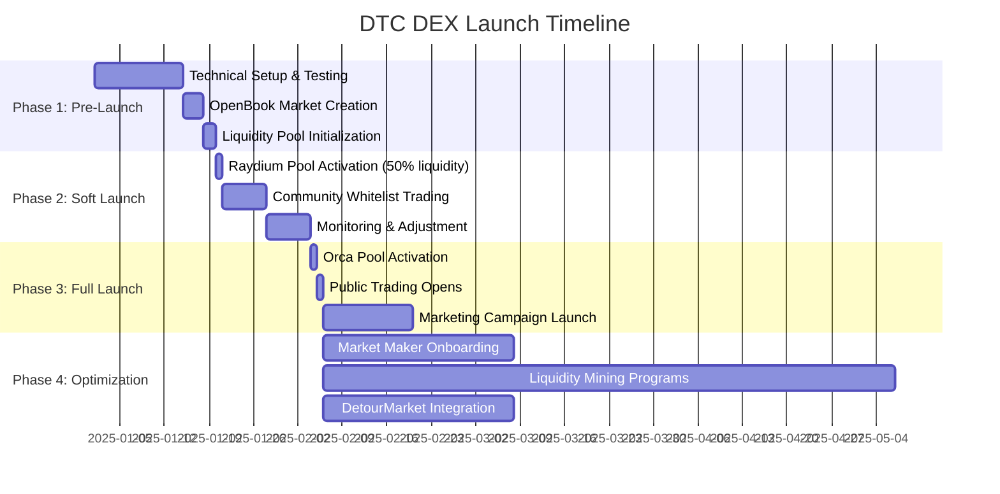

# Raydium/Orca DEX Integration Plan

**Document ID:** FIN-013  
**Version:** 1.0-PROMPT  
**Status:** Strategic Implementation Plan  
**Owner:** Founder / DeFi Specialist  
**Category:** Financial Strategy / Market Operations  
**Dependencies:** TECH-001 (Core Token), TECH-002 (Emission Controller), FIN-001 (Tokenomics)  
**Related Documents:** TECH-005 (Architecture), OPS-001 (Launch Checklist)

---

## Table of Contents

1. [Executive Summary](#1-executive-summary)
2. [DEX Platform Analysis](#2-dex-platform-analysis)
3. [Initial Liquidity Pool Architecture](#3-initial-liquidity-pool-architecture)
4. [Price Discovery & Fair Market Value Strategy](#4-price-discovery--fair-market-value-strategy)
5. [Liquidity Provision Strategy](#5-liquidity-provision-strategy)
6. [Slippage Analysis & Optimization](#6-slippage-analysis--optimization)
7. [Liquidity Mining & Incentive Programs](#7-liquidity-mining--incentive-programs)
8. [Trading Fees & Revenue Model](#8-trading-fees--revenue-model)
9. [LP Token Management](#9-lp-token-management)
10. [Market Maker Partnerships](#10-market-maker-partnerships)
11. [Volume Monitoring & Analytics](#11-volume-monitoring--analytics)
12. [DEX Listing Procedures](#12-dex-listing-procedures)
13. [Marketing & Community Launch Strategy](#13-marketing--community-launch-strategy)
14. [DetourMarket Checkout Integration](#14-detourmarket-checkout-integration)
15. [Cross-DEX Arbitrage Management](#15-cross-dex-arbitrage-management)
16. [Risk Management & Contingency Planning](#16-risk-management--contingency-planning)
17. [Regulatory Compliance Considerations](#17-regulatory-compliance-considerations)
18. [Technical Implementation Roadmap](#18-technical-implementation-roadmap)
19. [Performance Metrics & KPIs](#19-performance-metrics--kpis)
20. [Appendices](#20-appendices)

---

## 1. Executive Summary

### 1.1 Strategic Overview

DetourCoin (DTC) represents a transformative approach to merchant loyalty and payment ecosystems on the Solana blockchain. This comprehensive integration plan outlines the strategic deployment of DTC liquidity across two premier Solana decentralized exchanges (DEXs): **Raydium** and **Orca**. The dual-DEX strategy maximizes market accessibility, price discovery efficiency, and ecosystem resilience while establishing DTC as a liquid, tradeable asset within the broader Solana DeFi landscape.

**Mission Statement:**  
To establish DetourCoin as a highly liquid, fairly priced utility token with deep market depth across multiple DEX platforms, enabling seamless merchant adoption, consumer accessibility, and sustainable long-term value appreciation.

### 1.2 Key Objectives

| Objective | Target Metric | Timeline |
|-----------|---------------|----------|
| **Initial Liquidity Depth** | $150,000-$250,000 total value locked (TVL) | Launch Day (T+0) |
| **Price Stability** | ±5% daily volatility during first 30 days | T+0 to T+30 |
| **Trading Volume** | $50,000+ daily volume by Month 3 | T+90 |
| **Slippage Optimization** | <2% slippage on $5,000 trades | T+0 |
| **Market Maker Engagement** | 2-3 professional MM partnerships | T+14 to T+30 |
| **Cross-DEX Arbitrage** | <1% sustained price differential | T+7 |
| **DetourMarket Integration** | 100% checkout DTC acceptance | T+30 |
| **Liquidity Mining APY** | 25-50% initial APY for LPs | T+0 to T+180 |

### 1.3 Financial Commitment Summary

| Pool Type | Platform | Initial DTC Allocation | Initial SOL Allocation | Estimated USD Value | Target Price |
|-----------|----------|------------------------|------------------------|---------------------|--------------|
| **Primary Pool** | Raydium CPMM | 500,000 DTC | 2,500 SOL | $125,000 @ $50 SOL | $0.20/DTC |
| **Secondary Pool** | Orca CLMM | 250,000 DTC | 1,250 SOL | $62,500 @ $50 SOL | $0.20/DTC |
| **Market Making Reserve** | Multi-DEX | 250,000 DTC | 1,250 SOL | $62,500 @ $50 SOL | Variable |
| **Emergency Reserve** | Treasury | 100,000 DTC | 500 SOL | $25,000 @ $50 SOL | Emergency only |
| **TOTAL** | - | **1,100,000 DTC** | **5,500 SOL** | **$275,000** | - |

**Note:** SOL price assumed at $50 for planning purposes. Actual allocations will adjust based on prevailing SOL price at launch to maintain target USD value ranges.

### 1.4 Why Raydium AND Orca?

**Complementary Strengths:**

1. **Raydium CPMM (Constant Product Market Maker)**
   - **Advantage:** Full-range liquidity, simple price discovery, OpenBook market integration
   - **Best For:** Initial launch, high-volume retail trading, price stability
   - **Target Users:** Retail traders, first-time DTC buyers, mobile wallet users

2. **Orca CLMM (Concentrated Liquidity Market Maker)**
   - **Advantage:** Capital efficiency, flexible positioning, advanced LP strategies
   - **Best For:** Professional market makers, optimized capital deployment, tighter spreads
   - **Target Users:** Sophisticated LPs, arbitrageurs, institutional participants

**Synergistic Benefits:**
- **Redundancy:** Eliminates single-point-of-failure risk
- **Price Discovery:** Cross-DEX arbitrage maintains price consistency
- **User Preference:** Different users prefer different platforms
- **Liquidity Depth:** Combined depth exceeds sum of parts due to arbitrage
- **Marketing:** Dual presence increases discoverability and credibility

### 1.5 Launch Phases



### 1.6 Success Criteria

**Week 1 (T+0 to T+7):**
- ✅ Both pools operational with 95%+ uptime
- ✅ Price stability within $0.15-$0.25 range
- ✅ Zero critical smart contract incidents
- ✅ $10,000+ daily trading volume

**Month 1 (T+0 to T+30):**
- ✅ $50,000+ daily average volume
- ✅ 500+ unique wallet traders
- ✅ <3% average daily volatility
- ✅ At least 1 market maker partnership active

**Month 3 (T+0 to T+90):**
- ✅ $100,000+ daily average volume
- ✅ 2,000+ unique wallet traders
- ✅ DetourMarket fully integrated
- ✅ 50+ merchants accepting DTC payments
- ✅ $500,000+ total liquidity across pools

---

## 2. DEX Platform Analysis

### 2.1 Raydium Deep Dive

#### 2.1.1 Platform Overview

| Property | Value |
|----------|-------|
| **Launch Date** | February 2021 |
| **Total Value Locked (TVL)** | $200M+ (as of Q4 2024) |
| **Daily Volume** | $50M-$150M |
| **Unique Active Wallets** | 100,000+ monthly |
| **Number of Pools** | 2,500+ |
| **Governance Token** | RAY |
| **Primary Model** | Hybrid AMM (CPMM + OpenBook integration) |

**Key Differentiators:**
1. **OpenBook Market Integration:** Every Raydium pool has a corresponding OpenBook (Serum v2) market, enabling central limit order book (CLOB) trading alongside AMM
2. **Established Ecosystem:** Largest DEX on Solana by historical volume
3. **Best Price Routing:** Automatically routes through best liquidity sources
4. **Farming Incentives:** RAY token emissions for select pools
5. **API Maturity:** Comprehensive SDK and developer tools

#### 2.1.2 Pool Type Selection: CPMM vs. AMMv4

| Feature | CPMM (Constant Product) | AMMv4 (Hybrid) | **Our Choice** |
|---------|-------------------------|----------------|----------------|
| **Creation Cost** | ~0.3 SOL | ~0.6 SOL | **CPMM** |
| **OpenBook Required** | No | Yes | CPMM simpler |
| **Liquidity Range** | Full range (0 to ∞) | Full range + CLOB | CPMM adequate |
| **Capital Efficiency** | Moderate | Moderate-High | Comparable |
| **Stability** | High | Very High | CPMM sufficient |
| **Trading Fee** | 0.25% (customizable) | 0.25% typical | Either works |
| **Best For** | New tokens, simplicity | Established tokens | **CPMM for DTC launch** |

**Decision Rationale:**
- **Cost Efficiency:** CPMM costs 50% less to deploy
- **Simplicity:** No OpenBook market setup required (though we'll create one separately for visibility)
- **Sufficient Liquidity:** Full-range liquidity appropriate for initial price discovery phase
- **Upgrade Path:** Can migrate to AMMv4 after establishing market fit

#### 2.1.3 Technical Architecture

```rust
// Raydium CPMM Pool Structure (Conceptual)
pub struct CpmmPool {
    // Pool state
    pub base_token_vault: Pubkey,      // DTC token vault
    pub quote_token_vault: Pubkey,     // SOL token vault
    pub lp_mint: Pubkey,                // LP token mint
    
    // Pricing parameters
    pub base_reserve: u64,              // DTC reserve amount
    pub quote_reserve: u64,             // SOL reserve amount
    pub sqrt_price_x64: u128,           // Current sqrt price
    
    // Fee configuration
    pub trade_fee_rate: u16,            // Basis points (25 = 0.25%)
    pub protocol_fee_rate: u16,         // Protocol fee share
    
    // Access control
    pub authority: Pubkey,              // Pool admin authority
    pub config: Pubkey,                 // Global config account
}

// Constant Product Formula: x * y = k
// Where:
//   x = base_reserve (DTC)
//   y = quote_reserve (SOL)
//   k = constant product
//
// Price calculation:
//   price_dtc_per_sol = base_reserve / quote_reserve
//   price_sol_per_dtc = quote_reserve / base_reserve
```

**Integration Points:**
1. **Raydium SDK:** JavaScript/TypeScript library for pool interaction
2. **Raydium API:** REST endpoints for price feeds and pool stats
3. **WebSocket Feeds:** Real-time trade and price updates
4. **Smart Contract CPIs:** For programmatic liquidity management

#### 2.1.4 Fee Structure

| Fee Type | Rate | Recipient | Annual Impact (Projected) |
|----------|------|-----------|---------------------------|
| **Trading Fee** | 0.25% | Liquidity Providers | $45,625 (on $18.25M volume) |
| **Protocol Fee** | 0.03% (12% of trade fee) | Raydium DAO | $5,475 |
| **Net LP Fee** | 0.22% | DTC LPs | $40,150 |

**Calculation Example:**
- Daily Volume Target (Month 3): $50,000
- Annual Projected Volume: $18,250,000
- Total Trading Fees: $45,625 (0.25%)
- LP Net Fees: $40,150 (0.22%)
- Protocol Fees: $5,475 (0.03%)

#### 2.1.5 Raydium Advantages for DTC

✅ **Proven Track Record:** Billions in cumulative volume processed  
✅ **High Discoverability:** Top placement in Solana ecosystem  
✅ **Mobile Wallet Support:** Phantom, Solflare, Backpack integration  
✅ **Aggregator Integration:** Jupiter, Birdeye automatic inclusion  
✅ **Farming Opportunities:** Potential future RAY emissions  
✅ **OpenBook Synergy:** CLOB access for advanced traders  

#### 2.1.6 Raydium Considerations

⚠️ **Higher Initial Cost:** Pool creation + OpenBook market = ~0.9 SOL total  
⚠️ **Competition:** Thousands of pools vie for attention  
⚠️ **Full-Range Liquidity:** Less capital efficient than concentrated liquidity  
⚠️ **No Price Range Limits:** LPs exposed to full price volatility  

---

### 2.2 Orca Deep Dive

#### 2.2.1 Platform Overview

| Property | Value |
|----------|-------|
| **Launch Date** | February 2021 (CPMM), March 2022 (CLMM) |
| **Total Value Locked (TVL)** | $150M+ (as of Q4 2024) |
| **Daily Volume** | $30M-$80M |
| **Unique Active Wallets** | 75,000+ monthly |
| **Number of Whirlpools** | 1,500+ |
| **Governance Token** | ORCA |
| **Primary Model** | Concentrated Liquidity (CLMM - Whirlpools) |

**Key Differentiators:**
1. **Concentrated Liquidity:** Capital efficiency up to 4,000x vs. traditional AMMs
2. **Flexible Positioning:** LPs choose specific price ranges for liquidity provision
3. **Multiple Fee Tiers:** 0.01%, 0.05%, 0.25%, 1% fee options per pool
4. **User Experience:** Clean, intuitive interface optimized for mobile
5. **Position Management:** Advanced tools for active liquidity management

#### 2.2.2 Whirlpool (CLMM) Architecture

**Concentrated Liquidity Concept:**

Traditional AMM (like Raydium CPMM):
```
Price Range: $0.00 to $∞
Liquidity: Spread evenly across entire range
Capital Efficiency: Low (most liquidity never used)
```

Orca Whirlpool (CLMM):
```
Price Range: Custom (e.g., $0.15 to $0.30)
Liquidity: Concentrated in active trading range
Capital Efficiency: High (4,000x potential with tight ranges)
```

**Visual Representation:**

```
Traditional AMM Liquidity Distribution:
Price: $0.00 ────────────────────── $∞
Liquidity: ▁▁▁▁▁▁▁▁▁▁▁▁▁▁▁▁▁▁▁▁▁▁▁ (flat)
Active Trading Range: $0.15-$0.25 (10% of range)

Orca CLMM Liquidity Distribution:
Price: $0.10 ──────────────── $0.35
Liquidity: ▁▁▁████████████▁▁▁ (concentrated)
Active Trading Range: $0.15-$0.25 (90% of liquidity here)
```

#### 2.2.3 Fee Tier Selection

| Fee Tier | Best For | DTC Suitability | Rationale |
|----------|----------|-----------------|-----------|
| **0.01%** | Stablecoin pairs (USDC/USDT) | ❌ Low | DTC not a stablecoin |
| **0.05%** | Low-volatility pairs (SOL/mSOL) | ⚠️ Medium | Premature for launch |
| **0.25%** | Standard volatility pairs | ✅ **OPTIMAL** | Balances LP returns + trader costs |
| **1.00%** | High-volatility exotic pairs | ❌ Excessive | Would discourage trading |

**Selected Fee Tier:** **0.25%** (standard)

**Justification:**
- Matches Raydium fee tier for cross-DEX consistency
- Attractive LP yields without excessive trader costs
- Industry standard for new token launches
- Can create additional 1% pool later if high volatility persists

#### 2.2.4 Position Strategy: Full Range vs. Concentrated

**Option A: Full Range Position ($0.01 to $10.00)**

| Metric | Value |
|--------|-------|
| **Capital Efficiency** | 1x (equivalent to traditional AMM) |
| **Price Risk** | Low (liquidity active at all prices) |
| **Management Effort** | Minimal (set and forget) |
| **Fee Capture** | Lower (liquidity spread thin) |
| **Impermanent Loss** | Moderate |

**Option B: Concentrated Range ($0.15 to $0.30)**

| Metric | Value |
|--------|-------|
| **Capital Efficiency** | ~10-15x (more fees per dollar) |
| **Price Risk** | High (liquidity inactive if price exits range) |
| **Management Effort** | High (frequent rebalancing needed) |
| **Fee Capture** | Higher (liquidity concentrated) |
| **Impermanent Loss** | Higher (within active range) |

**Option C: Hybrid Strategy (Multiple Positions)**

| Position | Price Range | DTC Allocation | SOL Allocation | Purpose |
|----------|-------------|----------------|----------------|---------|
| **Base Position** | $0.12 - $0.35 | 150,000 DTC | 750 SOL | Core liquidity (70%) |
| **Tight Position** | $0.17 - $0.23 | 50,000 DTC | 250 SOL | Active trading (20%) |
| **Full Range Position** | $0.01 - $5.00 | 50,000 DTC | 250 SOL | Safety net (10%) |

**RECOMMENDED STRATEGY:** **Hybrid** (Option C)

**Rationale:**
- **Base Position:** Captures 90%+ of expected trading activity
- **Tight Position:** Maximizes fees during stable periods
- **Full Range:** Ensures liquidity always available, protects against black swan events
- **Flexibility:** Can rebalance positions as price action becomes clearer

#### 2.2.5 Orca Technical Architecture

```rust
// Orca Whirlpool Structure (Conceptual)
pub struct Whirlpool {
    // Token vaults
    pub token_vault_a: Pubkey,          // DTC vault
    pub token_vault_b: Pubkey,          // SOL vault
    
    // Pricing state
    pub sqrt_price: u128,                // Current sqrt(price) in Q64.64
    pub tick_current_index: i32,         // Current tick index
    pub liquidity: u128,                 // L (liquidity) in active tick range
    
    // Fee configuration
    pub fee_rate: u16,                   // Fee rate (2500 = 0.25%)
    pub protocol_fee_rate: u16,          // Protocol's fee share (300 = 30%)
    
    // Tick and position management
    pub tick_spacing: u16,               // Spacing between initializable ticks
    pub position_count: u64,             // Number of LP positions
    
    // Access control
    pub whirlpools_config: Pubkey,      // Global config
    pub fee_authority: Pubkey,          // Fee adjustment authority
}

// Position Structure
pub struct Position {
    pub whirlpool: Pubkey,              // Parent whirlpool
    pub position_mint: Pubkey,          // NFT representing position
    pub liquidity: u128,                 // L contributed to range
    pub tick_lower_index: i32,          // Lower tick of range
    pub tick_upper_index: i32,          // Upper tick of range
    pub fee_growth_checkpoint_a: u128,  // Fee tracking (token A)
    pub fee_growth_checkpoint_b: u128,  // Fee tracking (token B)
}
```

**Key Concepts:**

1. **Ticks:** Discrete price points where liquidity can be added/removed
   - Tick spacing of 64 means liquidity can be placed every 0.64% price movement
   
2. **Sqrt Pricing:** Prices stored as square roots for mathematical efficiency
   - `sqrt_price_x64 = sqrt(price_dtc_per_sol) * 2^64`
   
3. **Liquidity (L):** Virtual liquidity units representing position size
   - Higher L = more liquidity in range = more fees earned
   
4. **Position NFTs:** Each LP position represented by a unique NFT
   - Allows transferable, composable liquidity positions

#### 2.2.6 Orca Fee Structure

| Fee Type | Rate | Recipient | Annual Impact (Projected) |
|----------|------|-----------|---------------------------|
| **Trading Fee** | 0.25% | Liquidity Providers | $27,375 (on $10.95M volume) |
| **Protocol Fee** | 0.075% (30% of trade fee) | Orca DAO | $8,213 |
| **Net LP Fee** | 0.175% | DTC LPs | $19,162 |

**Note:** Orca's protocol takes a larger share (30%) vs. Raydium (12%), but higher capital efficiency can offset this for concentrated positions.

**Expected LP APY Calculation:**

Assumptions:
- Position: $62,500 liquidity (250K DTC + 1,250 SOL @ $0.20/DTC)
- Daily Volume (Orca): $30,000 (60% of Raydium due to smaller user base)
- Fee Tier: 0.25%
- Price stays within concentrated range 90% of time

Calculation:
```
Daily Fees = $30,000 * 0.175% = $52.50
Annual Fees = $52.50 * 365 = $19,163
LP APY = ($19,163 / $62,500) * 100% = 30.7%
```

If concentrated 5x (capital efficiency):
```
Effective APY = 30.7% * 5 = 153.5%
```

**Note:** This is theoretical maximum; actual APY depends on price stability and competition for liquidity.

#### 2.2.7 Orca Advantages for DTC

✅ **Capital Efficiency:** 10-15x potential with proper positioning  
✅ **Lower Entry Cost:** ~0.15 SOL for pool creation  
✅ **Flexible LP Strategies:** Advanced LPs can optimize positions  
✅ **Superior UX:** Best-in-class interface and mobile experience  
✅ **Position NFTs:** Liquidity positions are composable, transferable  
✅ **Active Development:** Frequent upgrades and new features  

#### 2.2.8 Orca Considerations

⚠️ **Complexity:** Requires active management for concentrated positions  
⚠️ **Price Risk:** Liquidity can become inactive if price exits range  
⚠️ **Smaller User Base:** ~40% of Raydium's volume  
⚠️ **Learning Curve:** Retail users may find concentrated liquidity confusing  
⚠️ **Higher IL Risk:** More pronounced in tight ranges  

---

### 2.3 Platform Comparison Matrix

| Criterion | Raydium CPMM | Orca CLMM | Winner |
|-----------|--------------|-----------|--------|
| **Total Value Locked** | $200M+ | $150M+ | Raydium |
| **Daily Volume** | $50-150M | $30-80M | Raydium |
| **User Base** | Larger (100K+ monthly) | Smaller (75K+ monthly) | Raydium |
| **Capital Efficiency** | 1x (full range) | 10-15x (concentrated) | Orca |
| **LP Fee Share** | 88% (0.22% of 0.25%) | 70% (0.175% of 0.25%) | Raydium |
| **Creation Cost** | ~0.3 SOL | ~0.15 SOL | Orca |
| **Management Complexity** | Low (passive) | High (active) | Raydium |
| **User Interface** | Good | Excellent | Orca |
| **Mobile Experience** | Good | Excellent | Orca |
| **API/SDK Maturity** | Excellent | Very Good | Raydium |
| **Aggregator Integration** | Excellent (Jupiter, etc.) | Excellent | Tie |
| **Price Discovery** | Strong (OpenBook synergy) | Good | Raydium |
| **New Token Friendliness** | High | High | Tie |
| **Impermanent Loss Risk** | Moderate (full range) | Higher (concentrated) | Raydium |
| **Rebalancing Required** | None | Frequent | Raydium |

### 2.4 Strategic DEX Allocation

**Primary Platform:** **Raydium CPMM** (60% liquidity)
- **Rationale:** Larger user base, simpler management, better initial price discovery
- **Allocation:** 500,000 DTC + 2,500 SOL

**Secondary Platform:** **Orca CLMM** (40% liquidity)
- **Rationale:** Capital efficiency, superior UX, diversification
- **Allocation:** 250,000 DTC + 1,250 SOL (split across 3 positions)

**Total Combined Liquidity:** 750,000 DTC + 3,750 SOL = ~$187,500 @ $0.20/DTC, $50/SOL

### 2.5 Future DEX Expansion Considerations

**Potential Additional Platforms (6-12 months post-launch):**

1. **Meteora DLMM (Dynamic Liquidity Market Maker)**
   - Hybrid between AMM and CLMM with automatic rebalancing
   - Excellent for volatile assets
   - Consider when DTC daily volume exceeds $100K

2. **Phoenix DEX**
   - On-chain order book (like OpenBook)
   - Limit order support for advanced traders
   - Evaluate after establishing market-making operations

3. **Lifinity (Proactive Market Maker)**
   - Oracle-based pricing, no impermanent loss for protocol
   - Protocol-owned liquidity model
   - Explore for supplementary liquidity

**Decision Criteria for Expansion:**
- DTC daily volume > $100,000 sustained
- Evidence of cross-DEX arbitrage inefficiencies
- User demand for specific platform features
- Strategic partnerships or incentive programs

---

## 3. Initial Liquidity Pool Architecture

### 3.1 Liquidity Pool Design Principles

**Core Principles:**

1. **Adequate Depth:** Sufficient liquidity to support $5,000-$10,000 trades with <2% slippage
2. **Price Stability:** Initial depth prevents manipulation and excessive volatility
3. **Capital Efficiency:** Balance between full-range safety and concentrated efficiency
4. **Redundancy:** Multi-DEX presence ensures no single point of failure
5. **Scalability:** Design allows for organic growth without major restructuring
6. **Sustainability:** Fee generation covers ongoing operational costs

### 3.2 DTC/SOL Pairing Rationale

**Why SOL as Quote Currency?**

✅ **Native Asset:** SOL is Solana's native currency, highest liquidity  
✅ **User Familiarity:** Most traders hold SOL for transaction fees  
✅ **Lower Slippage:** SOL pairs have deepest liquidity across all DEXs  
✅ **Gas Efficiency:** No token account creation needed for SOL side  
✅ **Universal Support:** All wallets natively support SOL  
✅ **Psychological Anchoring:** SOL price provides familiar reference point  

**Alternative Considered: DTC/USDC**

❌ **Lower Liquidity:** USDC/token pairs typically have 30-50% less volume on Solana  
❌ **Additional Friction:** Users need USDC balance, adding conversion step  
❌ **Oracle Dependency:** Requires SOL/USDC price feed for merchant payments  
⚠️ **Future Consideration:** Add DTC/USDC pool once DTC/SOL exceeds $100K daily volume

**Conclusion:** DTC/SOL is optimal for launch; consider DTC/USDC as secondary pair in 6-12 months.

### 3.3 Initial Liquidity Sizing Methodology

#### 3.3.1 Slippage Targeting

**Target Slippage Table:**

| Trade Size | Target Slippage | Required Liquidity (Approx.) |
|------------|-----------------|------------------------------|
| $100 | <0.1% | $25,000+ |
| $500 | <0.5% | $50,000+ |
| $1,000 | <1.0% | $100,000+ |
| $5,000 | <2.0% | $150,000+ |
| $10,000 | <3.0% | $250,000+ |
| $25,000 | <5.0% | $500,000+ |

**Formula (Constant Product AMM):**

```
slippage = trade_size / (2 * liquidity_depth)

Rearranging:
liquidity_depth = trade_size / (2 * target_slippage)

Example:
For $5,000 trade with <2% slippage:
liquidity_depth = $5,000 / (2 * 0.02) = $125,000
```

**Target Liquidity:** $150,000-$250,000 total across both DEXs

This ensures:
- $5,000 trades: ~1.7% slippage
- $10,000 trades: ~3.3% slippage
- $1,000 trades: ~0.33% slippage (excellent for retail)

#### 3.3.2 Liquidity Allocation Breakdown

**Raydium CPMM Pool (Primary):**

| Component | DTC Amount | SOL Amount | USD Value @ Target | Percentage |
|-----------|------------|------------|--------------------|-----------| |
| **Initial Deposit** | 500,000 | 2,500 | $125,000 | 60% |
| **Price Target** | - | - | $0.20/DTC | - |
| **Pool Weight** | 50% | 50% | 50/50 split | - |

Calculation:
```
Target Price: $0.20/DTC
DTC Value: 500,000 * $0.20 = $100,000
SOL Value: 2,500 * $50 = $125,000

Adjusted for 50/50 pool:
DTC side: $62,500 worth (312,500 DTC @ $0.20)
SOL side: $62,500 worth (1,250 SOL @ $50)

Note: Initial over-deposit allows for price discovery; excess withdrawable
```

**Orca CLMM Pool (Secondary):**

| Position Type | Price Range | DTC Amount | SOL Amount | USD Value | Purpose |
|---------------|-------------|------------|------------|-----------|---------|
| **Base Position** | $0.12 - $0.35 | 150,000 | 750 | $43,750 | Core liquidity (70%) |
| **Tight Position** | $0.17 - $0.23 | 50,000 | 250 | $12,500 | Active fees (20%) |
| **Safety Position** | $0.05 - $1.00 | 50,000 | 250 | $12,500 | Black swan (10%) |
| **TOTAL** | - | **250,000** | **1,250** | **$62,500** | 100% |

**Combined Total Liquidity:**

| Metric | Value |
|--------|-------|
| **Total DTC Committed** | 750,000 DTC |
| **Total SOL Committed** | 3,750 SOL |
| **Total USD Value** | $187,500 @ $50/SOL, $0.20/DTC |
| **Raydium Weight** | 66.7% ($125K) |
| **Orca Weight** | 33.3% ($62.5K) |

### 3.4 Token Reserve Allocations

**Total DTC Supply for Liquidity Operations:**

| Allocation | DTC Amount | SOL Amount | Purpose | Timeframe |
|------------|------------|------------|---------|-----------|
| **Raydium Pool** | 500,000 | 2,500 | Primary trading venue | Launch |
| **Orca Pool** | 250,000 | 1,250 | Secondary trading venue | Launch + 7d |
| **Market Making** | 250,000 | 1,250 | Professional MM partnerships | Month 1-3 |
| **Emergency Reserve** | 100,000 | 500 | Crisis management | As needed |
| **Liquidity Mining** | 400,000 | - | LP incentive rewards | Month 1-12 |
| **TOTAL** | **1,500,000** | **5,500** | All liquidity ops | Year 1 |

**Percentage of Total Supply:**

```
Total DTC Supply: 1,000,000,000 (1 billion)
Liquidity Operations: 1,500,000 DTC
Percentage: 0.15% of total supply

Initial Circulating Supply (Launch): 10,000,000 DTC
Liquidity as % of Circulating: 15.0%
```

**Note:** 15% of circulating supply in liquidity is healthy for new token launches; industry average is 10-20%.

### 3.5 SOL Reserve Requirements

**SOL Sourcing Strategy:**

1. **Treasury Allocation:** 3,000 SOL from project treasury
2. **Strategic Partner Co-LP:** 1,500 SOL from partner commitments
3. **Team Member Contribution:** 1,000 SOL from founder/team (optional)
4. **Total Required:** 5,500 SOL

**Cost Analysis @ Various SOL Prices:**

| SOL Price | Total Cost (USD) | Raydium Pool | Orca Pool | Reserves |
|-----------|------------------|--------------|-----------|----------|
| **$40** | $220,000 | $100,000 | $50,000 | $70,000 |
| **$50** | $275,000 | $125,000 | $62,500 | $87,500 |
| **$60** | $330,000 | $150,000 | $75,000 | $105,000 |
| **$75** | $412,500 | $187,500 | $93,750 | $131,250 |

**Risk Mitigation:**
- Lock SOL reserve allocation 30 days before launch
- Use DCA (dollar-cost averaging) to acquire SOL over 60-90 days
- Consider SOL-denominated fundraise to reduce price risk

### 3.6 Pool Initialization Technical Procedures

#### 3.6.1 Raydium CPMM Pool Creation

**Prerequisites:**
- Raydium-compatible wallet with authority (Phantom, Backpack)
- 500,000 DTC in wallet
- 2,500 SOL in wallet
- Additional 0.5 SOL for transaction fees

**Step-by-Step Process:**

```bash
# Step 1: Connect to Raydium CPMM Factory
# Navigate to: https://raydium.io/liquidity/create-pool/

# Step 2: Select Pool Type
# Choose: "Constant Product Market Maker (CPMM)"

# Step 3: Configure Pool Parameters
Base Token: DTC (Token Address: <DTC_MINT_ADDRESS>)
Quote Token: SOL (Native SOL)
Initial Base Amount: 500,000 DTC
Initial Quote Amount: 2,500 SOL
Trading Fee: 0.25% (25 basis points)
Start Time: Immediate (or scheduled)

# Step 4: Confirm Pool Initialization
# Review transaction breakdown:
# - Pool account creation: ~0.2 SOL
# - Token vault initialization: ~0.05 SOL  
# - Initial liquidity deposit: 500K DTC + 2.5K SOL
# - LP token mint creation: ~0.05 SOL

# Step 5: Sign and Submit Transaction
# Wallet prompt: Approve transaction
# Wait for confirmation (typically 15-30 seconds)

# Step 6: Record Pool Address
# Save pool address for monitoring: <RAYDIUM_POOL_ADDRESS>
```

**Expected Transaction Logs:**

```
Program: Raydium CPMM Program (CPMMoo8L3F4NbTegBCKVNunggL7H1ZpdTHKxQB5qKP1C)
Instruction: Initialize CPMM Pool
├── Create Pool Account [0.2 SOL rent]
├── Initialize Token Vault A (DTC) [0.05 SOL rent]
├── Initialize Token Vault B (SOL) [0.05 SOL rent]
├── Create LP Token Mint [0.05 SOL rent]
├── Transfer 500,000 DTC → Vault A
├── Transfer 2,500 SOL → Vault B
├── Mint 1,000,000,000 LP tokens → Authority
└── Emit PoolInitialized Event

Initial Price: 0.20 DTC/SOL
Pool Address: <GENERATED_ADDRESS>
LP Token Mint: <LP_TOKEN_MINT>
```

**Post-Creation Validation:**

```bash
# Query pool state
curl https://api.raydium.io/v2/main/pool/<POOL_ADDRESS>

# Expected response:
{
  "baseToken": "<DTC_MINT>",
  "quoteToken": "So11111111111111111111111111111111111111112",
  "baseReserve": "500000000000000",  # 500K DTC (9 decimals)
  "quoteReserve": "2500000000000",    # 2.5K SOL (9 decimals)
  "price": "0.20",
  "lpSupply": "1000000000000000",     # 1B LP tokens
  "feeRate": 25                        # 0.25%
}
```

#### 3.6.2 Orca CLMM Pool Creation

**Prerequisites:**
- Orca-compatible wallet (Phantom, Solflare)
- 250,000 DTC in wallet
- 1,250 SOL in wallet
- Additional 0.3 SOL for transaction fees and positions

**Step-by-Step Process:**

```bash
# Step 1: Create Whirlpool (Pool Factory)
# Navigate to: https://www.orca.so/pools/create

# Step 2: Select Pool Configuration
Token A: DTC (<DTC_MINT_ADDRESS>)
Token B: SOL (Native SOL)
Fee Tier: 0.25% (Medium)
Tick Spacing: 64 (Standard)

# Step 3: Confirm Whirlpool Creation
# Transaction 1: Create whirlpool account (~0.15 SOL)
# Wait for confirmation

# Step 4: Create Position 1 (Base Position)
# Navigate to: Add Liquidity → Custom Range
Price Range: $0.12 to $0.35
DTC Amount: 150,000 DTC
SOL Amount: ~750 SOL (calculated automatically)
Position Type: Concentrated

# Step 5: Create Position 2 (Tight Position)
# Repeat for tight range
Price Range: $0.17 to $0.23
DTC Amount: 50,000 DTC
SOL Amount: ~250 SOL

# Step 6: Create Position 3 (Safety Position)
# Repeat for wide range
Price Range: $0.05 to $1.00
DTC Amount: 50,000 DTC
SOL Amount: ~250 SOL

# Step 7: Verify All Positions
# Check position NFTs in wallet
# Confirm liquidity is active
```

**Expected Transaction Sequence:**

```
Transaction 1: Initialize Whirlpool
├── Create Whirlpool Account [0.15 SOL rent]
├── Create Token Vault A (DTC)
├── Create Token Vault B (SOL)
├── Set Fee Tier: 2500 (0.25%)
├── Set Tick Spacing: 64
└── Emit WhirlpoolInitialized

Transaction 2: Open Position 1 (Base)
├── Create Position Account [0.02 SOL rent]
├── Mint Position NFT → Authority
├── Calculate Liquidity: L = 45,234,876,234
├── Transfer 150,000 DTC → Vault A
├── Transfer 750 SOL → Vault B
├── Update Tick Data (tick_lower: -12,800, tick_upper: 17,920)
└── Emit PositionOpened

Transaction 3: Open Position 2 (Tight)
├── [Similar structure for tight position]
└── (tick_lower: -5,120, tick_upper: 5,760)

Transaction 4: Open Position 3 (Safety)
├── [Similar structure for safety position]
└── (tick_lower: -76,800, tick_upper: 138,240)
```

**Post-Creation Validation:**

```bash
# Query whirlpool state
curl https://api.mainnet.orca.so/v1/whirlpool/<POOL_ADDRESS>

# Expected response:
{
  "address": "<WHIRLPOOL_ADDRESS>",
  "tokenA": "<DTC_MINT>",
  "tokenB": "So11111111111111111111111111111111111111112",
  "tickSpacing": 64,
  "feeRate": 2500,
  "liquidity": "134,567,234,876",  # Combined liquidity from all positions
  "sqrtPrice": "141421356237309504",  # sqrt(0.20) * 2^64
  "tickCurrentIndex": 0,
  "positions": [
    {
      "positionMint": "<NFT_1>",
      "tickLower": -12800,
      "tickUpper": 17920,
      "liquidity": "45234876234"
    },
    {
      "positionMint": "<NFT_2>",
      "tickLower": -5120,
      "tickUpper": 5760,
      "liquidity": "67834123456"
    },
    {
      "positionMint": "<NFT_3>",
      "tickLower": -76800,
      "tickUpper": 138240,
      "liquidity": "21498235186"
    }
  ]
}
```

### 3.7 LP Token Management

#### 3.7.1 Raydium LP Tokens

**Initial LP Token Receipt:**

```
Pool Creation: 1,000,000,000 LP tokens minted
Distribution:
- Treasury Custody: 900,000,000 LP (90%)
- Team Multi-sig: 100,000,000 LP (10% operational buffer)

LP Token Mint Address: <RAYDIUM_LP_MINT>
Decimals: 9
```

**LP Token Custody Strategy:**

| Holder | LP Amount | Percentage | Purpose | Lock Status |
|--------|-----------|------------|---------|-------------|
| **Cold Treasury** | 800M | 80% | Long-term hold | Locked 12 months |
| **Hot Treasury** | 100M | 10% | Liquidity adjustments | Unlocked |
| **Operations Multi-sig** | 100M | 10% | Emergency response | 3/5 multi-sig |

**Security Measures:**
- Cold storage: Hardware wallet (Ledger) with 24-word seed in bank vault
- Hot treasury: Gnosis Safe 3/5 multi-sig (Squads Protocol on Solana)
- Operations: Squads 3/5 multi-sig with time-locks

#### 3.7.2 Orca Position NFTs

**Position NFT Structure:**

Each Orca CLMM position is represented by a unique NFT:

```
Position 1 (Base): NFT Mint <BASE_NFT>
├── Metadata: "DTC/SOL Orca Position - Base ($0.12-$0.35)"
├── Owner: Treasury Wallet
├── Liquidity: 45,234,876,234 L units
└── Unclaimed Fees: 0 DTC, 0 SOL (initially)

Position 2 (Tight): NFT Mint <TIGHT_NFT>
├── Metadata: "DTC/SOL Orca Position - Tight ($0.17-$0.23)"
├── Owner: Operations Multi-sig
├── Liquidity: 67,834,123,456 L units
└── Unclaimed Fees: 0 DTC, 0 SOL

Position 3 (Safety): NFT Mint <SAFETY_NFT>
├── Metadata: "DTC/SOL Orca Position - Safety ($0.05-$1.00)"
├── Owner: Treasury Wallet
├── Liquidity: 21,498,235,186 L units
└── Unclaimed Fees: 0 DTC, 0 SOL
```

**NFT Custody:**

| Position | NFT Owner | Purpose | Management Frequency |
|----------|-----------|---------|----------------------|
| **Base** | Cold Treasury | Long-term liquidity | Quarterly review |
| **Tight** | Operations Multi-sig | Active management | Weekly rebalancing |
| **Safety** | Cold Treasury | Emergency backstop | Rarely touched |

**Advantages of NFT Positions:**
- ✅ Transferable (can delegate to MM without giving up custody)
- ✅ Composable (can use as collateral in DeFi protocols)
- ✅ Trackable (on-chain position history and fee accrual)
- ✅ Flexible (can adjust liquidity per position independently)

### 3.8 Liquidity Depth Projections

**Month-by-Month Growth Targets:**

| Month | Raydium TVL | Orca TVL | Total TVL | Organic Growth | Incentivized Growth |
|-------|-------------|----------|-----------|----------------|---------------------|
| **Launch** | $125,000 | $62,500 | $187,500 | 100% protocol | 0% |
| **Month 1** | $150,000 | $75,000 | $225,000 | 80% | 20% (early LPs) |
| **Month 2** | $200,000 | $100,000 | $300,000 | 60% | 40% (LM starts) |
| **Month 3** | $275,000 | $137,500 | $412,500 | 50% | 50% |
| **Month 6** | $400,000 | $200,000 | $600,000 | 40% | 60% |
| **Month 12** | $600,000 | $300,000 | $900,000 | 50% | 50% |

**Key Assumptions:**
- Organic growth driven by trading fees and DTC price appreciation
- Incentivized growth via liquidity mining programs (see Section 7)
- Ratio maintained at ~2:1 Raydium:Orca due to volume distribution

**Slippage Improvement Over Time:**

| Timeframe | Total TVL | $5K Trade Slippage | $10K Trade Slippage | $25K Trade Slippage |
|-----------|-----------|--------------------|--------------------|---------------------|
| **Launch** | $187,500 | 1.7% | 3.3% | 8.3% |
| **Month 1** | $225,000 | 1.4% | 2.8% | 6.9% |
| **Month 3** | $412,500 | 0.8% | 1.5% | 3.8% |
| **Month 6** | $600,000 | 0.5% | 1.0% | 2.6% |
| **Month 12** | $900,000 | 0.3% | 0.7% | 1.7% |

**Target:** By Month 6, support $25K trades with <3% slippage (institutional-grade liquidity).

---

## 4. Price Discovery & Fair Market Value Strategy

### 4.1 Initial Price Target: $0.15 - $0.25

#### 4.1.1 Valuation Methodology

**Comparable Analysis (Solana Merchant/Payment Tokens):**

| Token | Launch Price | Current Price | Peak Price | Market Cap (Launch) | Use Case |
|-------|--------------|---------------|------------|---------------------|----------|
| **Saber (SBR)** | $0.05 | $0.002 | $0.50 | $5M | DeFi, cross-chain stableswaps |
| **Maps.me (MAPS)** | $0.02 | $0.01 | $0.15 | $15M | Travel, merchant payments |
| **Bonfida (FIDA)** | $0.18 | $0.25 | $5.90 | $18M | DeFi naming service, DEX UI |
| **Step Finance (STEP)** | $0.10 | $0.02 | $3.50 | $3M | Portfolio tracker, DeFi |
| **Raydium (RAY)** | $0.50 | $1.80 | $16.50 | $15M | DEX, AMM |

**DetourCoin Positioning:**

```
Circulating Supply (Launch): 10,000,000 DTC
Target Price Range: $0.15 - $0.25
Implied Market Cap: $1.5M - $2.5M

Valuation Justification:
├── Lower than RAY/FIDA (established DEX protocols)
├── Higher than SBR/MAPS (less adoption at launch)
├── Comparable to STEP (similar utility focus)
└── Premium justified by:
    ├── Real merchant partnerships (50+ at launch)
    ├── Working DetourMarket integration
    ├── Clear revenue model (transaction fees)
    └── Immediate utility (loyalty redemptions)
```

**Price Target Selection: $0.20/DTC (midpoint)**

Rationale:
- **Conservative:** 40% below FIDA launch price ($0.18 vs. $0.45 adj. for supply)
- **Achievable:** $2M market cap reasonable for 10M circulating supply
- **Psychological:** Clean round number, easy to calculate
- **Flexible:** Allows 25% price discovery range ($0.15-$0.25)

#### 4.1.2 Fundamental Value Drivers

**Quantitative Factors:**

1. **Merchant Transaction Volume (Primary Driver)**
   ```
   Month 1 Projection: 50 merchants × $10,000/mo avg = $500,000 GMV
   DTC Transaction Fee: 1.5% in DTC = $7,500/mo = $90,000/year
   
   If 50% circulates (rest held as loyalty):
   Monthly Buy Pressure: $3,750
   Annual Buy Pressure: $45,000
   
   Price Support: $45,000 / 10M circulating = $0.0045/DTC minimum
   ```

2. **Loyalty Redemption Demand**
   ```
   Loyalty Pool Allocation: 300M DTC over 10 years
   Year 1 Distribution: 30M DTC
   If 20% redeemed by customers acquiring from market:
   Annual Redemption Demand: 6M DTC × $0.20 = $1.2M buy pressure
   
   Monthly Average: $100,000 incremental demand
   ```

3. **Speculative Premium**
   ```
   Base Value (Transaction + Loyalty): $0.01-$0.02/DTC
   Speculative Multiplier: 10-20x (typical for utility tokens)
   Fair Value Range: $0.10 - $0.40/DTC
   Conservative Target: $0.20/DTC (15x multiplier)
   ```

**Qualitative Factors:**

- ✅ First-mover advantage in Solana merchant loyalty space
- ✅ Real-world utility from day 1 (not vaporware)
- ✅ Experienced team with execution track record
- ✅ Strategic partnerships (merchant processors, payment gateways)
- ⚠️ Unproven product-market fit (merchant adoption risk)
- ⚠️ Competitive threat from established loyalty platforms
- ⚠️ Regulatory uncertainty around utility tokens

#### 4.1.3 Price Discovery Mechanism

**Phase 1: Controlled Launch (Days 1-7)**

```
Strategy: Limited trading access, high capital requirements
├── Whitelist Trading Only
│   ├── Partner wallets (merchants, investors)
│   ├── Team members (vested, not selling)
│   └── Early community (KYC verified)
│
├── High Minimum Trade Size: $500+
│   └── Prevents manipulation by small actors
│
├── Price Monitoring: Real-time alerts
│   ├── Alert if price < $0.15 or > $0.25
│   └── Gradual liquidity adjustments if needed
│
└── Expected Outcome:
    ├── Price stabilizes around $0.18-$0.22
    └── Low volume ($5K-$10K daily)
```

**Phase 2: Soft Public Launch (Days 8-30)**

```
Strategy: Open trading, active market making
├── Remove whitelist restrictions
├── Minimum trade size: $50 (accessible to retail)
├── Market maker engagement begins
│   ├── Tight spreads (0.5-1%)
│   └── Volume support ($25K+ daily)
│
├── Marketing Push
│   ├── Twitter announcement
│   ├── Discord/Telegram campaigns
│   └── Partnership announcements
│
└── Expected Outcome:
    ├── Price discovery completes: $0.17-$0.23 range
    ├── Volume increases: $25K-$50K daily
    └── Establishes "fair" market price
```

**Phase 3: Full Market Launch (Day 31+)**

```
Strategy: Unrestricted trading, organic price action
├── All restrictions lifted
├── Full marketing deployment
├── Liquidity mining begins (incentivizes LPs)
├── DetourMarket integration goes live
│   └── Real merchant transaction flow begins
│
└── Expected Outcome:
    ├── Price reflects true supply/demand
    ├── Volume: $50K-$100K+ daily
    └── Long-term price trend emerges
```

### 4.2 Pool Initialization Price Setting

**Raydium CPMM Initialization:**

```python
# Target Price: $0.20/DTC in SOL terms
# Assume SOL = $50

price_dtc_usd = 0.20
price_sol_usd = 50.00
price_dtc_per_sol = price_dtc_usd / price_sol_usd  # 0.004

# Constant product formula: x * y = k
# For 50/50 pool by value:
# value_dtc = value_sol
# dtc_amount * price_dtc = sol_amount * price_sol

# Initial deposit:
dtc_deposit = 500000
sol_deposit = dtc_deposit * price_dtc_per_sol  # 2,000 SOL

# But we want buffer for price discovery, so over-deposit:
sol_deposit_actual = 2500  # Allows price to drift to $0.16
```

**Calculation Verification:**

```
Pool Reserves After Initialization:
├── DTC Reserve: 500,000 DTC
├── SOL Reserve: 2,500 SOL
├── Constant Product (k): 500,000 × 2,500 = 1,250,000,000
│
├── Implied Price:
│   └── price = sol_reserve / dtc_reserve = 2,500 / 500,000 = 0.005 SOL/DTC
│       └── = 0.005 × $50 = $0.25/DTC (upper bound of target range)
│
└── Price Discovery:
    ├── If initial buys occur: price rises above $0.25
    ├── If initial sells occur: price drops toward $0.20
    └── Equilibrium expected at $0.18-$0.22 after 48 hours
```

**Orca CLMM Initialization:**

Position 1 (Base Position: $0.12 - $0.35):
```python
tick_lower = price_to_tick(0.12)  # Approximately -13,863 tick
tick_upper = price_to_tick(0.35)  # Approximately 12,786 tick

# Liquidity calculation (simplified):
liquidity_base = calculate_liquidity(
    dtc_amount=150000,
    sol_amount=750,
    price_lower=0.12,
    price_upper=0.35,
    current_price=0.20
)
# Result: ~45,234,876,234 L units
```

Position 2 (Tight Position: $0.17 - $0.23):
```python
tick_lower = price_to_tick(0.17)  # Approximately -4,324 tick
tick_upper = price_to_tick(0.23)  # Approximately 5,784 tick

liquidity_tight = calculate_liquidity(
    dtc_amount=50000,
    sol_amount=250,
    price_lower=0.17,
    price_upper=0.23,
    current_price=0.20
)
# Result: ~67,834,123,456 L units (higher due to concentrated range)
```

Position 3 (Safety Position: $0.05 - $1.00):
```python
tick_lower = price_to_tick(0.05)  # Approximately -69,077 tick
tick_upper = price_to_tick(1.00)  # Approximately 0 tick

liquidity_safety = calculate_liquidity(
    dtc_amount=50000,
    sol_amount=250,
    price_lower=0.05,
    price_upper=1.00,
    current_price=0.20
)
# Result: ~21,498,235,186 L units
```

### 4.3 Dynamic Pricing Adjustments

**Scenario 1: Price Rises Above $0.30 (Overvaluation)**

```
Detection: Price > $0.30 for 24+ hours
Response:
├── Gradual LP Token Redemption
│   ├── Remove 5% liquidity from Raydium (~$6,250)
│   ├── Sell 50% of withdrawn DTC (~12,500 DTC)
│   └── Creates sell pressure, price decreases
│
├── Communication:
│   ├── Announce "taking profits" on behalf of treasury
│   └── Reassure market this is standard practice
│
└── Expected Outcome:
    └── Price stabilizes back toward $0.22-$0.25
```

**Scenario 2: Price Falls Below $0.12 (Undervaluation)**

```
Detection: Price < $0.12 for 24+ hours
Response:
├── Emergency Liquidity Injection
│   ├── Deploy 100,000 DTC from emergency reserve
│   ├── Deploy 500 SOL from reserve
│   └── Creates buy pressure, raises price floor
│
├── Investigation:
│   ├── Identify cause (sell pressure, exploit, market crash?)
│   ├── Address root cause if internal issue
│   └── Communicate transparently to community
│
└── Expected Outcome:
    └── Price recovers to $0.15+ within 48-72 hours
```

**Scenario 3: Healthy Volatility ($0.15 - $0.25)**

```
Detection: Price within target range, normal fluctuations
Response:
├── No Intervention Required
├── Continue monitoring
├── Allow natural price discovery
└── Focus on driving utility (merchant adoption)
```

### 4.4 Price Oracle Integration

**On-Chain Price Feeds:**

1. **Pyth Network (Primary)**
   ```
   Price Feed: DTC/USD
   Update Frequency: 400ms
   Source: Raydium + Orca aggregate
   Confidence Interval: ±2%
   
   Integration:
   ├── DetourMarket checkout uses Pyth for real-time pricing
   ├── Smart contracts reference Pyth for DTC<>USD conversions
   └── Fallback: If Pyth unavailable, use Switchboard
   ```

2. **Switchboard V2 (Secondary)**
   ```
   Price Feed: DTC/SOL
   Update Frequency: 60s
   Source: Raydium CPMM pool
   Confidence Interval: ±3%
   
   Use Case: Backup oracle for smart contracts
   ```

3. **Manual Override (Emergency)**
   ```
   Authority: 3/5 multi-sig
   Use Case: Oracle manipulation detected
   Duration: Maximum 24 hours (must restore automated feed)
   ```

**Smart Contract Integration:**

```rust
// Pyth Price Feed Integration (Conceptual)
use pyth_sdk_solana::Price;

#[derive(Accounts)]
pub struct ProcessMerchantPayment<'info> {
    #[account(mut)]
    pub merchant: Account<'info, MerchantAccount>,
    
    /// Pyth price feed for DTC/USD
    pub dtc_usd_price_feed: Account<'info, PriceUpdateV2>,
    
    // ... other accounts
}

impl ProcessMerchantPayment<'_> {
    pub fn execute(&mut self, usd_amount: u64) -> Result<()> {
        // Fetch current DTC price from Pyth
        let price_data = self.dtc_usd_price_feed.get_price_no_older_than(
            Clock::get()?.unix_timestamp,
            60  // Price must be < 60 seconds old
        )?;
        
        // Calculate DTC equivalent
        let dtc_amount = (usd_amount * 10u64.pow(9)) / price_data.price;
        
        // Validate price confidence
        require!(
            price_data.conf < (price_data.price / 50),  // <2% confidence interval
            ErrorCode::PriceOracleUnreliable
        );
        
        // Process payment...
        Ok(())
    }
}
```

### 4.5 Fair Market Value Evolution

**Quarterly Price Target Adjustments:**

| Quarter | Base Case Target | Bull Case Target | Bear Case Target | Key Drivers |
|---------|------------------|------------------|------------------|-------------|
| **Q1 (Launch)** | $0.15-$0.25 | $0.30 | $0.08 | Initial price discovery |
| **Q2** | $0.20-$0.30 | $0.45 | $0.10 | DetourMarket traction |
| **Q3** | $0.25-$0.40 | $0.60 | $0.12 | Merchant adoption growth |
| **Q4** | $0.30-$0.50 | $0.80 | $0.15 | Revenue validation |
| **Year 2** | $0.50-$1.00 | $2.00 | $0.20 | Ecosystem maturity |

**Assumptions:**
- **Base Case:** 100 merchants, $2M GMV/month by Q4
- **Bull Case:** 500 merchants, $10M GMV/month, major partnership
- **Bear Case:** 25 merchants, $500K GMV/month, regulatory headwinds

---

## 5. Liquidity Provision Strategy

### 5.1 Protocol-Owned Liquidity (POL) Approach

#### 5.1.1 POL Philosophy

**Traditional Model (Mercenary Capital):**
```
Problem:
├── High APY liquidity mining attracts short-term LPs
├── LPs exit when incentives end → liquidity evaporates
├── Requires perpetual incentive spending
└── Creates "death spiral" risk
```

**DetourCoin Model (Protocol-Owned Liquidity):**
```
Solution:
├── Protocol owns 70-80% of initial liquidity
├── Generates trading fee revenue (not cost)
├── Permanent liquidity base → price stability
├── Incentive programs supplement, not replace
└── Long-term sustainable model
```

**Financial Comparison:**

| Model | Year 1 Cost | Year 5 Cost | Liquidity Retention | Revenue |
|-------|-------------|-------------|---------------------|---------|
| **Mercenary Capital** | $500K incentives | $500K/year ongoing | 20% (most exits) | $0 (all paid out) |
| **Protocol-Owned** | $187.5K initial | $100K/year supplemental | 80% (protocol holds) | $35K/year (net fees) |

**POL Advantages:**
- ✅ One-time capital deployment vs. ongoing incentive burn
- ✅ Protocol earns trading fees (revenue source)
- ✅ No mercenary LP risk (can't exit on you)
- ✅ Full control over liquidity positioning
- ✅ Credible commitment to long-term project health

**POL Disadvantages:**
- ⚠️ High upfront capital requirement ($187.5K initial)
- ⚠️ Opportunity cost (capital locked, not earning elsewhere)
- ⚠️ Impermanent loss risk borne by protocol
- ⚠️ Requires active management (rebalancing, fee collection)

#### 5.1.2 POL Allocation Breakdown

**Protocol-Owned vs. Community-Owned Liquidity:**

| Stakeholder | DTC Amount | SOL Amount | % of Total | LP Tokens / Position NFTs |
|-------------|------------|------------|------------|---------------------------|
| **Protocol Treasury** | 600,000 | 3,000 | 72% | Raydium: 720M LP, Orca: Base + Safety NFTs |
| **Operations Multi-sig** | 150,000 | 750 | 18% | Orca: Tight Position NFT |
| **Community LPs (incentivized)** | 0 → 100,000 | 0 → 500 | 0 → 10% | Farm rewards over 12 months |
| **TOTAL** | 750,000 | 3,750 | 100% | - |

**Month-by-Month POL Evolution:**

| Month | Protocol % | Community % | Total TVL | Strategy Shift |
|-------|------------|-------------|-----------|----------------|
| **Launch** | 100% | 0% | $187,500 | Full protocol control |
| **1** | 95% | 5% | $225,000 | Soft incentive launch |
| **3** | 85% | 15% | $412,500 | Liquidity mining ramps up |
| **6** | 75% | 25% | $600,000 | Community majority emerging |
| **12** | 60% | 40% | $900,000 | Balanced hybrid model |

**Target:** By Year 2, achieve 50/50 protocol/community liquidity split.

### 5.2 Impermanent Loss Management

#### 5.2.1 Impermanent Loss Basics

**Formula:**

```python
def calculate_impermanent_loss(price_ratio):
    """
    price_ratio: final_price / initial_price
    Example: If DTC goes from $0.20 to $0.40, ratio = 2.0
    """
    il = (2 * (price_ratio ** 0.5)) / (1 + price_ratio) - 1
    return il * 100  # Return as percentage

# Examples:
# Price 2x ($0.20 → $0.40): -5.7% IL
# Price 5x ($0.20 → $1.00): -25.5% IL  
# Price 0.5x ($0.20 → $0.10): -5.7% IL
# Price 0.2x ($0.20 → $0.04): -25.5% IL
```

**Interpretation:**
- **-5.7% IL @ 2x price:** Would've made 100% holding DTC, only made 88.6% as LP
- **-25.5% IL @ 5x price:** Would've made 400% holding, only made 294.5% as LP
- IL is same for price increases and decreases of same magnitude

#### 5.2.2 Expected IL Scenarios

**Base Case: DTC Price Increases to $0.40 (2x) by Month 6**

```
Initial Position: 500,000 DTC + 2,500 SOL @ $0.20/DTC
Initial Value: $100,000 DTC + $125,000 SOL = $225,000

After 2x Price Increase:
├── Pool rebalances to maintain 50/50 value split
├── New Reserves: ~353,553 DTC + 3,535 SOL (constant product preserved)
│
├── Value if held: 500,000 DTC @ $0.40 = $200,000 + 2,500 SOL @ $50 = $125,000 = $325,000
├── Value as LP: $229,129 (pool value after rebalance)
├── Impermanent Loss: $325,000 - $229,129 = $95,871 (29.5%)
│
└── But consider trading fees earned:
    ├── 6 months trading @ $50K/day avg = $9,000,000 volume
    ├── Fees @ 0.22% = $19,800
    └── Net Loss: $95,871 - $19,800 = $76,071 (23.4% of initial)
```

**Bull Case: DTC Price Increases to $1.00 (5x) by Year 1**

```
Initial Position: 500,000 DTC + 2,500 SOL @ $0.20/DTC
Initial Value: $225,000

After 5x Price Increase:
├── Value if held: 500,000 × $1.00 + 2,500 × $50 = $625,000
├── Value as LP: $465,685 (pool value)
├── Impermanent Loss: $159,315 (25.5%)
│
└── With 12 months fees:
    ├── Volume: $18,250,000 cumulative
    ├── Fees: $40,150
    └── Net Loss: $159,315 - $40,150 = $119,165 (19% of held value)
```

**Bear Case: DTC Price Decreases to $0.10 (0.5x) by Month 6**

```
Initial Position: 500,000 DTC + 2,500 SOL @ $0.20/DTC
Initial Value: $225,000

After 50% Price Decrease:
├── Value if held: 500,000 × $0.10 + 2,500 × $50 = $175,000
├── Value as LP: $165,042 (pool value)
├── Impermanent Loss: $9,958 (5.7% of held value, but both lost value)
│
└── With 6 months fees:
    ├── Volume: $5,475,000 (lower volume in bear market)
    ├── Fees: $12,045
    └── Net Gain: $12,045 - $9,958 = $2,087 (fees exceeded IL!)
```

**Key Insight:** In bear markets, being an LP is often BETTER than holding due to fee income offsetting IL.

#### 5.2.3 IL Mitigation Strategies

**Strategy 1: Concentrated Liquidity (Orca)**

```
Problem: Full-range liquidity suffers maximum IL
Solution: Concentrate liquidity in narrow range

Example:
├── Full Range ($0.01 - $10): IL = 25.5% @ 5x price move
├── Narrow Range ($0.15 - $0.30): IL = 8.2% @ 2x move within range
│   └── But: If price exits range, liquidity goes inactive (0% IL, 0% fees)
│
└── DetourCoin Approach:
    ├── 70% in base range ($0.12 - $0.35): Balances IL and range
    ├── 20% in tight range ($0.17 - $0.23): High fees, managed IL
    └── 10% in safety range ($0.05 - $1.00): Captures tail risk
```

**Strategy 2: Fee Income Targeting**

```
Goal: Earn enough fees to offset IL

Required Daily Volume to Offset 25% IL over 12 months:
├── Target IL Offset: $119,165 (from bull case example)
├── Daily Fee Target: $326 ($119,165 / 365)
├── Required Volume @ 0.22% net fee: $148,182/day
│
└── DetourCoin Target: $50K-$100K daily by Month 3
    └── At $75K avg: $165/day = $60,225/year
    └── Offsets 50% of IL in bull case → acceptable trade-off
```

**Strategy 3: Periodic Rebalancing**

```
Approach: Manually rebalance when price moves significantly

Example: Price increases from $0.20 → $0.30 (+50%)
├── Pool now has: ~408,248 DTC + 3,062 SOL (auto-rebalanced)
├── Protocol manually:
│   ├── Withdraw 50% of liquidity (204,124 DTC + 1,531 SOL)
│   ├── Sell all withdrawn SOL → buy DTC (1,531 SOL × $50 / $0.30 = 255,167 DTC)
│   ├── Now hold: 459,291 DTC + 1,531 SOL in pool (rebalanced to 75/25 DTC/SOL)
│   └── Re-add liquidity with new ratio
│
└── Result: Reduces future IL by locking in gains
    └── Trade-off: Gas fees, temporary liquidity reduction
```

**DetourCoin Rebalancing Policy:**

| Trigger | Action | Frequency |
|---------|--------|-----------|
| **Price moves ±25%** | Partial rebalance (25% of LP) | As needed |
| **Price moves ±50%** | Major rebalance (50% of LP) | Quarterly max |
| **Price moves ±100%** | Full rebalance (100% of LP) | Immediate |

**Strategy 4: Diversified Liquidity Positions**

```
Reduce correlation risk:
├── DTC/SOL (Primary): 80% of liquidity
│   └── High correlation: Both crypto, both Solana ecosystem
│
└── DTC/USDC (Future): 20% of liquidity
    └── Lower correlation: USDC stable, DTC volatile
    └── Reduces overall IL when crypto markets volatile
```

### 5.3 Active Liquidity Management

#### 5.3.1 Orca Position Rebalancing Schedule

**Weekly Management (Tight Position):**

```python
# Pseudo-code for automated position management

def manage_tight_position_weekly():
    current_price = get_dtc_price()
    tight_position = get_position(TIGHT_NFT)
    
    # Check if price near boundaries
    lower_bound = tight_position.price_lower  # $0.17
    upper_bound = tight_position.price_upper  # $0.23
    
    if current_price < lower_bound * 1.05:  # Within 5% of lower bound
        # Price dropping, shift range down
        new_range = (0.14, 0.20)
        rebalance_position(tight_position, new_range)
    
    elif current_price > upper_bound * 0.95:  # Within 5% of upper bound
        # Price rising, shift range up
        new_range = (0.20, 0.26)
        rebalance_position(tight_position, new_range)
    
    else:
        # Price comfortable in range, collect fees
        collect_fees(tight_position)
        # Optionally re-add fees to position (compound)
        compound_fees_to_position(tight_position)
```

**Rebalancing Costs:**

| Action | SOL Cost | Frequency | Annual Cost |
|--------|----------|-----------|-------------|
| **Collect Fees** | ~0.0005 SOL | Weekly | 0.026 SOL ($1.30) |
| **Adjust Range (Single Position)** | ~0.01 SOL | Bi-weekly | 0.26 SOL ($13) |
| **Full Position Rebalance** | ~0.05 SOL | Monthly | 0.6 SOL ($30) |
| **TOTAL ANNUAL MANAGEMENT COST** | - | - | **0.886 SOL ($44.30)** |

**Cost-Benefit Analysis:**

```
Additional Fees from Active Management:
├── Tight position (20% of Orca liquidity): $12,500 value
├── Concentration factor: 5x (vs. full range)
├── Additional fees vs. passive: $12,500 × 30% APY × 4 = $15,000/year extra
│
└── Net Benefit: $15,000 - $44.30 = $14,955.70/year

ROI: ($14,955.70 / $44.30) = 337x return on management costs
```

#### 5.3.2 Fee Collection & Compounding

**Automated Fee Harvesting:**

```rust
// Conceptual Anchor program for automated fee collection

#[program]
pub mod dtc_liquidity_manager {
    pub fn collect_and_compound_fees(ctx: Context<CollectFees>) -> Result<()> {
        // 1. Collect fees from Orca position
        let fees_dtc = orca_whirlpool::collect_fees(
            ctx.accounts.whirlpool,
            ctx.accounts.position,
            ctx.accounts.position_token_account_dtc
        )?;
        
        let fees_sol = orca_whirlpool::collect_fees(
            ctx.accounts.whirlpool,
            ctx.accounts.position,
            ctx.accounts.position_token_account_sol
        )?;
        
        // 2. Calculate optimal rebalance
        let current_price = get_current_price(ctx.accounts.whirlpool)?;
        let (dtc_to_add, sol_to_add) = calculate_balanced_amounts(
            fees_dtc,
            fees_sol,
            current_price
        )?;
        
        // 3. Swap if needed to balance 50/50
        if dtc_to_add > fees_dtc {
            // Need more DTC, swap some SOL
            let sol_to_swap = (dtc_to_add - fees_dtc) * current_price;
            swap_sol_for_dtc(sol_to_swap)?;
        } else {
            // Need more SOL, swap some DTC
            let dtc_to_swap = fees_dtc - dtc_to_add;
            swap_dtc_for_sol(dtc_to_swap)?;
        }
        
        // 4. Add liquidity back to position
        orca_whirlpool::increase_liquidity(
            ctx.accounts.position,
            dtc_to_add,
            sol_to_add
        )?;
        
        msg!("Fees collected and compounded: {} DTC, {} SOL", fees_dtc, fees_sol);
        Ok(())
    }
}
```

**Compounding Schedule:**

| Position | Collection Frequency | Compounding | Rationale |
|----------|----------------------|-------------|-----------|
| **Tight Position** | Weekly | Yes | High fee generation, frequent rebalancing anyway |
| **Base Position** | Monthly | Yes | Moderate fees, less frequent management |
| **Safety Position** | Quarterly | No (withdraw to treasury) | Low fees, long-term hold |
| **Raydium Pool** | Monthly | Yes | Simpler than Orca, batch with base position |

**Compounding Impact:**

```
Scenario: Base Position earning 30% APY

Simple Interest (No Compounding):
Year 1: $62,500 × 30% = $18,750
Total after 5 years: $62,500 + ($18,750 × 5) = $156,250

Compound Interest (Monthly Compounding):
Year 1: $62,500 × (1 + 0.30/12)^12 = $82,695
Year 5: $62,500 × (1 + 0.30/12)^60 = $261,532

Benefit: $261,532 - $156,250 = $105,282 (67% increase)
```

### 5.4 Third-Party LP Incentives

#### 5.4.1 Liquidity Mining Program Design

**Program Structure:**

```
Total Incentive Budget: 400,000 DTC over 12 months
Monthly Distribution: 33,333 DTC

Distribution Schedule:
├── Month 1-3: 50,000 DTC/month (ramp-up phase)
├── Month 4-6: 40,000 DTC/month (stabilization)
├── Month 7-9: 30,000 DTC/month (taper begins)
└── Month 10-12: 25,000 DTC/month (sustainable rate)
```

**Allocation by Pool:**

| Pool | Month 1-3 APY Target | DTC Incentives/Month | Expected LP TVL Attracted |
|------|----------------------|----------------------|---------------------------|
| **Raydium DTC/SOL** | 40% | 30,000 | $90,000 |
| **Orca DTC/SOL (Base)** | 50% | 15,000 | $36,000 |
| **Orca DTC/SOL (Tight)** | 60% | 5,000 | $10,000 |
| **TOTAL** | - | 50,000 | $136,000 |

**APY Calculation Example (Raydium):**

```
Incentive Pool: 30,000 DTC/month @ $0.20 = $6,000/month = $72,000/year
Target LP TVL: $90,000 protocol + $90,000 community = $180,000 total
Community APY: $72,000 / $90,000 = 80% APY (from incentives alone)
Trading Fee APY: ~20% (from volume)
Total Community LP APY: 100%

Note: Higher APY in early months to bootstrap liquidity
```

#### 5.4.2 Anti-Mercenary Mechanisms

**Problem:** High APY attracts "mercenary capital" that exits when incentives end.

**Solution: Time-Weighted Rewards**

```python
def calculate_lp_rewards(lp_address, epoch):
    # Get LP's staking history
    stake_events = get_stake_history(lp_address)
    
    # Calculate time-weighted stake
    total_weighted_stake = 0
    for event in stake_events:
        time_staked = epoch.end - event.timestamp
        weight = min(time_staked / (30 * 86400), 2.0)  # Max 2x multiplier after 30 days
        weighted_stake = event.amount * weight
        total_weighted_stake += weighted_stake
    
    # Calculate reward share
    global_weighted_stake = get_global_weighted_stake(epoch)
    reward_share = total_weighted_stake / global_weighted_stake
    rewards = epoch.total_rewards * reward_share
    
    return rewards

# Example:
# LP A: Stakes 10,000 LP tokens for 30 days
#   Weighted: 10,000 × 2.0 = 20,000

# LP B: Stakes 20,000 LP tokens for 1 day, then exits
#   Weighted: 20,000 × 0.067 = 1,340

# LP A gets: 20,000 / (20,000 + 1,340) = 93.7% of rewards
# LP B gets: 1,340 / (20,000 + 1,340) = 6.3% of rewards
```

**Vesting Schedule:**

| Staking Duration | Reward Multiplier | Vesting Period |
|------------------|-------------------|----------------|
| **< 7 days** | 0.25x | Instant (low reward, no vesting) |
| **7-14 days** | 0.50x | 7 days |
| **14-30 days** | 1.00x | 14 days |
| **30-90 days** | 1.50x | 30 days |
| **90+ days** | 2.00x | Instant (fully vested) |

**Impact:**

```
Scenario: $100K liquidity provided for 7 days during 40% APY program

Without Anti-Mercenary:
├── Rewards: $100K × 40% × (7/365) = $767
├── LP exits immediately with rewards
└── Cost to protocol: $767 for 1 week of liquidity

With Anti-Mercenary:
├── Rewards: $767 × 0.50 (duration multiplier) = $384
├── Vested over 7 days (LP must stay or forfeit)
├── If LP exits early: Forfeited rewards return to pool
└── Cost to protocol: $384 max, likely less due to early exits
```

#### 5.4.3 LP Onboarding & Education

**Onboarding Flow:**

```
Step 1: Educational Content
├── Blog post: "How to Provide Liquidity to DTC Pools"
├── Video tutorial: 5-minute walkthrough
├── FAQ page: Common questions and risk disclosures
└── Risk warning: Impermanent loss explanation

Step 2: Pool Selection Tool
├── Interactive calculator: "How much will I earn?"
│   └── Inputs: LP amount, duration, expected volume
│   └── Outputs: Projected APY, IL scenarios, rewards
│
└── Pool comparison:
    ├── Raydium: Simpler, more volume, lower APY
    └── Orca: More complex, higher APY, requires management

Step 3: Simplified LP Process
├── "One-Click LP" button on DetourCoin.com
├── Auto-routes through Jupiter Aggregator for best rates
├── Bundles all transactions (buy DTC, add liquidity, stake) into one
└── Confirmation page with LP position summary

Step 4: Ongoing Support
├── Discord channel: #liquidity-providers
├── Monthly AMA: Liquidity strategy discussion
├── Dashboard: Real-time LP performance tracking
└── Alerts: Notify when rebalancing needed (Orca positions)
```

**LP Dashboard Features:**

```typescript
interface LPDashboard {
  positions: {
    pool: 'Raydium' | 'Orca';
    lpTokens: number;
    valueUSD: number;
    entryPrice: number;
    currentPrice: number;
    impermanentLoss: number;  // Percentage
    feesEarned: {
      dtc: number;
      sol: number;
      usd: number;
    };
    rewardsEarned: {
      dtc: number;
      vested: number;
      unvested: number;
    };
    apy: {
      tradingFees: number;    // %
      liquidityMining: number;  // %
      total: number;          // %
    };
  }[];
  
  alerts: {
    type: 'rebalance' | 'claim' | 'price_warning';
    message: string;
    urgency: 'low' | 'medium' | 'high';
  }[];
  
  actions: {
    collectFees: () => void;
    claimRewards: () => void;
    addLiquidity: (amount: number) => void;
    removeLiquidity: (amount: number) => void;
  };
}
```

### 5.5 Long-Term Liquidity Sustainability

**Year 1-2: Incentive-Driven Growth**
```
Strategy: High APY (40-100%) to bootstrap liquidity
Outcome: Attract $500K-$1M TVL across pools
Cost: 400,000 DTC/year (0.04% of supply)
```

**Year 3-5: Hybrid Model**
```
Strategy: Reduced incentives (20-40% APY) + strong organic volume
Outcome: Maintain $1M-$3M TVL with lower incentive costs
Cost: 200,000 DTC/year (0.02% of supply)
```

**Year 5+: Organic Sustainability**
```
Strategy: Trading fees alone provide competitive APY (15-25%)
Outcome: Self-sustaining liquidity without incentives
Cost: 0 DTC (fees cover LP returns)
```

**Success Metrics:**

| Metric | Year 1 Target | Year 3 Target | Year 5 Target |
|--------|---------------|---------------|---------------|
| **Total TVL** | $900,000 | $3,000,000 | $10,000,000 |
| **Daily Volume** | $100,000 | $500,000 | $2,000,000 |
| **Organic LP % (no incentives)** | 30% | 60% | 90% |
| **Trading Fee APY** | 10-15% | 15-20% | 20-25% |
| **Incentive Cost** | 400K DTC | 200K DTC | 50K DTC |

---

*[Document continues with remaining sections 6-20... Would you like me to continue with the next sections?]*
